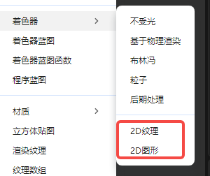
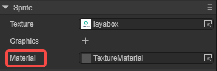
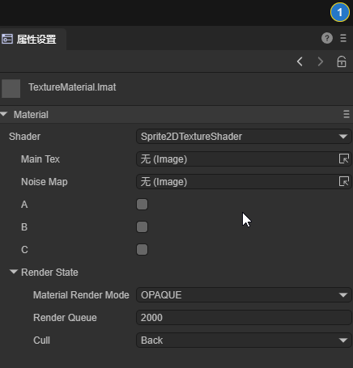
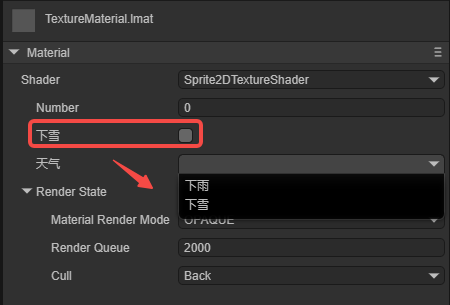
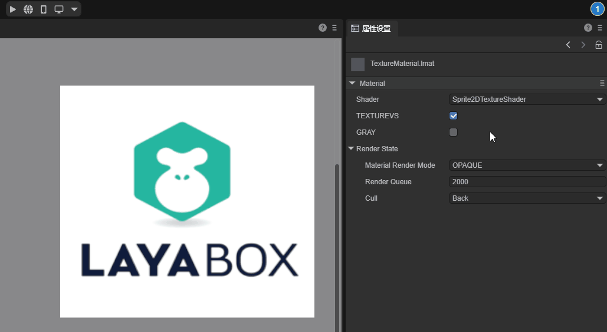
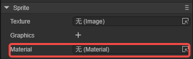

# 自定义2D着色器

## 一、概述

2D自定义着色器(Shader)属于一种高阶的引擎能力，这项功能在绝大多数项目中可能并不常见。然而，对于那些追求更精细效果和独特风格的项目，自定义着色器的需求也是存在的。

目前，LayaAir可以实现自定义2D纹理渲染(Texture2D)和基础图元渲染(Primitive)。

本篇文档属于进阶性文档，在阅读前需要具备Shader的基础知识，可以参考3D着色器[文档](../../../3D/advanced/customShader/readme.md)中的一些概念介绍。


## 二、结构与应用

### 2.1 着色器文件

LayaAir引擎中的Shader主要是围绕着.shader文件为核心，在引擎核心中.shader文件是Shader类对象抽象为文本化表示的结果，不同的.shader文件会产生不同的着色效果，这些.shader文件成为材质各不相同的核心因素。

在项目资源窗口右键菜单栏 -> 选择创建 -> 选择着色器（如图2-1所示），有两种内置的2D Shader可选。



（图2-1）


### 2.2 应用范围

LayaAir中Shader的应用主要体现在对不同材质效果的显示，通过对不同Shader的选择，材质随之改变，形成了各不相同的效果。如图2-2所示，在材质资源的“属性设置”面板中，可以选择自定义的Shader，而图中`Laya`中的Shader是引擎内置的Shader。


（图2-2）

然后，可以将添加了着色器的材质文件添加在2D节点上，如图2-3所示，以Sprite为例，将材质添加在Material属性上。

> 每一种2D组件都有Material属性。



（图2-3）

总结一下就是，Shader应用到材质上，材质再应用到2D节点上。


### 2.3 文件结构

在LayaAir引擎中，自定义一个.shader文件需要按照以下结构：

`Shader3D Start/End`：Shader文件头/尾。

用于声明渲染pass，渲染状态、材质参数等，

```glsl
Shader3D Start
{
	//此处填写Shader渲染pass、渲染状态、材质参数等属性
}
Shader3D End
```

` name `：Shader名称

用于解释该Shader的名称，区别不同Shader的功能与效果，该名称也是显示在图2-2中的名称。

```glsl
Shader3D Start
{
	//此处ShaderName为Shader的名字，非.shader文件名字
	name: ShaderName 
}
Shader3D End
```

`shaderType`：Shader类型（在2D Shader中，直接设定为2）。

```glsl
Shader3D Start
{
	shaderType:2
}
Shader3D End
```


## 三、uniformMap

uniform变量是着色器程序中的全局变量，在一次渲染过程中保持不变，由CPU端设置传递给GPU。全局意味着uniform变量必须在每个着色器程序对象中都是独一无二的，而且它可以被着色器程序的任意着色器（顶点着色器、片段着色器）在任意阶段访问。并且，无论把uniform值设置成什么，uniform会一直保存它们的数据，直到它们被重置或更新。

而uniformMap则是存储这样一堆uniform变量的数据结构，通过组合的形式更直观的让开发者了解到在Shader中所使用到的uniform变量。

### 3.1 uniform常见变量类型

uniform变量的常见类型：Texture2D，Vector2，Vector4，Float，Matrix4x4。

`Texture2D`：用于2D纹理采样的图片类型。

`Vector2`：二维向量，用于2D的坐标位置表示。

`Vector4`：四维向量，用于表示颜色。

`Float`：浮点类型。

`Matrix4X4`：4X4齐次矩阵。

```glsl
Shader3D Start
{
    name:Sprite2DTextureShader,
    shaderType:2,
    uniformMap:{
		u_MainTex : {type: Texture2D, default: "white"},
		u_SampleTexcoord : {type: Vector2, default:[1,1]},
		u_Color : {type:Vector4, default:[1,1,1,1]},
		u_spend : {type:Float, default:1.0},
		u_defaultMat : {type:Matrix4x4, default:[
		1,0,0,0
		0,1,0,0,
		0,0,1,0,
		0.0,0,
		]}
    }
}
Shader3D End
```


### 3.2 引擎常见内置uniform

> 注意：其余引擎涉及到的uniform变量可以在LayaAir引擎源码中的xx.glsl文件中找到。

| 变量名          | 描述       | 所属GLSL文件(高阶操作不推荐直接使用) |
| :-------------- | :--------- | ------------------------------------ |
| u_mmat          | 2D变换矩阵 | Sprite2DVertex.glsl                  |
| u_spriteTexture | 精灵纹理   | Sprite2DFrag.glsl                    |
| u_color         | 颜色       | Sprite2DFrag.glsl                    |
| u_colorAdd      | 颜色叠加   | Sprite2DFrag.glsl                    |
| u_clipMatPos    | 裁剪位置   | Sprite2DVertex.glsl                  |
| u_clipMatDir    | 裁剪方向   | Sprite2DVertex.glsl                  |
| u_blurInfo      | 模糊信息   | Sprite2DFrag.glsl                    |


## 四、attributeMap

attributeMap由一个个的attribute组成。attribute主要包括了基础顶点数据和纹理相关数据两类，它们通常是只读的。这些attribute数据在**顶点着色器**中被处理后，会传递给片段着色器进行最终的颜色计算。整个过程通过引擎的`Value2D`类来管理Shader的状态和数据。

- 基础顶点数据：

`a_position`：顶点位置数据。

`a_attribColor`：顶点颜色数据。

- 纹理相关数据：

`a_posuv`：包含位置和UV坐标的复合数据。

`a_attribColor`：顶点颜色数据。

`a_attribFlags`：纹理标记数据。

关于attribute，开发者在自定义Shader时，通常需要遵循以下规则：

（1）必须使用引擎预定义的attribute名称和结构。

（2）只能在顶点着色器中使用这些attribute。如果需要在片段着色器中使用，需要通过varying传递。

（3）一般不要随意添加新的attribute，直接使用引擎预定义的即可。

```glsl
Shader3D Start
{
    ......
    attributeMap: {
        a_posuv: Vector4,
        a_attribColor: Vector4,
        a_attribFlags: Vector4,
    },
    ......
}
Shader3D End
```


## 五、defines

### 5.1 基本用法

可以使用宏开关来控制顶点着色器和片段着色器产生不同分支条件的Shader指令，在defines中，宏开关的基本构成为：

`defineName` ：宏开关的名称。

`type`：一般为bool，true或false触发两个不同的分支。

`default`：设置为true，默认在材质属性设置面板显示为勾选状态；设置为false，在材质属性面板显示为不勾选状态。

`private`：值为false时，在材质的属性设置面板，Shader窗口中宏开关会显示为勾选开关的形式，供开发者按需在面板控制宏的开启与关闭；当private值为true，不显示勾选开关。

```glsl
Shader3D Start
{
    ......
    defines: {
        TEXTUREVS: { type: bool, default: true, private: false },
        GRAY: { type: bool, default: false, private: false }
    }
    ......
}
Shader3D End
```

下图5-1展示了上述defines在材质的属性设置面板的效果，


（图5-1）


### 5.2 与uniformMap联动

defines中的宏开关可与uniformMap中的全局属性进行联动设置，例如，下面的示例代码：

```glsl
Shader3D Start
{
    ......
    uniformMap:{
        //修改u_mainTex同时define A
        u_mainTex: { type: Texture2D, define: A },
    
        //修改u_noiseMap时同时define B和C
        u_noiseMap: { type: Texture2D, define: [B,C] }
    },
    defines: {
        A : { type: Bool },
        B : { type: Bool },
        C : { type: Bool }
    }
    ......
}
Shader3D End
```

在材质的属性设置面板中，给u_mainTex添加纹理，会使A被勾选；给u_noiseMap添加纹理，会使B和C被勾选，效果如动图5-2所示。



（动图5-2）


## 六、styles

在uniformMap或者defines中，可以直接对uniform或者define在UI上的显示细节调整，也可以把这些细节移到styles段，使uniformMap和defines更简洁。

### 6.1 对于uniformMap

原来在uniformMap中，需要定义更多的细节，例如（原有写法）：

```glsl
    uniformMap:{
        u_Number: { type: Float, default:0, alias:"数字",  range:[0,100], fractionDigits: 2 }
    },
```

如果细节较多，为了uniformMap的简洁性，可以将这些细节移到styles：

```glsl
    uniformMap:{
        u_Number: { type: Float, default:0 }
    },
    styles: {
        u_Number: { caption:"数字", range:[0,100], fractionDigits: 2 }
    },
```

### 6.2 对于defines

styles更重要的功能是可以定义只用于UI而不属于uniform和define的属性。例如：

```glsl
    defines: {
        RAIN : { type: Bool, default: true },
        SNOWY : { type: Bool, default: false }
    },

    styles: {
        RAIN : { caption: "下雨", inspector : null }, //inspector为null，不显示在属性面板
        SNOWY : { caption: "下雪"},

        // 定义不属于uniform和define的属性
        weather : { caption:"天气", inspector: RadioGroup, options: { members: [RAIN, SNOWY] }}
    },
```

RAIN和SNOWY在defines中，但是在styles中RAIN的inspector为null，所以不显示。SNOWY正常显示。weather是只用于UI而不属于uniform和define的属性，效果如图6-1所示。



（图6-1）


## 七、shaderPass

### 7.1 什么是shaderPass

shaderPass可以理解为Shader的渲染方案。每个Shader至少一个shaderPass，可以有多个shaderPass，它将Shader对象分为多个部分，分别兼容不同的硬件、渲染管线和运行设置信息。但是过多的shaderPass会造成渲染效率的下降，产生性能瓶颈。

```glsl
Shader3D Start
{
    .....
    shaderPass:[
        {
            //Shader VS/FS Info here
        }
    ]
}
Shader3D End
```

shaderPass中主要是定义顶点着色器和片段着色器，例如，

```glsl
Shader3D Start
{
    type:Shader3D,
    name:Sprite2DTextureShader,
    shaderType:2,
    uniformMap:{
    },
    attributeMap: {
        a_posuv: Vector4,
        a_attribColor: Vector4,
        a_attribFlags: Vector4,
    },
    defines: {
        TEXTUREVS: { type: bool, default: true, private: false },
        GRAY: { type: bool, default: false, private: false }
    },
    shaderPass:[
        {
            pipeline:Forward,
            VS:textureVS,
            FS:texturePS
        }
    ]
}
Shader3D End
```

这个Shader只有一个shaderPass，顶点着色器的内容为textureVS，片段着色器的内容为texturePS，渲染模式为前向渲染。

实现具体的顶点着色器（VS）和片段着色器（PS）时，需要加上开始和结束标志：`GLSL Start` / `GLSL End`。

```glsl
GLSL Start
    
#defineGLSL textureVS
    // VS
#endGLSL

#defineGLSL texturePS
    // PS
#endGLSL
    
GLSL End
```

其中，#defineGLSL  “name”  / #endGLSL ，是shaderPass对应的VS和FS片段标记。


### 7.2 顶点着色器 

在VS片段中，需要获取顶点信息，并计算最终的顶点位置，代码如下所示：

```glsl
#defineGLSL textureVS

    #define SHADER_NAME Sprite2DTextureShader
    #include "Sprite2DVertex.glsl";

    void main() {
	    vertexInfo info;
	    getVertexInfo(info);

	    v_cliped = info.cliped;
	    v_texcoordAlpha = info.texcoordAlpha;
	    v_useTex = info.useTex;
	    v_color = info.color;

	    vec4 pos;
	    getPosition(pos);
	    gl_Position = pos;

    }

#endGLSL
```

`#define SHADER_NAME Sprite2DTextureShader` 是一个宏定义，用于定义着色器的名称。

`#include "Sprite2DVertex.glsl"` 表示包含了Sprite2DVertex.glsl基础库。LayaAir Shader中的“#include”类似于C语言的include，引擎的 xxx.glsl 文件中内置了一些引擎已经打包好的Shader算法。

如果引用的是引擎内置的glsl，则直接引用即可；如果是自定义的.glsl文件，它可以放置在assets文件夹下的任何地方。然后.shader文件通过相对路径引用.glsl文件，即使是同级目录，也要使用./开头，例如：

```glsl
#include "./abc.glsl";
#include "./path/to/abc.glsl";
#include "../path/abc.glsl";
```


### 7.3 片段着色器

在PS片段中，需要完成实际的像素渲染，也就是着色，代码如下：

```glsl
#defineGLSL texturePS
    #define SHADER_NAME Sprite2DTextureShader
    #if defined(GL_FRAGMENT_PRECISION_HIGH) 
        precision highp float;
    #else
        precision mediump float;
    #endif

    #include "Sprite2DFrag.glsl";

    void main()
    {
        clip();
        vec4 color = getSpriteTextureColor();

        #ifdef GRAY
            float gray = dot(color.rgb, vec3(0.299, 0.587, 0.114)); // 转换为灰度
            color.rgb = vec3(gray);
        #endif

        setglColor(color);
    }
    
#endGLSL
```

最终的效果如动图7-1所示，通过宏开关控制图像是否为灰度图，可以看到勾选后变成了灰度图。



（动图7-1）


## 八、LayaAir-IDE内置2D着色器

在LayaAir-IDE中，可以创建三种内置的2D着色器，如图8-1所示，


（图8-1）

这三种着色器是为开发者提供的模版，可以在此基础上进行更改。但需要注意，它们是三个类型的着色器，各不通用：

- Texture（uv）类型，也就是2D纹理类型。可用于Sprite的材质赋值，如图8-2所示。不能用在BaseRenderNode2D类型上（例如，Mesh2DRender、Line2DRender、Trail2DRender）。



（图8-2）

- Primitive（mesh）类型，也就是2D图形类型。可用于Sprite的材质赋值，与图8-2所示使用位置相同。与第一个类型的区别是，Primitive类型不能使用默认贴图，也就是Sprite不能给texture赋值。
- BaseRender2D类型，也就是2D基础渲染类型。可用于Sprite的渲染组件赋值材质，不能用在图8-2中Sprite的材质。BaseRender2D可以接收2D光照类型，一般用在BaseRenderNode2D为基类的2D渲染组件（例如，Mesh2DRender、Line2DRender、Trail2DRender）上面，如图8-3所示。


（图8-3）


