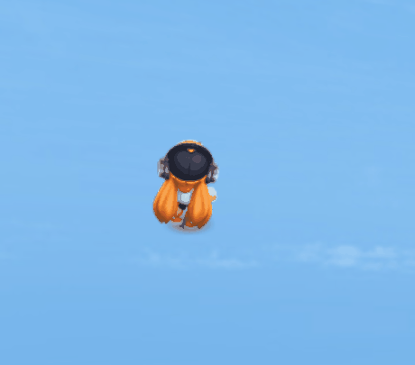
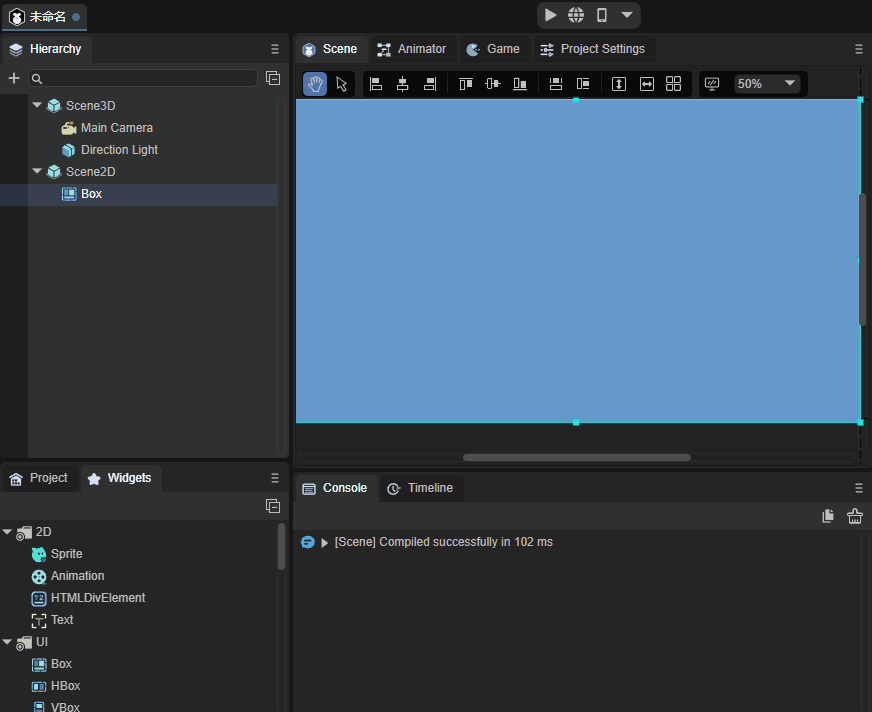
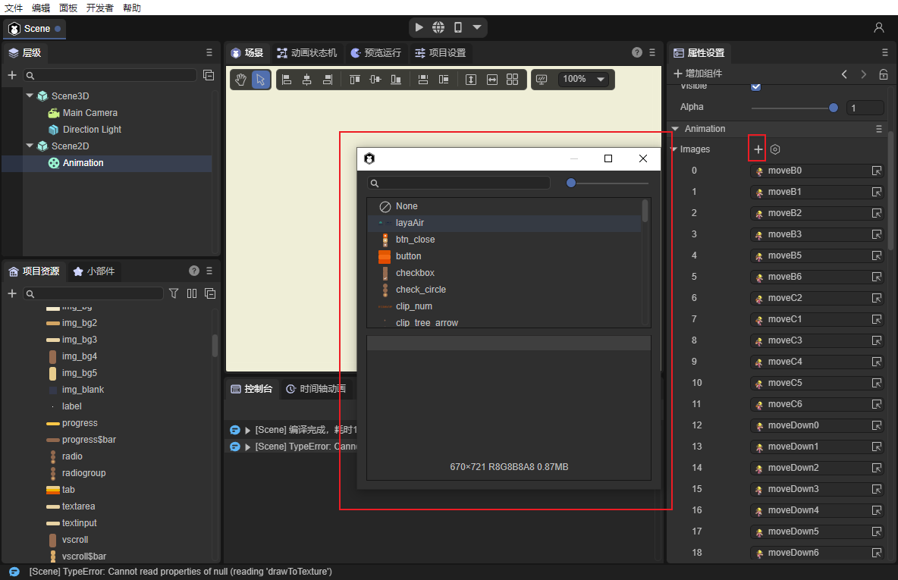
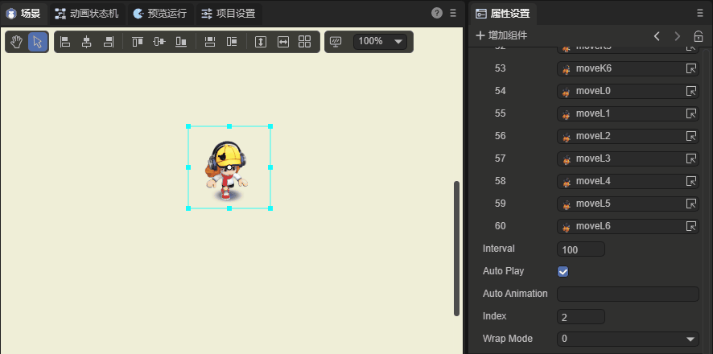
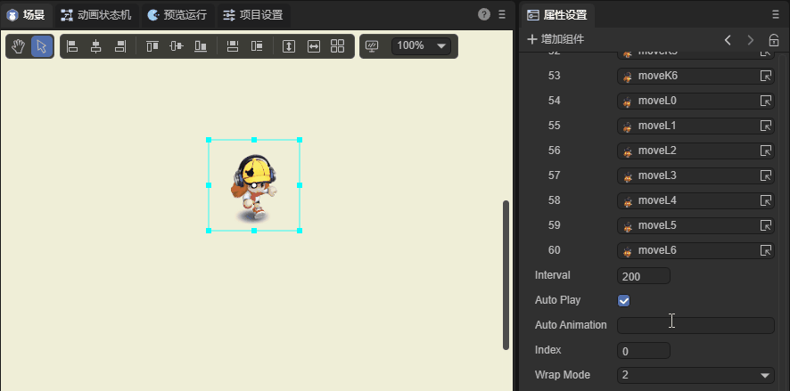
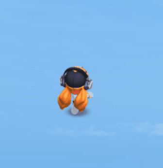

# Animation组件参考


## 1、初步认知Animation 组件

Animation组件是节点动画组件，可以方便的创建图集动画多帧动画。如动图1所示。

 

（动图1）

### 1.2 Animation组件的常用属性

| 属性          | 功能说明                                                    |
| ------------- | ----------------------------------------------------------- |
| images        | 添加动画图集                                                |
| interval      | 动画播放间隔，单位为毫秒，默认值为50毫秒。                  |
| autoplay      | 动画图集是否自动播放，默认为false。                         |
| autoanimation | 默认播放的动画名称。                                        |
| index         | 播放位置。                                                  |
| wrapmode      | 播放类型：默认为0是正序播放，1为倒序播放，2为pingpong播放。 |

## 2、通过LayaAirIDE创建Animation 组件

### 2.1 创建Animation

Animation不是UI组件。所以在创建Animation的时候，需要先从`小部件库`里直接拖入Animation到IDE的`场景编辑器`中。如动图2所示。

 

（动图2）


### 2.2 通过source属性去接收动画数据源

接收动画数据源现在有两种方式，一种是在代码中引入，source属性在代码中使用方法为将打为图集的.atls文件放入source属性中。

```
 Animation.source = "resources/UI/role/frameAni/role.atlas";
```

第二种方法是在IDE中通过可视化操作直接设置，可以摁住键盘**↓**方向键快速选择图片，也可以单击图片进行添加，如图3所示。

 

（图3）

`Tips：开发者不要在代码和IDE中同时设置source属性和images属性，会导致播放出来的动画第一帧是IDE中images属性设置的第一帧动画，最后运行结果还是代码中所设置的属性的执行结果。`		


### 2.3 控制动画的播放模式（wrapMode）

动画播放模式属性wrapMode有三个值可选，默认值是0，正序播放。选1时，倒序播放。选2时，pingpong（乒乓）模式，直白一些就是来回播放。下面我们选一组序列图资源分别演示不同模式下的播放差异。

#### 2.3.1 正序模式播放

默认不设置wrapMode属性或是将wrapMode属性值设为0时，为正序播放模式。也就是序列图从前到后的顺序进行播放。

wrapMode属性为**0**时，如动图4所示。

  

(动图4)

#### 2.3.2 倒序模式播放

将wrapMode属性值设为1时，为倒序播放模式。也就是序列图后到前的顺序进行播放，与正序播放模式完全相反，如动图5所示。


 

(动图5)

#### 2.3.3 pingpong（乒乓）模式播放

将wrapMode属性值设为2时的pingpong模式，正好可以解决这个问题，同一套动作，正序播放完了，并不是直接回到images属性设置的第一帧重头播放，而是从倒序的倒数第二帧播放。从而让动作更加平滑和完整。因此，pingpong模式也是游戏中经常使用的模式之一，在保障效果的前提下，还可以大幅减少美术资源量。效果如动图6所示。

 

(动图6)

### 2.4  动画播放的帧间隔时间(interval)

`interval`属性可以设置动画播放的帧间隔时间(单位：毫秒)，默认值为50毫秒。例如，我们将刚刚播放的动画，放慢一倍，设置为200毫秒。效果如动图7所示。


 

(动图7)

**Tips**：*如果动画正在播放，设置后会重置帧循环定时器的起始时间为当前时间，也就是说，如果频繁设置interval，会导致动画帧更新的时间间隔会比预想的要慢，甚至不更新。*


### 2.5 设置自动播放（autoPlay）

autoPlay属性可以设置是否自动播放，默认为false，不自动播放。如果设置为true，则动画被创建并添加到舞台后自动播放。该属性设置不可以在IDE中即时预览，需要在发布运行时查看属性设置效果。


### 2.6 设置播放的起始位置（index）

index属性可以指定动画的帧索引，默认的索引是0，可以设置为动画中的任意一帧。设置后，将会跳到设定的动画帧。

`Tips：该属性仅用于静态指定，比如通过代码或点击事件来手动切换动画帧。如果设置为自动播放，仍会从第0帧开始播放，与索引的设置没有关系。`


## 3、代码创建Animation

通过代码来创建Animation组件也是非常简单的，代码示例如动图8所示。

 

（动图8）

下面用代码来演示下。

```
const { regClass, property } = Laya;

@regClass()
export class UI_Animation extends Laya.Script {
    //declare owner : Laya.Sprite3D;

    @property()
    public text: string = "";

    constructor() {
        super();
    }

    /**
     * 组件被激活后执行，此时所有节点和组件均已创建完毕，此方法只执行一次
     */
    onAwake(): void {
        this.setup();

    }
private setup():void{

    var Animation:Laya.Animation = new Laya.Animation();
    Animation.pos(200,200);
    Animation.source = "resources/UI/role/frameAni/role.atlas";
    Animation.size(600,275);
    Animation.interval = 100;
    Animation.autoPlay = true;
    Animation.index = 50;
    Animation.wrapMode = 2;
    this.owner.addChild(Animation)


}

```

