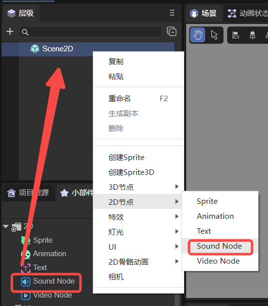
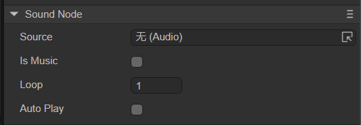

# 音频节点(SoundNode)

## 1. LayaAir IDE中使用音频节点

### 1.1 创建SoundNode

如图1-1所示，可以在`层级`窗口中右键进行创建，也可以从`小部件`窗口中拖拽添加。



（图1-1）

### 1.2 属性介绍

在IDE中，将SoundNode节点添加到场景编辑的视图区后，属性面板中SoundNode的专属属性如下图所示： 



（图1-2）

下面分别对这些属性进行介绍：

| 属性名称 | 属性说明                                                     |
| -------- | ------------------------------------------------------------ |
| Source   | 添加音频文件源                                               |
| IsMusic  | 是否为背景音乐。勾选后，当前音频为背景音乐，如果有两个音频都勾选了IsMusic，则不能同时播放，只能播放一个。如果不勾选，当前音频文件可以与背景音乐、其它音频同时播放 |
| Loop     | 循环播放的次数。设置为0，是无尽循环；设置为1，只播放一次     |
| AutoPlay | 运行时，是否自动播放                                         |


### 1.3 脚本控制SoundNode

在Scene2D的属性设置面板中，增加一个自定义组件脚本。然后，将SoundNode拖入到其暴露的属性入口中。下面给出一个示例代码，实现脚本控制SoundNode：

```typescript
const { regClass, property } = Laya;

@regClass()
export class NewScript extends Laya.Script {
    //declare owner : Laya.Sprite3D;

    @property({ type: Laya.SoundNode })
    public sound: Laya.SoundNode;

    constructor() {
        super();
    }

    /**
     * 组件被激活后执行，此时所有节点和组件均已创建完毕，此方法只执行一次
     */
    onAwake(): void { 
        this.sound.source = "resources/sound.wav"; //音频路径
        this.sound.loop = 0; //循环次数设置，要放在autoPlay参数设置前
        this.sound.autoPlay = true; //自动播放
        this.sound.isMusic = false; //是否为背景音乐

    }
}
```


## 2.代码创建SoundNode

SoundNode节点在运行时只有声音效果，如果不想在IDE中添加并拖拽到装饰器暴露的属性入口，做这么繁琐的操作，那可以通过代码来创建。在Scene2D的属性设置面板中，增加一个自定义组件脚本，示例代码如下：

```typescript
const { regClass, property } = Laya;

@regClass()
export class NewScript extends Laya.Script {
    //declare owner : Laya.Sprite3D;

    constructor() {
        super();
    }

    /**
     * 组件被激活后执行，此时所有节点和组件均已创建完毕，此方法只执行一次
     */
    onAwake(): void { 
        let sound = new Laya.SoundNode();
        // 添加到舞台
        Laya.stage.addChild(sound);
        sound.source = "resources/sound.wav"; //音频路径
        sound.loop = 0; //循环次数设置，要放在autoPlay参数设置前
        sound.autoPlay = true; //自动播放
        sound.isMusic = false; //是否为背景音乐
    }
}
```

