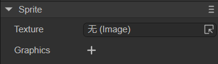

# 精灵（Sprite）


## 一、概述

游戏中Sprite精灵是在屏幕中能够被控制的显示对象，如果屏幕中的显示对象不能被控制那就只是一个节点。准确来说，Sprite精灵是一个能够通过改变自身属性，比如角度、位置、缩放、颜色等，变为可控动画的2D图像。

`Sprite` 是基本的显示图形的显示列表节点。 通过 `graphics` 可以绘制图片或者矢量图，支持旋转，缩放，位移等操作。`Sprite`同时也是容器类，可用来添加多个子节点。`Sprite`针对不同的情况做了渲染优化，所以保证一个类实现丰富功能的同时，又达到高性能。

另外，在LayaAir 2D UI中，Sprite是所有节点对象的基础类，如图1-1所示，Sprite 类的基础功能会被继承到所有继承的节点对象中（由于篇幅有限，图中只列出了Sprite类部分的子类，全部的继承关系请参考[API文档](https://layaair.com/3.x/api/Chinese/index.html?version=3.0.0&type=Core&category=display&class=laya.display.Sprite)），因此本篇会详解介绍 Sprite 类的基础功能，后续的节点对象重复的将不再介绍。

 

（图1-1）


## 二、IDE中使用

### 2.1 创建精灵

#### 2.1.1 Scene2D中创建

在一个Scene2D的`层级`窗口中，任何节点下，或者是空白位置，都可以通过鼠标右键来创建精灵，如动图2-1所示： 


（动图2-1）

此时创建的精灵，是看不到任何效果的，实际上就是创建了一个空的2D精灵节点。


#### 2.1.2 控件中创建

在`小部件`的2D标签下，可以在任何节点下，创建精灵，如动图2-2所示： 


（动图2-2）


### 2.2 基础属性

如图2-3所示，精灵有如下基础属性:


（图2-3）

| 基础属性 | 功能说明       |
| -------- | -------------- |
| Position | 精灵的位置坐标 |
| Size     | 精灵的宽高     |
| Anchor   | 精灵的锚点     |
| Scale    | 精灵的缩放     |
| Skew     | 精灵的倾斜角度 |
| Rotation | 精灵的旋转度   |
| Visible  | 精灵是否可见   |
| Alpha    | 精灵的透明度   |

我们通过一组操作，来看看这些属性是如何操作的，如动图2-4： 


（动图2-4）

由于此时的精灵只是一个空节点，没有显示对象，因此 Visible 和 Alpha 的调整是没有任何显示变化的，我们先来看看几个常用的基础属性：

#### 2.2.1 位置Position

精灵的位置说的是精灵锚点/轴心点所处画布的位置。Position有x和y两个参数，以画布的左上角为原点，从左指向右为x轴正向，从上指向下为y轴正向。

#### 2.2.2 大小Size

精灵的大小是指精灵的宽（W）和高（H），单位是像素。

#### 2.2.3 锚点 Anchor

在讲解锚点之前需要先知道**轴心点Pivot**的概念。一个Sprite精灵对象默认的轴心点位于自身的左上角，设置Sprite精灵的位置时默认是以左上角为基准进行定位的。

轴心点是基准点，决定着Sprite在舞台的位置。轴心点以像素为单位，默认X、Y坐标为(0,0)表示图片左上角作为基准点。当修改了Sprite对象设置默认轴心点，对Sprite对象设置位置Position、缩放Scale、旋转Rotation时，都是以轴心点为基准，而并非默认的Sprite对象左上角的坐标值。改变轴心点可以控制旋转和缩放的中心，还会影响对象位置、缩放中心、旋转中心。

锚点anchor和轴心点pivot都是基准点，决定着Sprite在舞台的位置。锚点则是以Sprite的宽和高的倍数为单位，取值范围是0~1。

改变锚点anchor的同时，轴心点pivot也会随着改变，因此说明**修改锚点anchor是改变轴心点pivot的另外一种简单方式**。

#### 2.2.4 缩放大小Scale

Scale的X和Y是以锚点/轴心点为中心进行水平、垂直大小缩放。

默认为1，不缩放；正数值越大，缩放尺寸越大。

缩放到0，不可见；

`-1`为镜像。负数值越大，镜像后缩放尺寸越大。

#### 2.2.5 倾斜角度Skew

Skew的X和Y是以锚点/轴心点为中心进行水平、垂直角度倾斜。

#### 2.2.6 旋转角度Rotation

旋转以锚点/轴心点为中心，正数代表顺时针旋转，负数代表逆时针旋转。

#### 2.2.7 可见性Visialble

这是一个布尔型的值。勾选代表true，表示可见。不勾选代表false，表示不可见，此时如果精灵加载了图片，那么就不会显示到画布上了。

#### 2.2.8 透明度Alpha

如果精灵加载了图片，透明度可以设置图片的透明度，范围为0~1。


### 2.3 Sprite的特有属性



（图2-5） 

如图2-5所示，精灵的自身属性有：

`Texture`：绘制一个图片或者渲染纹理。

`Graphics`：绘制一个或者一组图形。

#### 2.3.1 Image的Texture

首先，Sprite的Texture是支持通过拖入或者加载一张图片作为纹理Texture绘制的。

如动图2-6所示，来了解下拖入一张图片到Texture属性中的过程：


（动图2-6）

> **注意：在实现项目开发过程中，如果只是绘制一张图片，那么尽量使用Spirte对象通过Texture的方式绘制，性能是最高的。在2D界面开发中，需要将图片编辑成“精灵纹理”，详细请参考[《项目资源面板说明》](../../../basics/IDE/assets/readme.md)。**


#### 2.3.2 RenderTexture的Texture

渲染纹理 （Render Texture）是在运行时不断更新渲染的一种特殊类型纹理 。渲染纹理的一个典型用法是将其设置为摄像机的“目标纹理”属性，这将使摄像机渲染到纹理， 而不是渲染到屏幕。随后可以如同普通纹理 (Texture) 一样在Sprite对象中使用。

如动图2-7所示，是把一张创建好的渲染纹理（制作方法参看[混合使用3D](../../../IDE/uiEditor/use3D/readme.md)）拖入到Sprite的Texture属性中的。


（动图2-7）

> **注意：只有通过Sprite的Texture属性才能设置渲染纹理，其它任何显示对象组件中设置渲染纹理的方式都是不正确的**


#### 2.3.3 Graphics属性

通过使用Graphics属性，我们可以绘制矩形，圆形，多边形等图形，如动图2-8所示 ：


（动图2-8）

具体每一种图形的绘制介绍和代码使用方法，请开发者参考[《绘制图形》](../../../IDE/uiEditor/graphics/readme.md)一篇。


### 2.4 其它属性

`杂项`属性面板中包括了精灵的其它属性，如图2-9所示：   


（图2-9）

| 其它属性         | 功能说明                                             |
| ---------------- | ---------------------------------------------------- |
| Blend Mode       | 指定要使用的混合模式。目前只支持"lighter"            |
| Mouse Enabled    | 是否接受鼠标事件                                     |
| Mouse Through    | 鼠标事件与此对象的碰撞检测是否可穿透                 |
| Hit Test Prior   | 指定鼠标事件检测是优先检测自身，还是优先检测其子对象 |
| DrawCallOptimize | 是否开启DrawCall优化                                 |
| Cache As         | 是否开启静态缓存优化                                 |
| Mask             | 设置遮罩节点对象                                     |
| Hit Area         | 点击区域                                             |
| Filters          | UI滤镜效果                                           |

> 其中Mouse Enabled、Mouse Through、Hit Test Prior、Hit Area统一放在“2.4.6鼠标操作相关属性”中讲解


#### 2.4.1 关于节点层级关系

如图2-10所示，在层级面板中添加了两个Sprite，按顺序添加，则后添加的（sprite2）在场景中显示在上方。

如果开发者想让节点在运行时改变显示层级，则可以在**代码中**设置`ZOrder`（Z排序，更改此值，则会按照值的大小对同一容器的所有对象重新排序。值越大，越靠上。默认都为0），参考后面的3.4.1节。


（图2-10）


#### 2.4.2 设置BlendMode

如动图2-11所示，我们在IDE中设置了两个Sprite，原本Sprite2是覆盖Sprite1的，当使用BlendMode为“lighter”后，看看运行的效果，两个Sprite的图的颜色叠加了。


（动图2-11）

> **注意：在IDE中，只支持lighter模式，原有图形和新图形都显示，交集部分做颜色叠加**


#### 2.4.3 设置Draw Call Optim

如果为true，代表开启DrawCall优化。

> DrawCall的内容请参考[《性能统计与优化》](../../../basics/common/Stat/readme.md)。


#### 2.4.4 设置Cache As


（图2-12）

如图2-12所示，可以设置两种类型的静态缓存，我们来看看静态缓存的一些说明：

**当游戏中有大量的UI，并且一个UI有多个节点，变化较小时，推荐使用cacheAs（大部分UI都可以使用）。**

例如我们使用的LayaAir IDE，软件中的很多面板，例如属性设置器、资源管理器、项目管理器等，它们的节点子对象很多，但不是很频繁的改动，因此我们都使用了cacheAs进行缓存，提高了渲染效率。

**对于经常变化的复杂UI，可以把UI分成两层，较少变化的一层使用cacheAs，经常变化的层不使用。**

例如有“倒计时”显示的UI，我们也可以把它分成倒计时部分和其他部分，其他部分进行cacheAs，倒计时部分不进行cacheAs。

> 开发时使用cacheAs需认真学习理解，错误的理解和使用缓存机制反而会降低性能。

`cacheAs`：缓存组件，是否缓存为静态图像，合理作用能提高性能 。它有”无”，”正常”和”位图”三个值可选。

**“无”**：表示不做任何缓存。

**“正常”**：进行命令缓存，它相当于只缓存了子对象遍历过程及程序命令组织，未缓存成一张位图，在游戏每帧渲染时，不用再次去遍历子对象，而是直接把子对象按照遍历好的层级进行显卡渲染，它不会减少drawcall，不会增加内存损耗。渲染性能中等。

**“位图”**：进行renderTarget缓存，它相当于把多个子对象组成的UI缓存成一张位图并提交给显卡进行每帧渲染，减少了drawcall。渲染性能最高。需注意的是缓存的位图会额外增加一部分内存开销，缓存的位图越大，内存开销越大。且缓存位图大小不能超过2048。这种模式在不断重绘时也会增加CPU的开销。

**Tips**：*当cacheAs选择”正常”和”位图”时，子对象发生变化，会自动重新缓存，同时也可以手动调用reCache方法更新缓存。*


#### 2.4.5 设置Mask

根据对象（支持位图和矢量图）的形状进行遮罩显示，遮罩对象坐标系是相对于遮罩对象本身的。

如动图2-13所示，我们来看看设置mask的操作过程，比如我们在Sprite1绘制的图形上设置一个圆形的遮罩Sprite2，其中Sprite2是Sprite1的子节点。


（动图2-13）


#### 2.4.6 鼠标操作相关属性

鼠标操作相关属性说明如下：

| **属性**       | **功能说明**                                                 |
| :------------- | :----------------------------------------------------------- |
| MouseEnabled   | 设为true表示接受鼠标事件，设为false不接受鼠标事件（以下属性均将失效） |
| Hit Area       | 点击区域，自定义区域只支持圆形、矩形、多边形                 |
| MouseThrough   | 默认值为false，如果设置为true，则点击空白区域（不设置Texture、Image等）可以穿透过去，只针对自身有效 |
| Hit Test Piror | 当值为true时，并且不穿透（Mouse Through为false）时，会优先检测本节点。当值为false时，会优先检测子节点，一直到stage上的全部节点都递归检测完毕。 |

##### **1. Mouse Enabled：**

默认为false，**如果在脚本代码中监听鼠标事件，则会自动设置本对象及父节点的MouseEnabled属性值都为 true**。但若将父节点的MouseEnabled的值手动设置为false，即使进行了鼠标事件监听，父节点的MouseEnabled值也是false。

下面来举一个例子说明这一特殊情况。如图2-14所示，“Sprite1”为父节点，“Sprite2”为子节点，在IDE中默认MouseEnabled属性值为false。


（图2-14）

此时，可以在Scene2D下添加一个自定义组件脚本，并添加如下代码：

```typescript
const { regClass, property } = Laya;

@regClass()
export class NewScript extends Laya.Script {
    //declare owner : Laya.Sprite3D;

    @property({ type: Laya.Sprite })
    public sprite1: Laya.Sprite;

    @property({ type: Laya.Sprite })
    public sprite2: Laya.Sprite;

    constructor() {
        super();
    }

    /**
     * 组件被激活后执行，此时所有节点和组件均已创建完毕，此方法只执行一次
     */
    onAwake(): void {
        this.sprite2.on(Laya.Event.MOUSE_DOWN, this, this.test2);//设置监听，sprite1或sprite2均可
        console.log(this.sprite1.mouseEnabled);//打印父节点sprite1的MouseEnabled的值：true
        console.log(this.sprite2.mouseEnabled);//打印子节点sprite2的MouseEnabled的值：true
    }
    test2(e: Laya.Event) {
        console.log('mouseSprite2')
    }
}
```

虽然默认的MouseEnabled属性值为false，但是由于在脚本中设置了监听鼠标事件`this.sprite2.on`，所以此时父节点“Sprite1“和子节点”Sprite2”的MouseEnabled值会自动变为true。代码执行效果如下：


（动图2-15）

可以看到，设置监听后，打印的MouseEnabled值变为true。

但如果在代码中给父节点“Sprite1”的MouseEnabled赋值为false，那么即使给“Sprite1”设置了监听也不会改变它的值了：

```typescript
const { regClass, property } = Laya;

@regClass()
export class NewScript extends Laya.Script {
    //declare owner : Laya.Sprite3D;

    @property({ type: Laya.Sprite })
    public sprite1: Laya.Sprite;

    @property({ type: Laya.Sprite })
    public sprite2: Laya.Sprite;

    constructor() {
        super();
    }

    /**
     * 组件被激活后执行，此时所有节点和组件均已创建完毕，此方法只执行一次
     */
    onAwake(): void {
        this.sprite1.mouseEnabled = false;//父节点的MouseEnabled赋值为false
        this.sprite1.on(Laya.Event.MOUSE_DOWN, this, this.test1);//设置监听,sprite1
        this.sprite2.on(Laya.Event.MOUSE_DOWN, this, this.test2);//设置监听,sprite2
        console.log(this.sprite1.mouseEnabled);//打印父节点sprite1的MouseEnabled的值：false
        console.log(this.sprite2.mouseEnabled);//打印子节点sprite2的MouseEnabled的值：true
    }
    test1(e: Laya.Event) {
        console.log('mouseSprite1')
    }
    test2(e: Laya.Event) {
        console.log('mouseSprite2')
    }
}
```

但是要注意，此时“sprite2”的MouseEnabled并没有被手动赋值，仍然只有默认初始值，所以给“sprite2”设置监听会让其MouseEnabled值变为true。

> 事件监听方法参考[《事件与交互》](../../../basics/common/Event/readme.md)。


##### **2. Hit Area：**

如果我们对一个图片设置点击事件，那么这个Sprite的长宽所组成的矩形就是它的点击区域。也可以用HitArea为其设置自定义的点击区域`Hit`（圆形、矩形、多边形）和非点击区域`UnHit`，如动图2-16设置点击区域：


（动图2-16）


##### **3. Mouse Through：**

以一个例子来说明这个属性。如图2-17所示，场景中有两个Sprite节点，为了方便观察效果，给Sprite1的”Graphics”加一个矩形并设为白色。Sprite2在Sprite1的上层，它的大小比Sprite1稍小一点，不给它设置“Texture”、“Graphics”等，即Sprite2就是一个**空白区域**。


（图2-17）

此时，先不勾选“Mouse Through”，在代码中监听鼠标按下事件：

```typescript
onAwake(): void {
        this.sprite1.on(Laya.Event.MOUSE_DOWN, this, this.test1);//设置监听,sprite1
        this.sprite2.on(Laya.Event.MOUSE_DOWN, this, this.test2);//设置监听,sprite2
    }
    test1(e: Laya.Event) {
        console.log('mouseSprite1')
    }
    test2(e: Laya.Event) {
        console.log('mouseSprite2')
    }
```

在运行时，由于Sprite2是空白区域，所以我们无法观察到，但是，Sprite2覆盖在Sprite1的上层，如果点击Sprite2的点击区域，是会被监听到的，效果如动图2-18所示：


（动图2-18）

可以看到，控制台打印了mouseSprite2这个日志，但是它没有监听到Sprite1，因为点击的地方，是Sprite2覆盖在了Sprite1的上面。

勾选Sprite2的“Mouse Through”，再次运行，效果如下：


（动图2-19）

点击的是Sprite2的区域，但是控制台打印的是mouseSprite1，原因就是这个事件穿过（Mouse Through）了Sprite2，作用在了下层的Sprite1。


##### **4. Hit Test Prior：**

如果鼠标不在节点的鼠标碰撞区域内，则会直接中断此节点以及其子节点的检测，这样能减少鼠标碰撞，提高性能。但也因如此，会导致子节点在其父节点的碰撞区域外时，无法响应鼠标事件。

下面以一个例子来说明，如图2-20所示，Sprite1是父节点，绘制了一个白色矩形，子节点Sprite2在父节点的外面，绘制了一个红色矩形。


（图2-20）

上述“**3. Mouse Through**”中的脚本代码不变，先不勾选Sprite1的“Hit Test Prior”，点击子节点Sprite2，控制台打印Sprite1和Sprite2的两个日志，效果如下：


（图2-21）

图2-21的效果表明，当父节点的“Hit Test Prior”值为false时，会优先检测子节点，并一直递归检测到父节点也会响应。

再勾选Sprite1的“Hit Test Prior”，这时，子节点Sprite2不在父节点Sprite1的鼠标碰撞区域内，如果鼠标放在子节点Sprite2上，就会直接中断Sprite1和Sprite2的检测，无法响应鼠标事件，效果如动图2-22所示。


（动图2-22）

可以看到，点击Sprite2没有响应鼠标事件。


#### 2.4.7 设置Filters

滤镜主要是用来实现图像的各种特殊效果，使图像取得最佳艺术效果。滤镜的类型有很多，但是营造不同的效果需要不同的滤镜功能。关于滤镜有单独的一篇进行讲解，请参考[《UI滤镜效果》](../../../IDE/uiEditor/Filter/readme.md)。


### 2.5 脚本控制属性

在Scene2D的属性设置面板中，增加一个自定义组件脚本。然后，将Sprite节点拖入到其暴露的属性入口中，如动图2-23所示。


（动图2-23）

接着，就可以在组件脚本中用代码对Sprite进行控制了，示例代码如下：

```typescript
const { regClass, property } = Laya;

@regClass()
export class NewScript extends Laya.Script {
    //declare owner : Laya.Sprite3D;

    @property({ type: Laya.Sprite })
    public sprite: Laya.Sprite;

    constructor() {
        super();
    }

    /**
     * 组件被激活后执行，此时所有节点和组件均已创建完毕，此方法只执行一次
     */
    onAwake(): void {
        this.sprite.loadImage("atlas/comp/image.png"); //纹理：图片路径

        this.sprite.pos(Laya.stage.width >> 1, Laya.stage.height >> 1); //位置：屏幕中心
        this.sprite.x = Laya.stage.width/2; //x、y分别设置位置
        this.sprite.y = Laya.stage.height/2;

        this.sprite.size(512, 313); //大小
        this.sprite.width = 512; //宽、高分别设置大小
        this.sprite.height = 313;

        this.sprite.pivot(this.sprite.width/2, this.sprite.height/2); //轴心点：sprite的中心
        this.sprite.pivotX = this.sprite.width/2; //x、y分别设置轴心点
        this.sprite.pivotY = this.sprite.height/2;

        this.sprite.anchorX = 0.5; //锚点:sprite的中心
        this.sprite.anchorY = 0.5;

        this.sprite.scale(0.5, 0.5); //缩放大小
        this.sprite.scaleX = 2; //x、y分别设置缩放
        this.sprite.scaleY = 2;

        this.sprite.skew(5, 5); //倾斜度
        this.sprite.skewX = 5; //x、y分别设置倾斜度
        this.sprite.skewY = 5;

        this.sprite.rotation = 45; //旋转角度

        this.sprite.visible = true; //是否可见：可见

        this.sprite.alpha = 0.5; //透明度
    }
}
```


## 三、代码中使用

`Laya.Sprite` 类位于Core核心类库中，是 `laya.display.Sprite` 类封装后形成的。LayaAir引擎API设计精简巧妙，核心显示类只有一个`Sprite`。


### 3.1 创建Sprite

创建Sprite对象实例，代码如下：

```typescript
onAwake(): void {
        let sprite = new Laya.Sprite();
        // 添加到舞台
        Laya.stage.addChild(sprite);
    }
```


### 3.2 显示图片

图片的显示是游戏开发的基础，Sprite类中用于显示图片是 `Sprite.loadImage ` 和 `Sprite.texture`。

#### 3.2.1 loadImage

```typescript
    /**
     * <p>加载并显示一个图片。相当于加载图片后，设置texture属性</p>
     * <p>注意：2.0改动：多次调用，只会显示一个图片（1.0会显示多个图片）,x,y,width,height参数取消。</p>
     * @param url		图片地址。
     * @param complete	（可选）加载完成回调。
     * @return	返回精灵对象本身。
     */
    loadImage(url: string, complete?: Handler): Sprite;

```

 我们来看看代码示例：

```typescript
let sprite = new Laya.Sprite();
// 加载并显示一个图片，居中显示
sprite.loadImage("atlas/comp/image.png", null);
sprite.pos(Laya.stage.width >> 1, Laya.stage.height >> 1);
// 添加到舞台
Laya.stage.addChild(sprite);
```

#### 3.2.2 set texture

```typescript
    /**
     * 设置一个Texture实例，并显示此图片（如果之前有其他绘制，则会被清除掉）。
     * 等同于graphics.clear();graphics.drawImage()，但性能更高
     * 还可以赋值一个图片地址，则会自动加载图片，然后显示
     */
    get texture(): Texture;
    set texture(value: Texture);
```

 我们来看看代码示例：

```typescript
Laya.loader.load("atlas/comp/image.png").then(() => {
    let sprite = new Laya.Sprite();
    //精灵设置纹理并居中显示
    let res = Laya.loader.getRes("atlas/comp/image.png");
    sprite.pos(Laya.stage.width >> 1, Laya.stage.height >> 1);
    sprite.texture = res;
    // 添加到舞台
    Laya.stage.addChild(sprite);
});
```

3.2.1和3.2.2这两个示例代码的运行效果是一样的，如图3-1所示，开发者可以根据自己的需要来使用。

 

（图3-1）


### 3.3 基础属性

我们通过一些代码示例来看看：


```typescript
let sprite = new Laya.Sprite();
// 加载并显示一个图片
sprite.loadImage("atlas/comp/image.png", null);
//设置图片的起始位置
sprite.pos(20, 20);
//设置锚点
sprite.anchorX = 0.5;
sprite.anchorY = 0.5;
//设置缩放
sprite.scale(2, 2);
//旋转
sprite.rotation = 30;
// 添加到舞台
Laya.stage.addChild(sprite);
```

运行效果如图3-2所示：


（图3-2） 


### 3.4 其它属性


#### 3.4.1 设置zOrder

设置 zOrder 的示例代码如下：

```typescript
let sp1 = new Laya.Sprite();
Laya.stage.addChild(sp1);
sp1.pos(200, 190);
// 加载并显示一个图片1
sp1.loadImage("resources/layabox.png", null); //需要在resources文件夹下放入layabox.png图片

let sp2 = new Laya.Sprite();
Laya.stage.addChild(sp2);
// 加载并显示一个图片2
sp2.loadImage("atlas/comp/image.png", null);

// 设置zOrder
sp1.zOrder = 1;
sp2.zOrder = 0;
```

我们来看看运行结果：  


（图3-3）

可以看到，sp1原本是先添加的子节点，sp2是后添加的子节点，原本sp2是会覆盖掉sp1的，但是通过修改zOrder，会让sp1在显示最上层。


#### 3.4.2 设置BlendMode

设置 BlendMode 的示例代码如下：

```typescript
let sp1 = new Laya.Sprite();
Laya.stage.addChild(sp1);
// 加载并显示一个图片1
sp1.loadImage("atlas/comp/image.png", null);
let sp2 = new Laya.Sprite();
Laya.stage.addChild(sp2);
// 加载并显示一个图片2
sp2.loadImage("resources/layabox.png", null);
sp2.pos(200, 190);
// 设置blendMode
sp2.blendMode = "lighter";
```

我们来看看运行结果：  


（图3-4）

与图3-3对比可以看到，使用“lighter”的blendMode后，sp2图片的颜色和sp1的颜色叠加了。


#### 3.4.3 设置autoSize

指定是否自动计算宽高数据。默认值为 false 。Sprite宽高默认为0，并且不会随着绘制内容的变化而变化，如果想根据绘制内容获取宽高，可以设置本属性为true。示例代码如下：

```typescript
let sprite = new Laya.Sprite();
// 添加到舞台
Laya.stage.addChild(sprite);
sprite.autoSize = true;
```


#### 3.4.4 缓存为静态图像

示例代码如下：

```typescript
let sprite = new Laya.Sprite();
Laya.stage.addChild(sprite);
//缓存为静态图像
sprite.cacheAs = "bitmap"
```


#### 3.4.5 设置遮罩mask

代码示例如下：

```typescript
let sprite = new Laya.Sprite();
Laya.stage.addChild(sprite);
sprite.loadImage("atlas/comp/image.png", null);
        
//创建遮罩
let mask = new Laya.Sprite();
sprite.addChild(mask);
mask.graphics.drawCircle(200, 200, 100, "#FFFFFF");

//图片添加遮罩
setTimeout(() => { 
	sprite.mask = mask;//等待1秒执行遮罩
}, 1000);
```

运行效果如下： 


（动图3-5）

 

#### 3.4.6 设置点击区hitArea

鼠标操作相关属性较多，但是代码的使用都类似，这里以hitArea为例，示例代码如下：

```typescript
let sp = new Laya.Sprite();
Laya.stage.addChild(sp);
// 加载并显示一个图片
sp.loadImage("atlas/comp/image.png", null);
//设置图片的点击事件
sp.on("click", this, () => {
	Laya.Tween.to(sp, { scaleX: 0.5, scaleY: 0.5 }, 100);
});
//设置鼠标点击区域
let hitArea: Laya.HitArea = new Laya.HitArea();
hitArea.hit.drawRect(0, 0, 100, 100, "#00ff00");
sp.hitArea = hitArea;
```

我们来看看运行结果： 


（动图3-6）

可以看到，点击区域是有点击效果的，其他区域是没有效果的，而如果不设置hitArea，只要是图片范围，都可以接受点击事件。


