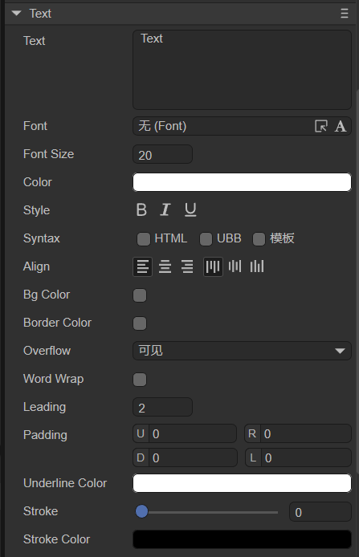

## 基础文本Text

Text继承于Sprite，是静态文本的基础组件。这里我们介绍一下Text专属的组件属性。

## 1. LayaAir IDE中使用Text

### 1.1 创建Text

如图1-1所示，可以在`层级`窗口中右键进行创建，也可以从`小部件`窗口中拖拽添加。


（图1-1）

### 1.2 属性介绍

在IDE中，我们将Text组件添加到场景编辑的视图区后，属性面板中Text组件的专属属性如下图所示： 



（图1-2）

下面我们分别对这些属性进行介绍说明：

| 属性名         | 属性说明                                                     |
| -------------- | ------------------------------------------------------------ |
| text           | 文本的实际内容                                               |
| font           | 文本字体，例如：`Microsoft YaHei`，这里可以手动输入常用的字体 |
| fontSize       | 文本字体大小，例如： `50`，直接填写正整数                    |
| color          | 文本的颜色，可以直接输入颜色值，例如：`#ffffff`，也可以点击输入条右侧的拾色器选取颜色 |
| style          | “**B**”(bold)是否为粗体，“***I***”(italic)是否为斜体，“<u>**U**</u>”是否有下划线 |
| syntax         | 多样式混排，支持部分HTML语法和UBB语法。还可以勾选模版，能够在字符串中使用变量。 |
| align          | 对齐方式，水平对齐(align)分别是left（居左对齐）、center（居中对齐）、right（居右对齐）;垂直对齐(valign)分别是top（居顶对齐）、middle（居中对齐）、bottom（居底对齐） |
| bgColor        | 背景颜色，勾选后可以直接输入颜色值，例如：`#ffffff`，也可以点击输入条右侧的拾色器选取颜色 |
| borderColor    | 文本边框颜色，勾选后可以直接输入颜色值，例如：`#ffffff`，也可以点击输入条右侧的拾色器选取颜色 |
| overflow       | 文本溢出处理，共有三种模式。visible（默认模式）：不进行任何裁切。hidden:不显示超出文本域的字符。scroll:不显示文本域外的字符像素，并且支持scroll接口 |
| wordWrap       | 是否自动换行，布尔值选项，默认为`false`，选择`true`可以开启自动换行 |
| leading        | 垂直行间距，当开启自动换行时，文本内容多行时有效。间距以像素为单位，输入正整数即可 |
| padding        | 文本边距，以像素为单位，由4个整数值组成。“U”表示距上边框的距离、”R“表示距右边框的距离、”D“表示距下边框的距离、”L”表示距左边框的距离 |
| underlineColor | 下划线颜色，可以直接输入颜色值，例如：`#ffffff`，也可以点击输入条右侧的拾色器选取颜色 |
| stroke         | 描边宽度，范围为0~100                                        |
| strokecolor    | 描边颜色，可以直接输入颜色值，例如：`#ffffff`，也可以点击输入条右侧的拾色器选取颜色 |

以上属性都比较容易理解，开发者只需调整参数便可在IDE中看到对应的效果。

这里只详细介绍一下**“syntax”属性**：如果勾选HTML，则支持部分HTML语法；如果勾选UBB，则支持UBB语法，UBB语法比HTML更简洁一点；如果两个都勾选，则两种语法都支持。

支持的UBB语法如下表所示：

| 语法结构                    | 示例代码                                                    | 语句说明           |
| --------------------------- | ----------------------------------------------------------- | ------------------ |
| [img]image_url[/img]        | [img]atlas/comp/image.png[/img]                             | 显示一张图片       |
| [url=link_href]text[/url]   | [url='www.layabox.com']蓝亚盒子[/url]                       | 显示一个超级链接   |
| [b]text[/b]                 | [b]这些字是粗体[/b]                                         | 设置文本为粗体     |
| [i]text[/i]                 | [i]这些字是斜体[/i]                                         | 设置文件为斜体     |
| [u]text[/u]                 | [u]这些字有下划线[/u]                                       | 设置文本下划线     |
| [color=#FFFFFF]text[/color] | [color=#FF0000]这是红色的字[/color]                         | 设置文本颜色       |
| [size=10]text[/size]        | [size=60]这是字体大小为60的字[/size]                        | 设置文本的字体大小 |
| 标签之间的嵌套              | [color=#FF0000] [size=60]红色且大小为60的字[/size] [/color] | 不支持交叉嵌套     |

支持的HTML语法如下表所示：

| 语法结构                                        | 示例代码                                                     | 语句说明                                     |
| ----------------------------------------------- | ------------------------------------------------------------ | -------------------------------------------- |
| `` | ``   | 显示一张图片，还可以使用百分比指定图片的大小 |
| `<a href='xxx'>link text</a>`                   | `<a href='www.layabox.com'>蓝亚盒子</a>`                     | 显示一个超级链接                             |
| `<div> Text </div>`                             | `<div>文本的最外层</div>`                                    | div容器标签                                  |
| `<span> Text </span>`                           | `<span> 多个span之间不会自动换行，除非是达到了宽度限制</span>` | 行内元素                                     |
| `<p>Text</p>`                                   | `<p>多个p标签之间会自动换行，每个完整的p标签是一个单独的段落</p>` | 段落                                         |
| `Text1<br />Text2`                              | `换行<br />后面的就换行了`                                   | 换行                                         |
| `&nbsp;`                                        | `这里&nbsp;空一格`                                           | 空格                                         |

下面来看一个具体的例子，如图1-3所示，勾选HTML和UBB后，就可以在Text属性中输入符合语法的语句：


（图1-3）

Text中输入的示例语句如下：

```html


[url='www.layabox.com']蓝亚盒子[/url]

[size=60]text[/size]

[color=#FF0000]text[/color]

[u]text[/u]

[color=#FF0000][size=60]text[/size][/color]
```

上述这6条语句分别对应图1-3所示的6种效果：加载图片、显示链接、字体大小为60、字体颜色为红色、下划线、嵌套（大小和颜色）。每条语句之间可以不空行，示例中有空行是为了方便观察效果。

“syntax”属性还可以勾选`模版`选项，勾选后，就可以在字符串中使用变量了。比如，在Text属性中输入`Text{n=100}`，效果如图1-4所示：


（图1-4）

变量n还可以是字符串，例如，输入`Text{n=你好}`,显示的效果就是图1-5所示的了。当然，这个变量不一定必须是n，开发者可以自定义变量名。


（图1-5）

还可以在代码中使用`setVar`方法动态调节变量n，可以结合1.3节的脚本控制，在脚本中输入如下代码：

```typescript
const { regClass, property } = Laya;

@regClass()
export class NewScript extends Laya.Script {
    //declare owner : Laya.Sprite3D;

    @property({ type: Laya.Text })
    txt: Laya.Text;

    constructor() {
        super();
    }

    onAwake(): void {
        this.txt.text = "第{n=1}页"; //显示文本的初始化内容
    }

    onStart(): void {
        let page: number = 1;
        Laya.timer.frameLoop(10, this, () => {
            page += 1; //在定时器中让变量page每次自增1
            this.txt.setVar("n", page); //使用setVar方法，让text文本中变量n的值动态改变
        });
    }
}
```

效果如动图1-6所示：


（动图1-6）

> 注：变量n还可以是从.json文件中获取的文本，开发者可以自己写一个.json文件，然后在脚本中进行加载，最后利用setVar方法赋值给变量n。


### 1.3 脚本控制Text

在Scene2D的属性设置面板中，增加一个自定义组件脚本。然后，将Text拖入到其暴露的属性入口中。下面给出一个示例代码，实现脚本控制Text：

```typescript
const { regClass, property } = Laya;

@regClass()
export class TextControl extends Laya.Script {
    //declare owner : Laya.Sprite3D;

    @property( { type : Laya.Text } )
    public txt: Laya.Text;

    constructor() {
        super();
    }

    /**
     * 组件被激活后执行，此时所有节点和组件均已创建完毕，此方法只执行一次
     */
    onAwake(): void {
        this.txt.pos(Laya.stage.width >> 1, Laya.stage.height >> 1); //位置
        this.txt.size(500, 30); //大小
        this.txt.pivot(this.txt.width/2, this.txt.height/2); //轴心点
        this.txt.text = "大家好，欢迎各位开发者使用LayaAir IDE，这里是Text的文本内容，您可以基于此文本进行调试"; //文本内容
        this.txt.font = "宋体"; //字体
        this.txt.fontSize = 50; //字体大小
        this.txt.color = "#ff0000"; //字体颜色
        this.txt.bold = true; //加粗
        this.txt.italic = true; //斜体
        this.txt.underline = true; //下划线
        this.txt.underlineColor = "#ff0000"; //下划线颜色

        this.txt.stroke = 5; //描边宽度
        this.txt.strokeColor = "#000000" ; //描边颜色

        this.txt.wordWrap = true; //自动换行
        this.txt.leading = 20; //垂直行间距
        // this.txt.padding = [10, 10, 10, 10]; //文本边距

        this.txt.align = "center"; //水平对齐方式
        this.txt.valign = "top"; //垂直对齐方式

        this.txt.overflow = "visible"; //文本溢出

    }
}
```


## 2. 代码创建Text

有时，不想让Text节点一开始就在舞台上，而是在要用的时候才添加，这就要通过代码来创建了。在Scene2D的属性设置面板中，增加一个自定义组件脚本，示例代码如下：

```typescript
const { regClass, property } = Laya;

@regClass()
export class NewScript extends Laya.Script {
    //declare owner : Laya.Sprite3D;

    constructor() {
        super();
    }

    /**
     * 组件被激活后执行，此时所有节点和组件均已创建完毕，此方法只执行一次
     */
    onAwake(): void {
        let txt = new Laya.Text();
        // 添加到舞台
        Laya.stage.addChild(txt);
        txt.pos(Laya.stage.width >> 1, Laya.stage.height >> 1); //位置
        txt.size(500, 30); //大小
        txt.pivot(txt.width/2, txt.height/2); //轴心点
        txt.text = "大家好，欢迎各位开发者使用LayaAir IDE，这里是Text的文本内容，本方法是代码创建Text"; //文本内容
        txt.wordWrap = true; //自动换行
    }
}
```

