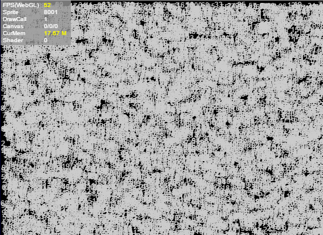
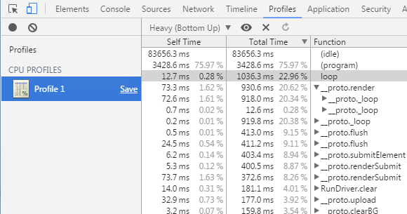

# 性能优化


## 一、 内存优化方式

### 1.1 通过对象池优化内存

对象池优化是游戏开发中非常重要的优化方式，也是影响游戏性能的重要因素之一。
在游戏中有许多对象在不停的创建与移除，比如角色攻击子弹、特效的创建与移除，NPC的被消灭与刷新等，在创建过程中非常消耗性能，特别是数量多的情况下。
对象池技术能很好解决以上问题，在对象移除消失的时候回收到对象池，需要新对象的时候直接从对象池中取出使用。
优点是减少了实例化对象时的开销，且能让对象反复使用，减少了新内存分配与垃圾回收器运行的机会。
**注意**：对象移除时并不是立即从内存中抹去，只有认为内存不足时，才会使用垃圾回收机制清空，清空时很耗内存，很可能就会造成卡顿现象。**用了对象池后将减少程序的垃圾对象，有效的提高程序的运行速度和稳定性**。

具体使用方式请参考[《对象池》](https://layaair.layabox.com/3.x/doc/basics/common/Pool/readme.html)文档


### 1.2 释放内存

JavaScript运行时无法启动垃圾回收器。要确保一个对象能够被回收，需要删除对该对象的所有引用。Sprite提供的`destory()`方法会帮助设置内部引用为null。

例如，以下代码确保对象能够被作为垃圾回收：

```typescript
//创建一个Sprite实例
var sp:Laya.Sprite = new Laya.Sprite();
//将sp内部引用设置为null
sp.destroy();
```

当对象设置为null，不会立即将其从内存中删除。只有系统认为内存足够低时，垃圾回收器才会运行。内存分配（而不是对象删除）会触发垃圾回收。

垃圾回收期间可能占用大量CPU并影响性能。通过重用对象，尝试限制使用垃圾回收。此外，尽可能将引用设置为null，以便垃圾回收器用较少时间来查找对象。有时（比如两个对象相互引用），无法同时设置两个引用为null，垃圾回收器将扫描无法被访问到的对象，并将其清除，这会比引用计数更消耗性能。


### 1.3 资源卸载

游戏运行时总会加载许多资源，这些资源在使用完成后应及时卸载，否则一直残留在内存中。

下例演示加载资源后对比资源卸载前和卸载后的资源状态：

```typescript
var assets: Array<any> = []
assets.push("resources/apes/monkey0.png");
assets.push("resources/apes/monkey1.png");
assets.push("resources/apes/monkey2.png");
assets.push("resources/apes/monkey3.png");
Laya.loader.load(assets).then(()=>{
    for(var i:number = 0, len: number = assets.length; i<len; ++i)
    {
        var asset:string = assets[i];
        //查看log，清理前资源一直在内存中
        console.log(Laya.loader.getRes(asset));
        //调用清理方法
        Laya.loader.clearRes(asset);
        //查看log，清理后，资源被卸载
        console.log(Laya.loader.getRes(asset));
    }
});
```


### 1.4 关于滤镜、遮罩

尝试尽量减少使用滤镜效果。将滤镜（BlurFilter和GlowFilter）应用于显示对象时，运行时将在内存中创建两张位图。其中每个位图的大小与显示对象相同。将第一个位图创建为显示对象的栅格化版本，然后用于生成应用滤镜的另一个位图：

 

（图1-1）

应用滤镜时内存中的两个位图

当修改滤镜的某个属性或者显示对象时，内存中的两个位图都将更新以创建生成的位图，这两个位图可能会占用大量内存。此外，此过程涉及CPU计算，动态更新时将会降低性能。

ColorFiter在Canvas渲染下需要计算每个像素点，而在WebGL下的GPU消耗可以忽略不计。

最佳的做法是，尽可能使用图像创作工具创建的位图来模拟滤镜。避免在运行时中创建动态位图，可以帮助减少CPU或GPU负载。特别是一张应用了滤镜并且不会在修改的图像。


# 二、渲染优化方式

### 2.1 优化Sprite

1. 尽量减少不必要的层次嵌套，减少Sprite数量。

2. 非可见区域的对象尽量从显示列表移除或者设置visible=false。

3. 对于容器内有大量静态内容或者不经常变化的内容（比如按钮），可以对整个容器设置cacheAs属性，能大量减少Sprite的数量，显著提高性能。如果有动态内容，最好和静态内容分开，以便只缓存静态内容。

4. Panel内，会针对panel区域外的直接子对象（子对象的子对象判断不了）进行不渲染处理，超出panel区域的子对象是不产生消耗的。

   

### 2.2 优化DrawCall

1. 对复杂静态内容设置cacheAs，能大量减少DrawCall，使用好cacheAs是游戏优化的关键。
2. 尽量保证同图集的图片渲染顺序是挨着的，如果不同图集交叉渲染，会增加DrawCall数量。
3. 尽量保证同一个面板中的所有资源用一个图集，这样能减少提交批次。


### 2.3 优化Canvas

在对Canvas优化时，我们需要注意，在以下场合不要使用cacheAs：

1. 对象非常简单，比如一个字或者一个图片，设置cacheAs=”bitmap”不但不提高性能，反而会损失性能。
2. 容器内有经常变化的内容，比如容器内有一个动画或者倒计时，如果再对这个容器设置cacheAs=”bitmap”，会损失性能。

可以通过查看Canvas统计信息的第一个值，判断是否一直在刷新Canvas缓存。


### 2.4 CacheAs

设置cacheAs可将显示对象缓存为静态图像，当cacheAs时，子对象发生变化，会自动重新缓存，同时也可以手动调用reCache方法更新缓存。 建议把不经常变化的复杂内容，缓存为静态图像，能极大提高渲染性能，cacheAs有”none”，”normal”和”bitmap”三个值可选。

1. 默认为”none”，不做任何缓存。
2. 当值为”normal”时，Canvas下进行画布缓存，webgl模式下进行命令缓存。
3. 当值为”bitmap”时，Canvas下进行依然是画布缓存，webGL模式下使用renderTarget缓存。这里需要注意的是，webGL下renderTarget缓存模式有2048大小限制，超出2048会额外增加内存开销。另外，不断重绘时开销也比较大，但是会减少drawcall，渲染性能最高。 webGL下命令缓存模式只会减少节点遍历及命令组织，不会减少drawcall，性能中等。

设置cacheAs后，还可以设置staticCache=true以阻止自动更新缓存，同时可以手动调用reCache方法更新缓存。

cacheAs主要通过两方面提升性能。一是减少节点遍历和顶点计算；二是减少drawCall。善用cacheAs将是引擎优化性能的利器。

下例绘制10000个文本(根据电脑性能而定，本例为10000)：

```typescript
class Test {
     private text:Laya.Text;
    constructor() {
        Laya.init(550,400,Laya.WebGL);
        Laya.Stat.show();
        var textBox=new Laya.Sprite();
        for(var i=0;i<10000;i++)
        {
            this.text=new Laya.Text();
            this.text.text=(Math.random()*100).toFixed(0);
            this.text.color="#CCCCCC";
            this.text.x=Math.random()*550;
            this.text.y=Math.random()*400;
            textBox.addChild(this.text);
        }
        Laya.stage.addChild(textBox);
    }
}
```

下面是笔者电脑上的运行时截图，FPS稳定于52上下。

 

（图2-1）

当我们对文字所在的容器设置为cacheAs之后，如下面的例子所示，性能获得较大的提升，FPS达到到了60帧。

```
 //...省略其他代码   
 var textBox=new Laya.Sprite();   
 textBox.cacheAs="bitmap";
 //...省略其他代码
```

 

（图2-2）


### 2.5 文字描边

在运行时，设置了描边的文本比没有描边的文本多调用一次绘图指令。此时，文本对CPU的使用量和文本的数量成正比。因此，尽量使用替代方案来完成同样的需求。

· 对于几乎不变动的文本内容，可以使用cacheAs降低性能消耗

· 对于内容经常变动，但是使用的字符数量较少的文本域，可以选择使用位图字体。


### 2.6 跳过文本排版，直接渲染

大多数情况下，很多文本都不需要复杂的排版，仅仅简单地显示一行字。为了迎合这一需求，Text提供的名为changeText的方法可以直接跳过排版。

```typescript
this.text.text="text";
Laya.stage.addChild(this.text);
//后面只是更新文字内容，使用changeText能提高性能
this.text.changeText("text changed.");
```

Text.changeText会直接修改绘图指令中该文本绘制的最后一条指令，这种前面的绘图指令依旧存在的行为会导致changeText只使用于以下情况：

· 文本始终只有一行。

· 文本的样式始终不变（颜色、粗细、斜体、对齐等等）。

即使如此，实际编程中依旧会经常使用到这样的需要。


## 三、减少CPU使用量

### 3.1 减少动态属性查找

JavaScript中任何对象都是动态的，你可以任意地添加属性。然而，在大量的属性里查找某属性可能很耗时。如果需要频繁使用某个属性值，可以使用局部变量来保存它：

```typescript
foo()
{
    var prop=this.target.prop;
    //使用prop
    this.process1(prop);
    this.process2(prop);
    this.process3(prop);
}
```


### 3.2 性能消耗的回收

日常在使用消耗性能的功能时，尤其是循环处理，当无需使用时，一定要及时回收，或停止循环。

 LayaAir提供两种计时器循环来执行代码块。

1. `Laya.timer.frameLoop`执行频率依赖于帧频率，可通过Stat.FPS查看当前帧频。


1. `Laya.timer.loop`执行频率依赖于参数指定时间。

```typescript
Laya.timer.frameLoop(1, this, this.animateFrameRateBased);
Laya.stage.on("click", this, this.dispose);
dispose() 
{
    Laya.timer.clear(this, this.animateFrameRateBased);
}
```

当一个对象的生命周期结束时，记得清除其内部的Timer


### 3.3 获取显示对象边界的做法

在相对布局中，很经常需要正确地获取显示对象的边界。获取显示对象的边界也有多种做法，而其间差异很有必要知道。

1. 使用getBounds/ getGraphicBounds。

```typescript
var sp=new Laya.Sprite();
sp.graphics.drawRect(0,0,100,100,"#FF0000");
var bounds:Laya.Rectangle=sp.getGraphicBounds();
Laya.stage.addChild(sp);
```

getBounds可以满足多数多数需求，但由于其需要计算边界，不适合频繁调用。

1. 设置容器的autoSize为true。

```typescript
var sp=new Laya.Sprite();
sp.autoSize=true;
sp.graphics.drawRect(0,0,100,100,"#FF0000");
Laya.stage.addChild(sp);
```

上述代码可以在运行时正确获取宽高。autoSize在获取宽高并且显示列表的状态发生改变时会重新计算（autoSize通过getBoudns计算宽高）。所以对拥有大量子对象的容器应用autoSize是不可取的。如果设置了size，autoSize将不起效。

使用loadImage后获取宽高：

```typescript
var sp=new Laya.Sprite();
sp.loadImage("res/apes/monkey2.png",0,0,0,0,Laya.Handler.create(this,function()
{
    console.log(sp.width,sp.height);  
}));
Laya.stage.addChild(sp);
```

loadImage在加载完成的回调函数触发之后才可以正确获取宽高。

1. **直接调用size设置：**

```typescript
Laya.loader.load("res/apes/monkey2.png",Laya.Handler.create(this,function()
{
    var texture=Laya.loader.getRes("res/apes/monkey2.png");
    var sp=new Laya.Sprite();
    sp.graphics.drawTexture(texture,0,0);
    sp.size(texture.width,texture.height);
    Laya.stage.addChild(sp);
}));
```

使用Graphics.drawTexture并不会自动设置容器的宽高，但是可以使用Texture的宽高赋予容器。毋庸置疑，这是最高效的方式。

**注：getGraphicsBounds用于获取矢量绘图宽高。**


### 3.4 根据活动状态改变帧频

帧频有三种模式，

- Stage.FRAME_FAST

  fast模式，最高FPS为显示器的最大帧率，如果显示器最大帧率是60，则最大FPS为60，显示器最大帧率是120，则最大FPS为120。

- Stage.FRAME_SLOW

  slow模式，最高FPS为显示器最大帧率的一半，在游戏运行的过程中，引擎会隔帧丢弃。如果实际可以达到40帧，那游戏最终帧率只是20，如果帧率能达到100，那最终帧只能是50。

- Stage.FRAME_MOUSE

  mouse模式则选择性在fast模式与slow模式之间切换，有时并不需要让游戏以满帧速率执行，比如60帧满帧的时候，30FPS已经能够满足多数情况下人类视觉的响应，但是鼠标交互时，30FPS可能会造成画面的不连贯，于是Stage.FRAME_MOUSE应运而生。

  下例展示以Stage.FRAME_SLOW的帧率，在画布上移动鼠标，使圆球跟随鼠标移动：

```typescript
Laya.init(this.Browser.width,this.Browser.height);
Laya.Stat.show();
Laya.stage.frameRate=Laya.Stage.FRAME_SLOW;
var sp=new Laya.Sprite();
sp.graphics.drawCircle(0,0,20,"#990000");
Laya.stage.addChild(sp);
Laya.stage.on(Laya.Event.MOUSE_MOVE,this,function()
{
	sp.pos(Laya.stage.mouseX,Laya.stage.mouseY);
});
```

 

（图3-1）

此时FPS显示30，并且在鼠标移动时，可以感觉到圆球位置的更新不连贯。设置Stage.frameRate为Stage.FRAME_MOUSE：

```typescript
Laya.stage.frameRate = Laya.Stage.FRAME_MOUSE;
```

 

（图3-2）

此时在鼠标移动后FPS会显示60，并且画面流畅度提升。在鼠标静止2秒不动后，FPS又会恢复到30帧。


### 3.5 使用callLater

callLater使代码块延迟至本帧渲染前执行。如果当前的操作频繁改变某对象的状态，此时可以考虑使用callLater，以减少重复计算。

考虑一个图形，对它设置任何改变外观的属性都将导致图形重绘：

```typescript
var rotation=0,
scale=1,
position=0;
private function setRotation(value):void
{
  this.rotation=value;
  update();
}
private function setScale(value):void
{
  this.scale = value;
    update();
}
private function setPosition(value):void
{
    this.position = value;
    update();
}
public function update()
{
    console.log('rotation: ' + this.rotation + '\tscale: ' + this.scale + '\tposition: ' + this.position);
}
```

调用以下代码更改状态：

```typescript
setRotation(90);
setScale(2);
setPosition(30);
```

控制台的打印结果是:

```typescript
rotation: 90scale: 1position: 0
rotation: 90scale: 2position: 0
rotation: 90scale: 2position: 30
```

update被调用了三次，并且最后的结果是正确的，但是前面两次调用都是不需要的。

尝试将三处update改为：

```typescript
Laya.timer.callLater(this, update);
```

此时，update只会调用一次，并且是我们想要的结果。


### 3.6 图片/图集加载

在完成图片/图集的加载之后，引擎就会开始处理图片资源。如果加载的是一张图集，会处理每张子图片。如果一次性处理大量的图片，这个过程可能会造成长时间的卡顿。

在游戏的资源加载中，可以将资源按照关卡、场景等分类加载。在同一时间处理的图片越少，当时的游戏响应速度也会更快。在资源使用完成后，也可以予以卸载，释放内存。


# 四、其它优化策略

### 4.1 减少粒子的使用数量

由于粒子属于矢量绘制，大量使用粒子对CPU压力大，在移动平台Canvas模式下，尽量不用粒子；

WebGL模式下可以采用GPU运算，能减轻CPU压力，但也要尽量控制，减少使用量。

### 4.2 Canvas模式尽量减少旋转，缩放，alpha等属性的使用

在Canvas模式下，尽量减少旋转，缩放，alpha等属性的使用，这些属性会对性能产生消耗。

如要使用，建议在WebGL模式下使用；

### 4.3 不要在Timer的循环里创建对象及复杂计算

由于Timer的`loop()`与`frameLoop()`方法里会不断的循环执行，当创建对象及复杂计算时，会导致大量的性能消耗出现在循环里，因此，尽可能不要在循环里创建对象及复杂计算。

### 4.4 尽量少用autoSize与getBounds

`autoSize()`与`getBounds()`需要大量计算，对性能的影响较大，尽量少用。

### 4.5 被try catch的函数执行会变得非常慢

项目中尽量减少`try catch`的使用，被`try catch`的函数执行会变得非常慢。


# 五、使用chrome的性能分析器

> 性能分析器（Profiles）是 chrome 开发者工具的一部分，可以通过在页面右键选择审查元素或在谷歌浏览器页面按F12 打开 chrome 开发者工具。然后点击 Profiles 切换至性能分析器（Profiles）面板。

### 5.1 CPU占用分析

#### 启动CPU性能分析器

 选中 `Record JavaScript CPU Profile`，点击 Start 按钮或左上角的实心圆点，这个时候Chrome 就会开始记录当前网页的方法的执行。如图5-1所示。


（图5-1）

#### 结束CPU性能分析器的监控

结束这个性能分析器的监控记录需要点击Stop按钮（或左侧的红色实心圆圈）。如图5-2所示。


（图5-2）

#### 查看CPU性能分析器的记录

结束监控后，在左侧 Profiles 下会列出一个监控结果文件，单击可以打开此监控结果文件。如图5-3所示


（图5-3）

监控结果是以数据表格形式展现的。我们可以根据消耗排行，找到Function中提供的函数名，针对性能消耗较大的地方进行优化。


### 5.2 内存占用分析

#### 启动内存分析

选中 `Take Heap Snapshot`，点击 `Take Snapshot` 按钮（也可以点击左边黑色实心圆圈），如图5-4所示，


（图5-4）

生成的内存快照文件是以数据表格的形式记录了，当前网页对象的个数、所占的内存大小等。

#### 内存快照记录

在启动内存分析后，很快就会在左侧的 Profiles 栏目下生成一个当前网页的内存快照记录文件。单击可以查看相关数据，如图5-5所示。


（图5-5）

#### 内存快照分析

在拍完第一个内存快照后，点击左上角的圆点，可以记录一个新的内存快照。单击选择第二个内存快照，可以选择 Comparison 模式对此第二个快照与第一个快照之间的变化。通过分析，对网页进行优化。

 

 （图5-6）

 

 （图5-7）


## 六、纹理压缩的使用

使用纹理压缩的好处：

1，降低内存，特别是移动端应用，内存占用不应过大，否则低端机很容易崩溃

2，降低带宽，手游类应用，在渲染时会有大量贴图传输到GPU，不限制的话不仅会严重影响渲染性能，同时会带来很严重的发热

具体使用方式请参考[《纹理压缩》](https://layaair.layabox.com/3.x/doc/IDE/textureCompress/readme.html)文档


