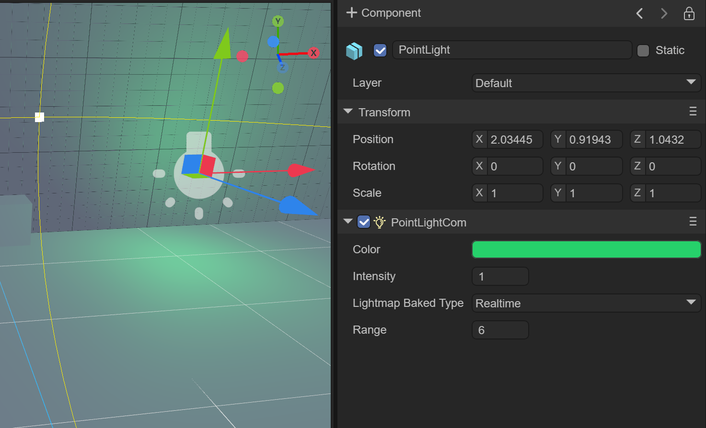
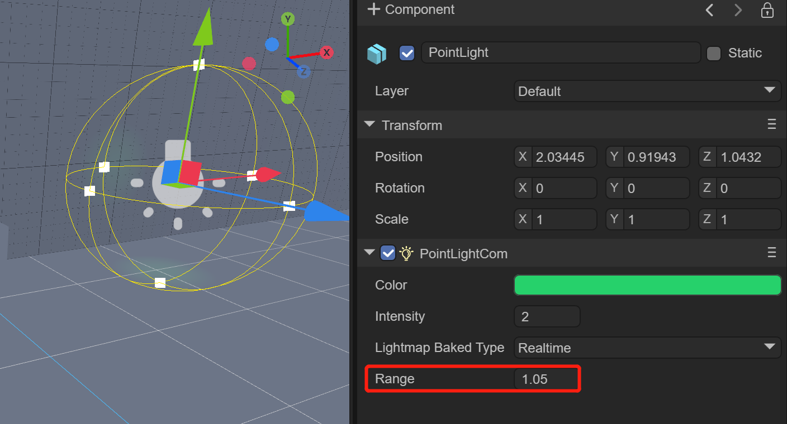
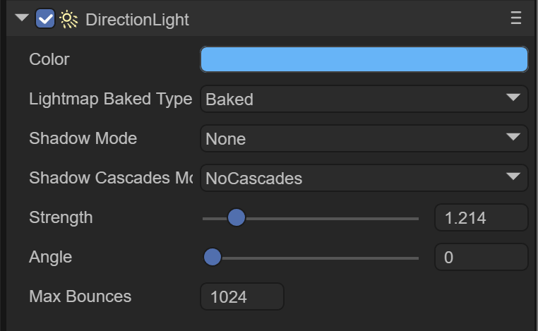
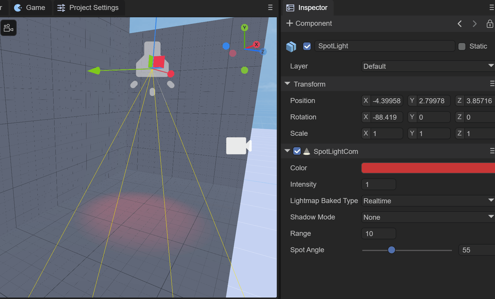
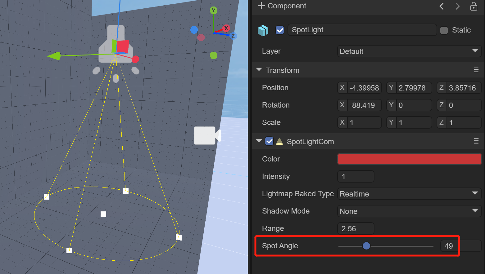
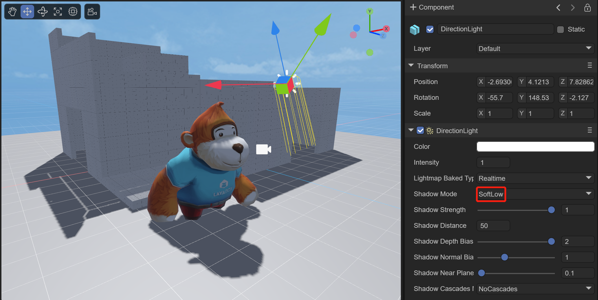
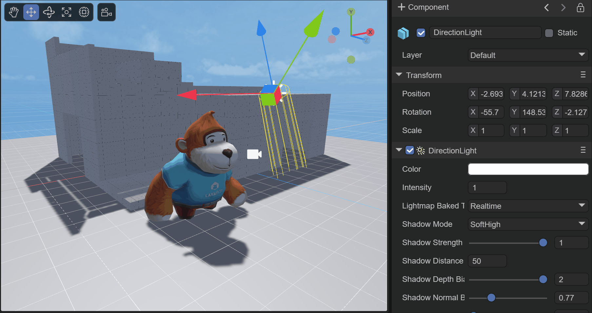
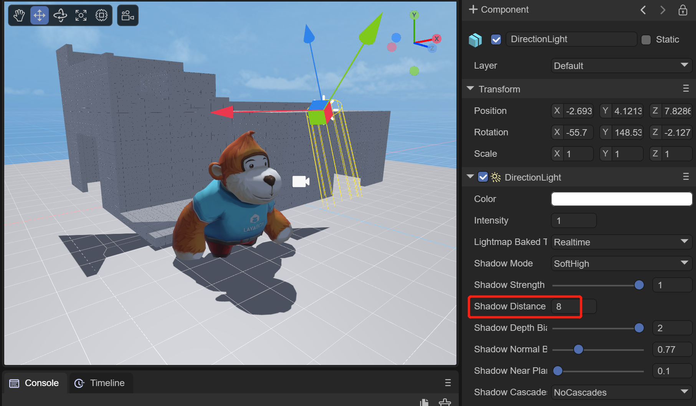
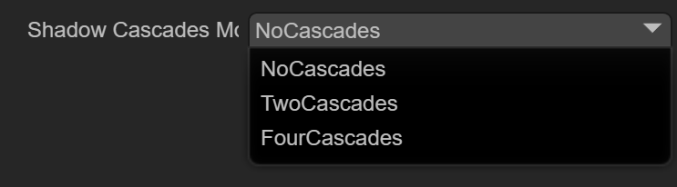

# 使用3D灯光和阴影


## 一、概述

光源是每一个场景的重要组成部分。网格和纹理决定了一个物体的形状和外观，但是光源决定了你的环境的颜色和氛围。灯光的种类有多种，不同的光源呈现的效果不同，可以设置不同的参数。

目前光源的种类有：

- **DirectionLight（平行光）**
- **PointLight（点光源）**
- **SpotLight（聚光灯）**
- **AreaLight（区域光）**

本篇会一一讲解这四种光源。


## 二、PointLight

PointLight（点光源）是向四面八方发射光线的光源，又称全向光或者球状光，现实中的点光源比如灯泡、蜡烛，可以感觉到点光源是有强度、颜色和衰减半径属性。

如图2-1所示，在一个建筑中，周围都是墙壁，其中创建的点光源，可以通过设置强度，颜色，半径来设置光源效果


（图2-1）


### 2.1 创建点光源

 

（动图2-2）

如动图2-2所示，在Scene3D或者任意节点下，鼠标右键选择Light，点击PointLight，即可在场景中创建一个点光源。


### 2.2 组件属性

#### 2.2.1 基础属性

如图2-3所示，当创建一个PointLight后，在Inspector属性面板中会有如下几个属性

 

（图2-3） 

`Color`：点光源的颜色

 

（图2-4） 

`Intensity`：点光源的强度

 

（图2-5） 

`Range`：设置点光源的范围，相当于点光源的照射范围，数值越大，光照范围越大。

 

（图2-6） 

`Lightmap Bake Type`：光源模式

​	`Mixed`：混合光源

​	混合光源结合了实时光源和光照烘焙。可以使用混合光源将动态阴影与来自同一光源的烘焙照明相结合，或者在希望灯光提供直接实时照明和烘焙间接照明时使用混合灯光。可在运行时更改混合光源的属性。这样做将更新光源的实时光照，但不会更新烘焙光照。由于混合灯光总是至少结合一些实时和一些烘焙灯光，因此混合灯光总是比完全烘焙灯光涉及更多的运行时计算，并且比完全实时灯光使用更高的内存。

​	`Realtime`：实时光源

​	LayaAir会在运行时为实时光源执行光照计算，每帧进行一次。你可以在运行时更改实时光源的属性，从而创建诸如闪烁的灯泡或穿过暗室的火炬之类的效果。

实时光源可用于在角色或可移动的几何体上提供光照和投射阴影。为实时光源执行运行时计算可能成本很高。

​	`Baked`：烘焙光源

​	LayaAir为烘焙光源执行计算，并将结果作为光照数据保存到磁盘中。这一过程称为烘焙。在运行时，LayaAir将加载烘焙的光照数据，并使用这一数据来照亮场景。由于复杂的计算是预先执行的，因此烘焙光源可以减少运行时的着色成本，并减少阴影的渲染成本。烘焙光源可用于照亮在运行时不会发生变化的对象，例如景物。

#### 2.2.2 烘焙属性

如图2-7所示，当选择Lightmap Bake Type为Baked时，下面会出现三个参数。此功能是为了对烘焙效果提前做出设置。

由于只有在烘焙执行后，才能看到烘焙效果，有可能会对如下参数反复进行调整，不断烘焙出最佳效果。

  

（图2-7） 

​	`Box`：立方体天空盒

​	`Dome`：球形天空盒

`Material`：指定天空盒的材质

`Power`：烘焙的光照强度

`Radius`：烘焙的光照半径

`Max Bounces`：烘焙的光照最大反弹数

 

（图2-8）

图2-8所示，为对一个建筑场景添加多个点光源，烘焙后的效果


### 2.3 使用代码设置

```typescript
//创建点光源
var pointLight: PointLight = (<PointLight>this.scene.addChild(new PointLight()));
//点光源的颜色
pointLight.color = new Color(1.0, 0.5, 0.0, 1);
pointLight.transform.position = new Vector3(0.4, 0.4, 0.0);
//设置点光源的范围
pointLight.range = 3.0;
//设置点光源的强度
pointLight.intensity = 2;
```


## 三、DirectionLight

Direction Light（平行光）与点光区别较大，它有固定的一个方向，可通过弧度值设定，并且也没有衰减和光照范围，会对全场景所有模型进行照亮。3D世界中经常用来模拟固定方向的太阳光。

当新建一个3D场景时，DirectionLight是默认自带的

如图3-1所示，在一个场景中，通过调整平行光的角度，可以调整场景的光照效果

 

（动图3-1）


### 3.1 创建平行光

 

（动图3-2）

如动图3-2所示，在Scene3D或者任意节点下，鼠标右键选择Light，点击DirectionLight，即可在场景中创建一个平行光。


### 3.2 组件属性

#### 3.2.1 基础属性

如图3-3所示，当创建一个DirectionLight后，在Inspector属性面板中会有如下几个属性

 

（图3-3） 

`Color`：平行光的颜色

 

（图3-4） 

`Intensity`：平行光的强度

 

（图3-5）

`Lightmap Bake Type`：光源模式，同点光源一样

`Shadow Mode`：阴影模式

`Shadow Cascades Mode`：阴影的级联模式

 

（动图3-6）

如动图3-6所示，可以开启阴影模式的效果，同时调整平行光的角度，可以看到阴影随着改变。我们将会在第六章介绍阴影

#### 3.2.2 烘焙属性

如图3-7所示，当选择Lightmap Bake Type为Baked时，下面会出现三个参数。此功能是为了对烘焙效果提前做出设置。

  

（图3-7） 

`Power`：烘焙的光照强度

`Radius`：烘焙的光照角度

`Max Bounces`：烘焙的光照最大反弹数 


### 3.3 使用代码设置

```
//方向光的颜色
this.directionLight.getComponent(Laya.DirectionLightCom).color.setValue(1, 1, 1, 1);
//设置平行光的方向
var mat: Matrix4x4 = this.directionLight.transform.worldMatrix;
mat.setForward(new Vector3(-1.0, -1.0, -1.0));
this.directionLight.transform.worldMatrix = mat;
```

 **setForward** 平行光的方向，分别代表x、y、z轴上的方向，负数为负轴，正数为正轴，值的范围为-1—0—1，超过范围后为-1或1，初学者们可以在这个范围内设值观察方向的变化。

 

（动图3-8）

如动图3-8，设置平行光旋转看到的效果


## 四、SpotLight

SpotLight 聚光指的是从特定光源方向射出的光，比如手电筒，舞台筒灯等。光照区域根据距离因素逐渐放大，同时光照区域边缘也有衰减现象。

如图4-1所示，在一个场景中，通过调整聚光的锥形角度，可以调整场景的光照效果

 

（动图4-1）


### 4.1 创建聚光

 

（动图4-2）

如动图4-2所示，在Scene3D或者任意节点下，鼠标右键选择Light，点击SpotLight，即可在场景中创建一个聚光。


### 4.2 组件属性

#### 4.2.1 基础属性

如图4-3所示，当创建一个SpotLight后，在Inspector属性面板中会有如下几个属性

 

（图4-3） 

`Color`：聚光的颜色

 

（图4-4） 

`Range`：聚光的照射范围，与点光类似，区别只是聚光有方向，而点光无方向

 

 

（图4-5）

`Spot Angle`：聚光灯的锥形角度，设置的值越小，聚光光圈的越小，反之光圈越大。

 

（图4-6）

#### 4.2.2 烘焙属性

如图4-7所示，当选择Lightmap Bake Type为Baked时，下面会出现五个参数。此功能是为了对烘焙效果提前做出设置。

  

（图4-7） 

`Power`：烘焙的光照强度

`Radius`：烘焙的光照半径

`Max Bounces`：烘焙的光照最大反弹数

`Spot Size`：聚光的尺寸

`Blend`：混合比例，0-1之间


### 4.3 使用代码设置

```typescript
//聚光灯
var spotLight = scene.addChild(new Laya.SpotLight()) as Laya.SpotLight;
//设置聚光灯颜色
spotLight.color = new Laya.Vector3(1, 1, 0);
//设置聚光灯位置
spotLight.transform.position = new Laya.Vector3(0.0, 1.2, 0.0);
//设置聚光灯方向
var mat = spotLight.transform.worldMatrix;
mat.setForward(new Laya.Vector3(0.15, -1.0, 0.0));
spotLight.transform.worldMatrix = mat;
//设置聚光灯范围
spotLight.range = 6.0;
//设置聚光灯锥形角度
spotLight.spotAngle = 32;
```

 **setForward** 平行光的方向，分别代表x、y、z轴上的方向，负数为负轴，正数为正轴，值的范围为-1—0—1，超过范围后为-1或1，初学者们可以在这个范围内设值观察方向的变化。

 

（动图4-8）

如动图4-8，设置聚光灯旋转看到的效果


## 五、AreaLight

AreaLight（区域光）可以通过空间中的两个形状之一定义区域光：矩形或圆盘。区域光从该形状的一侧发射光。发射的光在该形状的表面区域的所有方向上均匀传播。区域光提供的照明强度以与光源距离的平方反比确定的速率减小（见平方反比定律）。由于此照明计算非常占用处理器，因此区域灯光在运行时不可用，只能烘焙到光照贴图中。

由于区域光同时从几个不同方向照亮对象，因此阴影趋向于比其他光源类型更柔和、细腻。您可以使用这种光源来创建逼真的路灯或靠近玩家的一排灯光。小的区域光可以模拟较小的光源（例如室内光照），但效果比点光源更逼真。

如图5-1所示，在一个场景中，通过调整区域光的尺寸和扩散，可以调整场景的光照效果

 

（动图5-1）

### 5.1 创建区域光

 

（动图5-2）

如动图5-2所示，在Scene3D或者任意节点下，鼠标右键选择Light，点击AreaLight，即可在场景中创建一个区域光。

### 5.2 组件属性

#### 5.2.1 基础属性

如图5-3所示，当创建一个AreaLight后，在Inspector属性面板中会有如下几个属性

 

（图5-3） 

`Color`：区域光的颜色

`Intensity`：区域光的强度

`Shape`：区域光的形状

​	`Rect`：矩形

​	`Elliptic`：圆形

`Spread`：扩散度

#### 5.2.2 烘焙属性

`Max Bounces`：烘焙的最大反弹数


## 六、如何为灯光添加阴影

投影是灯光照射模型时产生的即时阴影，可随着灯光角度、灯光强度、模型位置等变化而变化。投影是3D世界最重要的因素之一，能产生更加强烈的立体感。

即时阴影非常损耗性能，不能用得太多，特别是游戏场景，模型量较大，一般我们不使用实时投影，而使用静态的光照贴图。


#### 6.1 灯光的阴影属性

要让场景中产生投影，我们需了解灯光的以下属性，每种光源都具备这些属性

##### 6.1.1 阴影模式

 

（图6-1） 

`ShadowMode`：阴影模式，共分为四种模式：

​	`None`：不产生阴影

​	`Hard`：硬阴影，对性能要求较低

 

（图6-1-1）

​	`SoftLow`：低强度软阴影，对性能要求一般

 

（图6-1-2）

​	`SoftHigh`：高强度软阴影，对性能要求较高

 

（图6-1-3）效果最好

硬阴影和软阴影的区别：硬阴影（hard shadow）是指由理想电光源（即聚光性能好的单一光源）产生的阴暗均一、边界分明的阴影,它只包含物体的本影（umbra）。软阴影（soft shadow）则是由线、面或体光源等产生的边界柔和、有一定明暗过度的阴影，它包括物体的本影和半影（penumbra）。当物体完全处于阴影中时，即在本影域内，而当物体受到部分光照时则处于半影域内。

##### 6.1.2 阴影属性

当我们选择一种阴影模式后，可以看到设置阴影的属性

 

（图6-2）

`shadowStrength`：阴影强度，该值越大，阴影越明显。

 

（动图6-2-1） 

`shadowDistance`：灯光产生阴影的范围，范围是指摄像机到模型的距离，超出这个范围的模型将不会产生阴影与接受阴影，开发者可以根据场景大小进行设置。

 

（图6-2-2） 

图6-2-2中，`shadowDistance`距离为8时的效果

`shadowDepthBias`：阴影贴图基于深度的偏移，将深度做一个偏移可以有效解决阴影痤疮（”shadow acne”）。但需要提醒的是：在 `shadowDepthBias` 过大时会导致阴影脱离物体，即”Peter Panning”现象的出现。

`shadowNormalBias`：阴影贴图基于法线的偏移，将阴影Caster的表面沿着法线方向的反方向偏移，以防止自身阴影（“shadow acne”）伪影的出现。 较大的值可以更好地防止阴影痤疮（”shadow acne”），但要以阴影形状小于实际对象为代价。

`shadowNearPlane`：阴影视锥的近裁面，可以对阴影视锥的近裁面进行设置。

##### 6.1.3 阴影的级联模式

 

（图6-3） 

`shadowCascadesMode`：阴影的级联模式，数量越大，产生阴影贴图时，将视锥体划分的子视锥体越多，对应的阴影贴图也越多，阴影的质量会越好。


`TwoCascades`：二级级联阴影分割比例。

 

（图6-3-1）  

图6-3-1中，`TwoCascades`的效果


`FourCascades`：四级级联阴影分割比例，X、Y、Z依次为其分割比例，Z必须大于Y，Y必须大于X。

 

（图6-3-2）  

图6-3-2中，`FourCascades`的效果 


#### 6.2 模型的投影属性

除了光源的阴影设置，需要在模型上设置投影属性：如图6-4所示

 

（图6-4） 

`receiveShadow`：是否接受阴影，当模型此属性为true时，计算出的阴影会在此模型上显示出来。在游戏中，我们可以把场景的地面，及场景中可走动区域中的模型 `castShadow` 属性设置为true。

`castShadow`：是否产生阴影，当模型此属性为true时，灯光根据产生阴影的模型位置、模型网格形状大小、与灯光的角度等进行阴影计算，然后在接受阴影的模型上产生阴影。比如场景中的角色、NPC等活动游戏元素可以开启此属性。


如动图6-5所示，展现了平行光实时阴影的效果

  

（动图6-5） 


如动图6-6所示，展现了聚光灯实时阴影的效果

   

（动图6-6） 


#### 6.3 使用代码设置

灯光方面的设置:

```typescript
// Use soft shadow.
directionLight.shadowMode = ShadowMode.SoftLow;
// Set shadow max distance from camera.
directionLight.shadowDistance = 3;
// Set shadow resolution.
directionLight.shadowResolution = 1024;
// Set shadow cascade mode.
directionLight.shadowCascadesMode = ShadowCascadesMode.NoCascades;
// Set shadow normal bias.
directionLight.shadowNormalBias = 4;
```

开启地面接收阴影和模型产生阴影：

```typescript
// A plane receive shadow.
var grid: Sprite3D = <Sprite3D>scene.addChild(Loader.getRes("res/threeDimen/staticModel/grid/plane.lh"));
(<MeshSprite3D>grid.getChildAt(0)).meshRenderer.receiveShadow = true;

// A sphere cast/receive shadow.
var sphereSprite: MeshSprite3D = this.addPBRSphere(PrimitiveMesh.createSphere(0.1), new Vector3(0, 0.2, 0.5), scene);
sphereSprite.meshRenderer.castShadow = true;
```


## 七、多光源渲染

如图7-1所示，在IDE的项目设置中，可以对支持多光源做设置

 

（图7-1）

Enable Multi Light：是否支持多光源

Max Light Count：最大支持的光源数量，目前最大是50

Light Cluster Count： X、Y、Z轴的光照集群数量

X、Y、Z轴的光照集群数量，Z值会影响Cluster接受区域光(点光、聚光)影响的数量，Math.floor(2048 / lightClusterCount.z - 1) * 4 为每个Cluster的最大平均接受区域光数量，如果每个Cluster所接受光源影响的平均数量大于该值，则较远的Cluster会忽略其中多余的光照影响。

 

（动图7-2）

动图7-2，为多光源的示例，下面为创建多光源的代码

```typescript
export class MultiLight extends BaseScript {

    constructor() {
        super();
    }

    onAwake(): void {
    
		var moveScript: LightMoveScript = this.camera.addComponent(LightMoveScript);
		var moverLights: LightSprite[] = moveScript.lights;
		var offsets: Vector3[] = moveScript.offsets;
		var moveRanges: Vector3[] = moveScript.moveRanges;
		moverLights.length = 15;
		//添加15个点光源
		for (var i: number = 0; i < 15; i++) {
			var pointLight: PointLight = (<PointLight>this.scene.addChild(new PointLight()));
			pointLight.range = 2.0 + Math.random() * 8.0;
			pointLight.color.setValue(Math.random(), Math.random(), Math.random(), 1);
			pointLight.intensity = 6.0 + Math.random() * 8;
			moverLights[i] = pointLight;
			offsets[i] = new Vector3((Math.random() - 0.5) * 10, pointLight.range * 0.75, (Math.random() - 0.5) * 10);
			moveRanges[i] = new Vector3((Math.random() - 0.5) * 40, 0, (Math.random() - 0.5) * 40);
		}
		//添加一个聚光灯
		var spotLight: SpotLight = (<SpotLight>this.scene.addChild(new SpotLight()));
		spotLight.transform.localPosition = new Vector3(0.0, 9.0, -35.0);
		spotLight.transform.localRotationEuler = new Vector3(-15.0, 180.0, 0.0);
		spotLight.color.setValue(Math.random(), Math.random(), Math.random(), 1);
		spotLight.range = 50;
		spotLight.intensity = 15;
		spotLight.spotAngle = 60;
	}
}

//光源移动脚本
class LightMoveScript extends Laya.Script {
	forward: Vector3 = new Vector3();
	lights: LightSprite[] = [];
	offsets: Vector3[] = [];
	moveRanges: Vector3[] = [];

	onUpdate(): void {
		var seed: number = Laya.timer.currTimer * 0.002;
		for (var i: number = 0, n: number = this.lights.length; i < n; i++) {
			var transform: Transform3D = this.lights[i].transform;
			var pos: Vector3 = transform.localPosition;
			var off: Vector3 = this.offsets[i];
			var ran: Vector3 = this.moveRanges[i];
			pos.x = off.x + Math.sin(seed) * ran.x;
			pos.y = off.y + Math.sin(seed) * ran.y;
			pos.z = off.z + Math.sin(seed) * ran.z;
			transform.localPosition = pos;
		}
	}
}
```


