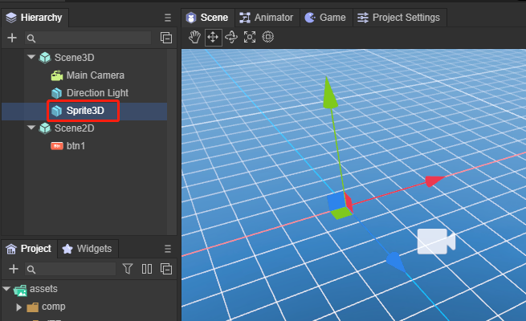
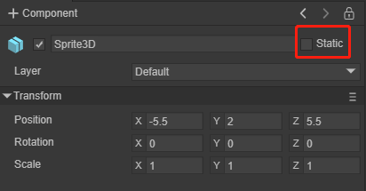
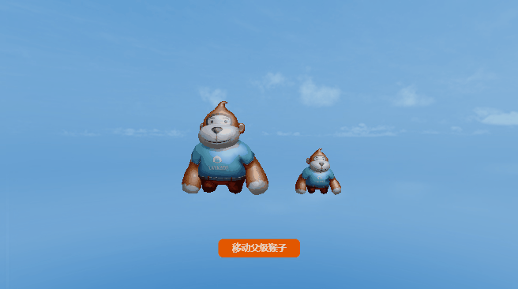
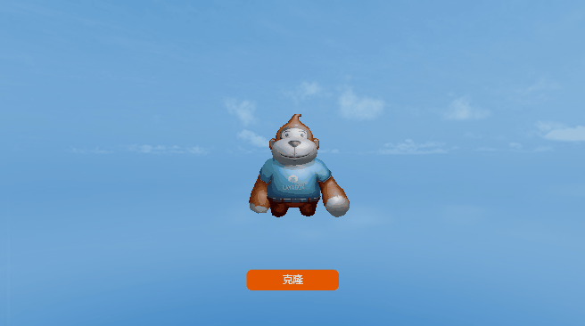
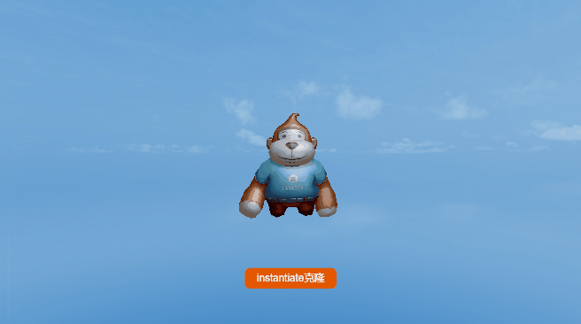
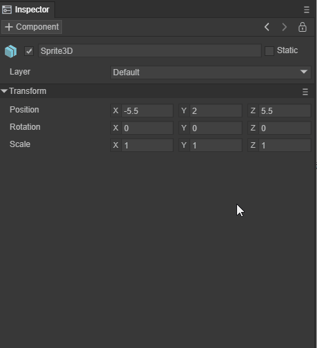
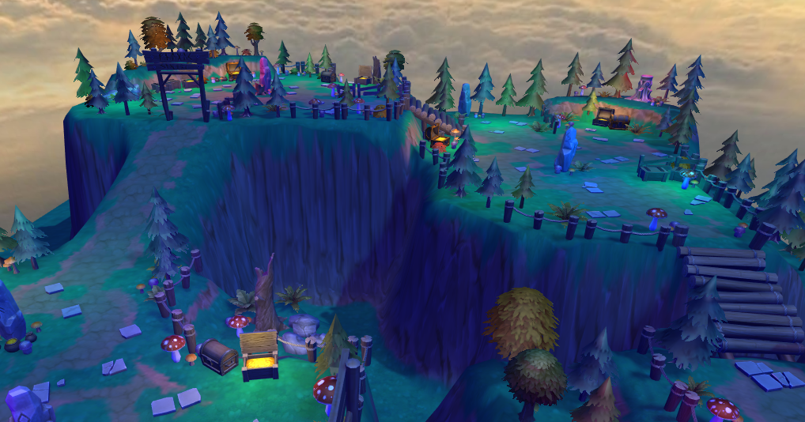
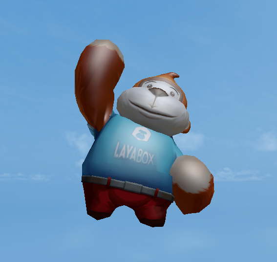
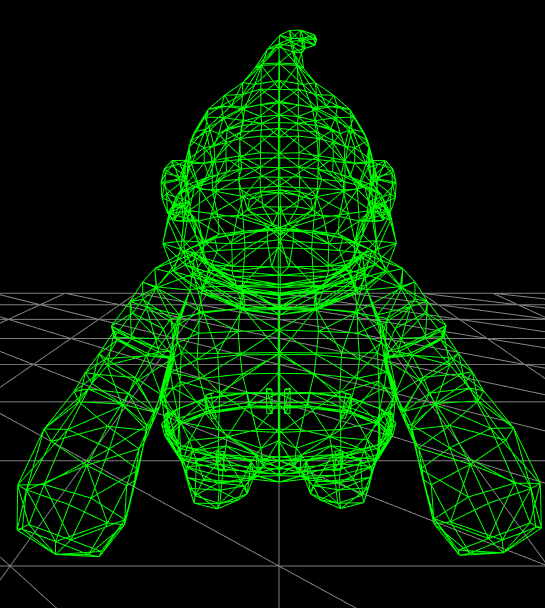

# 精灵 Sprite3D

### 一、概述

Sprite3D 是3D的基本节点对象，就像Sprite是2D的基本节点对象一样，是LayaAir3D中所有3D节点的父类，包含很多3D精灵基本的功能属性，除此之外还是所有3D组件和脚本的容器。

在LayaAir 3.0编辑器中，我们可以通过鼠标右键来创建一个Sprite3D，如动图1-1所示

 

（动图1-1）

创建好的Sprite3D，在编辑器场景中，Scene3D下会是一个空节点，如图1-2所示

 

（图1-2） 

基本上我们创建一个Sprite3D空节点的最重要的目的是作为一个根节点，一个项目中会有很多不同功能的根节点，来方面我们管理。另外也可以用Sprite3D来添加组件，下面我们会详细介绍Sprite3D的用途。

### 二、 属性和功能

 

（图2-1）

图2-1中，可以看到Sprite3D作为一个最基础的3D节点，都具备哪些属性，其它更丰富的3D节点都具备这些属性

#### 2.1节点的名字

 

（图2-2）

图2-2中，任何一个节点都有名字，通过名字可以方便的来查找一个节点下是否存在某个名字的字节的，通常我们调用如下方法来获取 getChildByName("xxx")

```
    /**
     * 根据子节点的名字，获取子节点对象。
     * @param	name 子节点的名字。
     * @return	节点对象。
     */
    getChildByName(name: string): Node {
        for (let child of this._children) {
            if (child && child.name === name)
                return child;
        }
        return null;
    }
```

当我们找到子节点时，也可以对节点做一些基础操作，比如删除掉自己方法 removeSelf()

```
    /**
     * 从父容器删除自己，如已经被删除不会抛出异常。
     * @return 当前节点（ Node ）对象。
     */
    removeSelf(): Node {
        this._parent && this._parent.removeChild(this);
        return this;
    }
```

具体一个Sprite3D都有哪些基础方法，我们可以去参考Node节点的基础属性


#### 2.2 是否激活

 

（图2-3）

图2-3中，任何节点，都可以通过勾选是否激活来作用于场景中，当不激活某个节点时，下面的所有字节的也会随着根节点处于不激活状态。当然我们也可以哦通过代码来控制

```
    /**
     * 获取自身是否激活。
     *   @return	自身是否激活。
     */
    get active(): boolean
    
    /**
     * 设置是否激活。
     * @param	value 是否激活。
     */
    set active(value: boolean)
```


#### 2.3 是否为静态

 

（图2-4）

图2-4所示，是否为静态。在游戏场景中，每一个Sprite3D都有静态或者动态的两种状态，当一个物体标记为static后，就确保这个物体在游戏场景中为静态的、不会移动的物体，进而在游戏的运行过程中让游戏有更加流畅的运行体验。一般而言，在场景中完全静止的物体标记成static是比较好的。这个静止指在游戏运行过程中没有发生移动或者缩放或者旋转等。

标记成 static 往往是为了提高效率，比如静态物体的碰撞检测要更快，同时多个使用同一材质的静态物体在绘制的时候只使用一个drawcall，进而节省了CPU。在光照计算上，static的物体也更快一些。

另外，当勾选Static时，编辑器会询问是否进行静态核批，如图2-5所示

 

（图2-5）

当然也可以用代码来控制

```
    /**
     * 是否为静态。
     */
    get isStatic(): boolean 

    /**
     * 是否设为静态。
     */
    set isStatic(value: boolean) 
```


#### 2.4 蒙版层

 

（图2-6）

图2-6中，是精灵所在的图层 `Layer`。渲染相机可进行可视遮罩层的控制，对精灵的渲染与否进行控制，可以参考摄像机文档，其中有对设置不同物体蒙版层后，摄像机选择不同蒙版层的示例。如动图2-1所示

 

（动图2-1）

如图2-7所示，通过点击Layer，可以选择编辑器已经自定义好的Default，Layer1等等，也可以再次编辑Layer层

 

（图2-7）

也可以通过代码来设置

```
    /**
     * 蒙版层。
     */
    get layer(): number 

    set layer(value: number)
    
    //添加显示图层(为相机添加一个蒙版)
	this.camera.addLayer(5);
```

#### 2.5 变换

变换组件确定场景中每个精灵的位置，旋转和缩放。同时和Node节点一样具备子父节点的关联关系，使变换操作更灵活，每个精灵都有一个`Transform3D`。

  

（图2-8）

我们也可以在编辑器里手动调整精灵的变换

 

（图2-9）

  

（图2-10）

图2-9用来调整精灵的旋转，图2-10用来调整精灵的缩放

 

（图2-11）

图2-11可同时用来调整精灵的位置，旋转和缩放

通过代码，来做变换

```
//平移
this.position1.setValue(-1.5, 0, 0.0);
this.sprite3d.translate(this.position1);
//旋转
this.rotate1.setValue(0, 60, 0);
this.sprite3d.rotate(this.rotate1, false, false);
//缩放
var scale = this.sprite3d.localScale;
scale.setValue(0.1, 0.1, 0.1);
this.sprite3d.localScale = scale;
```


### 三、子父级关系

Sprite3D继承自Node节点，是LayaAir3D中所有3D对象的父类。通过一些示例，我们可以了解子父级关系。

 

（动图3-1）

通过点击按钮，让父节点移动，同时可以看到子节点也跟随移动

```
this.layaMonkeyParent.transform.translate(new Laya.Vector3(-0.2, 0, 0);
```

  

 （动图3-2）

通过点击按钮，让子节点移动，可以看到父节点并没有移动

```
this.layaMonkeySon.transform.translate(new Laya.Vector3(-0.2, 0, 0);
```


### 四、 克隆

关于克隆，LayaAir3D中提供了几种接口。比较常用的是`clone`方法

```
    /**
     * 克隆。
     * @return	 克隆副本。
     */
    clone(): Node {
        var dstSprite3D: Node = Sprite3D._createSprite3DInstance(this);
        Sprite3D._parseSprite3DInstance(this, dstSprite3D, this, dstSprite3D);
        return dstSprite3D;
    }
```

  

（动图4-1）

通过代码来克隆一个猴子

```
//克隆一个猴子
let sp = this.layaMonkeyParent.clone() as Laya.Sprite3D;
//设置克隆猴子的坐标
sp.transform.position = new Laya.Vector3(1,0,0);
//添加到场景中
this.scene.addChild(sp);
```

其次，这里详细讲解下Sprite3D中特有的克隆接口`instantiate`

```
    /**
     * 创建精灵的克隆实例。
     * @param	original  原始精灵。
     * @param   parent    父节点。
     * @param   worldPositionStays 是否保持自身世界变换。
     * @param	position  世界位置,worldPositionStays为false时生效。
     * @param	rotation  世界旋转,worldPositionStays为false时生效。
     * @return  克隆实例。
     */
    static instantiate(original: Sprite3D, parent: Node = null, worldPositionStays: boolean = true, position: Vector3 = null, rotation: Quaternion = null): Sprite3D {
        var destSprite3D: Sprite3D = (<Sprite3D>original.clone());
        (parent) && (parent.addChild(destSprite3D));
        var transform: Transform3D = destSprite3D.transform;
        if (worldPositionStays) {
            var worldMatrix: Matrix4x4 = transform.worldMatrix;
            original.transform.worldMatrix.cloneTo(worldMatrix);
            transform.worldMatrix = worldMatrix;
        } else {
            (position) && (transform.position = position);
            (rotation) && (transform.rotation = rotation);
        }
        return destSprite3D;
    }
```

- original ：原始精灵。

- parent：父节点。

- worldPositionStays：是否保持自身世界变换。

- position：世界位置，worldPositionStays为false时生效。

- rotation：世界旋转，worldPositionStays为false时生效。

该方法可以在克隆时携带父节点信息，世界位置信息和世界旋转信息。

 

（动图4-2）

通过代码来instantiate克隆一个猴子

```
//sprite3d的instantiate克隆方法
let layaMonkey_clone1 = Laya.Sprite3D.instantiate(this.layaMonkeyParent, this.scene, false, new Laya.Vector3(-2, 0, 0), new Laya.Quaternion(0, -90, 0));
this.scene.addChild(layaMonkey_clone1);
```


### 五、 添加组件

LayaAir中，可以对任何3D对象添加`Component` 组件，如动图所示

 

（动图5-1）

`Component` 组件，是附加到所有3D对象的内容的基类。

通过代码也可以添加组件，需要物体使用`addComponent`方法

```
//添加Rigidbody3D组件
let rigidBody = this.layaMonkeyParent.addComponent(Laya.Rigidbody3D) as Laya.Rigidbody3D;
//创建盒子形状碰撞器
var boxShape = new Laya.BoxColliderShape(1, 1, 1);
//设置盒子的碰撞形状
rigidBody.colliderShape = boxShape; 
//使用重力
rigidBody.overrideGravity = true;
//重力为向下-10
rigidBody.gravity = new Laya.Vector3(0,-10,0);
```

 

（动图5-2）

如动图5-2，添加 `Rigidbody3D` 组件，并且设置重力的效果

### 六、 添加脚本

`Laya.Script3D` 这是3D世界中的脚本，继承自组件，是组件的一种。该类被定义为 ‘抽象类’ ，不允许实例。该类提供了一系列虚方法。

在3D世界的开发中脚本类会在很多地方被使用，该组件将会在后面的脚本篇中详细的讲解，在本篇只是简单的讲解如何给Sprite3D添加一个脚本。如动图6-1所示。

 

（动图6-1） 

我们可以给Main Camera添加一个通过鼠标和键盘来控制摄像机的脚本，这个脚本在实际开发过程中非常的实用，图6-2中，显示摄像机添加了这个脚本

 

（图6-2） 

脚本的代码为：

```
const { regClass, property } = Laya;

@regClass()
export class CameraMoveScript extends Laya.Script3D {

	/** @private */
	protected _tempVector3: Laya.Vector3 = new Laya.Vector3();
	protected lastMouseX: number = 0;
	protected lastMouseY: number = 0;
	protected yawPitchRoll: Laya.Vector3 = new Laya.Vector3();
	protected resultRotation: Laya.Quaternion = new Laya.Quaternion();
	protected tempRotationZ: Laya.Quaternion = new Laya.Quaternion();
	protected tempRotationX: Laya.Quaternion = new Laya.Quaternion();
	protected tempRotationY: Laya.Quaternion = new Laya.Quaternion();
	protected isMouseDown: boolean = false;
	protected rotaionSpeed: number = 0.00006;
	protected camera: Laya.BaseCamera = new Laya.Camera;
	protected scene: Laya.Scene3D = new Laya.Scene3D;

	speed: number = 0.01;

	constructor() {
		super();
	}

	/**
	 * @private
	 */
	protected _updateRotation(): void {
		if (Math.abs(this.yawPitchRoll.y) < 1.50) {
			Laya.Quaternion.createFromYawPitchRoll(this.yawPitchRoll.x, this.yawPitchRoll.y, this.yawPitchRoll.z, this.tempRotationZ);
			this.tempRotationZ.cloneTo(this.camera.transform.localRotation);
			this.camera.transform.localRotation = this.camera.transform.localRotation;
		}
	}

	/**
	 * 监听鼠标事件
	 */
	onAwake(): void {
		Laya.stage.on(Laya.Event.MOUSE_DOWN, this, this.mouseDown);
		Laya.stage.on(Laya.Event.MOUSE_UP, this, this.mouseUp);
		this.camera = (<Laya.Camera>this.owner);
	}

	/**
	 * 监听键盘事件
	 */
	onUpdate(): void {
		var elapsedTime: number = Laya.timer.delta;
		if (!isNaN(this.lastMouseX) && !isNaN(this.lastMouseY) && this.isMouseDown) {
			Laya.InputManager.hasKeyDown(87) && this.moveForward(-this.speed * elapsedTime);//W
			Laya.InputManager.hasKeyDown(83) && this.moveForward(this.speed * elapsedTime);//S
			Laya.InputManager.hasKeyDown(65) && this.moveRight(-this.speed * elapsedTime);//A
			Laya.InputManager.hasKeyDown(68) && this.moveRight(this.speed * elapsedTime);//D
			Laya.InputManager.hasKeyDown(81) && this.moveVertical(this.speed * elapsedTime);//Q
			Laya.InputManager.hasKeyDown(69) && this.moveVertical(-this.speed * elapsedTime);//E

			var offsetX: number = Laya.stage.mouseX - this.lastMouseX;
			var offsetY: number = Laya.stage.mouseY - this.lastMouseY;

			var yprElem: Laya.Vector3 = this.yawPitchRoll;
			yprElem.x -= offsetX * this.rotaionSpeed * elapsedTime;
			yprElem.y -= offsetY * this.rotaionSpeed * elapsedTime;
			this._updateRotation();
		}
		this.lastMouseX = Laya.stage.mouseX;
		this.lastMouseY = Laya.stage.mouseY;
	}

	/**
	 * 释放监听
	 */
	onDestroy(): void {
		Laya.stage.off(Laya.Event.MOUSE_DOWN, this, this.mouseDown);
		Laya.stage.off(Laya.Event.MOUSE_UP, this, this.mouseUp);
	}

	protected mouseDown(e: Laya.Event): void {
		this.camera.transform.localRotation.getYawPitchRoll(this.yawPitchRoll);
		this.lastMouseX = Laya.stage.mouseX;
		this.lastMouseY = Laya.stage.mouseY;
		this.isMouseDown = true;
	}

	protected mouseUp(e: Laya.Event): void {
		this.isMouseDown = false;
	}

	protected mouseOut(e: Laya.Event): void {
		this.isMouseDown = false;
	}

	/**
	 * 向前移动。
	 * @param distance 移动距离。
	 */
	moveForward(distance: number): void {
		this._tempVector3.x = this._tempVector3.y = 0;
		this._tempVector3.z = distance;
		this.camera.transform.translate(this._tempVector3);
	}

	/**
	 * 向右移动。
	 * @param distance 移动距离。
	 */
	moveRight(distance: number): void {
		this._tempVector3.y = this._tempVector3.z = 0;
		this._tempVector3.x = distance;
		this.camera.transform.translate(this._tempVector3);
	}

	/**
	 * 向上移动。
	 * @param distance 移动距离。
	 */
	moveVertical(distance: number): void {
		this._tempVector3.x = this._tempVector3.z = 0;
		this._tempVector3.y = distance;
		this.camera.transform.translate(this._tempVector3, false);
	}

}

```

运行时效果如动图6-3所示

 

（动图6-3） 


### 七、 各种渲染精灵简介

#### 7.1 MeshSprite3D精灵

`MeshSprite3D` 是引擎中最常用的 **静态网格精灵**，可根据于美术软件预制作或自定义的网格数据渲染模型。例如图7-1场景中的各种建筑模型、山体岩石一般均为`MeshSprite3D`

 

（图7-1）

通常我们在实践中会创建简单的Mesh网格3D对象，如图7-2所示

 

（图7-2）

也可以通过代码添加这些Mesh网格

```
//正方体
var box = new Laya.MeshSprite3D(Laya.PrimitiveMesh.createBox(0.5, 0.5, 0.5));
this.scene.addChild(box);
box.transform.position = new Laya.Vector3(2.0, 0.25, 0.6);
box.transform.rotate(new Laya.Vector3(0, 45, 0), false, false);

//球体
var sphere = new Laya.MeshSprite3D(Laya.PrimitiveMesh.createSphere(0.25, 20, 20));
this.scene.addChild(sphere);
sphere.transform.position = new Laya.Vector3(1.0, 0.25, 0.6);

//圆柱体
var cylinder = new Laya.MeshSprite3D(Laya.PrimitiveMesh.createCylinder(0.25, 1, 20));
this.scene.addChild(cylinder);
cylinder.transform.position = new Laya.Vector3(0, 0.5, 0.6);

//胶囊体
var capsule = new Laya.MeshSprite3D(Laya.PrimitiveMesh.createCapsule(0.25, 1, 10, 20));
this.scene.addChild(capsule);
capsule.transform.position = new Laya.Vector3(-1.0, 0.5, 0.6);

//圆锥体
var cone = new Laya.MeshSprite3D(Laya.PrimitiveMesh.createCone(0.25, 0.75));
this.scene.addChild(cone);
cone.transform.position = new Laya.Vector3(-2.0, 0.375, 0.6);

//平面
var plane = new Laya.MeshSprite3D(Laya.PrimitiveMesh.createPlane(6, 6, 10, 10));
this.scene.addChild(plane);
```


#### 7.2 SkinnedMeshSprite3D精灵

`SkinnedMeshSprite3D` 是引擎中的 **蒙皮动画网格精灵**，可根据美术软件预制作的网格数据和Animator组件的动画数据产生动作形变。常用于带蒙皮动画的角色、怪物等。和`MeshSprite3D `相比具产生网格形变的能力。

 

（图7-3）


#### 7.3 Particle3D 精灵

`Particle3D` 是引擎中的 3D**粒子精灵**,可根据美术人员编辑的粒子参数产生奇妙炫酷的粒子特效。一般用于各种角色技能特效或火焰、烟雾等场景特效。

  

（动图7-4）

 

#### 7.4 PixelLine 精灵

 `PixelLine` 是引擎中的 **像素线精灵**,可根据脚本的绘制数据产生任意颜色的像素线。一般用于场景中的引导效果或项目调试数据用途。

 

（图7-5）


#### 7.5 Trail 精灵

`Trail` 是引擎中的 **拖尾精灵**,可根据精灵运动轨迹产生动态的拖尾特效。一般用于各种轨迹拖尾效果的展示。

 

（动图7-6）

 
