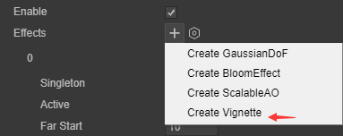

# 后处理

## 1.后处理概述

后处理是现代游戏中必不可少的技术之一，PostProcessing，通常在普通的场景渲染结束后对结果进行处理，将一张或数张Texture处理得到一张新的Texture。

PostProcessing的渲染Pipeline普通的模型渲染一样，不同之处在于在顶点着色器中通常只是简单的拷贝，主要的逻辑写在片段着色器中

下面的图像展示了应用和未应用后期处理的场景。

 

> 未应用后期处理的场景

 

> 应用后期处理后的场景

## 2.添加一个内置后处理效果

1. 在Scene中选择需要添加后处理效果的相机对象

 

图2-1

2. 在相机对象的组件面板中PostProcess组件

 

图2-2

3. 选择实例化PostProcess组件

 

图2-3

4. 在Effects中添加合适的后处理效果

 

图2-4

## 3.引擎内置后处理类型：ScalableAO

环境光遮蔽效果用于计算场景中暴露在环境照明下的点。然后，它会使隐藏在环境光之外的区域变暗，例如折痕、孔洞和靠近的物体之间的空间。

您可以通过两种方式实现环境光遮蔽效果：作为全屏后期处理效果实时实现。实时环境光遮蔽效果可能会占用大量资源。它对处理时间的影响取决于屏幕分辨率和效果属性。

 

图3-1

可拓展环境光遮蔽参数类型：

|  参数类型  |                   参数解释                   |
| :--------: | :------------------------------------------: |
|  AO Color  |             设置环境光遮挡的颜色             |
| Intensity  |              环境光遮挡产生强度              |
|   Radius   | 设置采样点的半径，以控制环境光遮蔽区域的范围 |
| AO Quality |      环境光遮蔽效果质量（高-中-低三档）      |

## 4.引擎内置后处理类型：Bloom

Bloom效应使图像中的明亮区域发光。为了做到这一点，它创建的边缘光从明亮的领域扩展到你的形象。这模拟了真实世界中的照相机在光线淹没镜头时所产生的效果。布鲁姆效果也有一个肮脏的功能，你可以用它来应用一个全屏幕层的污迹或灰尘来衍射Bloom效果。

 

图4-1

Bloom参数类型：

|     参数类型     |                           参数解释                           |
| :--------------: | :----------------------------------------------------------: |
|      Clamp       |              设置钳制像素的值以控制 Bloom 数量               |
|      Color       |                      选择 Bloom 的颜色                       |
|    Fast Mode     |                           快速模式                           |
|   Dirt Texture   |            选择一个肮脏的纹理添加污迹或灰尘的镜头            |
|    Intensity     |                      设置镜头肮脏的强度                      |
|    Threshold     |              设置亮度级别以过滤掉此级别下的像素              |
|    Soft Knee     | 为低于/超过阈值(0 = 硬阈值，1 = 软阈值)之间的转换设置渐进阈值。 |
|    Diffusion     |          与屏幕分辨率无关的方式设置面纱效果的范围。          |
| Anamorphic Ratio | 设置比例以垂直(范围[ -1,0])或水平(范围[0,1])缩放 Bloom。这模拟了变形透镜的效果。 |

## 5.引擎内置后处理类型：GaussianDoF

景深是一种常见的模拟相机镜头焦距特性的后处理效果。在现实生活中，相机只能在一定距离内对物体进行锐利的聚焦; 离相机较近或较远的物体会有点失焦。这种模糊不仅提供了一个关于物体距离的视觉线索，而且还引入了 Bokeh，这是一个术语，用来描述当图像的明亮区域失焦时出现的令人愉快的视觉伪影。

 

图5-1

GaussianDoF参数类型：

| 参数类型   | 参数解释         |
| ---------- | ---------------- |
| Far Start  | 景深开始值       |
| Far End    | 景深结束值       |
| Max Radius | 最大模糊景深半径 |

## 6.引擎自定义后处理类型

在3.0引擎中编写好自己的后处理效果后，在类定义前加上关键字**@regClass()**就可以将自定义好的后处理效果显式的展现在Camera的后处理组件的效果列表中

 

图6-1

 

图6-2

