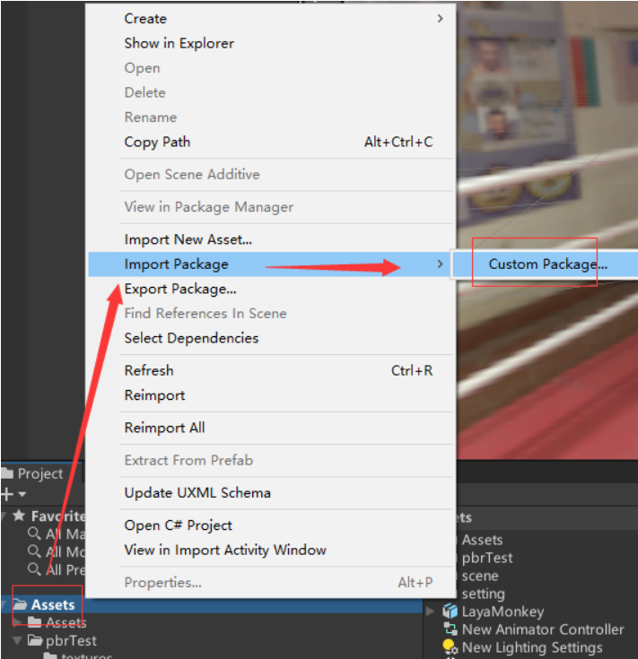
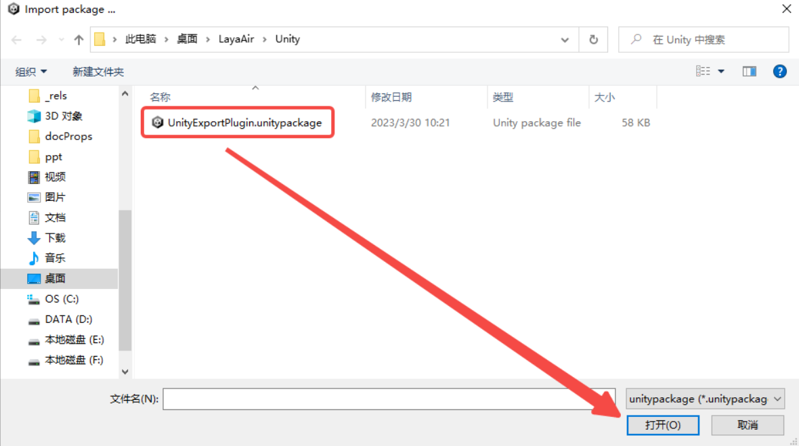
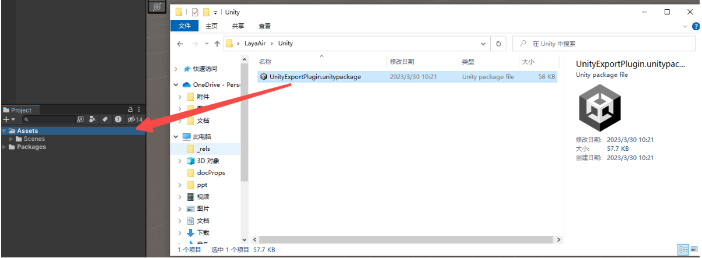
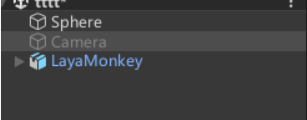
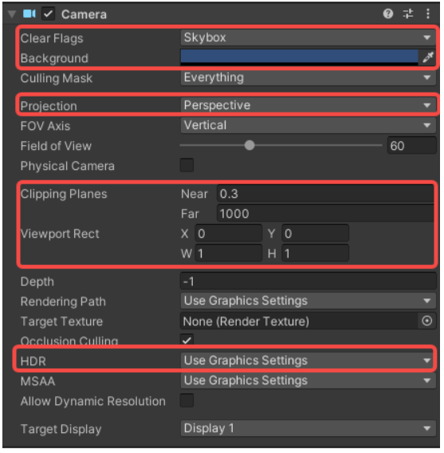
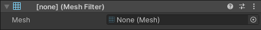
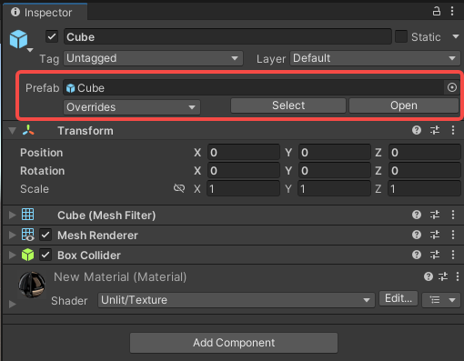

# Unity资源导出插件

## 一、关于插件
采用Unity插件方案的主要原因，主要是为了支持开发者在Unity资源商城中购买的资源可以无感的迁移到LayaAir IDE中进行相关的开发工作，Unity资源商城拥有一定数量的精美且高质量的美术资源，采用Untiy资源导出插件能将这些精美的美术资源迁移到LayaAir引擎的IDE中进行开发，对一些小而美的项目来说无疑是一种无形的帮助，更可以让有Unity经验的优质开发者可以更低学习成本进入HTML5和小游戏产业中来。

插件的项目地址：https://github.com/layabox/LayaAir3.0UnityPlugin.git

## 二、导入LayaAir的Unity插件

Unity里有一个导入自定义包的功能，通过这个功能，可以在Unity里导入LayaAir引擎提供的专属功能包，用来导出Unity里编辑好的场景和资源，然后再用以LayaAir引擎3D的开发。在Unity里导入这个自定义的LayaAir功能包的过程，我们可以视为安装了一个LayaAir引擎资源导出的Unity插件。本小节会针对这个过程进行详细介绍。

### 2.1 项目中首次安装插件

打开一个Unity项目后，如果还没有安装插件，那么需要在Unity菜单栏下打开`Window->Package Manager`窗口，如图2-1所示。

（图2-1）

然后，如图2-2所示，在打开的窗口中，点击左上角的`+`按钮，选择`Add package from git URL`。

（图2-2）

将插件的Git地址（`https://github.com/layabox/LayaAir3.0UnityPlugin.git`）填入后点击`Add`，如图2-3所示。

（图2-3）

点击后，插件会自动进行安装，安装完成后的效果如图2-4所示。

（图2-4）

插件安装完成后，可以看到菜单栏多出一个`LayaAir3D`，如图2-5所示。此时说明，已经导入成功。

（图2-5）

### 2.2 已有插件更新

如果LayaAir官方更新了插件，而开发者的Unity项目中已经安装过资源导出插件了，那么开发者只需要进行更新即可。如图2-6所示，在`Package Manager`窗口中找到`LayaAir 3.0 Export Tool`插件，点击`Update`即可更新。

（图2-6）

> 如果要删除插件，只需点击`Remove`即可。

### 2.3 插件导入安装的提醒

对于Unity还不太熟悉的开发者，需要提醒的是，LayaAir引擎Unity资源导出插件，不是一次导入所有项目通用。在每次创建新的项目工程后，都要重复上面导入LayaAir插件包的过程。

另外需要注意：

**1.关于颜色空间的提醒：**

LayaAir为线性颜色空间，对于Unity颜色空间设置为Gamma的开发者可能会出现导出效果与LayaAir不一致的情况，开发者需要确认Unity是否设置为Linear颜色空间。

可以使用以下步骤查看Unity颜色空间的设置：`Editor -> Project Setting -> Player -> Other Setting -> Color Space`，操作如图2-7所示。

（图2-7）

**2.关于法线贴图的提醒**

Unity的法线贴图经过了压缩，在导出的时候可能会存在LayaAir IDE预览与Unity不一致的情况，对于自定义Shader的用户需要注意法线的变换。

## 三、资源导出插件的功能

### 3.1 场景导出

（图3-1）场景导出面板

#### 3.1.1 节点设置

**忽略未激活节点**：如果勾选此选项，类似图3-2中Camera这类未激活的节点将不会被导出。

（图3-2）

#### 3.1.2 模型设置

**忽略顶点UV**：如果勾选此选项，导出的Mesh数据不存在UV信息。

**忽略顶点颜色**：如果勾选此选项，导出的Mesh数据不存在顶点颜色信息。

**忽略顶点法线**：如果勾选此选项，导出的Mesh数据不存在顶点法线信息。

**忽略顶点切线**：如果勾选此选项，导出的Mesh数据不存在顶点切线信息。

**自动生成UV1**：如果勾选此选项，导出的Mesh数据UV Set设置为UV1。

#### 3.1.3 其他设置

**自定义导出根目录**：如果勾选此选项，如图3-3所示，可以设置插件导出的资源路径(文本框填取绝对路径)。

（图3-3）

### 3.2 预设导出

（图3-4）预设导出面板

#### 3.2.1 节点设置

**忽略未激活节点**：如果勾选此选项，类似图3-5中Camera这类未激活的节点将不会被导出。

（图3-5）

**批量导出一级节点**：如果勾选此选项，类似图3-6中这类节点最终导出的为LayaMonkey根节点。

（图3-6）

#### 3.2.2 模型设置

**忽略顶点UV**：如果勾选此选项，导出的Mesh数据不存在UV信息。

**忽略顶点颜色**：如果勾选此选项，导出的Mesh数据不存在顶点颜色信息。

**忽略顶点法线**：如果勾选此选项，导出的Mesh数据不存在顶点法线信息。

**忽略顶点切线**：如果勾选此选项，导出的Mesh数据不存在顶点切线信息。

**自动生成UV1**：如果勾选此选项，导出的Mesh数据UV Set设置为UV1。

#### 3.2.3 其他设置

**自定义导出根目录**：如果勾选此选项，如图3-7所示，可以设置插件导出的资源路径(文本框填取绝对路径)。

（图3-7）

### 3.3 帮助 help

帮助菜单项里，下级菜单有`学习文档Study`、`问答社区Answsers`这些外链菜单项，方便开发者快速进入对应的官网页面中。还有`插件版本About LayaAir`，如图3-8所示。

（图3-8）

## 四、场景对象导出支持列表

除了LayaAir引擎插件自身面板上的导出设置项，我们还要注意并且必须要了解Unity的功能面板有哪些是可以导出使用，哪些是不支持的。

因为LayaAir引擎的Unity插件并非是将Unity所有的功能全都支持导出。毕竟我们的LayaAir引擎设计与结构与Unity的引擎并不相同，虽然3D场景基于Unity编辑器进行编辑和导出，但我们需要按LayaAir引擎插件的支持规则来使用。

在本小节，我们就全面介绍LayaAir引擎与插件支持哪些Unity中的功能。如果在本小节支持清单中未提及的，都是当前不支持的。所以，如果是刚接触Unity的开发者，在学习Unity工具使用的时候，也不必要全部学习，可以把本小节中所涉及的支持内容，作为关键字搜索学习即可。

> LayaAir引擎插件也会不断在更新，当升级新的引擎版本后，可以关注版本更新日志以及该文档的变化。

### 4.1 Inspector面板的基础属性

在Unity的Inspector面板中，可以查看和编辑Unity编辑器中几乎所有内容，下面，我们先了解一下Inspector面板的基础通用属性。

（图4-1）

在图4-1的基础属性里，LayaAir导出支持情况如下：

| Unity的Inspector基础属性    | LayaAir是否支持导出的说明                                |
| :-------------------------- | :------------------------------------------------------- |
| GameObject Name（节点名称） | 支持                                                     |
| Static（静态）              | 只支持勾选 或 不勾选                                     |
| Layer（层）                 | 只支持层的序号导出，开发者也可以在LayaAir引擎中设置Layer |
| Position（位置）            | 支持（包括：X、Y、Z）                                    |
| Rotation（旋转）            | 支持（包括：X、Y、Z）                                    |
| Scale（缩放）               | 支持（包括：X、Y、Z）                                    |

> 对比上面的图和表格，我们看到`Tag`是不支持的。`Static`与`Layer`是部分支持。后续将不再提醒，关注表格中的支持状态即可。

这里特别说一下，静态Static勾选后是全选，也就是Everything，如图4-2所示。但实际上LayaAir引擎只支持了Lightmap Static和Batching Static，那开发者不选Everything，只勾选这两个行不行。当然是不行的，我们其实只认Static勾选或不勾选这个状态，如果此处单独选择，导出并没有效果。

（图4-2）

### 4.2 相机的属性

（图4-3）

在图4-3中的Unity相机属性里，LayaAir导出支持情况如下：

| Unity的相机属性                     | LayaAir是否支持导出的说明                                    |
| :---------------------------------- | :----------------------------------------------------------- |
| Clear Flags（清除标志）             | 支持 （包括：Skybox天空盒（Background背景色）、Solid Color纯色（Background背景色）、Depth only仅深度、Don’t Clear不清除） |
| Projection（投射方式）              | 支持（包括：Perspective透视（Field of View视野范围），Orthographic正交（size视野大小）） |
| Clipping Planes（剪裁平面）         | 支持（包括：Near近点、Far远点）                              |
| Viewport Rect（标准视图矩形）       | 支持（包括：X、Y、W、H）                                     |
| Allow HDR（允许渲染高动态色彩画面） | 支持                                                         |

> Culling Mask在Unity中设置无效，但是layaAir引擎中是支持的，默认值相当于Unity中的Everything，也可以通过引擎的cullingMask进行设置层ID。

### 4.3 光照相关的属性

#### 4.3.1 灯光的属性Light

（图4-4）

在图4-4中的Unity灯光属性里，LayaAir导出支持情况如下：

| Unity的灯光属性         | LayaAir是否支持导出的说明                                    |
| :---------------------- | :----------------------------------------------------------- |
| Type（灯光类型）        | 部分支持（包括：Spot聚光（Range照射范围、Spot Angle聚光灯锥形角度）、Directional平行光、Point点光（Range照射范围）） |
| Color（灯光颜色）       | 支持                                                         |
| Mode（灯光模式）        | 支持（包括：Realtime实时灯光、Baked烘焙光照贴图、Mixed混合光源） |
| Intensity（灯光强度）   | 支持                                                         |
| Shadow Type（阴影类型） | 支持（包括：Soft Shadows、Hard Shadows）                     |

#### 4.3.2 反射探针的属性 Reflection Probe

（图4-5）

当Unity中添加Reflection Probe（反射探针）组件后，在图4-5中的属性里，LayaAir导出支持情况如下：

| Unity的反射探针相关配置属性                    | LayaAir是否支持导出的说明                                    |
| :--------------------------------------------- | :----------------------------------------------------------- |
| Type（类型）                                   | 部分支持（包括：Baked烘焙模式、Custom自定义模式）            |
| Runtime settings （运行时设置）                | 部分支持（包括：Importance权重参数、Intensity亮度、Box projection盒式偏移反射、Box Size反射探针大小、Box Offset反射探针偏移） |
| Cubemap capture settings（立方体贴图捕捉设置） | 支持                                                         |

### 4.4 模型相关的属性

关于模型的属性，分别支持普通模型和骨骼模型。

#### 4.4.1 普通模型

普通模型需要Mesh Filter组件Mesh Render组件，下面分别进行介绍。

**网格过滤器Mesh Filter**

（图4-6）

在图4-6中的Unity网格过滤器属性里，LayaAir导出支持情况如下：

| Unity的蒙皮网格渲染属性 | LayaAir是否支持导出的说明 |
| :---------------------- | :------------------------ |
| Mesh（网格）            | 支持                      |

**网格渲染器Mesh Renderer**

（图4-7）

（图4-8）

在图4-7中Unity的Mesh Render组件属性里，LayaAir导出支持情况如下：

| Unity的网格渲染属性              | LayaAir是否支持导出的说明                                    |
| :------------------------------- | :----------------------------------------------------------- |
| Materials（材质）                | 支持（包括：Size大小、Element材质球元素）                    |
| Lightmap Static（ 静态光照贴图） | 部分支持（包括：Lightmaps贴图（Baked Lightmap烘焙光照贴图（Lightmap Index、Tiling X、Tiling Y、Offset X、Offset Y））） |

#### 4.4.2 骨骼模型

骨骼模型的Mesh与Mesh Renderer不再分开，合并在组件`Skinned Mesh Renderer`里，如下图所示：

（图4-9）

在图4-9中Unity的Skinned Mesh Renderer组件属性里，LayaAir导出支持情况如下：

| Unity的蒙皮网格渲染属性 | LayaAir是否支持导出的说明                                  |
| :---------------------- | :--------------------------------------------------------- |
| Mesh（网格）            | 支持                                                       |
| Root Bone（骨骼根节点） | 支持                                                       |
| Bounds（包围盒）        | 支持（包括：Center中心（X、Y、Z）、Extent范围（X、Y、Z）） |
| Materials（材质）       | 支持（包括：Size大小、Element材质球元素）                  |

#### 4.4.3 材质

对于模型的材质，这里我们介绍一下常见支持的材质类型。

|              **分类**              |                   **材质**                   |
| :--------------------------------: | :------------------------------------------: |
|           Build in 管线            |                Standard 材质                 |
|                                    | Ulit Color/Texture/Cut Out/ Transparent 材质 |
|              URP 管线              |                 URP Lit材质                  |
|                                    |                 URP Ulit材质                 |
|               天空盒               |           Procedural 程序化天空盒            |
|                                    |                   6 Sideed                   |
|                                    |               Panoramic 全景图               |
| 旧版着色器（只做兼容考虑, 不建议） |                 Diffuse Fast                 |
|                                    |                   Diffuse                    |
|                                    |                Diffuse Detail                |
|                                    |                Bumped Diffuse                |
|                                    |               Bumped Specular                |

> 除了上述提供的材质Shader外，Unity里的其他材质，都不能在LayaAir引擎中使用。

### 4.5 纹理的属性

在`Assets（资源）`面板里，找到2D图片资源，可以为其设置纹理的属性。

（图4-10）

在图4-10中的Unity纹理属性里，LayaAir导出支持情况如下：

| Unity的纹理属性                 | LayaAir是否支持导出的说明                                    |
| :------------------------------ | :----------------------------------------------------------- |
| Generate Mip Maps（生成Mipmap） | 部分支持（仅支持是否勾选的状态）                             |
| Wrap Mode（循环模式）           | 部分支持（包括：Repeat重复、Clamp强制拉伸）                  |
| Filter Mode（过滤模式）         | 支持（包括：Point点过滤、Bilinear双线性过滤、Trilinear三线性过滤） |
| Aniso Level（各向异性等级）     | 支持                                                         |

### 4.6 动画的属性

在动画方面，LayaAir支持`Animator`组件和关联的`Animator Controller`面板的部分属性导出和使用。

#### 4.6.1 Aniamtor组件

（图4-11）

在图4-11中的Unity动画属性里，LayaAir导出支持情况如下：

| Unity的动画属性           | LayaAir是否支持导出的说明                                    |
| :------------------------ | :----------------------------------------------------------- |
| Controller（动画控制器）  | 支持                                                         |
| Culling Mode（ 剔除模式） | 部分支持（包括：Always Animate 总是播放、Cull Completely完全剔除） |

#### 4.6.2 Animator Controller State

在Aniamtor组件属性中双击Controller打开动画控制器的面板，选中`State`(状态)，可以看到图4-12所示的面板。

（图4-12）

在图4-12中的Unity动画控制器State属性里，LayaAir导出支持情况如下：

| Unity的动画控制器State属性 | LayaAir是否支持导出的说明 |
| :------------------------- | :------------------------ |
| Motion（选定动画）         | 支持                      |
| Speed（动画播放速度）      | 支持                      |

### 4.7 预制体

如图4-13所示，Unity中的预制体支持导出，但是导出的预制体所包含的属性（灯光、材质等），必须是插件支持的属性，即本节所列出的属性。

（图4-13）

## 五、模型的导出文件与加载显示

当了解完插件的功能和使用规则后，我们就可以在Unity中进行编辑并导出了，但是导出后的文件名分别代表着什么，又是怎么进行加载使用的。本小节开始为大家介绍。

### 5.1 导出文件类型的说明

| **文件的后缀** | **导出文件类型的说明**                                       |
| :------------- | :----------------------------------------------------------- |
| **.ls**        | 场景文件，选择导出`场景Scene3D`类别时生成的文件类型。会导出完整的场景信息，其中包含了场景需要的各种数据、光照贴图、模型、位置等。所以，需要导出场景相关的设置时，必须要使用Scene3D类别导出，就可以看到`.ls`后缀的文件。 |
| **.lh**        | 预设文件，选择导出`预设Sprite3D`类别时生成的文件类型。相对于`.ls`后缀的场景文件，会缺少环境光、环境反射、场景雾效等等与场景渲染相关的信息。 |
| **.lm**        | 模型数据文件，通常是FBX格式的转换而成。                      |
| **.lmat**      | 材质数据文件，是在unity中为模型设置的材质信息。加载`.ls`或`.lh`文件时会自动加载.lmat文件来产生材质。可以使用 BaseMaterial 类来加载。 |
| **.lani**      | 动画数据文件，如果模型上有动画，导出后将生成的动画配置文件，其中包含了动画帧数据。加载可以使用 AnimationClip 类来加载。 |
| **.jpg**       | JPEG格式的纹理图片文件。                                     |
| **.png**       | PNG格式的纹理图片文件。                                      |
| **.hdr**       | 全景天空盒需要的HDR格式图片文件                              |

### 5.2 加载显示
导出的Unity资源，在不考虑其它逻辑的情况下，要通过LayaAir引擎显示出来，就需要先加载资源。

#### 5.2.1 场景的加载显示
当我们想导出整个场景时，可以选择场景，设置导出路径。如图5-1所示，导出路径建议设置为在LayaAir IDE项目工程目录下的`assets`文件夹，至于是assets目录下的什么目录，由开发者自行决定。

（图5-1）

导出之后只需在IDE中打开其中的`.ls`文件，即可加载场景。

打开场景后，导出的场景并不具有环境光sh信息，需要找到在Scene3D层级下的烘焙开关。如图5-2所示，点击`烘焙`，对当前场景的环境光sh数据进行预计算，
这样烘焙完成后的效果就是我们想要的效果了。

（图5-2）

#### 5.2.2 预设的加载显示
如图5-3所示，预设的导出，主要是用于当不需要完整导出使用整个场景，只需要某些节点资源。又或者某些节点资源需要独立导出复用或代码动态使用等需求。

（图5-3）

## 六、常见问题

如果遇到下图的报错，原因是缺少一些包。

（图6-1）

这时需要在`Window`菜单中，打开包管理器`Package Manager`。打开后，如图6-2所示，搜索editor，然后选择”Editor Coroutines“和”Version Control“这两个包，添加即可。

（图6-2）

