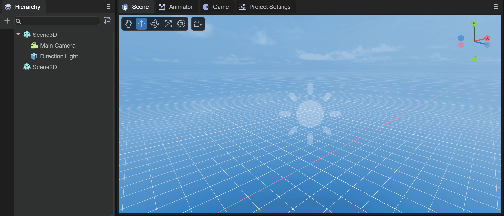
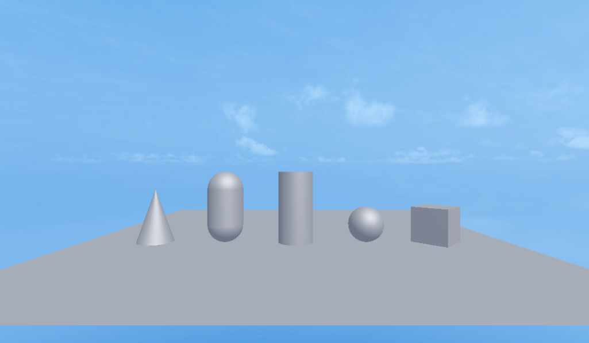

# 3D基础显示对象


## 一、概述

3D基础显示对象，在3D开发环境中是非常重要的辅助工具，是能够帮助开发者在3D场景中学习和使用的基础，往往对于初学者来说，通过创建和操作3D基础显示对象，可以快速了解3D基础知识，熟悉3D开发环境，同时在没有其它模型资源的情况下，可以快速建立概念，搭建场景，添加不同的组件，也可以快速熟悉代码开发。对于熟练的开发者来说，通过3D基础显示对象，可以方便的模拟和实现一些开发需求，或者用来展示一些开发逻辑，可以大大提高工作效率。

目前LayaAir IDE中可以创建的3D基础显示对象种类有：

- **Cube（立方体）**
- **Sphere（球体）**
- **Cylinder（圆柱体）**
- **Capsule（胶囊体）**
- **Cone（锥体）**
- **Plane（平面）**

 

（图1-1）

如图1-1所示，下面我们来看看在IDE和代码中是如何创建和使用这些3D基础对象的


## 二、IDE中创建与使用

对于初级开发者来说，在IDE中学会简单的创建和使用3D基础对象是非常重要的一步！


### 2.1 创建对象

在一个3D场景的`层级`面板中，任何节点下，或者是空白位置，都可以通过鼠标右键来创建3D显示对象，如动图2-1所示

 

（动图2-1）


创建这六种基础对象就不一一演示了，我们可以通过如图2-2的菜单选择创建，


（图2-2）


### 2.2 基础变换使用

移动，旋转，缩放是对3D对象来说最基础的变换操作，如动图2-3所示，


（动图2-3）


### 2.3 属性设置

每个3D基础对象，都具有 `MeshRenderer` 组件，通过给接收阴影的平面设置`Receive Shadow`和给产生阴影的立方体设置`Cast Shadow `来创建阴影效果，如动图2-4所示，


（动图2-4）

> 阴影除了设置3D基础对象的MeshRenderer，还需要保证Direction Light的Shadow Mode不为None。


### 2.4 添加组件

每个3D基础对象，都可以添加组件来实现高级的功能，通过对立方体添加3D物理组件 Rigidbody3D ，勾选重力属性，最后添加碰撞盒，可以实现模拟自由落体的效果，如动图2-5所示，


（动图2-5）

运行时可以看到立方体下落的效果，


（动图2-6） 

> 运行物理组件需要在项目设置面板中勾选相应的引擎模块。


### 2.5 添加材质和纹理

每个3D基础对象，都可以通过创建 `Material`，并在 `MeshRenderer` 组件中指定新创建的材质，来设置 `albedo Texture` 纹理 ，如动图2-7所示，


（动图2-7）


## 三、代码创建与使用

通过代码来创建和使用3D基础对象，也是我们了解和熟悉LayaAir引擎的过程


### 3.1 代码创建

#### 3.1.1 `PrimitiveMesh` 

类用于创建简单网格

> 注意：这里还不是最终场景中看到的 Sprite3D。

用 `createBox` 来举例，看下API是如何创建网格的：

```typescript
/**
* 创建Box网格。
* @param long 半径
* @param height 垂直层数
* @param width 水平层数
* @return
*/
static createBox(long: number = 1, height: number = 1, width: number = 1): Mesh
```

可以看到，通过 `createBox` 方法，可以创建Box网格，而且还可以创建不同的垂直和水平高度

因此，可以通过代码创建不同类型的Mesh网格：

```typescript
//正方体
let box = Laya.PrimitiveMesh.createBox(0.5, 0.5, 0.5);
//球体
let sphere = Laya.PrimitiveMesh.createSphere(0.25, 20, 20);
//圆柱体
let cylinder = Laya.PrimitiveMesh.createCylinder(0.25, 1, 20);
//胶囊体
let capsule = Laya.PrimitiveMesh.createCapsule(0.25, 1, 10, 20);
//圆锥体
let cone = Laya.PrimitiveMesh.createCone(0.25, 0.75);
//平面
let plane = Laya.PrimitiveMesh.createPlane(6, 6, 10, 1));
```

创建好的对象是Mesh网格，如果想要创建出场景中能看到的Sprite3D对象，我们还需要使用 `Laya.MeshSprite3D` 类


#### 3.1.2 `MeshSprite3D`

使用 `MeshSprite3D` 类，可以通过构造方法，传入 Mesh 对象，创建出场景能看到的 `Sprite3D` 对象，同时是带有 Mesh 形状的 `Sprite3D`

构造方法如下：

```typescript
/**
* 创建一个 <code>MeshSprite3D</code> 实例。
* @param mesh 网格,同时会加载网格所用默认材质。
* @param name 名字。
*/
constructor(mesh: Mesh = null, name: string = null) {
    super(name);
    this._meshFilter = this.addComponent(MeshFilter);
    this._render = this.addComponent(MeshRenderer);
    (mesh) && (this._meshFilter.sharedMesh = mesh);
}
```

`MeshSprite3D` 对象是会创建 `MeshFilter` （网格过滤器）和 `MeshRenderer` （网格渲染器）组件的。

最后，我们通过 `MeshSprite3D` 来创建并添加到场景中，代码如下：

```typescript
//正方体
//创建Box网络
let box: Laya.Mesh = Laya.PrimitiveMesh.createBox(0.5, 0.5, 0.5);
//创建MeshSprite3D网络
let boxMeshSprite3D: Laya.MeshSprite3D = new Laya.MeshSprite3D(box);
//添加到场景中
this.scene.addChild(boxMeshSprite3D);
// 三维变换
boxMeshSprite3D.transform.position = new Laya.Vector3(2.0, 0.25, 0.6);
boxMeshSprite3D.transform.rotate(new Laya.Vector3(0, 45, 0), false, false);

//球体
let sphere: Laya.Mesh = Laya.PrimitiveMesh.createSphere(0.25, 20, 20);
let sphereMeshSprite3D: Laya.MeshSprite3D = new Laya.MeshSprite3D(sphere);
this.scene.addChild(sphereMeshSprite3D);
sphereMeshSprite3D.transform.position = new Laya.Vector3(1.0, 0.25, 0.6);

//圆柱体
let cylinder:Laya.Mesh = Laya.PrimitiveMesh.createCylinder(0.25, 1, 20);
let cylinderMeshSprite3D: Laya.MeshSprite3D = new Laya.MeshSprite3D(cylinder);
this.scene.addChild(cylinderMeshSprite3D);
cylinderMeshSprite3D.transform.position = new Laya.Vector3(0, 0.5, 0.6);

//胶囊体
let capsule:Laya.Mesh = Laya.PrimitiveMesh.createCapsule(0.25, 1, 10, 20);
let capsuleMeshSprite3D: Laya.MeshSprite3D = new Laya.MeshSprite3D(capsule);
this.scene.addChild(capsuleMeshSprite3D);
capsuleMeshSprite3D.transform.position = new Laya.Vector3(-1.0, 0.5, 0.6);

//圆锥体
let cone:Laya.Mesh = Laya.PrimitiveMesh.createCone(0.25, 0.75);
let coneMeshSprite3D: Laya.MeshSprite3D = new Laya.MeshSprite3D(cone);
this.scene.addChild(coneMeshSprite3D);
coneMeshSprite3D.transform.position = new Laya.Vector3(-2.0, 0.375, 0.6);

//平面
let plane:Laya.Mesh = Laya.PrimitiveMesh.createPlane(6, 6, 10, 10);
let planeMeshSprite3D: Laya.MeshSprite3D = new Laya.MeshSprite3D(plane);
this.scene.addChild(planeMeshSprite3D);
```

运行时效果如下：



（图3-1）


### 3.2 基础变换使用

使用 `Transform3D` 类，可以对3D基础对象做基础变换，代码示例如下：

> 代码中的cube就是3.1.2节中的boxMeshSprite3D。

```typescript
//改变立方体的世界坐标
cube.transform.position = new Laya.Vector3(0, 0, 0);
//立方体的平移
cube.transform.translate( new Laya.Vector3(1, 1, 1));
//立方体的旋转
cube.transform.rotate(new Laya.Vector3(0, 45, 0), false, false);
//立方体的缩放
cube.transform.setWorldLossyScale( new Laya.Vector3(2, 2, 2));
```


### 3.3 属性设置

通过对 `MeshRenderer` 组件的属性设置，可以给接收阴影的平面设置`Receive Shadow`和给产生阴影的立方体设置`Cast Shadow`来创建阴影效果，代码示例如下：

```typescript
//立方体产生阴影
cube.meshRenderer.castShadow = true;
//创建平面
let plane = this.scene.addChild(new Laya.MeshSprite3D(Laya.PrimitiveMesh.createPlane(6, 6, 10, 10)));
//平面接收阴影
plane.meshRenderer.receiveShadow = true;
```

> 需要保证Direction Light的Shadow Mode不为None。


### 3.4 添加组件

每个3D基础对象，都可以通过代码添加组件来实现高级的功能，通过对立方体添加3D物理组件 Rigidbody3D ，设置重力属性，最后添加碰撞盒，可以实现模拟自由落体的效果，代码示例如下：

```typescript
//添加Rigidbody3D组件
let rigidbody3D : Laya.Rigidbody3D = cube.addComponent(Laya.Rigidbody3D);
//设置重力
rigidbody3D.overrideGravity = true;
//创建盒子形状碰撞器
let boxShape: Laya.BoxColliderShape = new Laya.BoxColliderShape(1, 1, 1);
//设置盒子的碰撞形状
rigidbody3D.colliderShape = boxShape;
```

> 运行物理组件需要在项目设置面板中勾选相应的引擎模块。


### 3.5 添加材质和纹理

每个3D基础对象，都可以通过代码添加材质和纹理，代码示例如下：

```typescript
//预加载纹理资源
let resource: string = "layabox.png";
Laya.loader.load(resource).then( ()=>{
    //创建BlinnPhong材质
    let materialBill: Laya.BlinnPhongMaterial = new Laya.BlinnPhongMaterial;
    cube.meshRenderer.material = materialBill;
    //为材质加载纹理
    let tex = Laya.Loader.getTexture2D("layabox.png");
    //设置贴图
    materialBill.albedoTexture = tex;
} );
```

运行时效果如下：


（图3-2）