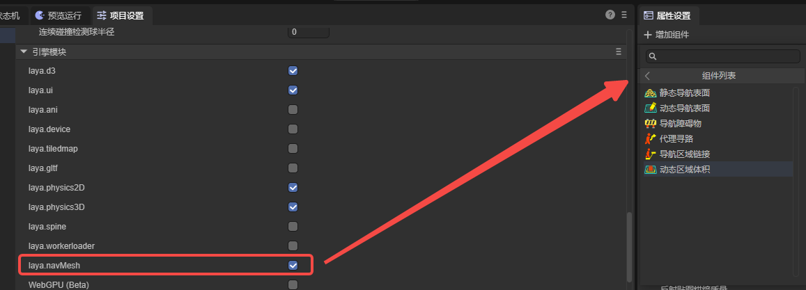
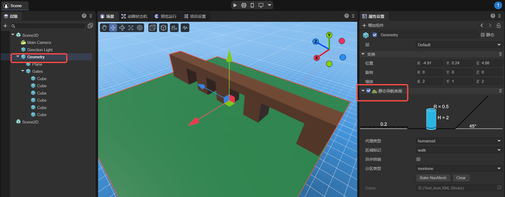
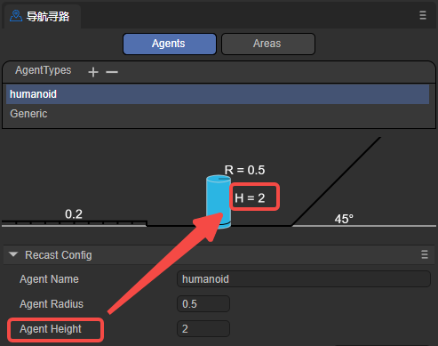
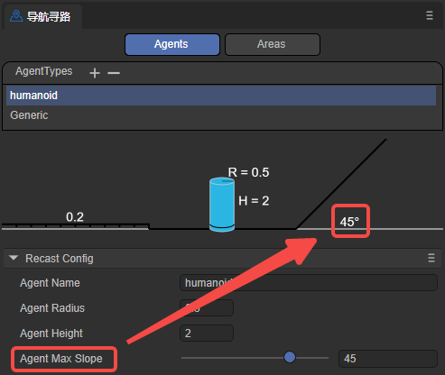
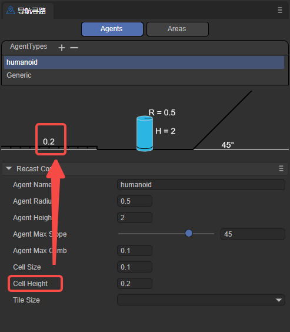
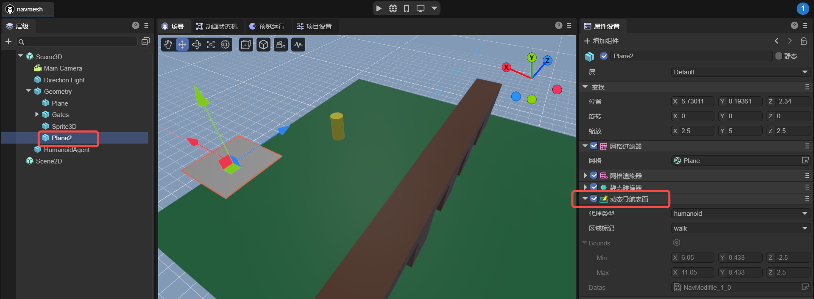

# 3D寻路

> Version >= LayaAir 3.2

## 一、简介

在游戏开发中，3D寻路是一个关键的功能，特别是在需要模拟角色或物体在三维空间内自动导航和移动的游戏中。3D寻路使得游戏内的角色能够智能地在复杂的三维环境中找到从一个点到另一个点的最优路径，同时避免障碍物和其他潜在障碍。

从LayaAir 3.2开始，新增导航网格（navMesh）用于实现3D场景的寻路。在许多游戏中，NPC通过在游戏世界的可导航区域内运行的寻路算法进行导航。例如，导航网格是一个二维三角形网格，它提供了对可导航区域边界的简单描述，以及为路径查找器提供连接信息。

在LayaAir-IDE中实现导航网格需要通过添加navMesh相应的组件来实现。开发者在使用前，需要先在项目设置面板中，勾选相应的模块，如图1-1所示。

（图1-1）

下面使用这些组件实现一个简单的3D寻路。

## 二、寻路导航

实现一个寻路的过程，需要添加导航网格、代理等。其中，导航网格表示角色可以在其中移动的区域，代理用于表示寻路的主体对象（角色、NPC、载具等），还有导航区域链接等可以实现一些特殊的功能。

### 2.1 静态导航表面(Nav Mesh Surface)

如图2-1所示，有一个简单的地形场景，由一个Plane和一些cube组成的Gates构成，在这个场景中实现寻路导航，首先要在地形节点的跟节点上添加`Nav Mesh Surface`组件。

（图2-1）

添加的静态导航表面组件就是用于生成导航网格，是实现寻路的主体，它将环境中角色可以行走的表面（地面、平台、斜坡等）转换为多边形网格，里面数据都是全局静态的。

在LayaAir-IDE中添加的静态导航表面组件如图2-2所示，

（图2-2）

下面分别介绍其属性。

#### 2.1.1 agentType

用于指定在该Nav Mesh Surface上寻路的代理类型。在寻路系统中，代理是一个抽象的概念，用于表示寻路的主体对象，如游戏中的角色、NPC、载具等。不同类型的代理在寻路时会有不同的特性和限制，如体积大小、移动方式、可通过的区域类型等。代理类型的作用是让开发者能够根据游戏中不同类型的寻路对象，灵活地设置和调整局部的寻路参数，以满足游戏的需求。

默认值为Humanoid（人形角色），表示适用于人形角色的导航设置，适用于大多数游戏中的人形角色导航。

如图2-3所示，开发者可以通过选择`open Agent Settings`选项，打开配置界面，新增自定义的代理类型。

（图2-3）

Agents的配置页面如图2-4所示，

（图2-4）

注意，此页面并不是调节agent本身，而是调节适用该agent的地形。下面介绍其各参数的意义，

##### `agentName`：

导航网格表面适用的Agent类型的名称。此处填写的名称将与agentType处选项的名称一致，如图2-5所示。

（图2-5）

##### `agentRadius`：

这个值决定了Agent在导航过程中与障碍物之间的最小距离。较大的半径会使Agent与障碍物保持更大的距离。该参数调节的是图2-6中的参数R。

（图2-6）

##### `agentHeight`：

这个值决定了Agent能够通过的空间的高度。Agent只能在高度大于等于其高度的区域中导航。该参数调节的是图2-7中的参数H。

（图2-7）

##### `agentMaxSlope`：

Agent能够导航的最大斜率角度。超过这个角度的斜坡将被视为不可通过的区域。

（图2-8）

##### `agentMaxClimb`：

Agent能够攀爬的最大高度。这个值决定了Agent能够攀爬的垂直墙面的最大高度。

##### `cellSize`：

导航网格的单元格大小。较小的单元格大小会生成更详细的导航网格，但会增加内存占用和计算成本。

##### `cellHeight`：

导航网格中每个单元格的高度。较小的单元格高度会生成更精确的导航网格，允许角色在垂直方向上更准确地导航，如跨越台阶或斜坡，但会增加内存占用。

（图2-9）

##### `tileSize`：

导航网格的瓦片大小。导航网格可以被划分为多个瓦片，以便在大型场景中更高效地生成和加载导航数据。

#### 2.1.2 areaFlag

用于标记当前Nav Mesh Surface的区域类型，如可行走区域、水、障碍物区域等。areaFlag可以影响agent在寻路时对不同区域的偏好和避让行为。

如图2-10所示，开发者可以通过点击`open Area Settings`选项，打开配置界面，新增自定义的areaFlag类型。

（图2-10）

Areas的配置界面如图2-11所示，

（图2-11）

下面介绍各参数的意义，

##### `name`：

区域类型的名称，此处填写的名称将与areaFlag处选项的名称一致，如图2-12所示。

（图2-12）

开发者还可以增加自定义的名称，通过name值，开发者可以在代码中指定代理经过该Area时所做的动作。

##### `cost`：

指定agent在导航时穿越该类型表面的相对代价或难度。通常是一个正数，较高的值表示通过该表面的代价更高或更难。例如，可以将水面的Cost设置为5，而普通地面的Cost设置为1，表示相对于普通地面，agent更难穿越水面。

总的来说，通过设置不同的areaFlag，可以控制agent在导航时如何与不同类型的表面进行交互。agent在寻路时会优先选择Cost较低的路径，避开Cost较高的表面。开发者可以根据自己的需求，为不同的表面类型设置适当的areaFlag和Cost值，以影响agent的导航行为。

#### 2.1.3 asyn

表示是否启用异步生成导航网格的功能。当勾选Async时，导航网格的生成过程将在后台异步进行，不会阻塞主线程的执行。启用异步生成可以保证在游戏运行的时候，每帧只生成一个tile，提高场景加载和编辑的流畅性。

#### 2.1.4 partitionType

用于指定导航网格的分区方式，如图2-13所示，有Monotone（单调分割）、Watershed（流域分割）和Layer（层次分割）三个选项。

（图2-13）

##### `Monotone`：

Monotone分割算法会将NavMesh表面划分为凸多边形区域。它创建的NavMesh区域形状简单，边缘平滑，适合于简单的场景或者对NavMesh形状要求不高的情况。Monotone分割的NavMesh生成速度较快，占用内存相对较少。然而，对于复杂的场景，Monotone分割可能会产生不够精确的NavMesh。

##### `Watershed`：

Watershed分割算法会根据高度场将NavMesh表面划分为不同的区域。它通过模拟水流从高处流向低处的过程，将NavMesh表面划分为多个"流域"。Watershed分割能够更好地适应复杂的场景，生成的NavMesh区域更加精确和自然。与Monotone分割相比，Watershed分割的NavMesh生成速度较慢，占用内存也相对较多，因此，Watershed分割适用于对NavMesh质量要求较高的场景。

##### `Layer`：

Layer分割算法会将NavMesh表面按照指定的层次结构进行划分。通过设置Layer属性，可以将不同的游戏对象分配到不同的层中，从而生成分层的NavMesh。不同层之间的NavMesh是独立的，agent只能在同一层内寻路和移动。Layer分割适用于需要对不同区域应用不同寻路规则的场景，例如室内和室外的分离。使用Layer分割时，需要注意正确设置游戏对象的Layer属性，以确保NavMsh的正确生成。

总的来说，选择合适的partitionType取决于项目的具体需求和场景复杂度。对于简单的场景或对NavMesh质量要求不高的情况，可以使用Monotone分割。对于复杂的场景或需要更精确NavMesh的情况，可以使用Watershed分割。如果需要对不同区域应用不同的寻路规则，则可以使用Layer分割。 建议在开发过程中对不同的partitionType进行测试和比较，根据实际效果和性能要求选择最适合项目的分割方式。

#### 2.1.5 datas

点击`Bake NavMesh`按钮后，可以对所有除动态节点外的、所有可渲染节点及子节点模型进行烘焙。也就是说，手动触发导航网格的生成（烘焙），会在点击`Bake NavMesh`按钮后立即开始生成导航网格。生成的结果（.bin文件）会保存到assets目录下新建的文件夹中（以模型所在场景命名）。最终，如图2-14所示，该文件会自动添加到datas属性中。

（图2-14）

一般来说，烘焙导航网格通常在场景编辑完成后进行，以确保导航网格与最新的场景状态保持一致。如果对场景节点以及子节点的位置进行了移动，或进行了旋转等变化，都需要重新烘培节点数据（不可存在预制体中，如果在预制体中拖入场景须重新烘培数据）。因为烘焙出的navMeshSurface并不会跟随场景动态改变。开发者可以先点击`clear`按钮清楚原有的datas数据，然后再重新烘焙。

### 2.2 动态节点的基类(NavModifleBase)

有时，场景中需要一些动态节点，如移动的地板、临时添加的障碍物等。这些就需要导航网格随着节点的变化而变化，`Nav Mesh Modifier Surface`和`Nav  Mesh Obstacles`两个组件可以实现此功能。它们都继承自动态节点基类NavModifleBase，它的数据可以动态添加到NavMeshSurface类的节点下面，形成场景路径的动态变化。下面分别对其两个子类进行介绍。

#### 2.2.1 动态导航表面(Nav Mesh Modifier Surface)

动态导航表面组件用于动态修改导航网格，使得游戏场景能够更加动态和交互。例如，当需要在游戏运行时移动导航网格的某些区域时，可以为该区域添加一个动态导航表面组件。该区域会覆盖或修改现有的导航网格，用户可以自定义修改区域的形状、标记行走区域类型等。

如图3-1所示，在场景Geometry中增加一个Plane2平面，给其添加一个动态导航表面组件。

（图3-1）

需要注意的时，Plane2需要放在Geometry的子节点下，在项目运行前与Geometry一起烘焙。这样，Plane2才会生成导航网格，如图3-2所示，

（图3-2）

虽然Geometry与Plane2的导航网格是一起烘焙出来的，但是Geometry的导航网格是静态的，Plane2的导航网格是动态的。即在项目运行时，Geometry的导航网格不会随着其模型移动，Plane2的导航网格会跟随其模型移动。

如果开发者需要通过代码添加动态导航网格，需要先提前烘焙好，并存储在预制体中，这样在项目运行时就可以使用代码动态添加了。

另外，节点本身的位置、旋转、缩放不会影响数据变化，但子节点的所有位置、旋转、缩放会影响数据变化，如果删减及添加渲染节点需要重新烘培数据。

#### 2.2.2 导航障碍物(Nav  Mesh Obstacles)

导航障碍物组件用于表示寻路过程中为障碍物的组件。通过在场景中放置障碍物对象，以及设置障碍物的类型与形状，影响导航网格的生成和寻路计算。

如图3-3所示，当前实现了盒子和圆柱体形状的障碍物。其中，bounds为地形区域，不需要手动配置，烘焙完之后自动生成。

（图3-3）

##### BOX

如图3-4所示，盒子形状的障碍物可以设置Center和Size两个参数，

（图3-4）

`center`：盒子的中心位置。

`size`：盒子的宽度、高度、长度。通过这些值可以调整盒子的体积大小，来匹配障碍物的尺寸。

##### CAPSULE

如图3-5所示，圆柱体形状的障碍物可以设置Center、Height、Radius三个参数，

（图3-5）

`center`：圆柱体的中心位置。

`height`：圆柱体的高，实际影响圆柱的垂直高度。

`radius`：圆柱的底面半径。

### 2.3 导航代理寻路(Nav Agent)

导航代理寻路是导航系统中用于控制角色或物体等寻路对象(导航的代理)在导航网格上移动和寻路的组件。它是寻路对象与导航系统交互的主要组件，负责处理寻路对象的移动、避障和路径规划。该组件是实现寻路对象在复杂环境中自主寻路和移动的关键。它与其他导航组件(如静态导航表面、导航障碍物等)协同工作,提供了一套完整的导航解决方案。

导航代理只有圆柱体形状，这样可以简化计算，将复杂的形状大大简化。并且，圆柱体没有尖锐的边角，使得代理在环境中移动时更加平滑，不容易被卡住或跨越过小的障碍物。总之，使用圆柱体作为Nav Agent的碰撞形状，是在导航性能、适应性和资源消耗之间取得平衡的结果。

如图4-1所示，选定agentType后，开发者可以调节该导航代理的一些属性。

（图4-1）

`Radius`：设置代理的碰撞半径。决定了代理在导航网格上的占用区域，并影响其与障碍物的碰撞检测。

`Height`：设置代理的碰撞高度。决定了代理在导航网格上的高度，并影响其与障碍物的碰撞检测。

`Base Offset`：设置代理在导航网格上的垂直偏移量。允许将代理的碰撞体悬停在导航网格的一定高度之上。

`Speed`：设置代理的最大移动速度。较大的速度可以让代理更快地到达目标点。

`Max Acceleration`：设置代理的最大加速度。这决定了代理在开始移动、停止移动或改变方向时的加速度。

`Quality`：定义代理的回避品质。影响代理在导航网格上计算路径的精度和效率，较高的质量可以生成更准确和优化的路径，但可能会增加计算开销。

`Priority`：设置代理的规避优先级。较高的优先级可以让代理在寻路和避障时获得更高的优先权。数值越小优先级越高。

`Area Mask`：设置代理可以通过的导航区域类型。可以限制代理只在特定类型的区域内移动。

### 2.4 导航区域链接(Nav Mesh Link)

导航区域链接组件是导航系统中用于连接两个不同导航网格表面的组件。它允许在导航网格之间创建链接，通过指定移动时的起点和终点,使得角色可以在这些链接上移动，从而在不同的导航区域之间进行寻路。这在游戏场景中非常有用，特别是当有多个不连续的可行走区域时，例如平台、楼层等。

如图5-1所示，当代理需要从下方的平面寻路到上方的平面时，就需要用到导航区域链接组件了。

（图5-1）

`start`：链接的起始位置，指定链接的起点所在的位置和方向，链接将从这个起点位置开始。

`end`：链接的结束位置，指定链接的终点所在的位置和方向，链接将在这个终点位置结束。

`width`：链接的宽度，决定了链接的可通过区域的大小。

`bidirectional`：是否为双向链接。如果不勾选，则链接只能单向通行，代理只能从起点到终点，不可以从终点到起点。

### 2.5 动态区域体积(Nav Mesh Modifier Volume)

动态区域体积组件是导航系统中用于在体积区域内修改导航网格属性的组件。它允许在场景中定义一个三维区域，该区域通常使用一个盒状碰撞器来表示，并且可以调整其大小和位置。

开发者可以将修改区域设置为不同的areaFlag，即为此区域设置一个不同的代价值。该代价值会影响寻路时经过该区域的代价计算。较高的代价值会使角色倾向于避开该区域，而较低的代价值则会鼓励角色通过该区域。

比如图6-1所示，代理从A点移动到B点，中间有一个动态区域体积，其areaFlag为unwalk，表示不可走。那么代理在寻路时，则会绕开此区域。

（图6-1）

