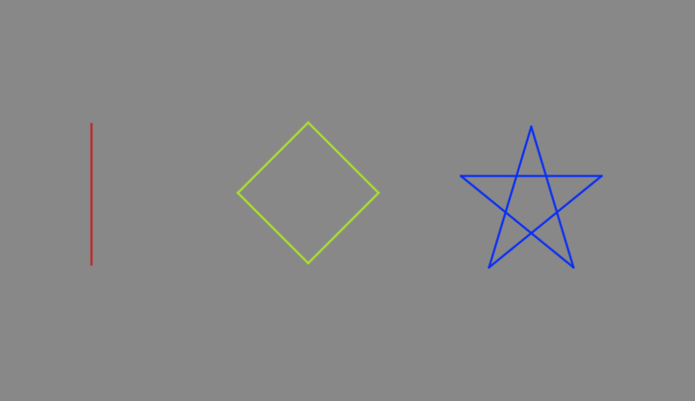
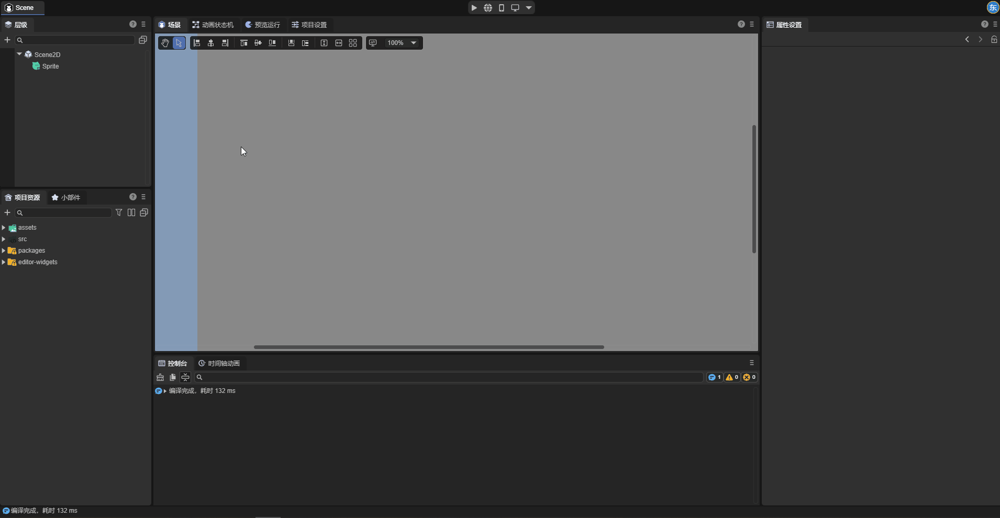
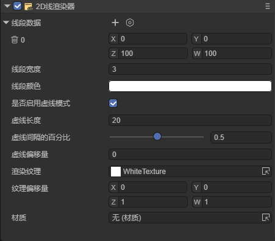
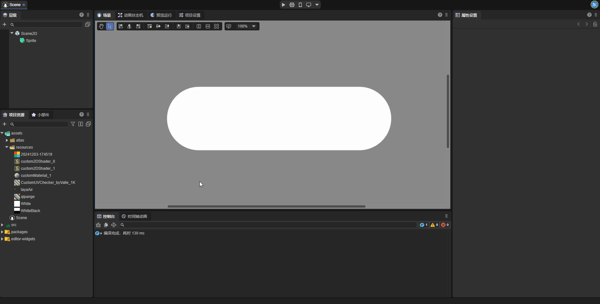
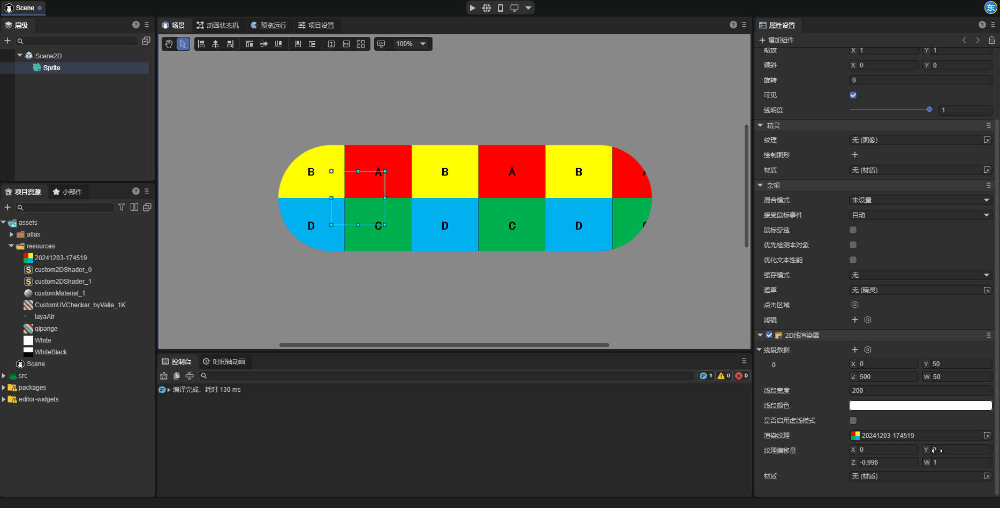
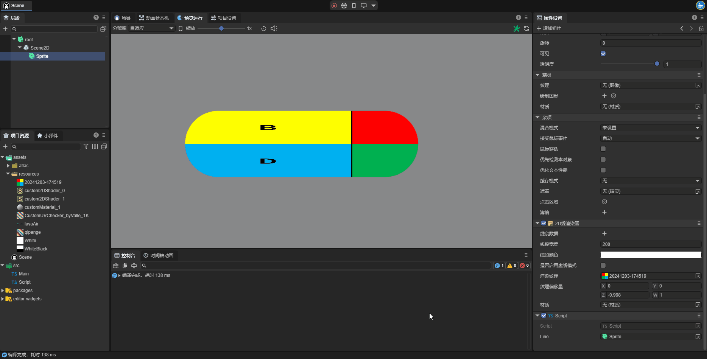
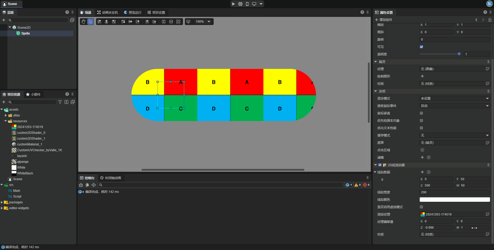
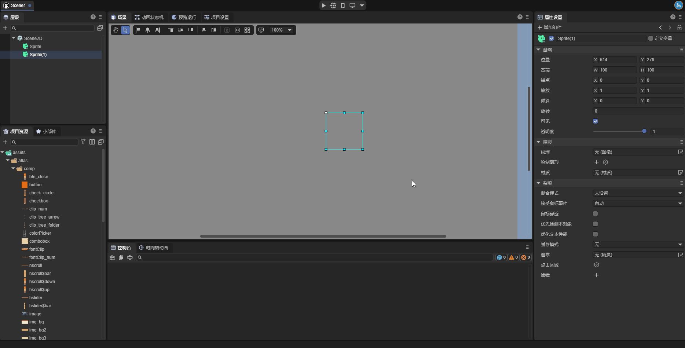

# 2D像素线
## 一、概述

尽管LayaAir引擎提供了绘制图形（Graphics）API用于绘制线段和折线，然而LayaAir3.3开始，提供了更为高级的2D线渲染器(Line2DRender)，不仅具有Graphics的画线能力，还支持创建虚线，以及为线段设置材质和纹理，使得2D线也可以接收光照，拥有更加炫酷的线形状效果，例如绳索、渐变线、线段边框、线上的动态纹理等等。

注：基于性能考虑，Graphics可以实现的情况下，建议优先使用Graphics画线。



（图1-1）

如图1-1所示，我们在场景中通过线渲染器创建了绳索、渐变线、图像边框。下面开始介绍如何在IDE中创建和使用线渲染器。


## 二、IDE中创建与使用

### 2.1添加2D线渲染器组件

选中一个2D节点，在属性设置面板中为节点增加一个2D线渲染器组件(Line2DRender)。



（图2-1-1）

组件添加到节点上后，默认会创建好一个线段。

### 2.2属性设置

如图2-2-1所示，2D线渲染器上有以下这些属性：

 

（图2-2-1）

| 属性                                | 功能                                                         |
| ----------------------------------- | ------------------------------------------------------------ |
| 渲染图层(layer)                     | 用于2D灯光组件的图层遮罩所影响的图层                         |
| 材质(sharedMaterial)                | 设置自定义的2D着色器材质，不设置引擎会使用默认材质           |
| 线段数据(positions)                 | 每一组数据代表2D节点上的一条线段，其中 `X,Y` 值为线段的起点，`Z,W` 值为线段的终点。开发者也可以在编辑2D线段状态下可视化的编辑线段的起点与终点。 |
| 线段宽度(lineWidth)                 | 线段的宽度，以像素为单位；线段的宽度不会随着节点的缩放而变化。 |
| 线段颜色(color)                     | 线段的颜色，与渲染纹理和材质共同决定线段最终的显示效果。     |
| 是否启用虚线模式(enableDashedModle) | 启用此属性后，线段会变为虚线。                               |
| 虚线长度(dashedLength)              | 启用虚线模式后可以设置的属性，此属性决定了虚线每一个循环的长度。 |
| 虚线间隔的百分比(dashedPercent)     | 虚线中非空白区域占线段长度的百分比。                         |
| 虚线偏移量(dashedOffset)            | 虚线上每个循环整体向左或向右的移动距离。                     |
| 渲染纹理(texture)                   | 应用于线段的纹理，此属性后续会详细讲解                       |
| 纹理偏移量(tillOffset)              | 代表线段上纹理的偏移值与缩放值，其中 `X,Y` 为纹理的偏移值；`Z，W` 为纹理的缩放值。 |

### 2.3线段的渲染纹理

2D线渲染器可以为线段设置渲染纹理(Texture)，用于实现渐变线等效果。开发者可在IDE中设置线段的纹理。

这里我们为了便于观察，将线段宽度设置为了100。



（图2-3-1）

设置好的纹理会循环的显示在线段上，开发者可自行设置纹理偏移量(TillOffset)，纹理偏移量中的`X，Y`值用于控制纹理的偏移，`Z,W`值用于控制纹理的缩放。这里我们通过四个例子直观的感受纹理偏移量的用法。

当我们改变纹理偏移量的`X`属性值时，如图2-3-2所示，纹理沿线段的方向平移：


（图2-3-2）


当我们改变纹理偏移量的`Y`属性值时，如图2-3-3所示，纹理垂直于线段的方向平移：



（图2-3-3）


当我们改变纹理偏移量的`Z`属性值时，如图2-3-4所示，可以发现纹理沿线段方向缩放：



（图2-3-4）


当我们改变纹理偏移量的`W`属性值时，如图2-3-5所示，可以发现纹理沿垂直于线段的方向缩放：



（图2-3-5）


### 2.4对比2D线渲染器和Graphics绘制线段

LayaAir引擎中还有另一个可以用于绘制线段的工具Graphics。



这里我们对比一下两者的区别。

一是创建虚线。对于2D线渲染器，开发者在启用是否启用虚线模式属性后，线段就会变成虚线，而Graphics绘制线段无法绘制虚线。

二是渲染纹理。2D线渲染器可以设置渲染纹理用于实现各种效果（例如渐变线，绳子等），Graphics绘制线段无法设置渲染纹理。

三是属性的作用对象不同。2D线渲染器设置的属性会作用于渲染器中的所有线段，而Graphics绘制线段中的每一条线段都有独立的属性值。


## 三、在代码中使用2D线渲染器组件

在游戏开发的过程中，开发者也可以通过脚本代码动态的创建线渲染器组件，以及创建任意图形线段。示例代码如下所示：

**示例代码:**

```typescript
const { regClass} = Laya;

@regClass()
/**
 * 基于2D线渲染器的画线示例脚本
 * 注意：脚本的事件是基于节点的宽高，所以绘制的图形也是在宽高范围内。
 */
export class DrawLine extends Laya.Script {

    declare owner: Laya.Sprite;

    line2DRender: Laya.Line2DRender;
    lastMousePos: number[] = [];
    isDrawing: boolean = false; // 标记是否正在绘制

    // 组件被激活后执行，此时所有节点和组件均已创建完毕，此方法只执行一次
    onEnable(): void {
        // 添加2D线渲染器组件
        this.line2DRender = this.owner.addComponent(Laya.Line2DRender);
        // 设置线的宽度
        this.line2DRender.lineWidth = 5;
    }

    // 鼠标按下时开始绘制
    onMouseDown(evt: Laya.Event): void {
        this.isDrawing = true;
        // 记录起始点
        this.lastMousePos[0] = evt.stageX - this.owner.x;
        this.lastMousePos[1] = evt.stageY - this.owner.y;
    }

    // 鼠标松开时停止绘制
    onMouseUp(): void {
        this.isDrawing = false;
        this.lastMousePos.length = 0; // 清空上一次的点
    }

    // 鼠标移动时绘制线段（仅在按下时）
    onMouseMove(evt: Laya.Event): void {
        if (!this.isDrawing || this.lastMousePos.length === 0) return;

        const x = evt.stageX - this.owner.x;
        const y = evt.stageY - this.owner.y;

        // 添加线段
        this.line2DRender.addPoint(this.lastMousePos[0], this.lastMousePos[1], x, y);

        // 更新最后一个点的坐标
        this.lastMousePos[0] = x;
        this.lastMousePos[1] = y;
    }
}
```

将以上代码保存后，拖到场景中的精灵节点上，运行即可，效果如图：


（图3-1）


