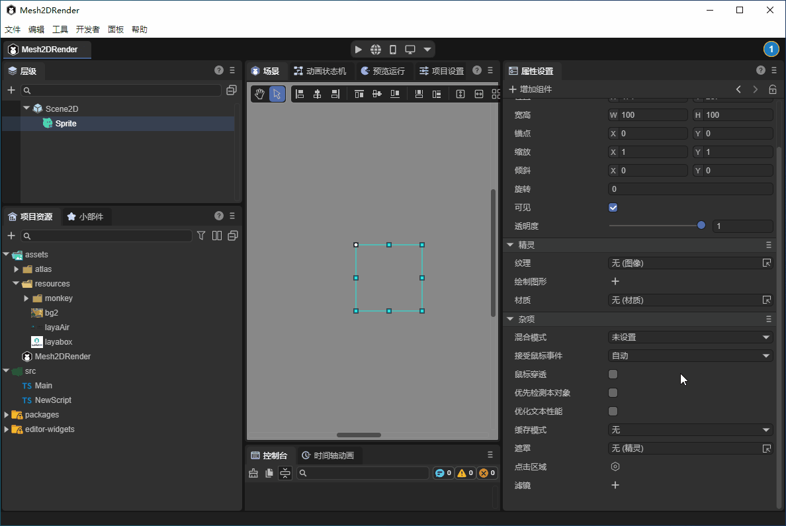
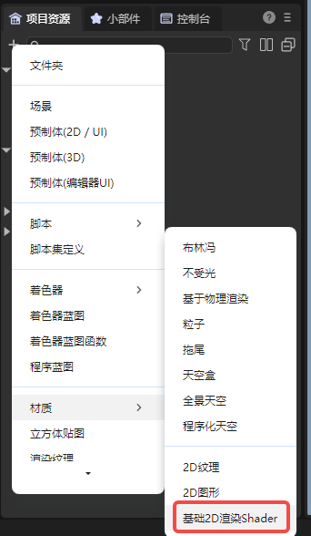
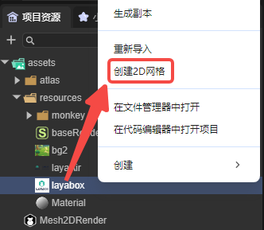

# 2D网格渲染器

## 一、简介

2D网格渲染器（Mesh2DRender）用于在2D场景中显示和渲染2D网格，支持纹理渲染，可以设置渲染颜色，还可以添加自定义的材质，接收2D光照效果。开发者可以用来创建复杂的2D图形效果，支持自定义网格形状，适合制作需要精确网格控制的2D游戏元素。

在游戏开发中，2D网格渲染器能够在2D游戏中实现更复杂和精细的视觉效果。例如，制作带有特殊光照效果的2D角色，创建复杂形态的 2D物体，实现复杂的2D特效。

总之，这个组件能够帮助开发者突破传统2D渲染的限制，创造出更加丰富和独特的效果。


## 二、在LayaAir-IDE中使用

在LayaAir-IDE中，创建一个sprite，在sprite上添加2D网格渲染器组件，如动图2-1所示。



（动图2-1）

添加后的组件属性如图2-2所示，


（图2-2）

其中`渲染图层`和`接受光照`属性都与光照相关，具体用法参考[2D灯光](../../BaseLight2D/readme.md)的文档。下面分别介绍其它的属性：

### 2.1 材质

2D网格渲染器支持添加自定义的材质，在LayaAir-IDE中，创建默认的材质为基础2D渲染（BaseRender2D），如图2-3所示，



（图2-3）

将材质添加到2D网格渲染器中的材质属性上，开发者也可以更改这个shader模版，自定义效果。

> 2Dshader的使用请查看文档[自定义2D着色器](../../../../../2D/advanced/customShader/readme.md)。

如图2-4所示，使用自定义的Shader实现了一个渐变的效果，


（图2-4）

此shader的代码如下，

```glsl
Shader3D Start
{
    type:Shader3D,
    name:baseRender2D,
    enableInstancing:true,
    supportReflectionProbe:true,
    shaderType:2,
    uniformMap:{
        u_gradientDirection: {type: Vector2, default:[1,1]},    // 渐变方向
        u_gradientStartColor: {type:Vector4, default:[1,1,1,1]},       // 渐变起始颜色
        u_gradientEndColor: {type:Vector4, default:[1,1,1,1]}        // 渐变结束颜色    
    },
    attributeMap: {
        a_position: Vector4,
        a_color: Vector4,
        a_uv: Vector2,
    },
    defines: {
        BASERENDER2D: { type: bool, default: true }
    }
    shaderPass:[
        {
            pipeline:Forward,
            VS:baseRenderVS,
            FS:baseRenderPS
        }
    ]
}
Shader3D End

GLSL Start
#defineGLSL baseRenderVS

    #define SHADER_NAME baseRender2D

    #include "Sprite2DVertex.glsl";

    void main() {
        vec4 pos;
        //先计算位置，再做裁剪
        getPosition(pos);
        vertexInfo info;
        getVertexInfo(info);

        v_texcoord = info.uv;
        v_color = info.color;

        #ifdef LIGHT_AND_SHADOW
            lightAndShadow(info);
        #endif

        gl_Position = pos;
    }

#endGLSL

#defineGLSL baseRenderPS
    #define SHADER_NAME baseRender2D
    #if defined(GL_FRAGMENT_PRECISION_HIGH) 
    precision highp float;
    #else
    precision mediump float;
    #endif

    #include "Sprite2DFrag.glsl";

    void main()
    {
        clip();
        vec4 textureColor = texture2D(u_baseRender2DTexture, v_texcoord);

        // 计算渐变因子
        float gradientFactor = dot(v_texcoord, normalize(u_gradientDirection)) * 0.5 + 0.5;
        
        // 混合渐变颜色
        vec4 gradientColor = mix(u_gradientStartColor, u_gradientEndColor, gradientFactor);
        textureColor *= gradientColor;
        
        #ifdef LIGHT_AND_SHADOW
            lightAndShadow(textureColor);
        #endif

        textureColor = transspaceColor(textureColor);
        setglColor(textureColor);
    }
    
#endGLSL
GLSL End
```


### 2.2 网格

2D网格可以通过两种方式进行创建。一种方法是LayaAir-IDE内置的方法，如图2-5所示，在项目资源面板中，在需要创建网格的图片上右键，选择“创建2D网格”即可。



（图2-5）

另一种方法是通过代码创建的方法，参考第三节中`generateCircleVerticesAndUV`和`generateRectVerticesAndUV`的代码。


### 2.3 纹理与颜色

纹理的选择不一定要与创建网格时选择的图片相同。例如，创建网格使用的是图2-6中的图片，


（图2-6）

纹理可以使用图2-7中的图片，


（图2-7）

最终的效果如图2-8所示，


（图2-8）

还可以更改颜色，效果如图2-9所示，


（图2-9）


## 三、通过代码使用

在LayaAir-IDE中新建一个脚本，添加到Scene2D节点后，加入下述代码，实现一个2D网格渲染器的效果：

```typescript
const { regClass, property } = Laya;

@regClass()
export class Mesh2DRender extends Laya.Script {

    @property({type: Laya.Sprite})
    private layaMonkey: Laya.Sprite;

    //组件被启用后执行，例如节点被添加到舞台后
    onEnable(): void {
        Laya.loader.load("resources/layabox.png", Laya.Loader.IMAGE).then(() => {
            this.setMesh2DRender();
        });
    }

    // 配置2D网格渲染器
    setMesh2DRender(): void {
        let mesh2Drender = this.layaMonkey.getComponent(Laya.Mesh2DRender);
        // 添加网格
        mesh2Drender.sharedMesh = this.generateCircleVerticesAndUV(100, 100);
        let tex = Laya.loader.getRes("resources/layabox.png");
        mesh2Drender.texture = tex;
        // mesh2Drender.color = new Laya.Color(0.8, 0.15, 0.15, 1);
        // mesh2Drender.lightReceive = true;
    }

    /**
     * 生成一个圆形2D网格
     * @param radius 圆的半径
     * @param numSegments 圆被分割的段数，段数越多圆越平滑
     */
    private generateCircleVerticesAndUV(radius: number, numSegments: number): Laya.Mesh2D {
        // 2π
        const twoPi = Math.PI * 2;
        // 顶点数组
        let vertexs = new Float32Array((numSegments + 1) * 5);
        // 索引数组
        let index = new Uint16Array((numSegments + 1) * 3);
        var pos = 0;

        // 生成圆周上的顶点
        for (let i = 0; i < numSegments; i++, pos += 5) {
            const angle = twoPi * i / numSegments;
            // 计算顶点坐标
            var x = vertexs[pos + 0] = radius * Math.cos(angle);
            var y = vertexs[pos + 1] = radius * Math.sin(angle);
            vertexs[pos + 2] = 0; // z坐标始终为0（2D）
            // 计算UV坐标
            vertexs[pos + 3] = 0.5 + x / (2 * radius); // 将x从[-radius, radius]映射到[0,1]
            vertexs[pos + 4] = 0.5 + y / (2 * radius); // 将y从[-radius, radius]映射到[0,1]
        }
        //圆心
        vertexs[pos] = 0;
        vertexs[pos + 1] = 0;
        vertexs[pos + 2] = 0;
        vertexs[pos + 3] = 0.5;
        vertexs[pos + 4] = 0.5;

        // 生成三角形索引
        for (var i = 1, ibIndex = 0; i < numSegments; i++, ibIndex += 3) {
            index[ibIndex] = i;
            index[ibIndex + 1] = i - 1;
            index[ibIndex + 2] = numSegments;
        }
        // 处理最后一个三角形：连接最后一个顶点、第一个顶点和圆心
        index[ibIndex] = numSegments - 1;
        index[ibIndex + 1] = 0;
        index[ibIndex + 2] = numSegments;
        // 顶点声明
        var declaration = Laya.VertexMesh2D.getVertexDeclaration(["POSITION,UV"], false)[0];
        let mesh2D = Laya.Mesh2D.createMesh2DByPrimitive([vertexs], [declaration], index, Laya.IndexFormat.UInt16, [{ length: index.length, start: 0 }]);
        return mesh2D;
    }
}
```

最终的效果如图3-1所示，


（图3-1）

示例中给出的是一个圆形的网格，下面再给出一个矩形网格的写法，

```typescript
    /**
     * 生成一个矩形2D网格
     * @param width 矩形的宽度
     * @param height 矩形的高度
     */
    private generateRectVerticesAndUV(width: number, height: number): Laya.Mesh2D {
        const vertices = new Float32Array(4 * 5);
        const indices = new Uint16Array(2 * 3);
        let index = 0;
        vertices[index++] = 0;
        vertices[index++] = 0;
        vertices[index++] = 0;
        vertices[index++] = 0;
        vertices[index++] = 0;

        vertices[index++] = width;
        vertices[index++] = 0;
        vertices[index++] = 0;
        vertices[index++] = 1;
        vertices[index++] = 0;

        vertices[index++] = width;
        vertices[index++] = height;
        vertices[index++] = 0;
        vertices[index++] = 1;
        vertices[index++] = 1;

        vertices[index++] = 0;
        vertices[index++] = height;
        vertices[index++] = 0;
        vertices[index++] = 0;
        vertices[index++] = 1;

        index = 0;
        indices[index++] = 0;
        indices[index++] = 1;
        indices[index++] = 3;

        indices[index++] = 1;
        indices[index++] = 2;
        indices[index++] = 3;

        const declaration = Laya.VertexMesh2D.getVertexDeclaration(["POSITION,UV"], false)[0];
        const mesh2D = Laya.Mesh2D.createMesh2DByPrimitive([vertices], [declaration], indices, Laya.IndexFormat.UInt16, [{ length: indices.length, start: 0 }]);
        return mesh2D;
    }
```

只需替换示例代码中的`generateCircleVerticesAndUV`即可，效果如图3-2所示。


（图3-2）


