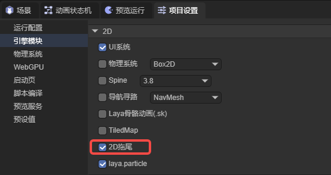
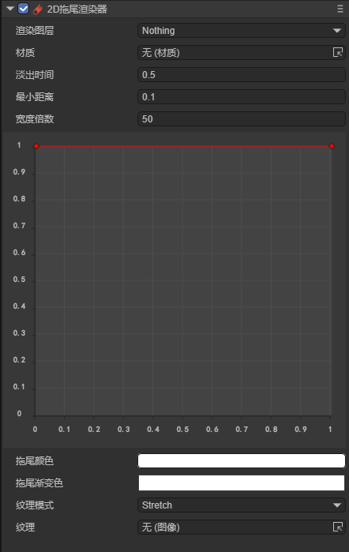
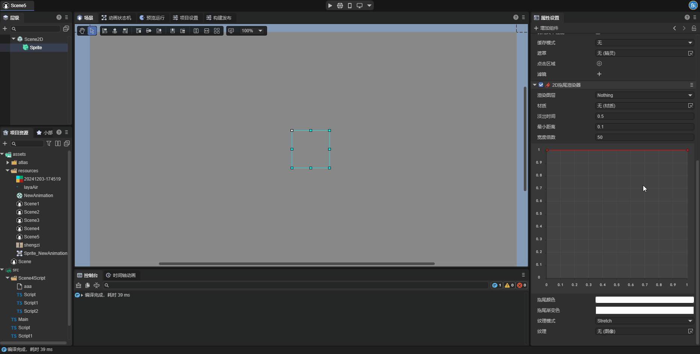
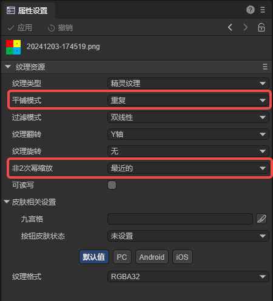

# 2D拖尾渲染器(Trail2DRender)

2D拖尾渲染器可以在移动的游戏对象后创建一条多边形轨迹。通过这个组件，我们可以增强游戏对象的运动感，也可以突出对象移动的路径或位置。


## 一、通过LayaAir IDE创建Trail2DRender组件

### 1.1创建Trail2DRender

通过IDE可视化操作，可以直接在属性设置面板中为2D节点添加2D拖尾渲染器(Trail2DRender)。


2D拖尾渲染器需要启用引擎模块中的2D拖尾模块才能使用，当开发者向节点上添加2D拖尾渲染器时，这个模块会自动启用，开发者也可以手动启动这一模块。




### 1.2 Trail2DRender中的属性

如图1-2-1所示，2D拖尾渲染器上有以下这些属性：



（图1-2-1）

| 属性                        | 功能                                                         |
| --------------------------- | ------------------------------------------------------------ |
| 渲染图层(layer)             | 用于2D灯光组件的图层遮罩所影响的图层                         |
| 材质(sharedMaterial)        | 设置自定义的2D着色器材质，不设置引擎会使用默认材质           |
| 淡出时间(time)              | 拖尾中点的生命周期（以秒为单位）                             |
| 最小距离(minVertexDistance) | 拖尾中两点之间的最小距离                                     |
| 宽度倍数(widthMultiplier)   | 拖尾的总宽度。（以像素为单位）                               |
| 宽度曲线(widthCurve)        | 一个归一化的值，决定了拖尾不同位置的宽度                     |
| 拖尾颜色(color)             | 设置拖尾的颜色，会与拖尾的渐变色混合叠加形成最终颜色         |
| 拖尾渐变色(colorGradient)   | 设置拖尾的渐变色，会与拖尾的颜色混合叠加形成最终颜色         |
| 纹理模式(textureMode)       | 控制纹理应如何应用于拖尾。有平铺(Stretch)和拉伸(Tile)两种模式 |
| 纹理(texture)               | 应用于拖尾的纹理，具体效果受纹理模式(textureMode)的影响。    |


### 1.3属性讲解

下面我们对Trail2DRender中的一部分属性进行讲解。

#### 1.3.1 minVertexDistance

2D拖尾在原理上是根据物体的运动轨迹生成一系列顶点，再根据这些顶点的位置生成渲染到场景中的图像，最终形成拖尾。`minVertexDistance`这一属性则决定了顶点之间的距离，顶点之间的距离越小，拖尾越流畅；反之，拖尾越生硬。下面我们通过两个例子直观的认识这个属性：

`minVertexDistance`设置为`0.1`时，如图1-3-1-1所示：


（图1-3-1-1）

`minVertexDistance`设置为`100`时，如图1-3-1-2所示：


（图1-3-1-2）


#### 1.3.2 widthCurve

`widthMultiplier`属性决定了拖尾的整体宽度，而`widthCurve`属性则在`widthMultiplier`属性的基础上定义了拖尾每一部分的实际宽度。在IDE中，开发者可以通过双击连接线来创建一个新的关键帧，并通过拖动关键帧的点来设置宽度曲线。拖尾在创建顶点时会在宽度曲线上采样，因此拖尾宽度的精度也与`minVertexDistance`属性有关。



（图1-3-2-1）

运行效果如图：


（图1-3-2-2）


#### 1.3.3 textureMode

`textureMode`属性决定了纹理会如何运用到拖尾上。

**Stretch**：拉伸模式。此模式下纹理会被拉伸到覆盖整个拖尾长度，无论拖尾的长度如何变化，纹理只会显示一次。拖尾越长，纹理被拉伸得越多。适用于光效等连续纹理表现，避免出现纹理的断裂感。


**Tile**: 平铺模式。此模式下纹理在拖尾长度上以重复的方式进行铺设。拖尾越长，纹理重复的次数越多，纹理会保持原始比例不变。适用于需要拖尾呈现连续的图案或纹理，如条纹、渐变或重复性图案。保证纹理细节在拖尾长度变化时不失真。


注意：如果要使用拖尾的`Tile`模式，则拖尾纹理的平铺模式需要设置为`重复`模式，纹理只有在宽高均为2的n次方时才能设置为`重复`模式。开发者可以通过设置纹理的`非2次幂缩放`属性来将纹理变成2的n次方。




## 二、在代码中使用Trail2DRender

在游戏运行的过程中，开发者可以通过代码动态创建拖尾渲染器组件，并设置拖尾的各项属性。示例代码如下所示：

**示例代码：**

```typescript
const { regClass, property } = Laya;

@regClass()
/**
 * 在节点上添加2D拖尾渲染器的示例代码
 */
export class NewScript extends Laya.Script {
    declare owner: Laya.Sprite;

    private _trail2D: Laya.Trail2DRender;

    //从场景文件中获取到的宽度曲线数据
    private _widthCurve: any[];
    //从场景文件中获取到的颜色渐变数据
    private _gradient: any;

    //组件被激活后执行，此时所有节点和组件均已创建完毕，此方法只执行一次
    onAwake(): void {
        //在节点上添加2D拖尾渲染器
        this._trail2D = this.owner.addComponent(Laya.Trail2DRender);
        //设置淡出时间
        this._trail2D.time = 1;
        //设置最小距离
        this._trail2D.minVertexDistance = 0.1;
        //设置宽度倍数
        this._trail2D.widthMultiplier = 50;
        //设置宽度曲线
        this.setWidthCurve(this._widthCurve);
        //设置颜色梯度
        this.setColorGradient(this._gradient);
        //设置纹理模式
        this._trail2D.textureMode = Laya.TrailTextureMode.Stretch;
        //设置纹理
        this._trail2D.texture = Laya.Texture2D.whiteTexture;
        // Laya.loader.load("此处填写纹理的路径").then((res) => {
        //     this._trail2D.texture = res;
        // });    
        //设置线段颜色
        this._trail2D.color = new Laya.Color(1, 1, 1, 1);
    }

    //控制物体向右移动
    onUpdate(): void {
        this.owner.x += 5;
    }

    //设置宽度曲线
    setWidthCurve(value: any[]) {
        //创建一个新的宽度曲线
        const floatKeyframe: Laya.FloatKeyframe[] = [];

        for (let i = 0; i < value.length; i++) {

            //创建一个新的关键帧
            let keyframe = new Laya.FloatKeyframe();
            //设置关键帧的各项属性
            keyframe.inTangent    =    value[i].inTangent;
            keyframe.outTangent   =    value[i].outTangent;
            keyframe.value        =    value[i].value;
            keyframe.inWeight     =    value[i].inWeight;
            keyframe.outWeight    =    value[i].outWeight;
            keyframe.time         =    value[i].time;

            //将关键帧添加到数组中
            floatKeyframe.push(keyframe);
        }

        //将宽度曲线应用到拖尾上
        this._trail2D.widthCurve = floatKeyframe;
    }

    //设置颜色梯度
    setColorGradient(value: any) {
        //创建一个新的颜色梯度
        const gradient = new Laya.Gradient();

        //设置颜色梯度的Alpha值
        for (let i = 0; i < value._alphaElements.value.length;) {
            gradient.addColorAlpha(value._alphaElements.value[i], value._alphaElements.value[i + 1]);
            i += 2;
        };

        //设置颜色梯度的RGB值
        for (let i = 0; i < value._rgbElements.value.length;) {
            let color = new Laya.Color(value._rgbElements.value[i + 1], value._rgbElements.value[i + 2], 			                                                    value._rgbElements.value[i + 3]);
            gradient.addColorRGB(value._rgbElements.value[i], color);
            i += 4;
        };

        //将颜色梯度应用到拖尾上
        this._trail2D.colorGradient = gradient;
    }
}
```

在`onAwake`方法中，代码将2D拖尾渲染器添加到了节点上，开发者可根据需要自行设置各项属性，在这之中比较特殊的是`widthCurve`和`colorGradient`这两个属性。在代码中直接设置这两个值效果可能不够直观，因此代码中设置了两个方法用于从场景文件保存的数据中设置这两个值。

首先，我们创建一个与项目无关的场景，在场景中创建2D精灵并添加2D拖尾渲染器组件，在属性设置面板中调整宽度曲线与颜色梯度，直到达到了需要的效果，保存场景文件；在项目资源面板中找到场景文件，右击——在代码编辑器中打开项目。

设置宽度曲线属性：在打开的场景文件中，搜索widthCurve，找到属性后将图(2-1)中所示的的属性值复制给脚本中的`_widthCurve`属性。


（图2-1）

设置颜色梯度属性：在打开的场景文件中，搜索colorGradient，找到属性后将图(2-2)中所示的的属性值复制给脚本中的`_gradient`属性。


（图2-2）

运行后查看效果，上方拖尾是通过代码创建的拖尾，下方拖尾是通过IDE创建的拖尾，可以看到两者效果一致。


（图2-3）


