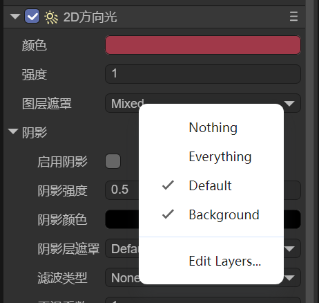

# 2D灯光与网格

> Author: Charley

2D灯光在游戏效果的制作中具有非常重要的价值，它不仅能通过不同的灯光颜色、强度和形态来营造场景氛围，增强画面层次感，丰富视觉效果。还具有增强游戏的沉浸感，引导玩家注意力、突出重要元素等作用。合理运用2D灯光，能有效提升游戏的整体品质和玩家体验。

在LayaAir3.3版本开始，我们支持了2D灯光，例如：2D方向光（DirectionLight2D）、2D精灵光（SpriteLight2D）、2D自由形态光（FreeformLight2D）、2D聚光灯（SpotLight2D）这几个组件。本章节我们具体介绍如何使用灯光，以及这些灯光组件的基类共同属性。

## 一、灯光与网格的关系

2D灯光必须作用于2D网格才能产生效果。要启用灯光效果，需要在目标精灵节点上添加2D网格渲染器（Mesh2DRender）组件，并勾选"接受光照"选项，这样该节点就能接收光照了。如图1-1所示。

 

（图1-1）

当网格渲染器组件启用接受光照后，在没有光源的情况下，物体会呈现黑色状态，这与现实世界中没有光照时物体不可见的原理相同。

添加任意类型的光源都可以照亮这些黑色区域，不同类型的光源会产生不同的照明效果。例如，**方向光**会从特定方向提供全局照明，而**聚光灯**则产生局部范围的照明效果。效果如图1-2所示。

 

(图1-2)

## 二、灯光组件的通用属性

在前文中我们提到了四种灯光组件，它们都继承自BaseLight2D基类。在介绍各个灯光组件的特有属性之前，我们先来了解这些通用属性。

### 2.1 灯光颜色（Color）

灯光颜色决定了光照的显示颜色，设置什么颜色，光源就会发出相应颜色的光。

### 2.2 灯光强度（Intensity）

灯光强度用于控制光照的亮度。如动图2-1所示，intensity值越大，光照亮度越高。

 

（动图2-1）

### 2.3 图层遮罩（Layer Mask）

每个网格渲染器都拥有一个渲染层属性。通过设置灯光的图层遮罩，可以指定该光源影响哪些渲染层。如图2-2所示，可以通过多选来设置受影响的层。

 

（图2-2）

### 2.4 阴影

虽然阴影是灯光的通用属性，但它主要与光遮挡器配合使用，如需了解阴影的内容，请跳转到另一篇文档[《2D光遮挡器与阴影》](../LightOccluder2D/readme.md)

## 三、进阶使用

### 3.1 图层遮罩的代码应用

在引擎中，灯光对网格层的照射判断是基于`按位与`运算实现的。

例如，`2 & 4`为0，不可照亮。`3 & 1` 非0，可以照亮。

#### 3.1.1 照亮指定层

LayaAir3-IDE默认提供一个Default层（值为0），假设我们新建一个Background层（值为1），要让灯光同时照亮这两个层，可以通过以下方式实现：

1. 使用左移位运算获取各层的2次幂值
2. 通过按位或运算组合这些值 
3. 将结果赋值给图层遮罩属性

示例代码如下：

```typescript
const { regClass, property } = Laya;

@regClass()
export class lightTest extends Laya.Script {
    declare owner: Laya.Sprite;

    @property({ type: Laya.Sprite })
    light1: Laya.Sprite;

    @property({ type: Laya.Sprite })
    mesh1: Laya.Sprite;

    @property({ type: Laya.Sprite })
    mesh2: Laya.Sprite;

    private light1Render: Laya.FreeformLight2D;
    private mesh1Render: Laya.Mesh2DRender;
    private mesh2Render: Laya.Mesh2DRender;


    //组件被激活后执行，此时所有节点和组件均已创建完毕，此方法只执行一次
    onAwake(): void {
        this.light1Render = this.light1.getComponent(Laya.FreeformLight2D);
        this.mesh1Render = this.mesh1.getComponent(Laya.Mesh2DRender);
        this.mesh2Render = this.mesh2.getComponent(Laya.Mesh2DRender);

        //设置mesh1位于0层（Default层）
        this.mesh1Render.layer = 0;
        //设置mesh2位于1层（自定义的第一个层）
        this.mesh2Render.layer = 1;
        //让光的遮罩与指定的0和1层发生交互，只照亮0和1层
        this.light1Render.layerMask = 1 << 0 | 1 << 1;
    }
}
```

#### 3.1.2 照亮所有层

假如，我们不止这两层，想通过代码让该灯光照亮所有的层，示例如下：

```typescript
//基于前文示例代码，仅修改layerMask即可  
//-1可以让灯光照亮所有层
this.light1Render.layerMask = -1;
```

#### 3.1.3  排除指定层

如果我们想更灵活一些，在所有层都照亮的情况下，排除掉1层和2层，示例如下：

```typescript
//基于前文示例代码，仅修改layerMask即可  
//排除某些层之外(例如排除1层和2层)，可以照亮其它所有的层
this.light1Render.layerMask = -1 ^ (1 << 1) ^ (1 << 2);
```

### 3.2 昼夜循环光照的示例

通过代码的控制，可以让灯光的属性变化的更为丰富。

以下代码，基于灯光颜色与强度，实现了一个简单的昼夜循环光照变化效果：

```typescript
const { regClass } = Laya;

@regClass()
export class DayNightSystem extends Laya.Script {
    declare owner: Laya.Sprite;

    private lightComp: Laya.DirectionLight2D;
    private dayTime: number = 0;
    private dayDuration: number = 16; // 一个昼夜光照完整变化周期的秒数

    onAwake(): void {
        this.lightComp = this.owner.getComponent(Laya.DirectionLight2D);
    }

    onUpdate(): void {
        // 更新时间
        this.dayTime = (this.dayTime + Laya.timer.delta / 1000) % this.dayDuration;

        // 计算当前时间的光照强度和颜色
        const timeProgress = this.dayTime / this.dayDuration;
        this.updateLightByTime(timeProgress);
    }

    private updateLightByTime(progress: number): void {
        // 调整光照强度和颜色
        const color = this.lightComp.color;

        if (progress < 0.25) { // 凌晨到早上
            // 从深蓝色渐变到白色
            const t = progress * 4; // 0-1的过渡
            const r = 0.2 + t * 0.8;  // 0.2-1.0
            const g = 0.2 + t * 0.8;  // 0.2-1.0
            const b = 0.3 + t * 0.7;  // 0.3-1.0
            color.setValue(r, g, b, 1);
            this.lightComp.intensity = 0.3 + t * 0.7; // 0.3-1.0
        }
        else if (progress < 0.5) { // 早上到中午
            // 保持明亮的白色
            color.setValue(1, 1, 1, 1);
            this.lightComp.intensity = 1.0;
        }
        else if (progress < 0.75) { // 下午到傍晚
            // 从白色渐变到深蓝色
            const t = (progress - 0.5) * 4; // 0-1的过渡
            const r = 1.0 - t * 0.8;  // 1.0-0.2
            const g = 1.0 - t * 0.8;  // 1.0-0.2
            const b = 1.0 - t * 0.7;  // 1.0-0.3
            color.setValue(r, g, b, 1);
            this.lightComp.intensity = 1.0 - t * 0.7; // 1.0-0.3
        }
        else { // 夜晚
            // 保持深蓝色的夜晚
            color.setValue(0.2, 0.2, 0.3, 1);
            this.lightComp.intensity = 0.3;
        }

        this.lightComp.color = color;
    }
}
```

开发者可以直接将上面的脚本，添加到2D方向光的节点上，然后体验效果，或者修改代码进一步丰富效果。 

## 四、灯光组件的使用

通用的灯光介绍就到这里，其它的2D灯光组件应用文档，请点击链接跳转查看。

### [2D方向光](../DirectionLight2D/readme.md)

### [2D精灵光](../SpriteLight2D/readme.md)

### [2D自由形态光](../FreeformLight2D/readme.md)

### [2D聚光灯](../SpotLight2D/readme.md)
