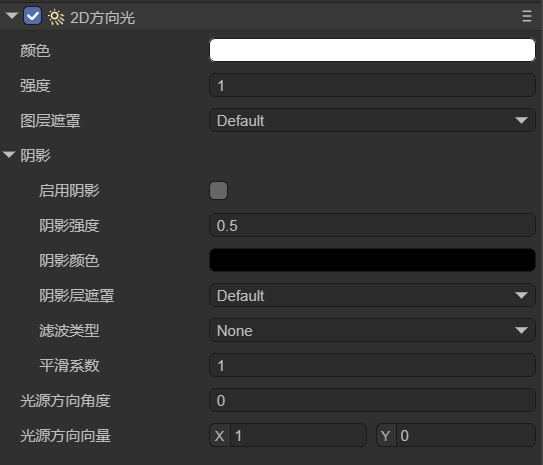
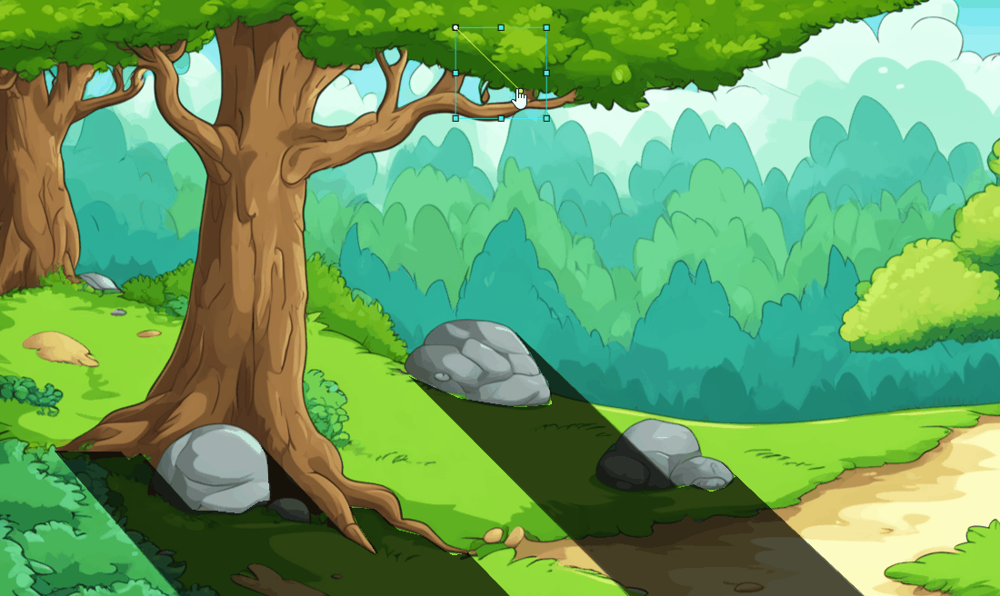

# 2D方向光

> Author: Charley、孟星煜

在阅读本文档前，请先阅读2D灯光的基类文档[《2D灯光与网格》](../BaseLight2D/readme.md)。

2D方向光（DirectionLight2D）在游戏开发中用于模拟来自特定方向的平行光源，常用于表现阳光或月光等大范围均匀照射的光线效果。它能够为场景中的物体提供统一的光照方向和阴影效果，增强画面的立体感和层次感，同时支持动态变化来表现时间流逝或天气变化。相比点光源和聚光灯，方向光的光照范围无限大，更适合用于全局光照需求的场景，如开放世界、森林、沙漠等环境，提升整体画面氛围和视觉表现力。

## 一、方向光组件的添加

### 1.1 通过组件列表添加

如动图1-1所示，在属性设置面板中，点击“增加组件”，选择“2D灯光->2D方向光”，即可添加方向光组件。

 

（动图1-1）

### 1.2 通过层级面板添加

如动图1-2所示，在层级面板中，添加2D灯光节点。

 

（动图1-2）


## 二、方向光的光源方向

方向光有一个特有的属性，那就是光源的方向。这个特性属性有两种表示方式，可以用角度表示，也可以用向量表示，其实是都是定义的光源方向。如图2-1所示。

 

(图2-1)

| 属性名          | 属性中文名称 | 属性说明                                                     |
| --------------- | ------------ | ------------------------------------------------------------ |
| directionAngle  | 光源方向角度 | 基于角度值设置光照方向，对阴影产生影响。当设置新的角度值时，会自动更新光源方向向量。 |
| directionVector | 光源方向向量 | 基于二维向量，精确设置光照方向，对阴影产生影响。当设置新的向量时，会自动更新光源方向角度。 |

光源方向角度和光源方向向量始终保持同步，“光源方向角度”更适合用于直观的角度控制，“光源方向向量”更适合用于数学计算和方向判断。

光源的方向，从作用与效果上。不添加阴影是没有意义的。我们添加阴影可以查看光源方向变化对阴影的影响，如动图2-2所示，



（动图2-2）

## 三、代码使用

当我们创建了接受方向光的网格背景后，并且创建了方向光的节点。

我们可以为这个方向光的节点添加脚本，通过脚本的控制实现光照的动态逻辑。

例如，通过控制方向光的颜色强度属性，就可以实现一个简单的昼夜更替效果。

示例代码如下：

```typescript
const { regClass } = Laya;

@regClass()
export class DayNight extends Laya.Script {
    declare owner: Laya.Sprite;

    private lightComp: Laya.DirectionLight2D;
    private dayTime: number = 0;
    private dayDuration: number = 24; // 一个完整周期的秒数

    private displayText: Laya.Text; // 文本显示当前时间

    onAwake(): void {
        this.lightComp = this.owner.getComponent(Laya.DirectionLight2D);

        // 初始化文本组件
        this.displayText = new Laya.Text();
        this.displayText.color = "#ffffff";
        this.displayText.font = "Arial";
        this.displayText.fontSize = 24;
        this.displayText.bold = true;
        this.displayText.x = 10; // 例如，设置在屏幕左上角
        this.displayText.y = 10;
        this.owner.scene.addChild(this.displayText); // 在场景中添加文本显示
    }

    onUpdate(): void {
        // 更新时间
        this.dayTime = (this.dayTime + Laya.timer.delta / 1000) % this.dayDuration;
        const totalMinutes = Math.floor((this.getAdjustedProgress()) * 24 * 60);
        const hours = Math.floor(totalMinutes / 60);
        const minutes = totalMinutes % 60;
        const timeString = `${this.padNumber(hours)}:${this.padNumber(minutes)}`;
        // 更新文本显示
        this.displayText.text = `时间: ${timeString}`;

        // 计算当前时间的光照强度
        const timeProgress = this.dayTime / this.dayDuration;
        this.updateLightByTime(timeProgress);
    }
    private padNumber(num: number): string {
        return num < 10 ? `0${num}` : `${num}`;
    }
    private getAdjustedProgress(): number {
        return (this.dayTime) % this.dayDuration / this.dayDuration;
    }
    private updateLightByTime(progress: number): void {
        let intensity = 0;
        if (progress < 0.125) {
            intensity = 0.2;
        } else if (progress < 0.375) {
            const t = (progress - 0.125) / 0.25;
            intensity = 0.2 + t * 0.8;
        } else if (progress < 0.708) {
            intensity = 1.0;
        } else if (progress < 0.833) {
            const t = (progress - 0.708) / 0.125;
            intensity = 1.0 - t * 0.8;
        } else {
            intensity = 0.2;
        }
        this.lightComp.intensity = intensity;
    }
}
```

示例中的变暗效果如动图3-1所示，

 

（动图3-1）


