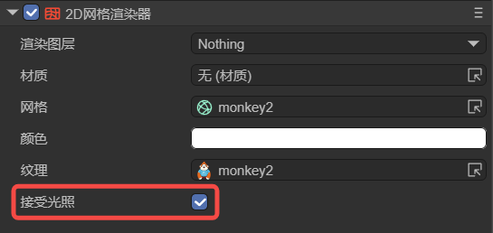
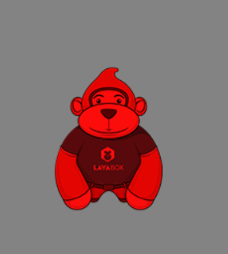
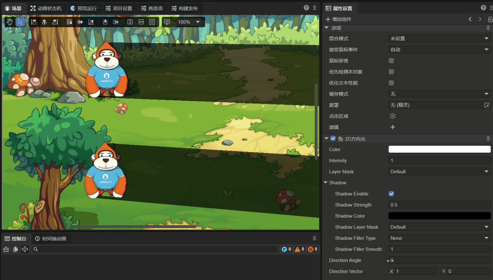
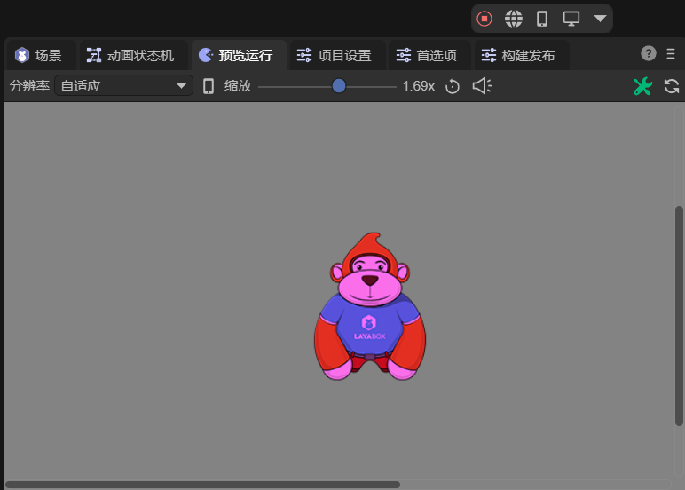

# 2D方向光

在查看本文档前，请先阅读2D灯光[通用属性](../BaseLight2D/readme.md)的文档。

## 一、简介

2D方向光（DirectionLight2D）是全局光，可以用来创建全局照明效果，能够照亮场景中所有的可受光组件。适用于需要模拟平行光源（太阳光、月光等）的场景。

这类灯光可以实现动态的日夜循环效果、产生统一的阴影效果、模拟室外光照环境、增强游戏场景的氛围和视觉效果等。


## 二、在LayaAir-IDE中使用

在LayaAir-IDE中，创建一个sprite，在sprite上添加2D方向光组件，如图2-1所示。


（图2-1）

场景中有灯光，还需要具有可受光的物体，再创建一个节点，添加“2D网格渲染器”组件，勾选其属性，如图2-2所示，



（图2-2）

这样这个2D网格就可以接收到光照了，效果如图2-3所示，



（图2-3）

这个组件的特有属性有两个：

`光源方向角度`：灯光的角度，以度为单位，取值范围是 0-360 度，角度为 0 时指向右方（ X 轴正向）。当设置新的角度值时，会自动更新光源方向向量（directionVector）。

`光源方向向量`：灯光的方向向量（始终是单位向量，长度为 1），默认指向右方（ X 轴正向）。当设置新的向量时，会自动归一化并更新光源方向角度（directionAngle）。

光源方向角度和光源方向向量始终保持同步，“光源方向角度”更适合用于直观的角度控制，“光源方向向量”更适合用于数学计算和方向判断。

从效果上看，需要添加阴影才能看出方向光的变化，如动图2-4所示，



（动图2-4）


## 三、通过代码使用

在LayaAir-IDE中新建一个脚本，添加到Scene2D节点后，加入下述代码，实现一个2D方向光的效果：

```typescript
const { regClass, property } = Laya;

@regClass()
export class DirectLight extends Laya.Script {

    private layaMonkey: Laya.Sprite = new Laya.Sprite();
    private directLight: Laya.Sprite = new Laya.Sprite();

    private meshResource: string = "resources/monkey2.lm";
    private textureResource: string = "resources/monkey2.png";

    //组件被启用后执行，例如节点被添加到舞台后
    onEnable(): void {
        Laya.loader.load([this.meshResource, this.textureResource]).then(() => {
            this.createDirectLight();
            this.createMonkey();
        });
    }

    // 创建方向光
    createDirectLight(): void {
        this.owner.addChild(this.directLight);
        let directLightComponent = this.directLight.addComponent(Laya.DirectionLight2D);
        directLightComponent.color = new Laya.Color(1, 0.812, 1);
        directLightComponent.intensity = 1.0;
    }

    // 创建可接收光照的2D网格
    createMonkey(): void {
        this.layaMonkey.pos(300, 300);
        this.owner.addChild(this.layaMonkey);
        // 添加Mesh2DRender组件
        let mesh2DComponent = this.layaMonkey.addComponent(Laya.Mesh2DRender);
        mesh2DComponent.lightReceive = true;
        let mesh2Dres: Laya.Mesh2D = Laya.Loader.getRes(this.meshResource);
        mesh2DComponent.sharedMesh = mesh2Dres;
        let tex: Laya.BaseTexture = Laya.Loader.getRes(this.textureResource);
        mesh2DComponent.texture = tex;
    }
}
```

最终的效果如图3-1所示，



（图3-1）


