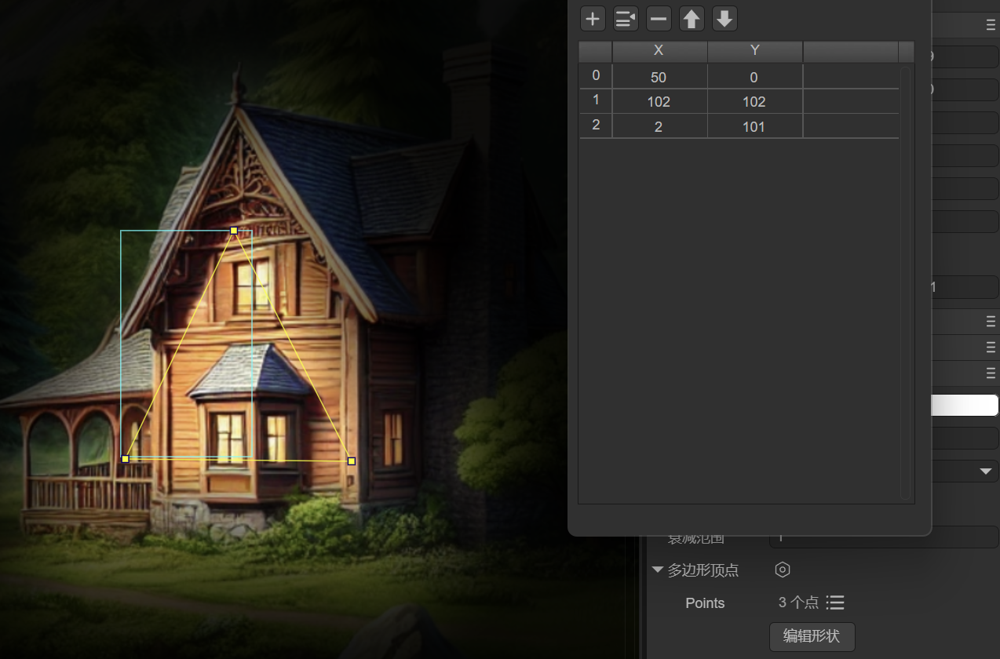
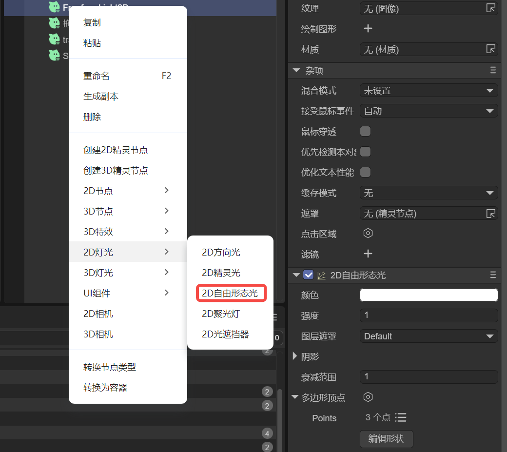
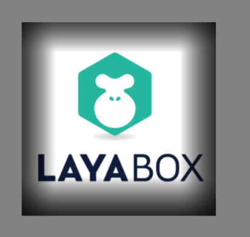
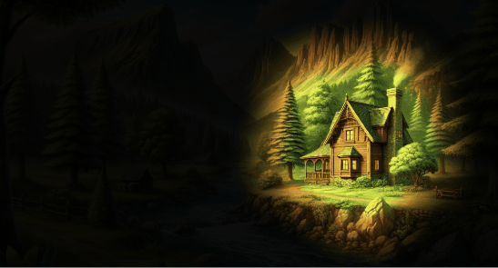

# 2D自由形态光

> Author: Charley

 本篇文档仅介绍自由形态光的特有属性，灯光的通用属性介绍在灯光基类文档中，如未阅读，请点击此处查看：[<<2D灯光与网格>>](../BaseLight2D/readme.md)。

## 一、应用场景

**2D自由形态光（FreeformLight2D）** 是一种支持自定义光源形状的2D灯光类型。通过设置多个顶点位置，开发者可以自由定义光源的几何形态，从而实现非规则的光照效果，如图1-1所示。这种灯光类型非常适合表现复杂或不规则的光影场景，提供了极大的灵活性和创作空间。

 

（图1-1）

例如以下应用场景：

### 1.1 **非规则光源**

适用于模拟非标准形状的光源，如裂缝中透出的光线、不规则的光芒等。

### 1.2 **动态光影效果**

在需要动态调整光源形状的场景中，自由形态光可以通过修改顶点实时生成变化的光影效果，例如模拟水波的光影变化或动态的魔法阵光芒。

### 1.3 **场景氛围渲染**

用于增强场景氛围，如模拟树叶间隙投射的斑驳光影、复杂窗格透射的光线等，增加环境的沉浸感和细节表现。


## 二、在LayaAir-IDE中使用

### 2.1 添加自由形态光

2D自由形态光可以直接在层面板中右键添加，“2D灯光” -> "2D自由形态光"，如图2-1所示。

  

（图2-1）

除了层级面板的添加，也可以先创建一个节点，然后从组件列表上，找到“2D灯光” -> “2D自由形态光”，为节点直接添加该组件。

### 2.2 多边形顶点

除了通用的灯光属性外，2D自由形态光有两个特有的属性，其一是“多边形顶点”，通过该属性，用户可以自由控制灯光的形态。

添加自由形态光的组件后，IDE默认设置了一个矩形灯光形状，开发者可以通过顶点数据列表按钮查看和编辑顶点。如图2-2所示：

 

（图2-2）

矩形灯光的效果如图2-3所示。

  

（图2-3）

除了在顶点列表中修改顶点数据外，我们还可以点击“编辑形状”按钮，进行可视化的顶点形状编辑。如动图2-4所示，

 

（动图2-4）

在编辑模式时，可以**拖拽黄色顶点方块**改变顶点位置，按住**键盘Ctrl+鼠标左键**点击线段，可以增加顶点。按住键盘Alt+鼠标左键点击顶点可以将其删除。

编辑完成后点击空白区域，就会退出编辑模式。

### 2.3  衰减范围

衰减范围用于控制光线从中心向外逐渐减弱直至完全消失的距离，值越小光线衰减得越快，光照范围越小，适合局部光源效果；值越大光线衰减得越慢，光照范围越大，适合覆盖更大区域的场景。取值范围为0-10。效果如动图2-5所示。

 

(动图2-5)


## 三、通过代码使用

如果我们需要通过代码动态添加顶点和设置衰减范围，甚至是使用引擎灯光基类中的API，我们也准备了一个脚本示例供大家参照。

示例代码如下：

```typescript
const { regClass } = Laya;
@regClass()
export class LightEffectDemo extends Laya.Script {
    declare owner: Laya.Sprite;

    private lightComp: Laya.FreeformLight2D;
    private rotateSpeed: number = 2;  // 增加旋转速度
    private scaleTime: number = 0;
    private scaleSpeed: number = 3;   // 增加缩放速度
    private intensity: number = 1.8;  // 定义灯光强度

    onAwake(): void {
        // 获取 FreeformLight2D 组件
        this.lightComp = this.owner.getComponent(Laya.FreeformLight2D);

        //灯光的顶点通常建议是在IDE中可视化配置，这里是为了演示如何通过代码动态设置顶点数据，方便动态调整灯光形状的需求。
        /**设置自由光的顶点数据，形成美观的多边形形态**/
        const polygon = new Laya.PolygonPoint2D();
        polygon.addPoint(0, -150);    // 上
        polygon.addPoint(20, -30);    // 上右内侧
        polygon.addPoint(150, -30);   // 右上
        polygon.addPoint(30, 10);     // 右上内侧
        polygon.addPoint(100, 150);   // 右下
        polygon.addPoint(10, 30);     // 下内侧
        polygon.addPoint(-100, 150);  // 左下
        polygon.addPoint(-30, 10);    // 左下内侧
        polygon.addPoint(-150, -30);  // 左上
        polygon.addPoint(-20, -30);   // 左上内侧
        this.lightComp.polygonPoint = polygon;

        // 增加灯光强度和设置灯光颜色
        this.lightComp.falloffRange = 3;       // 增大衰减范围
        this.lightComp.color = new Laya.Color(1.0, 0.9, 0.6, 1);  // 设置灯光颜色
        this.lightComp.intensity = this.intensity; // 应用灯光强度
    }

    onUpdate(): void {
        // 实现灯光旋转动画
        this.lightComp.lightRotation += this.rotateSpeed * Laya.timer.delta / 1000;
        // 实现灯光缩放动画
        this.scaleTime += Laya.timer.delta / 1000 * this.scaleSpeed;
        const scale = 1 + Math.sin(this.scaleTime) * 0.5;  // 增加缩放变化幅度
        this.lightComp.lightScale.setValue(scale, scale);
    }
}
```

运行的效果如动图3-1所示，

 

（动图3-1）


