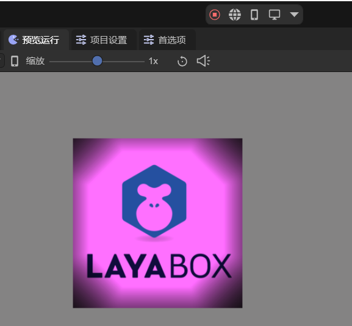

# 2D自由形态光

在查看本文档前，请先阅读2D灯光[通用属性](../BaseLight2D/readme.md)的文档。

## 一、简介

2D自由形态光（FreeformLight2D）允许开发者创建任意多边形形状的2D灯光，支持通过顶点数组定义灯光的形状轮廓。可以设置灯光的衰减范围和渐变效果，使光照效果更加自然。

自由形态光可以用于在游戏场景中创建自定义形状的光源，从而实现特殊的光照效果和氛围。还可用于制作复杂的光影效果，适合需要不规则形状光源的场景。


## 二、在LayaAir-IDE中使用

在LayaAir-IDE中，创建一个sprite，在sprite上添加2D自由形态光组件，如图2-1所示。


（图2-1）

一个2D网格渲染器接收的自由形态光的效果如图2-2所示，


（图2-2）

2D自由形态光组件有两个特有属性：

`多边形顶点`：用于定义灯光的形状，默认是一个200x200的矩形光源。LayaAir-IDE提供了两种编辑顶点的方法，

第一种是点击顶点列表，输入顶点坐标进行编辑（按顺时针顺序），如图2-3所示，


（图2-3）

第二种是点击“编辑形状”按钮，如动图2-4所示，点击后进入编辑模式。将鼠标放在顶点上可以拖拽改变顶点位置，按住键盘Ctrl+鼠标左键点击可以增加顶点，按住键盘Alt+鼠标左键点击顶点可以将其删除。编辑完成后点击空白区域，就会退出编辑模式。


（动图2-4）

`衰减范围`：控制灯光的扩展范围，即光照区域的大小，取值范围为0-10。如果使用较小的值，光照边缘的扩展范围较小，光照范围接近多边形本身的大小，光照效果更加集中。如果使用较大的值，光照边缘向外扩展更多，光照范围大于多边形本身，光照效果覆盖更大的区域。


## 三、通过代码使用

在LayaAir-IDE中新建一个脚本，添加到Scene2D节点后，加入下述代码，实现一个2D自由形态光的效果：

```typescript
const { regClass, property } = Laya;

@regClass()
export class FreeformLight extends Laya.Script {

    private layaImg: Laya.Sprite = new Laya.Sprite();
    private freeformLight: Laya.Sprite = new Laya.Sprite();

    private meshResource: string = "resources/layabox.lm";
    private textureResource: string = "resources/layabox.png";

    //组件被启用后执行，例如节点被添加到舞台后
    onEnable(): void {
        Laya.loader.load([this.meshResource, this.textureResource]).then(() => {
            this.createFreeformLight();
            this.createLayaImg();
        });
    }

    // 创建聚光灯
    createFreeformLight(): void {
        this.freeformLight.pos(341, 177);
        this.owner.addChild(this.freeformLight);
        let freeformLightComponent = this.freeformLight.addComponent(Laya.FreeformLight2D);
        freeformLightComponent.color = new Laya.Color(1, 0.812, 1);
        freeformLightComponent.intensity = 1.0;
        freeformLightComponent.falloffRange = 1.0;

        let poly: Laya.PolygonPoint2D = new Laya.PolygonPoint2D();
        // 添加多个顶点创建不规则形状（顺时针）
        poly.addPoint(-50, -100);
        poly.addPoint(50, -100);
        poly.addPoint(100, -50);
        poly.addPoint(100, 50);
        poly.addPoint(50, 100);
        poly.addPoint(-50, 100);
        poly.addPoint(-100, 50);
        poly.addPoint(-100, -50);
        freeformLightComponent.polygonPoint = poly;
    }

    // 创建可接收光照的2D网格
    createLayaImg(): void {
        this.layaImg.pos(300, 100);
        this.owner.addChild(this.layaImg);
        // 添加Mesh2DRender组件
        let mesh2DComponent = this.layaImg.addComponent(Laya.Mesh2DRender);
        mesh2DComponent.lightReceive = true;
        let mesh2Dres: Laya.Mesh2D = Laya.Loader.getRes(this.meshResource);
        mesh2DComponent.sharedMesh = mesh2Dres;
        let tex: Laya.BaseTexture = Laya.Loader.getRes(this.textureResource);
        mesh2DComponent.texture = tex;
    }
}
```

最终的效果如图3-1所示，



（图3-1）


