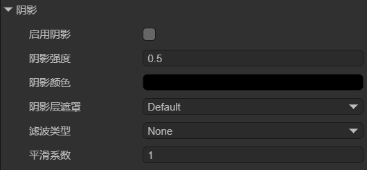
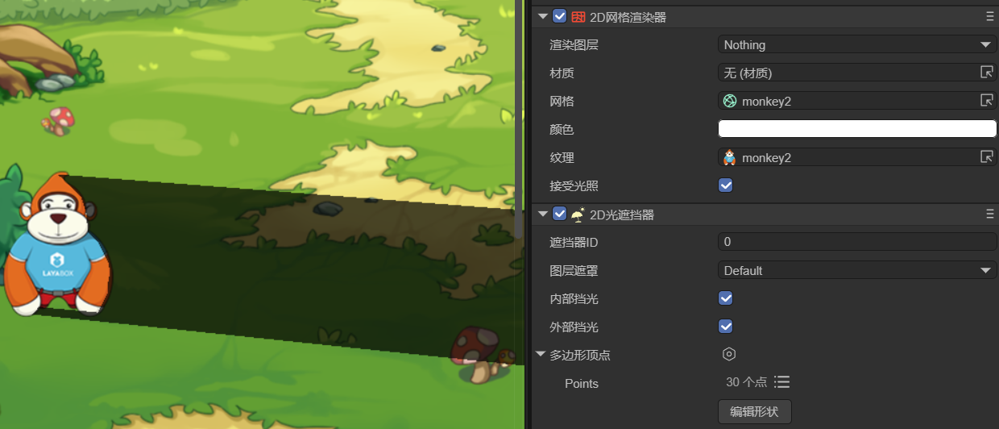
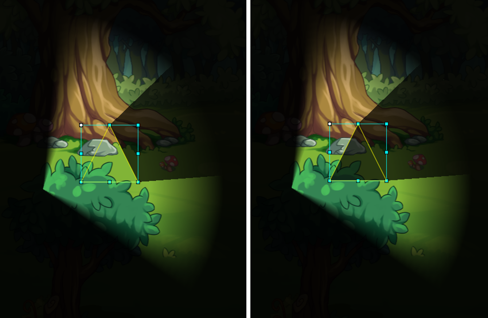

# 2D光遮挡器

在查看本文档前，请先阅读2D灯光[通用属性](../BaseLight2D/readme.md)文档的阴影介绍。

## 一、简介

2D光遮挡器（LightOccluder2D）用于在2D场景中创建光线遮挡效果。它可以定义任意多边形区域来阻挡光线的传播，从而产生阴影效果。

在游戏开发中，2D光遮挡器通过多边形顶点定义遮挡区域，自动计算光线与遮挡器的相交情况，能够处理复杂的光线投射和遮挡计算，可以用来模拟墙壁、物体等对光线的遮挡。


## 二、在LayaAir-IDE中使用

在LayaAir-IDE中使用2D光遮挡器，首先需要添加[2D灯光](../BaseLight2D/readme.md)（方向光、精灵光、自由形态光、聚光灯）并勾选“启用阴影”，如图2-1所示，才能显示出效果，



（图2-1）

阴影的相关属性解释如下：

| 中文属性名 | 英文属性名         | 解释                                                         |
| ---------- | ------------------ | ------------------------------------------------------------ |
| 启用阴影   | ShadowEnable       | 控制是否开启阴影效果。                                       |
| 阴影强度   | ShadowStrength     | 控制阴影的强度。值越大，阴影越深。                           |
| 阴影颜色   | ShadowColor        | 设置阴影的颜色。                                             |
| 阴影层遮罩 | ShadowLayerMask    | 控制哪些层会产生阴影。<br />关于层的影响，开发者需要注意，阴影的显示需要设置两个组件的层级，<br />一是各种灯光的layerMask，另一个是2D光遮挡器的layerMask，因为阴影由这两个组件共同作用。 |
| 滤波类型   | ShadowFilterType   | 采样数越多，阴影边缘越平滑，但性能消耗越大。<br />None：没有滤波处理，阴影边缘是完全锐利的。计算效率最高，但视觉效果最差，适合性能敏感的场景<br />PCF5：使用5 个采样点 进行模糊处理。阴影边缘有一定的平滑效果，但模糊程度有限，适合中等模糊需求的场景。计算开销较低，平衡性能和质量。<br />PCF9：使用9个采样点进行模糊处理。阴影边缘有更强的平滑效果，适合高质量光影的场景。计算开销适中视觉效果明显提升。。<br />PCF13：使用 13 个采样点进行模糊处理，是最高质量的模糊算法之一。阴影边缘非常柔和，适合对视觉质量要求极高的场景。计算开销较高，但效果非常细腻。 |
| 平滑系数   | ShadowFilterSmooth | 控制阴影边缘的模糊程度。值越大，阴影边缘越模糊。             |

然后在节点上添加2D光遮挡器组件，如图2-2所示，这样该节点就有遮光效果了。


（图2-2）

如图2-3所示，是一个添加了光遮挡器的节点，在方向光的照射下，产生阴影的效果。



（图2-3）

`图层遮罩`：用于控制光遮挡器影响哪些层，需要结合2D灯光的“图层遮罩”和阴影的“阴影层遮罩”设置，即阴影的显示关于层有两个要求，一是灯光的“图层遮罩”，保证该层物体能够收到光照影响，另一个是阴影属性中的“阴影层遮罩”，保证阴影能够在该层显示。

> 图层遮罩通过位运算的方式进行设置，设置方式与[通用属性](../BaseLight2D/readme.md)中给出的方法相同。


`内部挡光`：当光源位于光遮挡器内部时，是否产生遮挡效果。勾选后，光源在光遮挡器内部时也会产生遮挡，如图2-4（左）所示；如果不勾选，光源在光遮挡器内部时不会产生遮光效果，如图2-4（右）所示。（图2-4中，小正方形为2D自由形态光，大三角形为2D光遮挡器）


（图2-4）


`外部挡光`：控制是否只有光遮挡器的外轮廓产生遮挡效果。勾选后，只有外轮廓产生遮挡，如图2-5（左）；如果不勾选，整个光遮挡器区域都产生遮挡，如图2-5（右）。（图2-5中的三角形区域是2D光遮挡器）



（图2-5）


`多边形顶点`：用于定义光遮挡器的形状，通过添加多个顶点构建多边形。LayaAir-IDE提供了两种编辑顶点的方法，

第一种是点击顶点列表，输入顶点坐标进行编辑（按顺时针顺序），如图2-6所示，


（图2-6）

第二种是点击“编辑形状”按钮，如动图2-7所示，点击后进入编辑模式。将鼠标放在顶点上可以拖拽改变顶点位置，按住键盘Ctrl+鼠标左键点击可以增加顶点，按住键盘Alt+鼠标左键点击顶点可以将其删除。编辑完成后点击空白区域，就会退出编辑模式。


（动图2-7）


## 三、通过代码使用

在LayaAir-IDE中新建一个脚本，添加到Scene2D节点后，加入下述代码，实现一个光遮挡器的效果：

```typescript
const { regClass, property } = Laya;

@regClass()
export class LightOccluder extends Laya.Script {

    private spotLight: Laya.Sprite = new Laya.Sprite();
    private background: Laya.Sprite = new Laya.Sprite();
    private lightOccluder: Laya.Sprite = new Laya.Sprite();

    private backgroundTexture: string = "resources/bg2.png";

    //组件被启用后执行，例如节点被添加到舞台后
    onEnable(): void {
        Laya.loader.load(this.backgroundTexture).then(() => {
            this.createLightOccluder();
            this.createSpotLight();
            this.createBackground();
        });
    }

    // 创建2D光遮挡器
    createLightOccluder(): void {
        this.lightOccluder.pos(233, 265);
        this.owner.addChild(this.lightOccluder);
        let lightOccluderComponent = this.lightOccluder.addComponent(Laya.LightOccluder2D);
        lightOccluderComponent.canInLight = true;
        lightOccluderComponent.outside = true;
        let poly: Laya.PolygonPoint2D = new Laya.PolygonPoint2D();
        // 添加多个顶点创建不规则形状（顺时针）
        poly.addPoint(-50, -100);
        poly.addPoint(50, -100);
        poly.addPoint(100, -50);
        poly.addPoint(100, 50);
        poly.addPoint(50, 100);
        poly.addPoint(-50, 100);
        poly.addPoint(-100, 50);
        poly.addPoint(-100, -50);
        lightOccluderComponent.polygonPoint = poly;
    }

    // 创建聚光灯
    createSpotLight(): void {
        this.spotLight.pos(50, 350);
        this.spotLight.rotation = 70;
        this.owner.addChild(this.spotLight);
        let spotLightComponent = this.spotLight.addComponent(Laya.SpotLight2D);
        spotLightComponent.color = new Laya.Color(0.937, 1, 0);
        spotLightComponent.intensity = 1.25;
        spotLightComponent.innerRadius = 100;
        spotLightComponent.outerRadius = 500;
        spotLightComponent.innerAngle = 90;
        spotLightComponent.outerAngle = 120;
        // 开启阴影
        spotLightComponent.shadowEnable = true;
    }

    // 创建背景
    createBackground(): void {
        this.owner.addChild(this.background);
        let tex = Laya.loader.getRes("resources/bg2.png");
        let mesh2Drender = this.background.addComponent(Laya.Mesh2DRender);
        mesh2Drender.sharedMesh = this.generateRectVerticesAndUV(1000, 1000);
        mesh2Drender.texture = tex;
        mesh2Drender.lightReceive = true;
    }

    // 生成一个矩形
    private generateRectVerticesAndUV(width: number, height: number): Laya.Mesh2D {
        const vertices = new Float32Array(4 * 5);
        const indices = new Uint16Array(2 * 3);
        let index = 0;
        vertices[index++] = 0;
        vertices[index++] = 0;
        vertices[index++] = 0;
        vertices[index++] = 0;
        vertices[index++] = 0;

        vertices[index++] = width;
        vertices[index++] = 0;
        vertices[index++] = 0;
        vertices[index++] = 1;
        vertices[index++] = 0;

        vertices[index++] = width;
        vertices[index++] = height;
        vertices[index++] = 0;
        vertices[index++] = 1;
        vertices[index++] = 1;

        vertices[index++] = 0;
        vertices[index++] = height;
        vertices[index++] = 0;
        vertices[index++] = 0;
        vertices[index++] = 1;

        index = 0;
        indices[index++] = 0;
        indices[index++] = 1;
        indices[index++] = 3;

        indices[index++] = 1;
        indices[index++] = 2;
        indices[index++] = 3;

        const declaration = Laya.VertexMesh2D.getVertexDeclaration(["POSITION,UV"], false)[0];
        const mesh2D = Laya.Mesh2D.createMesh2DByPrimitive([vertices], [declaration], indices, Laya.IndexFormat.UInt16, [{ length: indices.length, start: 0 }]);
        return mesh2D;
    }
}
```

最终的效果如图3-1所示，


（图3-1）


