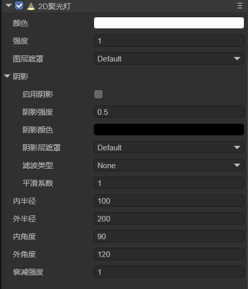
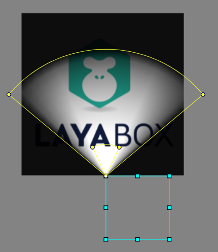
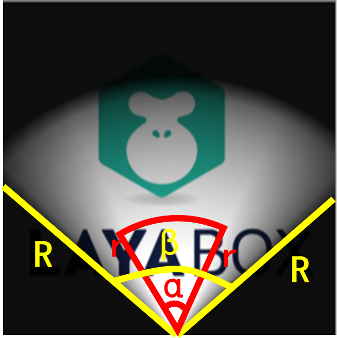

# 2D聚光灯

在查看本文档前，请先阅读2D灯光[通用属性](../BaseLight2D/readme.md)的文档。

## 一、简介

2D聚光灯（SpotLight2D）可以在2D场景中创建一个类似聚光灯的光照效果，能够对选定光源的角度和方向进行精细控制。该组件可以创建扇形区域的光照效果，通过调整内外半径和角度来控制光照范围，支持光照的实时渲染和更新。

在2D游戏中，聚光灯可以实现手电筒、探照灯、舞台灯光等效果，在场景中创建聚光灯照明，营造特殊的光照氛围。


## 二、在LayaAir-IDE中使用

在LayaAir-IDE中，添加一个sprite，然后在sprite上添加一个2D聚光灯组件，如图2-1所示。



（图2-1）

一个2D网格渲染器接收的聚光灯的效果如图2-2所示，



（图2-2）

2D聚光灯的特有属性如下：

`内半径`：内圆半径，在这个半径范围内的光照强度不会衰减。值越大，中心完全明亮的区域越大，但如果设置得太大，则大部分区域都会非常亮。

`外半径`：外圆半径，光照可以达到的最远距离，决定了整个光照的覆盖范围。值越大，光照覆盖的范围越大。

> 光源从内半径到外半径，光强度将逐渐减弱。如果外半径与内半径的差值过小，则过渡区域会很窄。

`内角度`：内扇形角度，在这个角度范围内的光照强度不会衰减。值越大，中心明亮的扇形区域越大。较小的值会创造出更聚焦的光束效果，较大的值会创造出更发散的光照效果。

`外角度`：外扇形角度，光照的最大张角，决定了光照扇形的总体展开角度。值越大，光照扩散的角度越大。

> 光源从内角度到外角度，光强度将逐渐减弱。如果外角度与内角度的差值过小，则边缘过渡较突兀。

`衰减强度`：控制光照强度在过渡区域（内半径到外半径、内角度到外角度）的衰减速度，取值范围为0-10。值越大，光照强度衰减越快，边缘越柔和。值越小，光照强度衰减越慢，过渡更加平缓。

为了更直观的理解，用R表示外半径，r表示内半径，β表示外角度，α表示内角度，各个属性的示意图如下：



（图2-3）

对于聚光灯的属性，有一些限制要求。LayaAir会自动限制这些参数在合理范围内，外半径必须大于等于内半径，外角度必须大于等于内角度。


## 三、通过代码使用

在LayaAir-IDE中新建一个脚本，添加到Scene2D节点后，加入下述代码，实现一个2D聚光灯的效果：

```typescript
const { regClass, property } = Laya;

@regClass()
export class SpotLight extends Laya.Script {

    @property({ type: Laya.Sprite })
    private spotLight: Laya.Sprite;

    //组件被启用后执行，例如节点被添加到舞台后
    onEnable(): void {
        this.setSpotLight();
    }

    // 创建聚光灯
    setSpotLight(): void {
        this.spotLight.pos(336, 280);
        let spotLightComponent = this.spotLight.getComponent(Laya.SpotLight2D);
        spotLightComponent.color = new Laya.Color(1, 0.812, 1);
        spotLightComponent.intensity = 1.0;
        spotLightComponent.innerRadius = 50;
        spotLightComponent.outerRadius = 200;
        spotLightComponent.innerAngle = 50;
        spotLightComponent.outerAngle = 150;
    }
}
```

让此聚光灯照亮一个2D网格，最终的效果如图3-1所示，


（图3-1）


