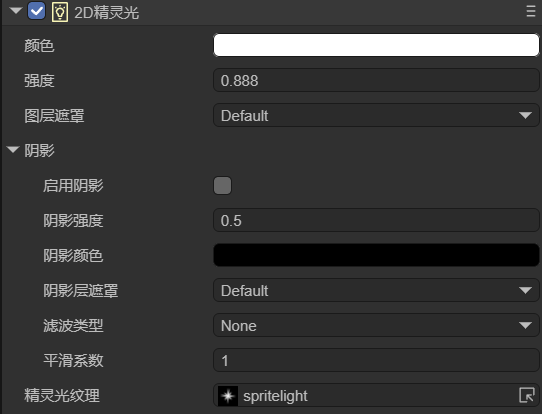

# 2D精灵光

> Author: 孟星煜

在查看本文档前，请先阅读2D灯光[通用属性](../BaseLight2D/readme.md)的文档。

## 一、简介

2D精灵光（SpriteLight2D） 是一种基于精灵纹理的自定义灯光类型。通过将特定纹理分配给精灵光的附加属性，可以生成具有独特形状和外观的光源。这种灯光类型因其灵活性和对视觉效果的高度可控性，在2D游戏开发中得到了广泛应用，尤其适用于需要精准控制光源形状和表现的场景。

该灯光类型可以满足以下需求：

（1）特定的光照效果：

当想要光源的形状和外观与某个纹理完全一致时，比如一个灯笼、火把或者任何其他具有特定形状的光源。

（2）环境细节增强：

在需要增强环境细节和氛围的场景中，比如通过窗户照射进来的光线、水面反射的光斑等，精灵光源可以提供额外的视觉层次。

（3）特效和视觉提示：

在需要通过光源来指示特定事件或状态变化的场景中，比如警报、魔法效果或者健康状态的指示。


## 二、在LayaAir-IDE中使用

在LayaAir-IDE中，添加一个sprite，然后在sprite上添加一个2D精灵光组件，如图2-1所示。

 

（图2-1）

这个灯光组件只有一个`精灵光纹理`属性是特有的，其余属性都是[通用属性](../BaseLight2D/readme.md)。

该属性用于设置精灵贴图，用于定义灯光的形状和外观。这里设置的图片需要在导入后设置为精灵纹理，如图2-2所示。

 

（图2-2）

例如，需要在场景中的某一处通过光源进行提示，如图2-3所示， 

 

（图2-3）

图中具有两个灯光，一个是2D方向光用于全局的照明（这里方向光的强度调低了，为了突出精灵光），另一个就是精灵光，用于场景中某一处的高亮显示。需要注意的是，场景中的背景必须能够接收到光照才有灯光效果。

可以发现，精灵光的好处在于，只需要有图片，就可以指定特定形状的光源。


## 三、通过代码使用

在LayaAir3-IDE中新建一个脚本，添加到Scene2D节点后，加入下述代码，实现一个2D精灵光的效果：

```typescript
const { regClass, property } = Laya;

@regClass()
export class SpriteLight extends Laya.Script {

    @property({type: Laya.Sprite})
    private spriteLight: Laya.Sprite;

    @property({type: Laya.Sprite})
    private directLight: Laya.Sprite;

    @property({type: Laya.Sprite})
    private background: Laya.Sprite;

    //组件被启用后执行，例如节点被添加到舞台后
    onEnable(): void {
        // 加载资源
        Laya.loader.load("resources/spritelight.png", Laya.Loader.IMAGE).then(() => {
            this.setSpriteLight();
            this.setDirectLight();
            this.setBackground();
        });
    }

    // 配置精灵灯光
    setSpriteLight(): void {
        this.spriteLight.pos(100,350);
        let spritelightComponent = this.spriteLight.getComponent(Laya.SpriteLight2D);
        spritelightComponent.color = new Laya.Color(1, 1, 1);
        spritelightComponent.intensity = 0.5;
        let tex = Laya.loader.getRes("resources/spritelight.png");
        spritelightComponent.spriteTexture = tex;
    }

    // 配置方向光
    setDirectLight(): void {
        let directlithtComponent = this.directLight.getComponent(Laya.DirectionLight2D);
        directlithtComponent.color = new Laya.Color(1, 1, 1);
        directlithtComponent.intensity = 0.2;
    }

    // 配置背景
    setBackground(): void {
        let mesh2Drender = this.background.getComponent(Laya.Mesh2DRender);
        mesh2Drender.sharedMesh = this.generateRectVerticesAndUV(1000, 1000);
        mesh2Drender.lightReceive = true;
    }

    // 生成一个矩形
    private generateRectVerticesAndUV(width: number, height: number): Laya.Mesh2D {
        const vertices = new Float32Array(4 * 5);
        const indices = new Uint16Array(2 * 3);
        let index = 0;
        vertices[index++] = 0;
        vertices[index++] = 0;
        vertices[index++] = 0;
        vertices[index++] = 0;
        vertices[index++] = 0;

        vertices[index++] = width;
        vertices[index++] = 0;
        vertices[index++] = 0;
        vertices[index++] = 1;
        vertices[index++] = 0;

        vertices[index++] = width;
        vertices[index++] = height;
        vertices[index++] = 0;
        vertices[index++] = 1;
        vertices[index++] = 1;

        vertices[index++] = 0;
        vertices[index++] = height;
        vertices[index++] = 0;
        vertices[index++] = 0;
        vertices[index++] = 1;

        index = 0;
        indices[index++] = 0;
        indices[index++] = 1;
        indices[index++] = 3;

        indices[index++] = 1;
        indices[index++] = 2;
        indices[index++] = 3;

        const declaration = Laya.VertexMesh2D.getVertexDeclaration(["POSITION,UV"], false)[0];
        const mesh2D = Laya.Mesh2D.createMesh2DByPrimitive([vertices], [declaration], indices, Laya.IndexFormat.UInt16, [{ length: indices.length, start: 0 }]);
        return mesh2D;
    }
}
```

最终的效果如图3-1所示，

 

（图3-1）


