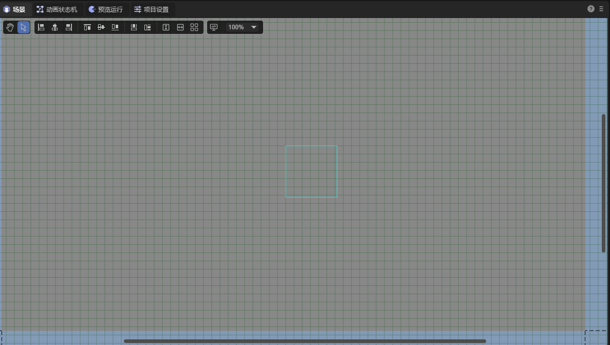
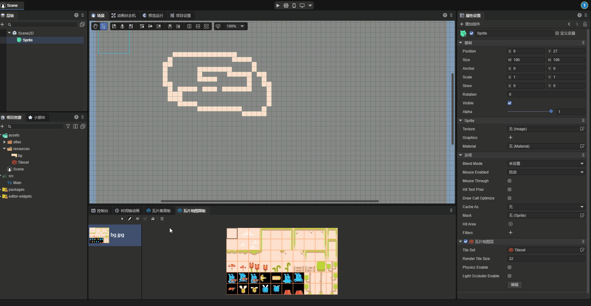
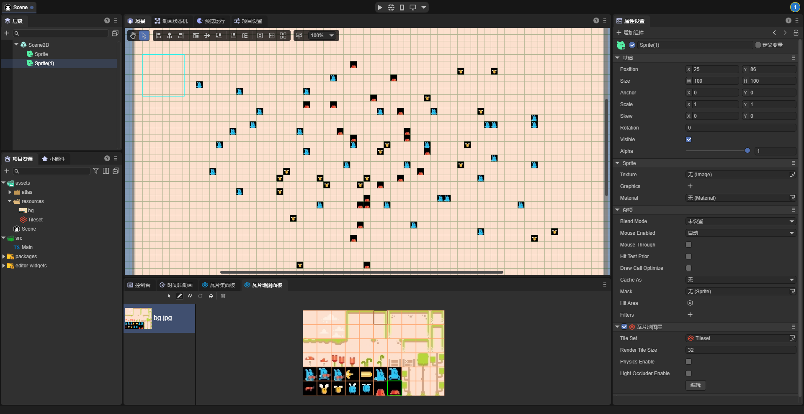

# 瓦片地图层

在使用瓦片地图层组件前，请先阅读[**瓦片地图**](..\..\..\assets\TileSet\readme.md)资源的文档。

## 一、概述

瓦片地图（Tilemap）是用于创建游戏布局的图块网格。在游戏开发中使用瓦片地图有很多优势。首先，瓦片地图可以通过将图块“绘制”到网格上来绘制布局，这比一个接一个地放置单个2D节点要快得多。其次，瓦片地图允许更大的关卡，因为它针对绘制大量图块进行了算法层面的优化。最后，开发者可以为图块添加物理碰撞、光的遮挡等，从而为瓦片地图添加更多功能。

## 二、瓦片地图组件

在制作瓦片地图前，开发者需要先设置好[**瓦片地图的资源**](..\..\..\assets\TileSet\readme.md)，然后在层级面板中加入一个节点，给其添加一个瓦片地图层（TileMapLayer）组件，如图2-1所示，

（图2-1）

`Tile Set`：之前设置好的瓦片集。

`Render Tile Size`：渲染瓦片大小，用于控制瓦片地图中每个瓦片的渲染尺寸，单位为“像素”，默认值为32像素。

`Physics Enable`：是否启用物理系统，用于控制瓦片地图的物理系统是否启用。启用后，瓦片地图会具有物理碰撞等特性。

`Light Occluder Enable`：是否启用光遮挡，用于控制瓦片地图的光遮挡系统是否启用。启用后，瓦片地图可以对2D光照产生遮挡效果。

`编辑`：点击编辑按钮后，场景面板会变为网格状，如图2-2所示，用于编辑瓦片地图。

（图2-2）

## 三、瓦片地图面板

编辑瓦片地图时，需要结合瓦片地图面板进行操作，如图3-1所示，

（图3-1）

绘制：可以在场景中直接绘制瓦片，如动图3-2所示。

（动图3-2）

删除：可以如橡皮擦一样，清楚不需要的瓦片，如动图3-3所示。

（动图3-3）

线条：可以使用选中的瓦片绘制一条直线，如图3-4所示。

（图3-4）

矩形：如图3-5所示，可以使用瓦片框选出一篇矩形区域。

（图3-5）

## 四、多层瓦片地图

有时，开发者需要添加多层瓦片地图，例如，最下面的一层放背景，中间一层放建筑，最上面一层放人物等。要实现多层瓦片地图，需要添加多个节点，一个节点就是一层瓦片地图。

如图4-1所示，在底层用瓦片绘制背景，

（图4-1）

如图4-2所示，在上面一层添加人物。

（图4-2）

