# 2D寻路

## 一、概述

在现代游戏开发中，自动寻路功能已经成为了不可或缺的基础功能之一。无论是角色自动走位、NPC巡逻还是宠物跟随，都需要用到寻路系统。点击场景中的一个位置，角色（Agent）就会自动寻路到达目的地。寻路过程中可能会有很多的障碍物，角色会自动绕过障碍物到达终点。

LayaAir为开发者提供了2D寻路解决方案。自动寻路可以有很多种实现方式。一种比较传统的是使用“A*寻路”算法，很多页游和端游都用到这种技术。在LayaAir中也可以使用这种技术实现寻路，参考[这里](../../../../basics/IDE/importJsLibrary/readme.md)提供的方法即可。

而本篇介绍的是LayaAir中内置的2D寻路系统NavMesh2D。在使用前，首先需要勾选“项目设置”面板下的“导航寻路”模块，如图1-1所示，


（图1-1）

2D寻路系统通过2D导航网格表面（NavMesh2DSurface）和2D导航代理（Nav2DAgent）两个组件实现。2D导航网格表面定义了导航网格，表示角色可以在其中移动的区域。2D导航代理定义了寻路的代理，用于表示寻路的主体对象（角色、NPC、载具等）。


## 二、2D导航网格表面

如图2-1所示，有一个以地形为背景的2D场景。场景中有山脉，湖泊，小路等，

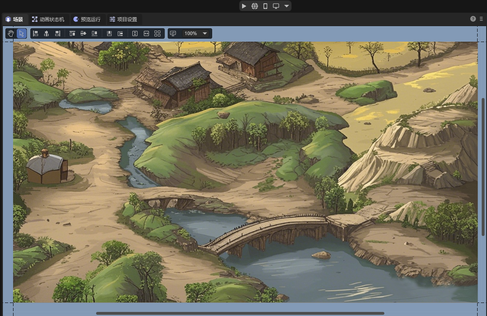

（图2-1）

### 2.1 组件属性

在这个地形背景层级上，添加一个sprite，用于创建导航网格。给sprite添加`2D导航网格表面`组件，如图2-2所示，


（图2-2）

添加后的组件如图2-3所示，


（图2-3）

分别介绍其属性：

#### 2.1.1 代理类型`agentType`

用于指定在该导航表面上寻路的代理类型。在寻路系统中，代理（Agent）是一个抽象的概念，用于表示寻路的主体对象，如游戏中的角色、NPC、载具等。不同类型的代理在寻路时会有不同的特性和限制，如大小、移动方式、可通过的区域类型等。代理类型的作用是让开发者能够根据游戏中不同类型的寻路对象，灵活地设置和调整局部的寻路参数，以满足游戏的需求。

默认值为Humanoid（人形角色），表示适用于人形角色的导航设置，适用于大多数游戏中的人形角色导航。

如图2-4所示，开发者可以通过选择`open Agent Settings`选项，打开配置界面，新增自定义的代理类型。


（图2-4）

Agents的配置页面如图2-5所示，

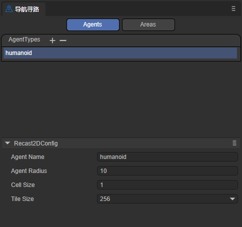

（图2-5）

注意，此页面并不是调节agent本身，而是调节适用该agent的地形。下面介绍其各参数的意义，

`agentName`：导航网格表面适用的Agent类型的名称。此处填写的名称将与代理类型处选项的名称一致，如图2-6所示。


（图2-6）

`agentRadius`：这个值决定了Agent在导航过程中与障碍物之间的最小距离。较大的半径会使Agent与障碍物保持更大的距离。

`cellSize`：导航网格的单元格大小。较小的单元格大小会生成更详细的导航网格，但会增加内存占用和计算成本。

`tileSize`：导航网格的瓦片大小。导航网格可以被划分为多个瓦片，以便在大型场景中更高效地生成和加载导航数据。


#### 2.1.2 区域标记`areaFlag`

用于标记当前静态导航表面的区域类型，如可行走区域、水、障碍物区域等。区域标记可以影响agent在寻路时对不同区域的偏好和避让行为。

如图2-7所示，开发者可以通过点击`open Area Settings`选项，打开配置界面，新增自定义的区域标记类型。

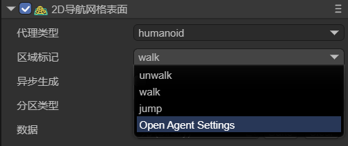

（图2-7）

Areas的配置界面如图2-8所示，


（图2-8）

`name`：区域类型的名称，此处填写的名称将与区域标记处选项的名称一致，如图2-9所示。

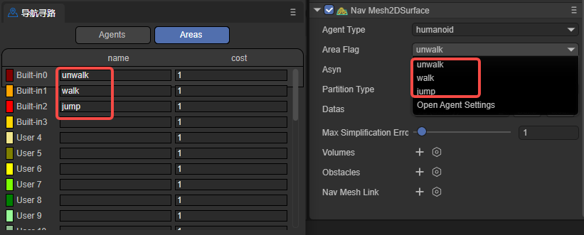

（图2-9）

`cost`：指定agent在导航时穿越该类型表面的相对代价或难度。通常是一个正数，较高的值表示通过该表面的代价更高或更难。例如，可以将水面的Cost设置为5，而普通地面的Cost设置为1，表示相对于普通地面，agent更难穿越水面。

总的来说，通过设置不同的areaFlag，可以控制agent在导航时如何与不同类型的表面进行交互。agent在寻路时会优先选择Cost较低的路径，避开Cost较高的表面。开发者可以根据自己的需求，为不同的表面类型设置适当的areaFlag和Cost值，以影响agent的导航行为。


#### 2.1.3 异步生成`asyn`

表示是否启用异步生成导航的功能。当勾选异步烘焙时，导航网格的生成过程将在后台异步进行，不会阻塞主线程的执行。启用异步生成可以保证在游戏运行的时候，每帧只生成一个tile，提高场景加载和编辑的流畅性。


#### 2.1.4 分区类型`partitionType`

用于指定导航网格的分区方式，如图2-10所示，有Monotone（单调分割）、Watershed（流域分割）和Layer（层次分割）三个选项。


（2-10）

`Monotone`：使用单调多边形分区算法，创建的导航网格区域形状简单，边缘平滑，适合于简单的场景。Monotone分割的导航网格生成速度较快，占用内存相对较少。然而，对于复杂的场景，Monotone分割可能会产生不够精确的导航网格。

`Watershed`：与Monotone分割相比，Watershed分割的导航网格生成速度较慢，占用内存也相对较多，但Watershed分割能够更好地适应复杂的场景，生成的导航网格区域更加精确和自然，适用于对导航网格质量要求较高的场景。

`Layers`：适用于需要对不同区域应用不同寻路规则的场景。


#### 2.1.5 数据`datas`

点击`Bake`按钮后，弹出烘焙面板，如图2-11所示，从层级面板中选择要烘焙的子节点（surface节点上添加了2D导航网格表面组件），拖入到烘焙面板中，按照需要选择节点进行烘焙。

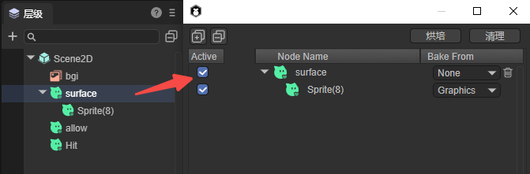

（图2-11）

`Active`：表示该节点是否参与导航网格的生成。当勾选时，该节点的数据会被用于生成导航网格。未勾选时，该节点会被完全忽略。

`Bake From`：

- Graphics是从Sprite的图形数据生成导航网格。例如图2-12所示，


（图2-12）

- Physics是从物理碰撞器数据生成导航网格。例如图2-13所示，


（图2-13）

- MeshRender是从网格数据生成导航网格。例如图2-14所示，


（图2-14）

- None是不使用任何现有数据。

设置好后点击右上角的`烘焙`按钮即可生成导航网格文件，如果需要重新选择节点，点击`清理`即可。

最终烘焙生成的结果（.bin文件）会保存到assets目录下新建的文件夹中（以节点所在的场景命名）。并且，烘焙好的文件会自动添加到datas属性中。

一般来说，烘焙导航网格通常在场景编辑完成后进行，以确保导航网格与最新的场景状态保持一致。如果对场景节点以及子节点的位置进行了移动，或进行了旋转等变化，都需要重新烘培节点数据（不可存在预制体中，如果在预制体中拖入场景须重新烘培数据）。因为烘焙出的导航网格并不会跟随场景动态改变。开发者可以先点击`clear`按钮清除原有的datas数据，然后再重新烘焙。


#### 2.1.6 最大简化误差`maxSimplificationError`

定义了简化多边形边框时允许的最大误差值，主要用于控制导航网格简化的程度。这个值会影响导航网格的生成质量，值越大，简化程度越高，生成的导航网格更粗糙，性能更好。值越小，简化程度越低，生成的导航网格更精确，但性能消耗更大。

较大的值会减少导航网格的复杂度，提高寻路性能，因此，对于简单场景，可以使用较大的值。但值不应该设置太大，否则可能导致寻路不准确。

较小的值会保留更多细节，提高寻路精确度，因此，对于需要精确寻路的场景，建议使用较小的值。但也不要设置太小，可能会造成不必要的性能开销。


#### 2.1.7 凸多边形区域`volumes`

表示导航系统中用于在某片区域内修改导航网格属性的组件。它允许在场景中定义一个区域，并且可以调整其大小、形状、位置等，并且设置后不需要重新烘焙，参数如图2-15所示。


（图2-15）

`Position`：设置动态区域的位置。

`Scale`：设置动态区域的缩放。

`Rotation`：设置动态区域的旋转。

`AreaFlag`：设置动态区域的区域标记。

`Datas`：设置动态区域形状的顶点位置和个数。

`编辑形状`：点击后，可以在场景中通过鼠标拖拽的方式编辑动态区域的形状。

开发者可以将修改区域设置为不同的区域标记（areaFlag），即为此区域设置一个不同的代价值（cost）。该代价值会影响寻路时经过该区域的代价计算。较高的代价值会使角色倾向于避开该区域，而较低的代价值则会鼓励角色通过该区域。

比如图2-16所示，代理从A点移动到B点，中间有一个动态区域，其区域标记为unwalk，表示不可走（橙色部分表示walk区域）。那么代理在寻路时，则会绕开此区域。

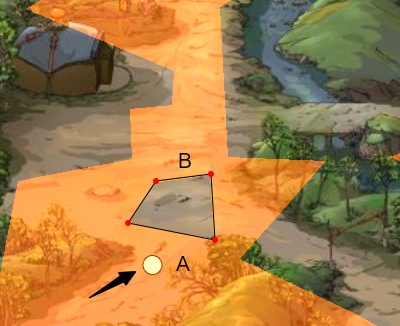

（图2-16）


#### 2.1.8 障碍物`obstacles`

用于表示寻路过程中视为障碍物的区域。通过在场景中放置障碍物区域，以及设置障碍物的大小与形状，影响导航网格的生成和寻路计算，参数如图2-17所示。

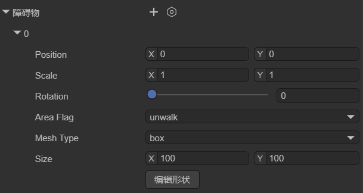

（图2-17）

`Position`：设置障碍物的位置。

`Scale`：设置障碍物的缩放。

`Rotation`：设置障碍物的旋转。

`AreaFlag`：设置障碍物的区域标记。

`MeshType`：设置障碍物的类型：box、cycle、mesh。

`编辑形状`：点击后，可以在场景中通过鼠标拖拽的方式移动障碍物。

如图2-18所示，box类型的障碍物，不需要再次烘焙就可以改变导航网格（橙色部分为之前烘焙好的导航网格）。


（图2-18）


#### 2.1.9 导航网格链接`navMeshLink`

用于连接两个不同导航网格表面的组件。它允许在导航网格之间创建链接，通过指定移动时的起点和终点，使得角色可以在这些链接上移动，从而在不同的导航区域之间进行寻路。参数如图2-19所示，

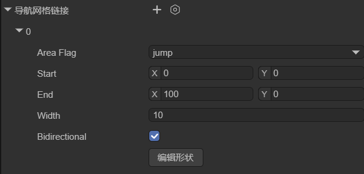

（图2-19）

`AreaFlag`：设置导航区域链接的区域标记。

`Start`：链接的起始位置，指定链接的起点所在的位置和方向，链接将从这个起点位置开始。

`End`：链接的结束位置，指定链接的终点所在的位置和方向，链接将在这个终点位置结束。

`Width`：链接的宽度，决定了链接的可通过区域的大小。

`Bidirectional`：是否为双向链接。如果不勾选，则链接只能单向通行，代理只能从起点到终点，不可以从终点到起点。

如图2-20所示，当代理需要从左边的区域寻路到右边的区域时，就需要用到导航区域链接组件了。


（图2-20）


### 2.2 生成导航区域

要在图2-1的场景中实现寻路导航，首先要根据地形生成寻路区域，以烘焙graphics区域为例，需要先使用sprite的graphics属性勾勒出地形，如图2-21所示，使用sprite将山路勾勒出来（这里只做演示，没有严格的控制边界）。

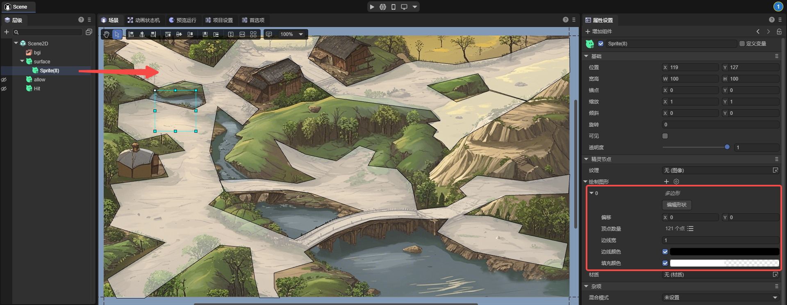

（图2-21）

节点sprite(7)的graphics与背景的大小相同，并且在节点surface上添加了2D导航网格表面组件，区域标记设置为walk，烘焙时的设置如图2-22所示，


（图2-22）

最终烘焙的效果如图2-23所示，就是全部的可通行区域。


（图2-23）


## 三、2D导航代理

导航代理是导航系统中用于控制角色或物体等寻路对象，在导航网格上移动和寻路的组件。它是寻路对象与导航系统交互的主要组件，负责处理寻路对象的移动、避障和路径规划。该组件是实现寻路对象在复杂环境中自主寻路和移动的关键。

导航代理只有圆形，这样可以简化计算，将复杂的形状大大简化。并且，圆形没有尖锐的边角，使得代理在环境中移动时更加平滑，不容易被卡住或跨越过小的障碍物。

### 3.1 组件属性

在场景中创建一个节点，为其添加2D导航代理组件，如图3-1所示，

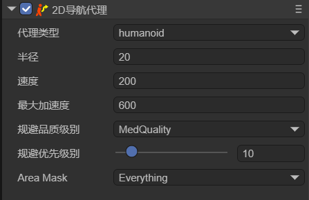

（图3-1）

选定`代理类型`后，开发者可以调节该导航代理的一些属性：

| 中文属性名   | 英文属性名       | 属性解释                                                     |
| ------------ | ---------------- | ------------------------------------------------------------ |
| 半径         | Radius           | 设置代理的碰撞半径。决定了代理在导航网格上的占用区域，并影响其与障碍物的碰撞检测。 |
| 速度         | Speed            | 设置代理的最大移动速度。较大的速度可以让代理更快地到达目标点。 |
| 最大加速度   | Max Acceleration | 设置代理的最大加速度。这决定了代理在开始移动、停止移动或改变方向时的加速度。 |
| 规避品质级别 | Quality          | 定义代理的回避品质。影响代理在导航网格上计算路径的精度和效率，较高的质量可以生成更准确和优化的路径，但可能会增加计算开销。 |
| 规避优先级别 | Priority         | 设置代理的规避优先级。较高的优先级可以让代理在寻路和避障时获得更高的优先权。数值越小优先级越高。 |
| 导航区域类型 | Area Mask        | 设置代理可以通过的导航区域类型。可以限制代理只在特定类型的区域内移动。 |


### 3.2 角色寻路

可以先在场景中创建一个Sprite节点（Hit），绘制图形用于显示鼠标点击的位置。用另一个Sprite节点（allow），绘制图形表示寻路的角色，如图3-2所示，

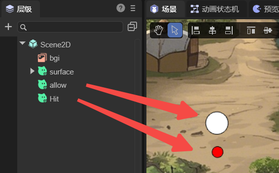

（图3-2）

在图2-21的surface节点上创建一个自定义的组件脚本：

```typescript
import Sprite = Laya.Sprite;
import Component = Laya.Component;
import Nav2DAgent = Laya.Nav2DAgent;

const { regClass, property } = Laya;

@regClass()
export class TestSprite extends Laya.Script {

    // 用于显示鼠标点击的位置
    @property({ type: Laya.Sprite })
    public hit: Sprite;

    private _temp: Sprite;
    private _allAgent: Nav2DAgent[] = [];

    private findCompents(lists: any[], sprite: Sprite, componentType: typeof Component) {
        let comp = sprite.getComponent(componentType);
        if (comp != null) {
            lists.push(comp);
        }
        for (var i = 0; i < sprite.numChildren; i++) {
            let child = sprite.getChildAt(i) as Sprite;
            this.findCompents(lists, child, componentType);
        }
    }

    //组件被激活后执行，此时所有节点和组件均已创建完毕，此方法只执行一次
    onAwake(): void {
        let sprite = this.owner as Laya.Sprite;
        //sprite.cache = true;
        this._temp = new Laya.Sprite();
        this.owner.scene.addChild(this._temp);
        this.findCompents(this._allAgent, sprite.scene, Nav2DAgent);
    }


    onMouseClick(evt: Laya.Event): void {
        let pos = new Laya.Vector2(evt.stageX, evt.stageY);
        console.log("click", pos);
        this._temp.graphics.clear();
        this._allAgent.forEach((agent) => {
            agent.destination = pos;
            let paths = agent.getCurrentPath();
            if (paths.length >= 2) {
                let points: any = []
                paths.forEach((point) => {
                    points.push(point.pos.x, point.pos.z);
                });
                this._temp.graphics.drawLines(0, 0, points, "#00000030", 5);
            }


        })
        this.hit.pos(pos.x, pos.y);
    }
}
```

这样，鼠标点击的位置就是终点，角色会自动规避障碍到达终点，效果如动图3-3所示，


（动图3-2）


