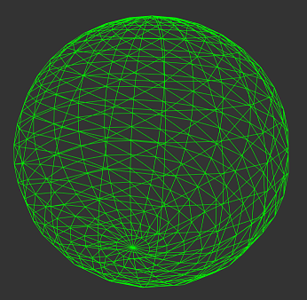
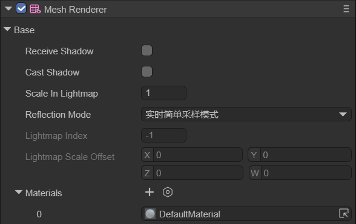
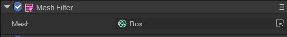

# 组件系统之Mesh

## 一、概述

Mesh是指模型的网格数据，3D模型是由多边形拼接而成，而一个复杂的多边形，实际上是由多个三角形拼接而成。所以一个3D模型的表面是由多个彼此相连的三角面构成。三维空间中，构成这些三角形的顶点的数据以及三角形的索引数据的集合就是Mesh。

（图1-1）

Mesh数据:

一个网格数据中包含了很多的数据信息，Shader中常见的顶点，法线等数据都是从Mesh数据中获取而来

一个标准的网格数据由以下的几部分属性组成

- Vertex：三维空间中位置的集合
- Topology：Mesh的基本片元类型
- Index：索引数据，描述顶点组合片元的整数集合

**Vertex：顶点数据**

每个顶点可以具有以下的属性内容：

- position顶点

顶点位置标示顶点在模型空间的具体位置，在引擎中使用这个值来确定Mesh的表面，所有的网格都需要这个顶点属性，为必须项

- normal法线

顶点法线表示从顶点位置的表面直接 “向外” 指出的方向。

- tangent切线

顶点切线表示沿着顶点位置表面的“ u”(水平纹理)轴指向的方向

- color颜色

顶点颜色表示顶点的基本颜色(如果有的话)。

- uv坐标

一个网格最多可以包含八组纹理坐标。纹理坐标通常称为 UV，这些集合称为通道。

- 骨骼（可选）

在蒙皮网格中，混合指数表示哪些骨骼影响顶点，骨骼重量描述这些骨骼对顶点的影响程度

**Topology：片元拓扑**

网格的拓扑结构定义了索引缓冲区的结构，而索引缓冲区又描述了顶点位置如何组合成面。每种拓扑类型在索引数组中使用不同数量的元素来定义单个面

LayaAir支持以下网格拓扑:

- Triangle
- Quad
- Lines
- Points

**Index Data : 索引数据**

索引数组包含引用顶点位置数组中元素的整数。这些整数称为索引

例如，对于包含下列值的索引数组的网格:

0,1,2,3,4,5

如果网格具有三角形拓扑，那么前三个元素(0,1,2)识别一个三角形，而后三个元素(3,4,5)识别另一个三角形。顶点可以贡献的面的数量没有限制。这意味着同一个顶点可以多次出现在索引数组中。

## 二、MeshRenderer组件

Mesh Renderer 组件用于渲染网格。该组件与同一个对象上的 Mesh Filter组件配合使用；Mesh Renderer 组件渲染 Mesh Filter 组件引用的网格

在引擎代码中MeshRenderer类继承自BaseRender组件类

### 2.1 Mesh Renderer Inspector

（图2-1）

RecevieShadow：指定该Render是否显示投射阴影

CastShadow：指定当一个合适的光照射到Render上时，该渲染器是否投射阴影以及如何投射阴影

ScaleInLightmap：LightMap缩放大小

LightmapIndex：LightMap索引号

Materials：Render材质列表

### 2.2 MeshRenderer的Material

**Material与Share Material的区别**

> Material

当我们引用修改这个属性的时候，LayaAir会返回该Render下第一个实例化后的material赋予当前的MeshRederer组件。

那么，什么是**第一个实例化后的material**呢？

每个MeshRenderer组件里有个Materals属性，这个数组决定了该物体下可以放几个material组件，默认是1。

当同一个物体上有很多个material的时候，我们可以手动更改material组件的上下位置关系。这里的第一个实例化后的material指的就是该物体上从上往下的第一个material组件，而不是MeshRenderer.materials[0]，也就是说我们每一次引用就会生成一个新的material到内存中。但是在引用后并不会改变我们项目工程中材质球的原始属性设置

> Share Material

当我们改变Renderer.sharedMaterial的时候，所有使用这个材质球物体都会被改变，并且改变后的设置将会被保存在项目工程中

假设cube01和cube02共用一个材质redMat,当我们想通过sharedMaterial修改cube01上material的属性的时候，cube02上对应的属性也会被修改

>  总结

当使用MeshRenderer.material的时候，每次调用都会生成一个新的material到内存中。

当使用Renderer.sharedMaterial的时候并不会生成新的material，而是直接在原material上修改，并且修改后的设置就会被保存到项目工程中。一般不推荐使用这个去修改，当某个材质球只被一个gameobject使用的时候可以使用这个去修改，并且最好在修改之前把原属性设置保存，当使用完毕后立即恢复原设置，防止下次加载后的gameobject上还会残留之前的设置信息。

如果是主角这一类gameobject身上需要修改材质的属性或者shader属性比较多的时候，可以第一次使用material，这样可以动态的生成一个material实例，然后再使用sharedmaterial，动态的修改这个新生成的material，而且不会创建新的material

## 三、MeshFilter组件

Mesh Filter 组件包含对网格的引用。该组件与同一个游戏对象上的 Mesh Renderer组件配合使用；Mesh Renderer 组件渲染 Mesh Filter 组件引用的网格。

（图3-1）

**Mesh属性**

对网格资源的引用要更改MeshFilter组件引用的网格资源，请选择网格名称旁的箭头标识符来调用选取列表选择想要的Mesh网格

**注意**：当更改 Mesh Filter 组件引用的网格时，此游戏对象上其他组件的设置不会改变。例如，MeshRenderer 组件不会更新其设置，这可能会导致引擎使用非预期的属性渲染网格。如果发生这种情况，请根据需要调整其他组件的设置

> 创建基础模型请参考[3D基础显示对象](../../../3D/displayObject/readme.md)

