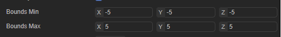

# Reflection Probe：反射探针

## 1. 反射探针概述

传统形式的反射是通过反射贴图的形式来模拟来自对象的反射，对于静态的开放场景来说，传统反射贴图的形式得到的效果是可以接受的，但对象处于复杂环境中，反射贴图的效果就捉襟见肘了，LayaAir通过反射探针的形式，对对象所有场景的周围环境进行采样，利用反射探针可以在复杂的环境中来保证对象的反射效果足够的真实。当存在多个探针的时候，引擎会自动对每个探针采样到的反射结果进行插值以得到平滑的反射过渡效果。

反射探针使用CubeMap的贴图形式来从六个方向来收集并保存在CubeMap中，如下图中所示六个方向的反射结果

 

图1-1

### 1.1 烘焙探针

LayaAir引擎中的探针类型为Bake，烘焙探针捕获的反射只能为包含标记为Static的对象，具体的操作为选择需要烘焙反射的对象，选中该对象，在Inspector面板右上角勾选对象Static选项。

 

图1-2

在将需要烘焙反射信息的对象设置为Static完毕后，在Sprite3D对象添加Reflection Probe组件

 

图1-3

在Reflection Probe组件选择适合的采样等级采样大小，点击Bake按钮就可以开始反射探针的烘焙

 

图1-4

## 2.反射探针的属性

### 2.1 Ambient Mode

环境光模式有两种，一种是球谐模式一种是纯色模式

 

图2-1

**球谐模式**

通过球谐函数计算天空盒提供的环境光信息，反射探针收集到的为球谐函数计算得到的数值

**纯色模式**

在反射探针收集非指定位置的反射信息由纯色填充

### 2.2 Importance

重要性判断，当前引擎只支持单探针模式，如果当前新建的探针Important值大于主探针Important值，才用当前探针作为主探针

### 2.3 Intensity

应用于该反射探针在其着色器中的纹理的强度大小调节

### 2.4 Box Projection(盒式投影)

通常情况下，假设反射立方体贴图处于与任何给定对象之间无限远的距离。当对象转动时，立方体贴图的不同角度都将变为可见状态，但是对象不能进一步靠近或远离反射环境。这种状态通常对于室外场景表现良好，但其局限性表现在室内场景中；房间的内部墙壁显然不是无限远的距离，物体越靠近墙壁，墙壁的反射应该越大。

 

图2-2

### 2.5 Bounds

反射探针作用的范围用一个包围盒的形式来，反射探针只接受位于包围盒内物体的反射信息

Bounds Min：包围盒最小值坐标

Bounds Max：包围盒最大值坐标

包围盒Size = Max — Min

 

图2-3

### 2.6 环境光强度与反射强度

环境光强度：属性为接收到的环境光强度，作用到映射反射物体上的效果为反射效果中的环境光更强烈、更亮

反射强度：属性为接收到的反射内容强度，作用到映射反射物体上的效果为反射效果更强烈、更亮

### 2.7 采样大小与采样质量

烘焙反射探针采样大小：决定了烘焙CubeMap的单张RT的尺寸（分辨率）

烘焙反射探针采样质量：决定了烘焙CubeMap的单张RT的写入质量（高中低三挡）

 

图2-4

### 2.8 Clear信息

清除信息：除了反射内容部分，烘焙的探针内容时填充的内容可选项

清除颜色：当填充内容选择为SolidColor时，在ClearColor选项中选择填充的颜色

 

图2-5

### 2.9 IBL选项

IBL Tex：烘焙的反射探针IBL Texture

IBL Tex RGBD：烘焙的纹理格式（颜色通道+深度通道）

 

图2-6

