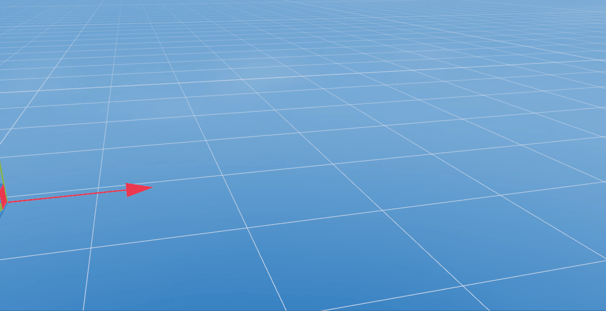

# 拖尾

## 一、概述

拖尾渲染器（Trail Renderer）用于制作跟在场景中的物体后面的拖尾效果来代表它们在到处移动。像在物体移动路径的位置上出现的残影，就是一种拖尾效果。

   

（动图1-1）

如动图1-1所示，这是一个自身旋转的立方体，周围有拖尾效果。下面我们来看看在IDE中是如何创建和使用拖尾的

## 二、IDE中创建与使用

### 2.1 创建拖尾对象

在一个3D场景的Hierarchy窗口中，任何节点下，或者是空白位置，都可以通过鼠标右键来创建拖尾对象，如动图2-1所示

 

（动图2-1）

此时创建的拖尾对象，是看不到任何效果的，实际上就是创建了一个空节点，并添加了拖尾渲染器（Trail Renderer）组件，我们来了解一下组件的信息

### 2.2 属性设置

如图2-2所示，拖尾渲染器有如下的属性

 

（图2-2）

由于 `Trail Renderer` 组件是继承自 `Base Renderer` 组件，因此拖尾渲染器本身具备一些基础属性，如图2-3所示

  

（图2-3）

接收阴影 `Receive Shadow` ，产生阴影的设置 `Case Shadow` 和光照贴图的缩放和偏移等基础属性，在这里就不介绍了

### 2.3 拖尾材质

拖尾所使用的的材质，也就是需要使用 `Laya.Trail` 这个Shader

#### 2.3.1 创建材质

首先我们在Asset下新建一个Material，默认情况下Material的Shader是BlinnPhone，接下来我们修改下Shader，如动图2-4所示

 

（动图2-4）

#### 2.3.2 材质贴图

如图2-5所示，带 Laya.Trail Shader的材质有如下几个属性

 

（图2-5）

这里我们主要关注拖尾效果的贴图，如动图1-1示例中的效果，需要做出拖尾效果的话，需要一张拖尾效果的纹理贴图，如图2-6所示

 

（图2-6）

我们接下来将纹理贴图拖入材质中，如图2-7所示，这样拖尾的贴图就配置好了

（动图2-7）

#### 2.3.3 纹理颜色

我们想让拖尾的效果是一种灰色的类似烟雾的效果，那么我们需要对材质的颜色做设置，如图2-8所示，选取灰色的颜色，并改透明图为55

  

（图2-8）

这样颜色就配置好了，同时我们需要改下 `Material Render Mode`为 `Additive` 模式，才能让贴图中黑色的颜色变为纯透明，并改变 `Cull` 为 `Off`，如图2-9所示

 

（图2-9）

这样修改后，效果才能如动图2-10所示

 

（动图2-10）

### 2.4 拖尾过滤器

拖尾材质可以指定拖尾的纹理效果，透明方式等等，但拖尾过滤器才可以设置拖尾的时间，轨迹，长度等等，就像3D粒子系统一样，如图2-11所示

  

（图2-11）

#### 2.4.1 淡出时间

`Time` ：淡出时间，时间越长，拖尾淡出时间越长

默认是5秒，5秒之后才会消失，如动图2-12所示

 

（动图2-12）

但是我们可以调整时间为1秒，如动图2-13所示

 

（动图2-13）

#### 2.4.2 轨迹准线

`Alignment` ：设置轨迹面向的方向

​	`VIEW`： 轨迹面向摄像机

​	`TransformZ`： 轨迹朝向其变换组件的 Z 轴

#### 2.4.3 最小距离

`Min Vertex Distance`：获取新旧顶点之间最小距离，实际上是最小拖尾片段距离，相当于拖尾的长度

可以确定在将新段添加到该路径之前，应用轨迹的游戏对象必须行进的距离（采用世界单位）。像 0.1 这样较小的值会更频繁地创建轨迹段，从而形成更平滑的轨迹。像 1.5 这样较大的值会创建在外观上更有锯齿状的轨迹段。另外，当顶点非常靠近并且轨迹会在短距离内显著改变方向时，较宽的轨迹可能出现视觉瑕疵。

> 注意：出于性能原因，最好使用尽可能最大的值来实现要创建的效果

#### 2.4.4 宽度设置

`Width` ：宽度值和曲线值以控制轨迹沿其长度的宽度。

曲线是在每个顶点处采样的，因此其精度受制于轨迹中的顶点数量。轨迹的总宽度由宽度值控制。

如动图2-9所示，我们可以通过鼠标双击红线上来添加曲线节点，并通过白色旋转轴来调整曲线角度，通过鼠标双击红色节点来删除

  

（动图2-14）

#### 2.4.5 颜色设置

`Color` ：采用 colorGradient 方式设置，有两个可选模式

​	`Fixed` 固定模式

​	`Blend` 混合模式

如图2-15所示，为设置从半透明到白色，最后变为半透明的颜色设置

  

（图2-15） 

#### 2.4.6 纹理模式

`texture Mode` ：纹理模式，与普通纹理模式相同

​	`Stretch` ：可沿着轨迹的整个长度应用纹理贴图

​	`Tile` ：使纹理沿着轨迹的长度平铺

通常我们使用Stretch为主，主要是应用一张贴图变化的效果

如动图2-16，采用Tile平铺的方式效果

 

（动图2-16）

最终我们选择Stretch为拖尾效果，如动图2-17所示

 

（动图2-17）

到此，拖尾渲染器就介绍完了，结合动画编辑器的使用，使物体在场景中运动起来，这样拖尾效果才能看到运行的效果，开发者可以很好的利用拖尾渲染器做出类似烟雾，残影等效果！

 

