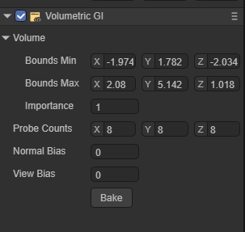
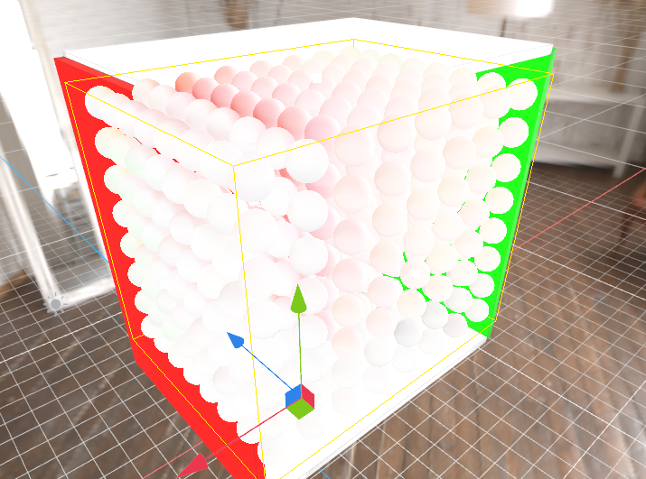
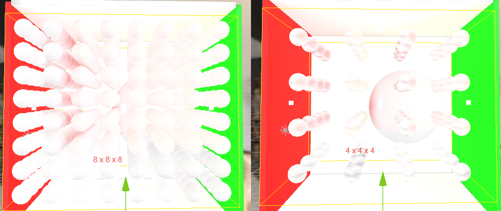

# Volumetric GI

## 1.Volumetric GI概述

体积全局照明（Volumetric GI）是指计算机图形学中使用的一种技术，用于模拟光与参与介质（如雾、烟或体积云）的相互作用。它旨在以逼真的方式捕捉媒体造成的散射和间接照明效果。

体积GI可以通过考虑光在参与媒体中的传播来增强场景的视觉质量和真实感。它考虑了介质的散射特性，并计算光如何反弹以及与周围对象和曲面的相互作用。此技术对于创建大气效果、动态照明场景以及半透明或体积材质的逼真渲染特别有用。

有各种算法和方法用于实现体积GI，包括：

1. 基于体素的方法：这些技术将三维空间离散为体素网格，并模拟光在体素内的传播。基于体素的表示可以捕捉介质的密度和散射特性，从而实现逼真的效果。

2. 光线行进：这项技术包括通过参与的媒介投射光线，并沿着光线的路径积累光线贡献。通过对介质重复采样并评估其散射特性，可以计算间接照明。

3. 屏幕空间方法：这些方法利用屏幕空间信息，如深度和法线缓冲区，来近似体积GI效果。他们经常采用各种过滤和混合技术来模拟参与介质内的散射和间接照明。

3. 预计算体积技术：在某些情况下，预计算的光传输数据可用于加速体积GI的渲染。这包括预计算参与介质中的光相互作用，并将其存储在数据结构中，以便在渲染期间进行高效查找。

体积GI是一个计算密集型过程，可能需要大量资源，尤其是对于实时应用。因此，它经常被选择性地使用或与其他照明技术相结合，以实现所需的视觉效果。

总的来说，体积GI通过准确模拟光与参与介质的相互作用，在创造逼真和身临其境的环境中发挥着至关重要的作用。它为虚拟场景添加了深度、氛围和自然的照明效果，增强了整体视觉质量和真实感。

## 2.Volumetric GI组件

### 2.1 创建一个Volumetric GI组件

可以向场景中的Sprite3D对象添加Volumetric GI组件，引擎的Volumetric GI组件可以在Volume的范围内提供实时的GI效果。

在属性设置面板中，创建Volumetric GI组件的方式如图2-1所示：增加组件 -> 渲染 -> Volumetric GI。

（图2-1）

（图2-2）

### 2.2 Volume Bound

只有在Volume Bound范围中的物体才会收到Volumetric GI的影响，Volume Bound中均匀分布了一定数量的probe用于采集周围的球谐信息。

（图2-3）

### 2.3 Volumetric GI 具体参数

`Bound Min`：控制Bound在X、Y、Z轴负方向上的面。

`Bound Max`：控制Bound在X、Y、Z轴正方向上的面。

`Importance` 权重：控制不同的Volumetric之间的权重比例。

`Probe Counts`：在Bound中Porbe的排布数量。

图2-4展示了不同数量级的Probe排布：

（图2-4） 

`Normal Bias`：表面沿着法线向内偏移量，减少遇到同像素采样引发的误差。

`View Bias`：表面沿着视野方向内偏移量，减少遇到同像素采样引发的误差。

