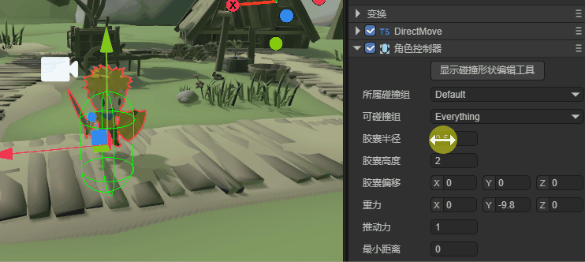
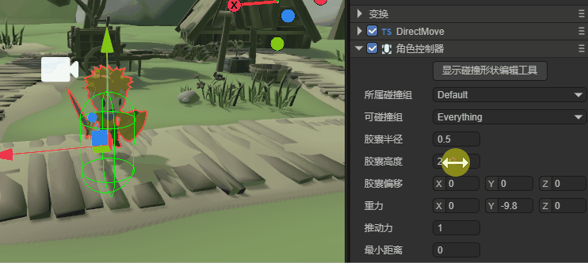
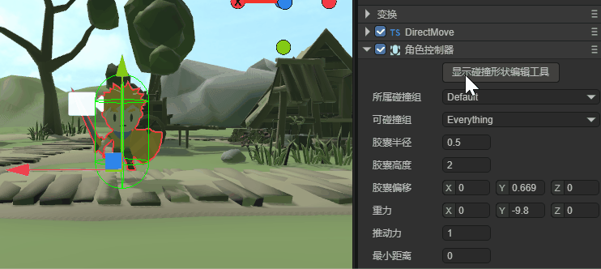
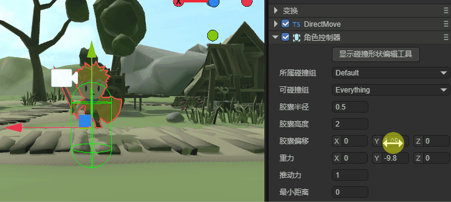
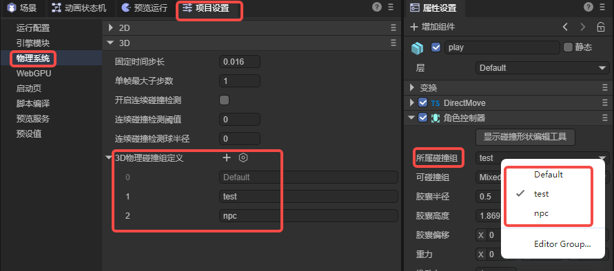
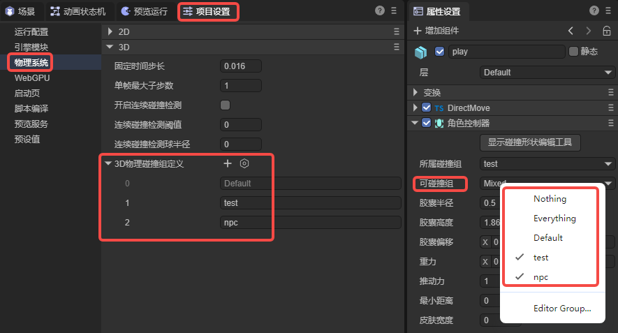
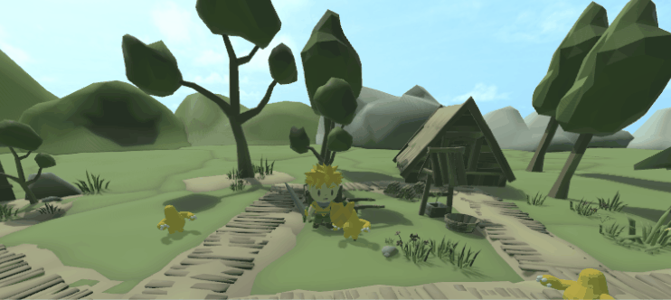
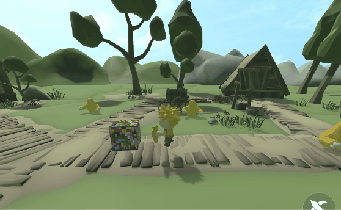
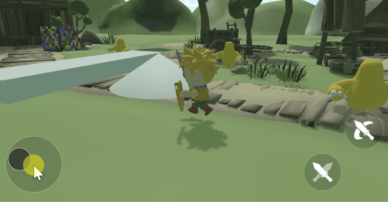
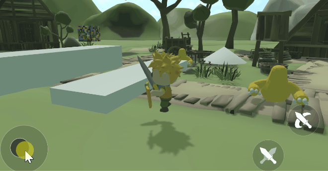

# 角色控制器

> Author : Charley        Version >= LayaAir 3.2

**角色控制器**是游戏引擎中用于控制玩家或NPC（非玩家角色）运动的组件。它通常用来简化和优化角色在三维空间中的运动和碰撞处理，提供一个专门的接口来实现角色的移动、跳跃、碰撞检测等功能。

从本质上讲，角色控制器代表了一种受限的物理实体。与完全遵循牛顿物理定律的刚体不同，角色控制器采用了一种混合方法，将确定性的角色移动与物理环境的交互结合起来。它既不是完全静态的碰撞体，也不是完全动态的刚体，而是介于两者之间的特殊存在。

与静态物理碰撞器（PhysicsCollider）不同，角色控制器可以在场景中主动移动；

与动态刚体（Rigidbody3D）不同，角色控制器的移动不完全受物理引擎的力学系统控制，而是通过显式的移动指令实现，这确保了游戏角色的移动更精确可控。

对于角色控制器，引擎默认使用胶囊碰撞形状（CapsuleColliderShape）作为碰撞形状，这是因为胶囊体形状最适合模拟人形角色，能够在保持稳定性的同时有效处理与环境的碰撞。

角色控制器内置了多种实用功能来处理常见的角色移动场景。例如，stepHeight属性定义了角色可以自动跨越的最大台阶高度，使角色能够平滑地爬上小台阶而不需要跳跃。maxSlope属性设置了角色能够攀爬的最大斜坡角度，超过此角度的斜面将被视为不可攀爬。move与jump方法，分别控制角色的移动与跳跃功能。

在游戏开发实践中，角色控制器特别适用于第一人称或第三人称游戏中的主角控制，它解决了传统使用3D刚体控制角色时可能出现的问题，如滑动、翻倒或碰撞不稳定等。通过角色控制器，开发者可以实现精确的角色控制，包括移动、跳跃、攀爬和与环境的交互，同时保持适当的物理真实感。

在LayaAir3引擎中，**角色控制器**的类为**CharacterController**，这是一个物理的组件类，继承自物理碰撞器组件类 PhysicsColliderComponent，它是一个专为角色移动设计的物理组件，是实现高品质角色控制系统的理想选择。

## 1、碰撞形状相关

**碰撞形状**是用于描述物体与其他物体发生碰撞时，如何检测和响应碰撞的几何体。它定义了物体的物理边界，即物体的外形，以便物理引擎能够准确判断物体之间是否发生接触，并据此计算碰撞后的反应。

由于角色控制器默认是胶囊碰撞形状，且不建议修改。所以角色控制器在IDE中无法更改碰撞形状类型，但是我们提供了碰撞形状大小改变（胶囊半径、胶囊高度）以及碰撞形状偏移（胶囊偏移）的属性，用于调整碰撞形状。

### 1.1 胶囊半径 radius

该属性表示角色控制器所使用的胶囊碰撞形状的半径。决定了角色在水平方向上的碰撞范围大小。如动图1-1所示：

 

(动图1-1)

### 1.2 胶囊高度 height

该属性表示角色控制器所使用的胶囊碰撞形状的高度，决定了角色在垂直方向上的碰撞范围大小。如动图1-2所示：

 

(动图1-2)

### 1.3 碰撞形状编辑工具

除了通过属性数值的调整，也可以直接在场景的碰撞形态上修改。

如动图1-3所示，直接点击碰撞形状顶部的“显示碰撞形状编辑工具”即可，

进入编辑模式后，可以看到几个白色方块，这些就是编辑点，通过拖动编辑点，可以实现便捷的形状外观改变。

 

(动图1-3)

### 1.4  胶囊偏移 centerOffset

该属性表示角色控制器所使用的胶囊碰撞形状的中心偏移，用于控制胶囊碰撞形状在角色控制器中的位置。

当角色模型的原点与实际的碰撞中心不一致时，使用中心偏移量来修正胶囊体的位置，确保碰撞检测的准确性。

 

(动图1-4)

## 2、碰撞分组设置

基于角色控制器的特点，除了碰撞分组外，碰撞基类的很多属性都不常用，所以IDE中并不显示出来，如果有特别的应用场景，可以在代码中开启。本小节仅介绍碰撞基类中常用的碰撞分组属性。

### 2.1 所属碰撞组 collisionGroup

当我们产生复杂的碰撞需求时，例如，想碰哪个，不碰哪个。这时候就需要进行分组，并指定可以与哪个碰撞组进行碰撞。

所属碰撞组用于指定当前碰撞器属于哪个碰撞组，在IDE中，可以通过点击`编辑组`Editor Group跳转到`项目设置`的`物理系统`栏目，添加碰撞分组以及分组的名称。如图2-1所示。

 

（图2-1）  

这里需要说明一下，碰撞分组的名称只是用于IDE里的方便识别，引擎API的组其实是2的N次幂值。

例如图2-1中的Default是2的**0次幂**，也就是1，而自己添加的npc组是2的**2次幂**，实际值是4，以此类推，分组ID为3的碰撞组实际值为8。

所以，如果我们不通过IDE来设置碰撞分组的话，引擎API的碰撞分组需要将值设置为2的幂。

示例代码如下：

```typescript
//用代码指定xxx碰撞器所属哪个碰撞组
xxx.collisionGroup = 1 << 3  ;// 值为2 的 3 次幂（8），可以简单理解分组ID为3，这样就更容易与IDE中的概念统一
```

### 2.2 可碰撞组 canCollideWith

在IDE中可以通过多选分组名称的方式，将值设置给**可碰撞组**，如图2-2所示，用于指定可以与哪些分组的碰撞器发生碰撞。

  

(图2-2)

除了指定自定义的碰撞组，顶部的`Nothing`表示不与任何分组发生碰撞，而`Everything`表示可以与任何分组发生碰撞。

如果开发者需要通过代码的方式传值，也可以基于位运算进行传值，示例代码如下：

```typescript
//指定xxx碰撞器 可以与  某个碰撞组 发生碰撞
xxx.canCollideWith = 1 << 2;  //只与分组ID为2的（值为4）分成发生碰撞

//指定xxx碰撞器 可以与 多个碰撞组 发生碰撞
xxx.canCollideWith = (1 << 1) | (1 << 2) | (1 << 5); //只与分组ID为1、2、5的进行碰撞

//指定xxx碰撞器  不可以  与哪些组 发生碰撞，其它组都可以碰撞
xxx.canCollideWith = -1 ^ (1 << 3) ^ (1 << 6)  //不与分组3、6进行碰撞，除3与6组之外都可以发生碰撞)
```

## 3、IDE面板的专有属性

### 3.1 重力 gravity

重力指的是物理引擎施加在刚体上的一种恒定加速度，通常模拟现实世界中的引力。

重力会影响刚体的运动，使其向某个方向（通常是向下，即 Y 轴负方向）持续加速，从而模拟真实世界中的自由落体效果。

默认的重力值为 **(0, -9.8, 0)**，表示物体会以 9.8 m/s² 的加速度向下坠落，效果如动图3-1所示。

   

（动图3-1）

### 3.2 推动力 pushForce

当角色与其他可推动的物体发生碰撞时，推动力会作用在物体上，使其产生移动。

如动图3-2所示，设置了推动力后，方块障碍未能阻挡角色的步伐，如果推动力为0，则无法推开方块，角色会被挡住。

 

(动图3-2)

### 3.3 最大坡度 maxSlope

最大坡度是指角色控制器能够攀爬的最大坡度角度。如果斜坡的角度超过该值，角色将无法继续向上移动，可能会开始滑落或停在斜坡下方。

如动图3-3所示，当最大坡度设置为50的时候，角色可以轻松走上锥体，但是面对90度的方块障碍物就无法通过了。

 

(动图3-3)

### 3.4 脚步高度 stepHeight

角色行走的脚步高度，用于表示角色能够顺利跨越的台阶最大高度。如果台阶高度超过了这个设定值，角色就无法直接跨越该台阶，会被阻挡或者需要采用其他方式通过（比如绕路）。

该值通常在 `0.1 - 1`之间，例如动图3-4中，最大坡度为默认值90度，脚步高度设置为0.5，可以轻松通过图中较低障碍，但无法通过相对较高的障碍。

 

(动图3-4)

## 4、引擎中的运动控制

角色的运动控制相关，需要在代码逻辑中调用实现。

### 4.1 角色位置 position

角色位置用于获取和设置角色控制器的位置，通常应用于获取角色当前位置，或者设置角色位置初始化（例如出生点与传送点）等需求。

代码设置示例如下：

```typescript
const { regClass, property } = Laya;
@regClass()
export default class DirectMove extends Laya.Script {
    declare owner: Laya.Sprite3D;
    private characterController: Laya.CharacterController;
    onAwake(): void {
        // 获取 角色控制器 组件并赋值给 characterController
        this.characterController = this.owner.getComponent(Laya.CharacterController);
        //设置出生点位置
        this.characterController.position = new Laya.Vector3(0, 0, 0);
    }
}
```

### 4.2 角色移动 move()

角色移动用于通过指定移动向量来移动角色。

在代码中，如果要自由控制角色的移动，通常是放到每帧更新（`onUpdate()`）的时候执行，通过不断调用 `move` 方法并传入移动向量，角色会按照指定的方向和距离进行移动。

当需要停止的时候，不仅仅是停止调用move移动向量。还要将move的移动向量重置为零向量。否则会一直基于最后一次设置的向量移动。

代码设置示例如下：

```typescript
const { regClass, property } = Laya;
@regClass()
export default class DirectMove extends Laya.Script {
    declare owner: Laya.Sprite3D;
    private characterController: Laya.CharacterController;
    // 标记角色是否移动
    private ismoveing: boolean = false;
    //移动向量，速度与方向，向X轴正方向移动，速度为0.05
    private moveVector: Laya.Vector3 = new Laya.Vector3(0.05, 0, 0);
    onAwake(): void {
        // 获取 角色控制器 组件并赋值给 characterController
        this.characterController = this.owner.getComponent(Laya.CharacterController);
    }
    
    /**
     * 每帧更新时执行，尽量不要在这里写大循环逻辑或者使用 getComponent 方法
     * 此方法为虚方法，使用时重写覆盖即可
     */
    onUpdate(): void {
        // 如果角色可移动 (ismoveing为true时)
        if (this.ismoveing) {
            // 调用角色控制器的 move 方法，使角色按照 moveVector 向量移动
            this.characterController.move(this.moveVector);
        }
    }

    /**
     * 停止角色移动
     */
    public moveStop(): void {
        // 标记角色停止移动，不再每帧更新
        this.ismoveing = false;
        // 重置角色的移动向量置为零向量，使其停止移动
        this.characterController.move(Laya.Vector3.ZERO.clone());
    }
}
```

基于角色控制器，完整的自由控制角色行走示例，请使用LayaAirIDE 3.2或以上版本，创建`3D-RPG示例`模板项目，查看源码。

### 4.3 角色跳跃 jump()

角色跳跃可以控制角色控制器的跳跃方向和高度，通常是重力相反的方向（Y轴正方向），绝对值越大，单次跳跃的高度越高。

代码设置示例如下：

```typescript
const { regClass, property } = Laya;
@regClass()
export default class DirectMove extends Laya.Script {
    declare owner: Laya.Sprite3D;
    private characterController: Laya.CharacterController;
	/** 跳跃的向量，Y轴正方向，高度5 */
    private jumpVector: Laya.Vector3 = new Laya.Vector3(0, 5, 0);

    onAwake(): void {
        // 获取 角色控制器 组件并赋值给 characterController
        this.characterController = this.owner.getComponent(Laya.CharacterController);
        //设置出生点位置
        this.characterController.position = new Laya.Vector3(0, 0, 0);
    }
    
    onKeyDown(evt: Laya.Event): void {
        switch (evt.keyCode) {
            case Laya.Keyboard.SPACE: //按键盘空格时
                this.characterController.jump(this.jumpVector); // 跳跃
                break;
        }
    }
}
```

### 4.4 获得垂直速度 getVerticalVel()

垂直速度方法主要用于获取角色在垂直方向（通常是 Y 轴）的当前速度。这个值反映了角色受重力、跳跃或其他垂直运动影响时的状态。

开发者可以通过检测垂直速度来判断角色是否在空中或刚刚落地，根据当前状态实现相应的逻辑。

- **值为 0**，表示角色位于地面；
- **为正值**，表示角色正在上升（如跳跃）；
- **为负值**，表示角色在下落。

代码设置示例如下：

```typescript
const { regClass, property } = Laya;
@regClass()
export default class DirectMove extends Laya.Script {
    declare owner: Laya.Sprite3D;
    private characterController: Laya.CharacterController;

    onAwake(): void {
        // 获取 角色控制器 组件并赋值给 characterController
        this.characterController = this.owner.getComponent(Laya.CharacterController);
    }

	onUpdate(): void {
        if (this.characterController.getVerticalVel() !== 0)
            // 控制台输出角色的垂直速度
            console.log("垂直速度", this.characterController.getVerticalVel());
	}
}
```

## 5、关联文档

### [《3D物理系统》](../../../physicsEditor/physics3D/readme.md)