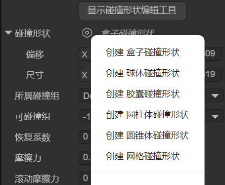
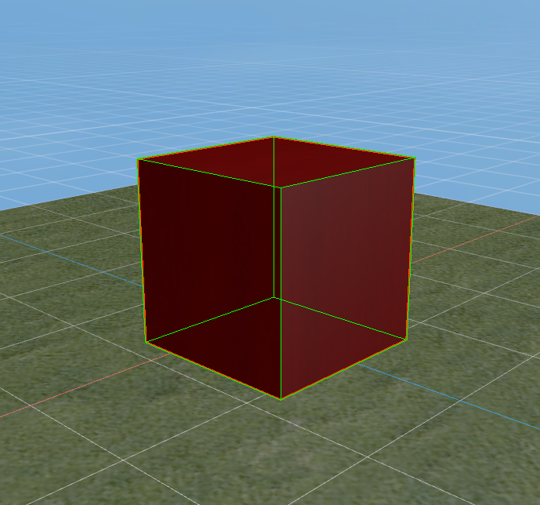
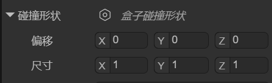
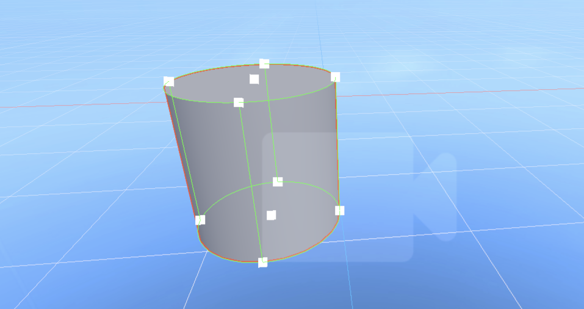
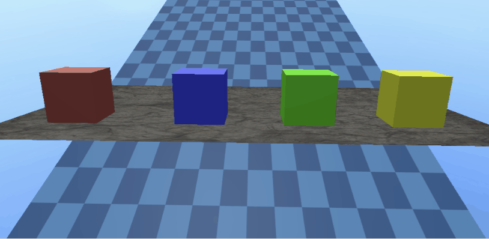

# 静态碰撞器

> Author : Charley        Version >= LayaAir 3.2

在物理引擎的设计中，静态碰撞器具有几个关键特性。

首先，它们在位置上保持绝对静止，除非开发者通过脚本直接修改其变换属性。

与动态物体（如由Rigidbody3D表示的刚体）不同，静态碰撞器不会受到重力、冲量或其他外力的影响。这意味着无论其他物体如何与之碰撞，静态碰撞器都会保持在原始位置，不会产生位移或旋转。

静态碰撞器的主要作用是为场景提供物理边界和障碍物，例如地形、建筑物、墙壁、平台等固定不动的环境元素。当动态物体（如受物理引擎控制的角色或物品）与静态碰撞器接触时，动态物体可以根据物理规则做出相应反应，如反弹、滑动或停止。这使得游戏中的物体能够以逼真的方式与环境交互，而不会导致环境本身发生移动。

从性能角度看，静态碰撞器比动态的刚体更为高效。由于它们不需要计算位置、速度、加速度等动态属性，有助于提升性能并减少不必要的物理运算。

在LayaAir3引擎中，**静态碰撞器**的类为**PhysicsCollider**，这是一个物理的组件类，继承自物理碰撞器组件类 PhysicsColliderComponent，用于模拟那些**不会移动**或**不受物理力影响的物体**的碰撞体。


## 1、碰撞器基类属性

### 1.1 碰撞形状 colliderShape

**碰撞形状**是用于描述物体与其他物体发生碰撞时，如何检测和响应碰撞的几何体。它定义了物体的物理边界，即物体的外形，以便物理引擎能够准确判断物体之间是否发生接触，并据此计算碰撞后的反应。

LayaAir引擎支持的碰撞形状包括盒子碰撞形状、球体碰撞形状、胶囊碰撞形状、圆柱体碰撞形状、圆锥体碰撞形状、网格碰撞形状，每种碰撞形状适用于不同类型的物体，如图1-1所示：

 

(图1-1)

碰撞形状的选择不仅影响物理碰撞计算的精度，也直接影响游戏或物理模拟的性能。

对于动态物体，通常会选择较简单的碰撞形状以提高效率；而对于静态物体，可以使用更复杂的碰撞形状来保证更高的精度。合理选择碰撞形状是3D物理模拟中至关重要的一步，它能够在保证物理效果的真实性的同时，优化系统的计算性能。

#### 1.1.1 盒子碰撞形状

盒子碰撞形状是一个长方体或立方体，如图1-2所示，适用于简单的方形物体，例如箱子、建筑物的墙壁等。它可以用于大多数规则形状的物体。

 

（图1-2）

我们可以通过偏移localOffset和尺寸size，来设置盒子碰撞形状的位置与尺寸，如图1-3所示。

 

（图1-3）

#### 1.1.2 球体碰撞形状

球体碰撞形状是最简单的碰撞形状，它使用一个球体来代表物体的碰撞边界，如图1-4所示。物理引擎通过检查球体之间的距离来判断物体是否发生碰撞。

由于其计算简单，更节省性能。球体碰撞形状适用于体积较小且形状接近球形的物体，如弹丸、球类以及简单的物体等。

 

（图1-4）

我们可以通过偏移localOffset和半径radius，来设置球体碰撞形状的位置与大小，如图1-5所示。

 

#### 1.1.3 胶囊碰撞形状

胶囊碰撞形状是由一个圆柱体和两个半球形的端点组成，类似于一个胶囊的形状。如图1-6所示。它通常用于模拟垂直方向较高但宽度较小的物体，常见的应用场景是人物角色的控制器。除此之外，胶囊形状也适用于其他柱状物体，例如立柱或类似形状的机械部件。

 

(图1-6)

我们可以通过偏移localOffset、半径radius、长度length、方向orientation，来设置胶囊碰撞形状的位置、胶囊粗细、胶囊长短、胶囊朝向，如图1-7所示。

 

(图1-7)

#### 1.1.4 圆柱体碰撞形状

圆柱体碰撞形状用于表示一个圆柱形物体的碰撞边界，通常用于那些具有对称形状的物体。它适合用于模拟一些较高的、但形状较为规则的物体，如管道、柱子等。如图1-8所示。圆柱形状也常用于需要旋转的物体，比如旋转的齿轮、滚筒等。由于其简单的几何结构，计算相对高效。

 

（图1-8）

我们可以通过偏移localOffset、半径radius、高度height、方向orientation，来设置圆柱体碰撞形状的位置、圆柱粗细、圆柱高矮、胶囊朝向，如图1-9所示。

 

（图1-9）

#### 1.1.5 圆锥体碰撞形状

圆锥体碰撞形状用于表示一个锥体物体的碰撞边界，它有一个圆形底面和一个顶点，适合用于那些形状为圆锥体的物体，如图1-10所示。圆锥体常用于模拟一些具有锥体结构的物体，如锥形石块、圆锥状的机械部件、尖刺、导弹等，能够确保物体碰撞时具有自然的物理反应。

 

(图1-10)

我们可以通过偏移localOffset、半径radius、高度height、方向orientation，来设置圆锥体碰撞形状的位置、圆锥底大小、圆锥高矮、圆锥朝向，如图1-11所示。

 

（图1-11）

#### 1.1.6 网格碰撞形状

网格碰撞形状使用物体的3D模型（网格）作为碰撞边界，如图1-12所示，能够精确地与物体的形状匹配。它适用于那些复杂或不规则形状的物体，能够提供非常高的碰撞精度。由于网格碰撞器的计算量较大，它通常只用于静态物体（静态碰撞器），而不适用于动态物体（3D刚体）。如果一定要应用于动态物体，LayaAir引擎会强制应用为凸多边形外观，以优化性能。

 

(图1-12)

我们可以通过偏移localOffset、网格mesh、凸多边形convex，来设置网格碰撞形状的位置、网格资源、是否引擎自动处理为凸多边形（优化性能），如图1-13所示。

 

(图1-13)

#### 1.1.7 碰撞形状编辑工具

LayaAir3.2.4开始，对于碰撞形状，除了通过属性的调整外，还提供了碰撞形状的可视化编辑工具，方便开发者更直观的编辑碰撞形状（网格碰撞形状除外）。

具体操作也很简单，直接点击碰撞形状顶部的“显示碰撞形状编辑工具”即可，进入编辑模式后，可以看到几个白色方块，这些就是编辑点，如图1-14所示。

 

(图1-14)

通过拖动编辑点，可以实现便捷的形状外观改变。

### 1.2 所属碰撞组 collisionGroup

当我们产生复杂的碰撞需求时，例如，想碰哪个，不碰哪个。这时候就需要进行分组，并指定可以与哪个碰撞组进行碰撞。

所属碰撞组用于指定当前碰撞器属于哪个碰撞组，在IDE中，可以通过点击`编辑组`Editor Group跳转到`项目设置`的`物理系统`栏目，添加碰撞分组以及分组的名称。如图2-1所示。


（图2-1） 

这里需要说明一下，碰撞分组的名称只是用于IDE里的方便识别，引擎API的组其实是2的N次幂值。

例如图2-1中的Default是2的**0次幂**，也就是1，而自己添加的npc组是2的**2次幂**，实际值是4，以此类推，分组ID为3的碰撞组实际值为8。

所以，如果我们不通过IDE来设置碰撞分组的话，引擎API的碰撞分组需要将值设置为2的幂。

示例代码如下：

```typescript
//用代码指定xxx碰撞器所属哪个碰撞组
xxx.collisionGroup = 1 << 3  ;// 值为2 的 3 次幂（8），可以简单理解分组ID为3，这样就更容易与IDE中的概念统一
```

### 1.3 可碰撞组 canCollideWith

在IDE中可以通过多选分组名称的方式，将值设置给**可碰撞组**，如图3-1所示，用于指定可以与哪些分组的碰撞器发生碰撞。

 

(图3-1)

除了指定自定义的碰撞组，顶部的`Nothing`表示不与任何分组发生碰撞，而`Everything`表示可以与任何分组发生碰撞。

如果开发者需要通过代码的方式传值，也可以基于位运算进行传值，示例代码如下：

```typescript
//指定xxx碰撞器 可以与  某个碰撞组 发生碰撞
xxx.canCollideWith = 1 << 2;  //只与分组ID为2的（值为4）分成发生碰撞

//指定xxx碰撞器 可以与 多个碰撞组 发生碰撞
xxx.canCollideWith = (1 << 1) | (1 << 2) | (1 << 5); //只与分组ID为1、2、5的进行碰撞

//指定xxx碰撞器  不可以  与哪些组 发生碰撞，其它组都可以碰撞
xxx.canCollideWith = -1 ^ (1 << 3) ^ (1 << 6)  //不与分组3、6进行碰撞，除3与6组之外都可以发生碰撞)
```

### 1.4 恢复系数 restitution

恢复系数用于描述物体碰撞时的弹性。恢复系数越大，碰撞后物体反弹的程度越强，能量损失较少；恢复系数越小，则碰撞后的反弹程度越小，物体会有更大的能量损失。例如动图4-1中，下落方块（3D刚体）从左至右的恢复系数分别为0、0.5、1。地板（静态碰撞器）的恢复系数为0.5。

 

(动图4-1)

> 注意，恢复系数的效果与碰撞的双方都有关系，例如，碰撞的一方恢复系数为0，那么不管另一方的恢复系数是多少也为0，即不会有反弹效果。

### 1.5 摩擦力 friction

摩擦力是指两个相互接触并挤压的物体，当它们发生相对运动或具有相对运动趋势时，在接触面上会产生一种阻碍相对运动或相对运动趋势的力。

摩擦力是用来模拟物体间接触时阻力的一个重要参数，影响物体在接触面上滑动的难易程度。值越大，摩擦力越大，物体越难以滑动。

我们将方块（3D刚体）的摩擦力从左至右分别设为0.1、0.3、0.5、1。斜坡（静态碰撞器）的摩擦力设为0，地板（静态碰撞器）的摩擦力设为0.5，效果如动图5-1所示，

 

(动图5-1)

当我们将斜坡（静态碰撞器）的摩擦力设为0.8，其它摩擦力保持不变，效果如动图5-2所示，

 

(动图5-2)

### 1.6 滚动摩擦力 rollingFriction

滚动摩擦力是指一个物体在另一个物体表面上滚动时，物体与接触面之间产生的阻碍物体滚动的力。当摩擦力过大时，甚至会影响滚动。

我们将球体（3D刚体）的滚动摩擦力从左至右分别设为0、0.2、0.3。斜坡（静态碰撞器）的滚动摩擦力设为0。效果如动图6-1所示，

 

(动图6-1)

球体（3D刚体）的滚动摩擦力保持不变，斜坡（静态碰撞器）的滚动摩擦力设为0.1。效果如动图6-2所示，只有左侧球还保持着滚动，最右侧的滑动缓慢，近乎静止。

 

(动图6-2)

## 2、静态碰撞器属性

### 2.1 是否为触发器 isTrigger

触发器是一种特殊类型的碰撞体，它并不参与正常的物理碰撞计算，而是用于检测物体是否进入、离开或与其他物体发生接触。触发器常用于触发物理碰撞事件，执行特定的逻辑，比如触发游戏中的事件、激活区域、检测是否进入某个区域等。

当我们勾选`是否为触发器`后，碰撞器作为触发器，只会触发事件但不会产生实际的物理阻挡效果，如动图7-1所示，将斜坡设置为触发器后，方块直接穿透斜坡，掉落在不是触发器地板上。

  

(动图7-1)

## 3、关联文档

### [《3D物理系统》](../../../physicsEditor/physics3D/readme.md)