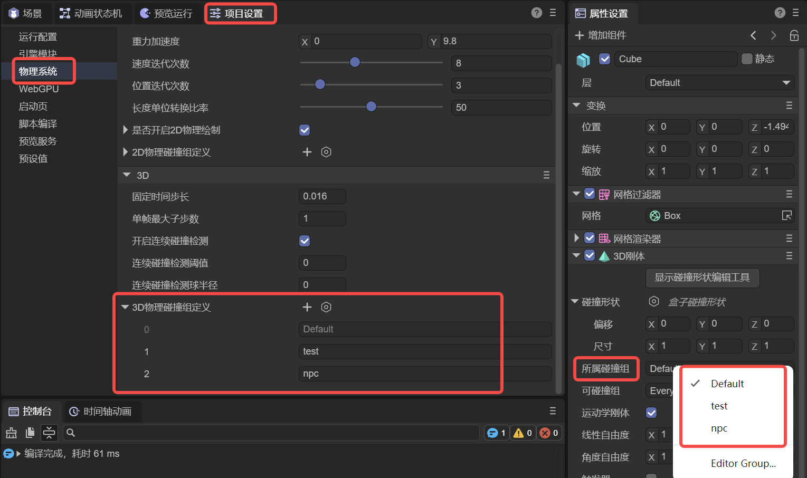
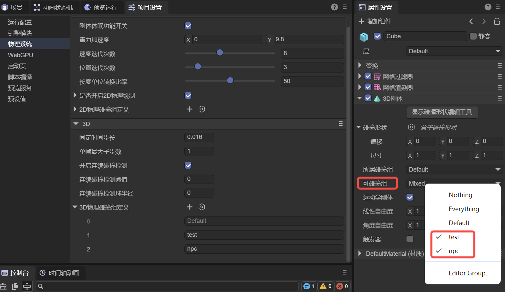
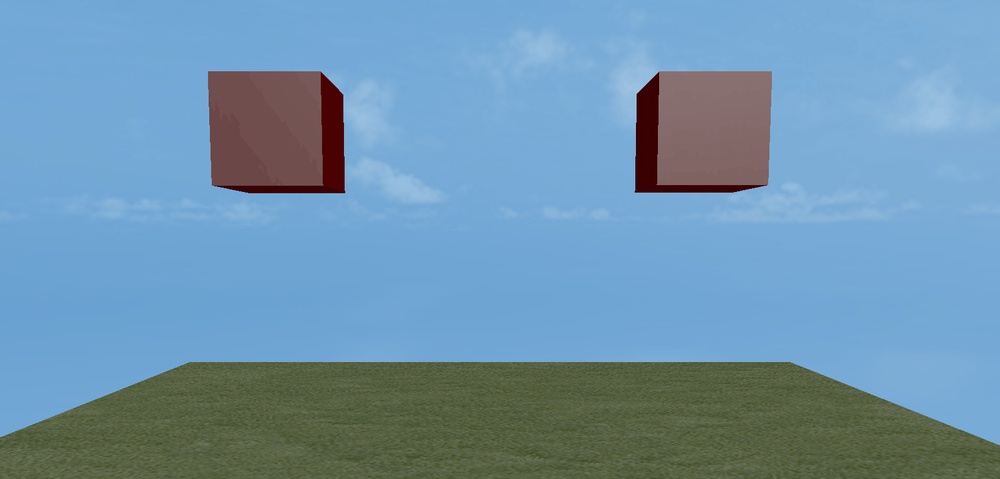
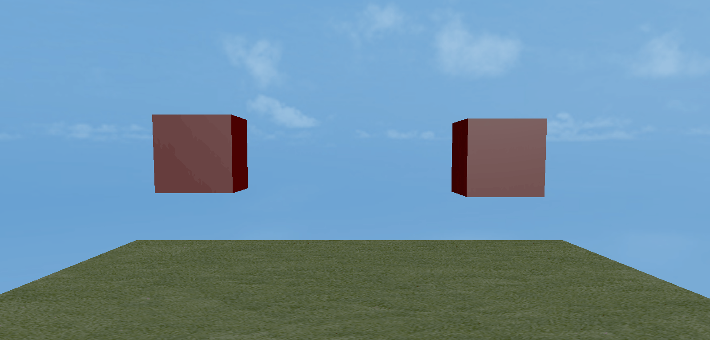
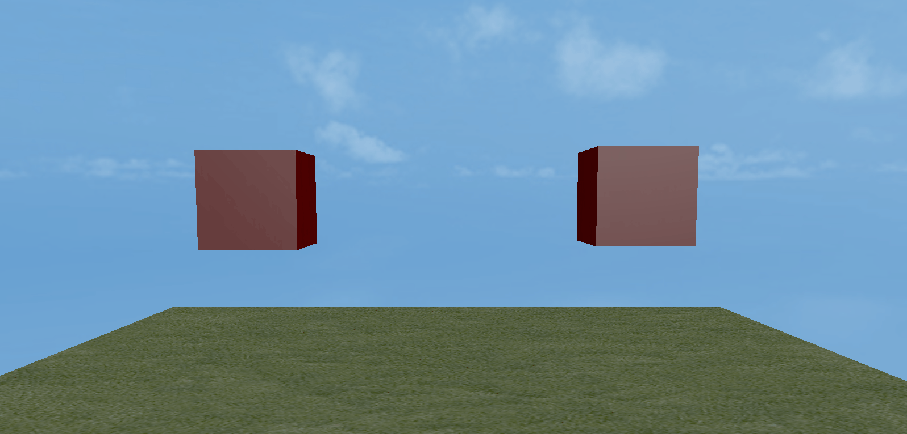
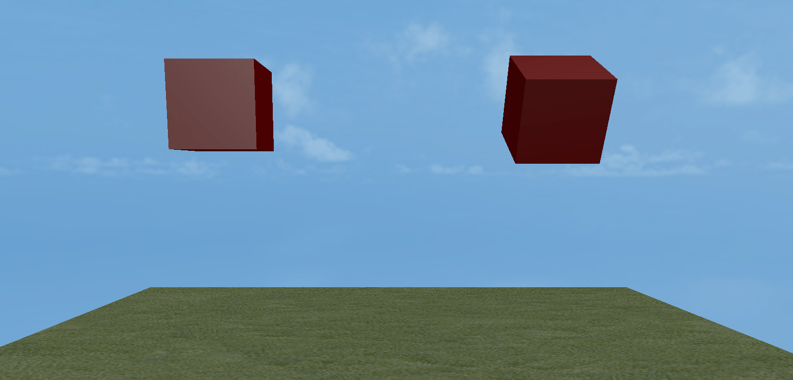
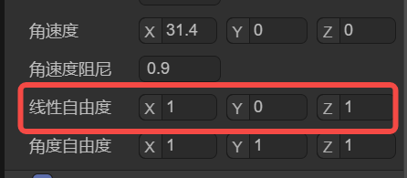

# 3D刚体

> Author : Charley        Version >= LayaAir 3.2

我们知道，所有有形体的物质在自然界中都可以被称为物体。

**刚体**是力学中的一个抽象概念，用来描述物体的特性。它是一种理想化的力学模型，**指的是在受力或运动过程中，物体的形状和大小保持不变，且物体内部各点之间的相对位置不发生变化**。

然而，现实世界中不可能存在完全符合这一定义的刚体模型。因为当物体受到力的作用时，力的大小、物体的材质、弹性、塑性等因素会导致物体发生形变。尽管如此，在很多物理模拟中，若物体的形变对整体运动过程影响较小，或者为了简化问题，我们仍然将物体视为刚体，忽略其形状和体积的变化。这样的近似方法通常能够获得与实际情况相符的结果。

在LayaAir3引擎中，**3D刚体的类为Rigidbody3D**，这是一个物理的组件类，继承自物理碰撞器组件类 PhysicsColliderComponent，**它提供了物理模拟所需的全部核心功能**，包括力的应用、速度控制、重力影响、碰撞响应等。

## 1、碰撞器基类属性

### 1.1 碰撞形状 colliderShape

**碰撞形状**是用于描述物体与其他物体发生碰撞时，如何检测和响应碰撞的几何体。它定义了物体的物理边界，即物体的外形，以便物理引擎能够准确判断物体之间是否发生接触，并据此计算碰撞后的反应。

LayaAir引擎支持的碰撞形状包括盒子碰撞形状、球体碰撞形状、胶囊碰撞形状、圆柱体碰撞形状、圆锥体碰撞形状、网格碰撞形状，每种碰撞形状适用于不同类型的物体，如图1-1所示：

 

(图1-1)

碰撞形状的选择不仅影响物理碰撞计算的精度，也直接影响游戏或物理模拟的性能。

对于动态物体，通常会选择较简单的碰撞形状以提高效率；而对于静态物体，可以使用更复杂的碰撞形状来保证更高的精度。合理选择碰撞形状是3D物理模拟中至关重要的一步，它能够在保证物理效果的真实性的同时，优化系统的计算性能。

#### 1.1.1 盒子碰撞形状

盒子碰撞形状是一个长方体或立方体，如图1-2所示，适用于简单的方形物体，例如箱子、建筑物的墙壁等。它可以用于大多数规则形状的物体。

 

（图1-2）

我们可以通过偏移localOffset和尺寸size，来设置盒子碰撞形状的位置与尺寸，如图1-3所示。

 

（图1-3）

#### 1.1.2 球体碰撞形状

球体碰撞形状是最简单的碰撞形状，它使用一个球体来代表物体的碰撞边界，如图1-4所示。物理引擎通过检查球体之间的距离来判断物体是否发生碰撞。

由于其计算简单，更节省性能。球体碰撞形状适用于体积较小且形状接近球形的物体，如弹丸、球类以及简单的物体等。

 

（图1-4）

我们可以通过偏移localOffset和半径radius，来设置球体碰撞形状的位置与大小，如图1-5所示。

 

#### 1.1.3 胶囊碰撞形状

胶囊碰撞形状是由一个圆柱体和两个半球形的端点组成，类似于一个胶囊的形状。如图1-6所示。它通常用于模拟垂直方向较高但宽度较小的物体，常见的应用场景是人物角色的控制器。除此之外，胶囊形状也适用于其他柱状物体，例如立柱或类似形状的机械部件。

 

(图1-6)

我们可以通过偏移localOffset、半径radius、长度length、方向orientation，来设置胶囊碰撞形状的位置、胶囊粗细、胶囊长短、胶囊朝向，如图1-7所示。

 

(图1-7)

#### 1.1.4 圆柱体碰撞形状

圆柱体碰撞形状用于表示一个圆柱形物体的碰撞边界，通常用于那些具有对称形状的物体。它适合用于模拟一些较高的、但形状较为规则的物体，如管道、柱子等。如图1-8所示。圆柱形状也常用于需要旋转的物体，比如旋转的齿轮、滚筒等。由于其简单的几何结构，计算相对高效。

 

（图1-8）

我们可以通过偏移localOffset、半径radius、高度height、方向orientation，来设置圆柱体碰撞形状的位置、圆柱粗细、圆柱高矮、胶囊朝向，如图1-9所示。

 

（图1-9）

#### 1.1.5 圆锥体碰撞形状

圆锥体碰撞形状用于表示一个锥体物体的碰撞边界，它有一个圆形底面和一个顶点，适合用于那些形状为圆锥体的物体，如图1-10所示。圆锥体常用于模拟一些具有锥体结构的物体，如锥形石块、圆锥状的机械部件、尖刺、导弹等，能够确保物体碰撞时具有自然的物理反应。

 

(图1-10)

我们可以通过偏移localOffset、半径radius、高度height、方向orientation，来设置圆锥体碰撞形状的位置、圆锥底大小、圆锥高矮、圆锥朝向，如图1-11所示。

 

（图1-11）

#### 1.1.6 网格碰撞形状

网格碰撞形状使用物体的3D模型（网格）作为碰撞边界，如图1-12所示，能够精确地与物体的形状匹配。它适用于那些复杂或不规则形状的物体，能够提供非常高的碰撞精度。由于网格碰撞器的计算量较大，它通常只用于静态物体（静态碰撞器），而不适用于动态物体（3D刚体）。如果一定要应用于动态物体，LayaAir引擎会强制应用为凸多边形外观，以优化性能。

 

(图1-12)

我们可以通过偏移localOffset、网格mesh、凸多边形convex，来设置网格碰撞形状的位置、网格资源、是否引擎自动处理为凸多边形（优化性能），如图1-13所示。

 

(图1-13)

#### 1.1.7 碰撞形状编辑工具

LayaAir3.2.4开始，对于碰撞形状，除了通过属性的调整外，还提供了碰撞形状的可视化编辑工具，方便开发者更直观的编辑碰撞形状（网格碰撞形状除外）。

具体操作也很简单，直接点击碰撞形状顶部的“显示碰撞形状编辑工具”即可，进入编辑模式后，可以看到几个白色方块，这些就是编辑点，如图1-14所示。

 

(图1-14)

通过拖动编辑点，可以实现便捷的形状外观改变。

### 1.2 所属碰撞组 collisionGroup

当我们产生复杂的碰撞需求时，例如，想碰哪个，不碰哪个。这时候就需要进行分组，并指定可以与哪个碰撞组进行碰撞。

所属碰撞组用于指定当前碰撞器属于哪个碰撞组，在IDE中，可以通过点击`编辑组`Editor Group跳转到`项目设置`的`物理系统`栏目，添加碰撞分组以及分组的名称。如图1-15所示。



（图-15） 

这里需要说明一下，碰撞分组的名称只是用于IDE里的方便识别，引擎API的组其实是2的N次幂值。

例如图2-1中的Default是2的**0次幂**，也就是1，而自己添加的npc组是2的**2次幂**，实际值是4，以此类推，分组ID为3的碰撞组实际值为8。

所以，如果我们不通过IDE来设置碰撞分组的话，引擎API的碰撞分组需要将值设置为2的幂。

示例代码如下：

```typescript
//用代码指定xxx碰撞器所属哪个碰撞组
xxx.collisionGroup = 1 << 3  ;// 值为2 的 3 次幂（8），可以简单理解分组ID为3，这样就更容易与IDE中的概念统一
```

### 1.3 可碰撞组 canCollideWith

在IDE中可以通过多选分组名称的方式，将值设置给**可碰撞组**，如图1-16所示，用于指定可以与哪些分组的碰撞器发生碰撞。

 

(图1-16)

除了指定自定义的碰撞组，顶部的`Nothing`表示不与任何分组发生碰撞，而`Everything`表示可以与任何分组发生碰撞。

如果开发者需要通过代码的方式传值，也可以基于位运算进行传值，示例代码如下：

```typescript
//指定xxx碰撞器 可以与  某个碰撞组 发生碰撞
xxx.canCollideWith = 1 << 2;  //只与分组ID为2的（值为4）分成发生碰撞

//指定xxx碰撞器 可以与 多个碰撞组 发生碰撞
xxx.canCollideWith = (1 << 1) | (1 << 2) | (1 << 5); //只与分组ID为1、2、5的进行碰撞

//指定xxx碰撞器  不可以  与哪些组 发生碰撞，其它组都可以碰撞
xxx.canCollideWith = -1 ^ (1 << 3) ^ (1 << 6)  //不与分组3、6进行碰撞，除3与6组之外都可以发生碰撞)
```

### 1.4 恢复系数 restitution

恢复系数用于描述物体碰撞时的弹性。恢复系数越大，碰撞后物体反弹的程度越强，能量损失较少；恢复系数越小，则碰撞后的反弹程度越小，物体会有更大的能量损失。例如动图1-17中，下落方块（3D刚体）从左至右的恢复系数分别为0、0.5、1。地板（静态碰撞器）的恢复系数为0.5。

 

(动图1-17)

> 注意，恢复系数的效果与碰撞的双方都有关系，例如，碰撞的一方恢复系数为0，那么不管另一方的恢复系数是多少也为0，即不会有反弹效果。

### 1.5 摩擦力 friction

摩擦力是指两个相互接触并挤压的物体，当它们发生相对运动或具有相对运动趋势时，在接触面上会产生一种阻碍相对运动或相对运动趋势的力。

摩擦力是用来模拟物体间接触时阻力的一个重要参数，影响物体在接触面上滑动的难易程度。值越大，摩擦力越大，物体越难以滑动。

我们将方块（3D刚体）的摩擦力从左至右分别设为0.1、0.3、0.5、1。斜坡（静态碰撞器）的摩擦力设为0，地板（静态碰撞器）的摩擦力设为0.5，效果如动图1-18所示，

 

(动图1-18)

当我们将斜坡（静态碰撞器）的摩擦力设为0.8，其它摩擦力保持不变，效果如动图1-19所示，

 

(动图1-19)

### 1.6 滚动摩擦力 rollingFriction

滚动摩擦力是指一个物体在另一个物体表面上滚动时，物体与接触面之间产生的阻碍物体滚动的力。当摩擦力过大时，甚至会影响滚动。

我们将球体（3D刚体）的滚动摩擦力从左至右分别设为0、0.2、0.3。斜坡（静态碰撞器）的滚动摩擦力设为0。效果如动图1-20所示，

 

(动图1-20)

球体的滚动摩擦力保持不变，斜坡（静态碰撞器）的滚动摩擦力设为0.1。效果如动图1-21所示，只有左侧球还保持着滚动，最右侧的滑动缓慢，近乎静止。

 

(动图1-21)

## 2、3D刚体属性

### 2.1 触发器 trigger

在 3D 刚体中，勾选触发器后，不会参与物理模拟中的碰撞交互，即不会产生碰撞力，也不会影响刚体的运动轨迹。如动图2-1右侧所示。下落的盒子无视地面（静态碰撞器），直接穿透而过。

  

（动图2-1）

触发器的主要作用在于检测其他刚体是否进入、停留或离开其定义的区域。当满足这些条件时，会触发预先设定好的事件或逻辑，从而实现各种丰富的游戏或模拟效果。 

### 2.2 运动学刚体 isKinematic

运动学刚体是一种不受物理力学影响的刚体，它的运动由程序控制，例如，通过3D变换属性来移动，而不是通过物理引擎的力学计算来驱动。

与普通刚体不同，运动学刚体不受重力、摩擦力等物理因素的作用，因此它可以精确地控制物体的位置和旋转。

此外，运动学刚体还能够显著提高性能，因为它不需要物理引擎对物体的每个运动进行计算。这对于需要大量物体存在的场景尤其重要，可以减轻物理引擎的负担。

运动学刚体通常需要配合触发器使用，仅检测碰撞事件但不受力学影响，适合需要与其他物体交互但不需要物理碰撞反馈的场景。

基于运动学刚体的特性，当勾选运动学刚体后，与力相关的属性会自动隐藏，如图2-2所示。

 

(图2-2)

### 2.3 重力 gravity

重力指的是物理引擎施加在刚体上的一种恒定加速度，通常模拟现实世界中的引力。

重力会影响刚体的运动，使其向某个方向（通常是向下，即 Y 轴负方向）持续加速，从而模拟真实世界中的自由落体效果。

默认的重力值为 **(0, -9.8, 0)**，表示物体会以 9.8 m/s² 的加速度向下坠落。

动力学刚体在同等的质量下，重力越大，下落的加速度越大。对比效果如动图2-3所示。

  

（动图2-3）

### 2.4 质量 mass

质量是衡量物体所含物质多少的物理量。在 3D 刚体的数字模拟环境里，质量可以理解为对刚体 “惯性大小” 的一种量化描述。

它是一个标量值，不具有方向，仅表示刚体的一个物理特征，不同的刚体可以有不同的质量数值，用来模拟现实世界中不同物体的重量差异。

在物理引擎中，质量通常用于计算物体的**运动方程**，符合牛顿第二定律：`F=m*a`。

其中，**F** 是作用在刚体上的合力，**m** 是刚体质量，**a** 是刚体产生的加速度。因此，如果一个刚体的质量较大，受到相同的力时，它的加速度会较小；反之，质量较小的刚体会更容易被推动。

如动图2-4所示，左侧箱子质量明显要大于右侧的箱子。

   

（动图2-4）

### 2.5 线速度 linearVelocity

线速度是描述刚体沿某一方向的直线运动速度的物理属性，由一个三维向量（x, y, z）表示，分别对应刚体在X、Y、Z 轴上的速度分量，该分量值既有大小又有方向。

动图2-5，是在同样重力值为0的情况下，没有设置线速度，和y轴设置了线速度值的对比效果。

  

（动图2-5）

### 2.6 线速度阻尼 linearDamping

如果没有外力作用，线速度会保持不变，使刚体持续运动。

线速度阻尼用于模拟**空气阻力**或**粘性阻力**等效果，使刚体的线速度随时间逐渐减小，从而在没有外力作用时，刚体不会无限运动。

动图2-6，是同样`重力为0`和`y轴线速度为-1`的情况下，左侧箱子线速度阻尼为0.9，右侧箱子线速度阻尼为1的对比效果。

  

（动图2-6）

### 2.7 角速度 angularVelocity

角速度是描述刚体绕某一轴旋转速度的物理属性，由一个三维向量（Vector3）表示，分别对应刚体围绕X、Y、Z 轴的旋转速率分量，该分量值既有大小又有方向。单位是**弧度/秒**。

简单来说，角速度衡量的是 3D 刚体绕某一旋转轴转动的快慢和方向，它体现了刚体在单位时间内绕轴转动的角度变化情况。

想象一个旋转的陀螺，角速度越大，陀螺在相同时间内转过的角度就越大，也就是旋转得越快；反之，角速度越小，旋转就越慢。

动图2-7，是角速度的x轴分别设置了3.14与31.4的对比效果。

  

（动图2-7）

### 2.8 角速度阻尼 angularDamping

角速度阻尼是用于模拟刚体在旋转过程中所受到的阻碍其转动的因素的一个物理属性。就如同现实世界中物体旋转时会受到空气阻力、摩擦力等阻碍其持续转动的力量一样，在 3D 物理模拟里，角速度阻尼就是用来量化这种阻碍效果的参数。

动图2-8，是在同样的31.4角速度下，左侧为1的的角阻尼值，右侧为0.9的角阻尼值，对比效果。

  

（动图2-8）

### 2.9 线性自由度 linearFactor

**线性自由度**是指**刚体在 X、Y、Z 三个轴向的平移能力**，即是否可以在某个方向上自由移动。例如在平面上推箱子，X、Z 方向可推动，Y 方向（竖直方向）被锁定。

**控制方式，通过某个轴的0或1，决定是否被锁定：**

- **自由（1）** → 允许刚体在该方向上移动。
- **锁定（0 ）** → 刚体在该方向上的位移被锁定，无法移动。

图2-9中的设置表示，X、Z 轴方向可自由移动。Y轴方向被锁定，无法移动。

 

（图2-9）

> 需要注意的是，自由度的限制，是基于物理力的轴运动。例如，线速度的设置，不会被线性自由度的设置而限制。

### 2.10 角度自由度 angularFactor

**角度自由度**是指**刚体在 X、Y、Z 三个轴向的旋转能力**，即是否可以在某个方向上旋转。例如铰链门， 只允许绕 Y 轴旋转，X、Z 轴的旋转被锁定。

**控制方式：**

- **自由（1）** → 允许刚体在该轴向旋转。
- **锁定（0 ）** → 该轴的旋转被锁定，刚体无法绕该轴旋转。

图2-10中的设置表示，Y 轴方向可自由旋转。X、Z轴方向被锁定，无法旋转。

 

（图2-10）

> 需要注意的是，自由度的限制，是基于物理力的轴运动。例如，角速度的设置，不会被角度自由度的设置而限制。

## 3、关联文档

### [《3D物理系统》](../../../physicsEditor/physics3D/readme.md)