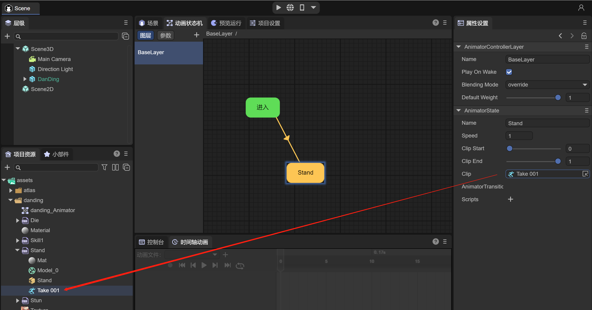
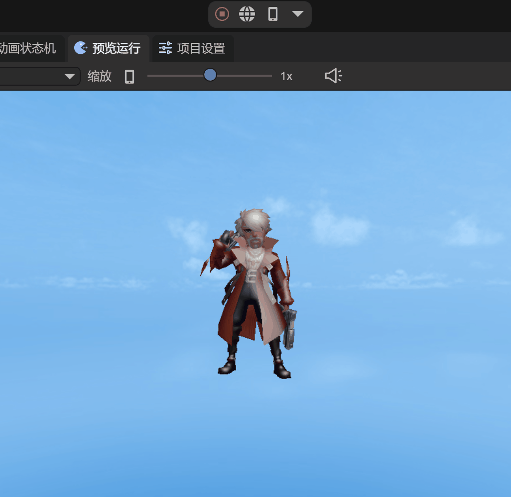
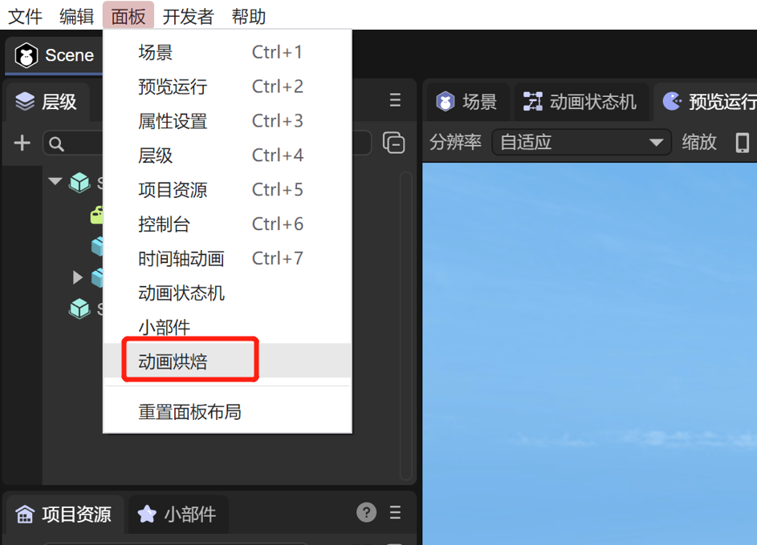
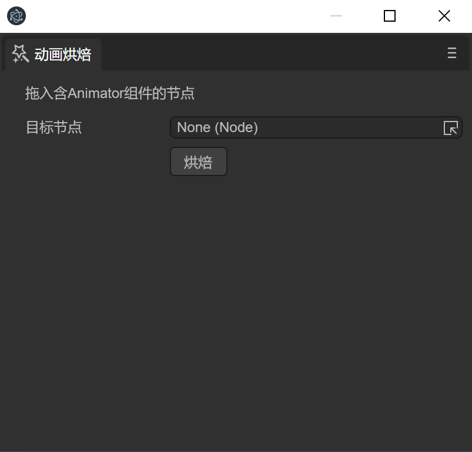
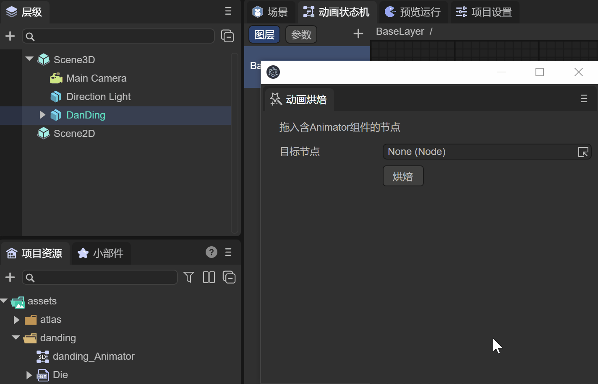
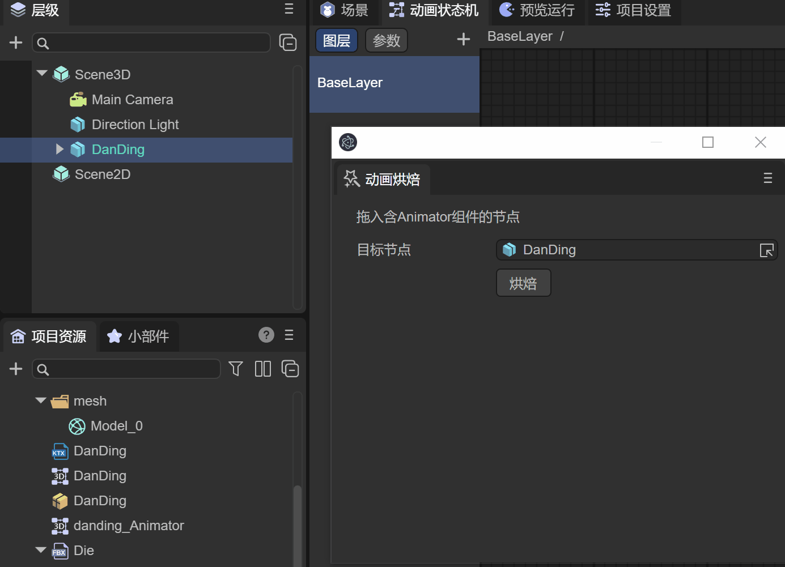
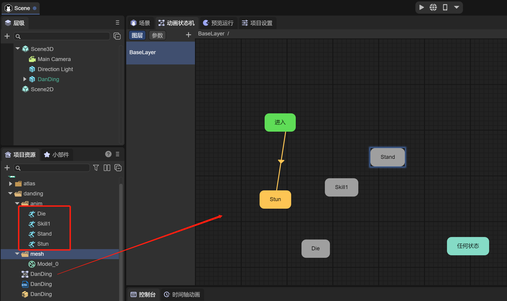

# 动画烘培详解

上面两篇文档介绍了在LayaAir3.0中如何使用时间轴动画及动画状态机，本篇将介绍一种特殊的动画优化方案，动画烘培。什么是动画烘培，动作烘培是将所有动作提前计算一次；将所有的骨骼节点预计算，存入内存中；gpu直接通过内存读取对应节点的矩阵值；进行渲染的方式。通过使用动画烘培，可以降低cpu的消耗，因为GPU动画效率高于CPU动画，对于大量使用骨骼动画的场景，可以大大提高性能。

## 一、IDE中使用动画烘培

由于在LayaAir项目中播放动画的对象都需要添加 `Animator` 组件，因此我们先准备好一个带 Animator 的动画对象，如图1-1所示

（图1-1）

在动画状态机中配置好动画状态和动画片段，如图1-2所示

（图1-2）

此时运行场景，可以看到人物在做待机的动画，如动图1-3所示

 

（动图1-3）

此时的动画是通过CPU计算骨骼的信息来播放动画的，接下来我们来使用动画烘培，用GPU来计算动画数据

在菜单中，点击“面板”，选择“动画烘培”，如图1-4所示

 

（图1-4）

可以打开“动画烘培”工具，如图1-5所示

 

（图1-5）

从工具中可以了解到，要想对上面的带Animator的动画做动画烘培，需要把包含Animator组件的节点，拖入到工具中，如动图1-6所示，我们来拖入节点

 

（动图1-6）

通过点击烘培后，开始执行动画烘培。在节点名字“DanDing”的目录下会生成动画烘培后的数据文件。

> 注意：生成数据文件的目录名是节点的名字

我们来看看都生成了什么数据文件，如图1-7所示

 

（图1-7）

其中，在danding目录下

- anim目录：存入动画.lani文件（可以多个动画文件）

- mesh目录：存入模型文件

- DanDing.ktx：烘培后的数据文件，使用ktx纹理图片的格式，用来存放计算好的动画数据

- DanDing.controller：重新以节点名字命名的3D动画状态机文件

- DanDing.lh：保存烘培后的预制体，可以直接使用。点击预制体，可以从图1-7中后边看到，模型节点上配置了SimpleSkinnedMeshRenderer组件，同时配置好烘培的数据文件

  

这时我们可以直接使用代码或者直接将预制体拖入场景中，在LayaAir示例中，可以看到加载大量烘培后的动画，效率有大幅提高，如图1-8

预烘培骨骼动画示例：https://layaair.layabox.com/3.x/demo/?category=3D&group=8&name=6

## 二、烘培多个动画

通常情况下Animator中会配置好多个动画，那么就可以一次性的烘培所有的动画，如图2-1所示

 

（图2-1）

接下来，重新对DanDing节点，做动画烘培，如动图2-2所示

 

（动图2-2）

此时，多个动画就烘培好了，如图2-3所示

 

（图2-3）

在anim目录中生成了多个动画lani文件。

> 提示：如果开发者有多个FBX文件，每个FBX文件只有一个lani动画文件，在IDE中是不能直接把lani动画文件从FBX文件中导出的，可以通过动画烘培的方式导出lani文件使用，从而保证项目的动画资源比较精简。

打开controller文件后，可以看到所有的动画状态已经创建，后面直接使用预制体就好了。

到此为止，动画烘培已经介绍完了，开发者可以在项目的优化过程中使用LayaAir3.0提供的动画烘培工具，进一步提高性能。

