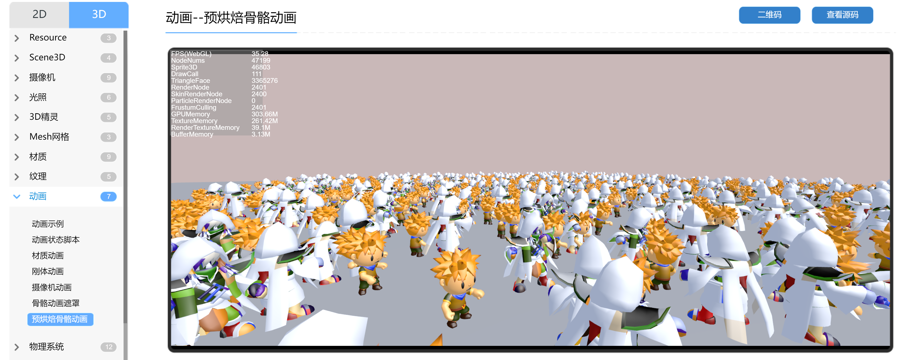

# 动画烘焙详解

上面两篇文档介绍了在LayaAir中如何使用时间轴动画及动画状态机，本篇将介绍一种特殊的动画优化方案，动画烘焙。什么是动画烘焙呢？动画烘焙是将所有动画提前计算一次；将所有的骨骼节点预计算，存入内存中；GPU直接通过内存读取对应节点的矩阵值；进行渲染的方式。通过使用动画烘焙，可以降低CPU的消耗，因为GPU动画效率高于CPU动画，对于大量使用骨骼动画的场景，可以大大提高性能。

## 一、从资源商店中导入插件

从LayaAir3.1开始，开发者进行动画烘焙可通过[资源商店](https://store.layaair.com/)导入“3D骨骼动作烘焙插件”到LayaAir IDE中。

（图1-1）

> 详情参考[《3D骨骼动作烘焙插件》](../../layapackage/Layabox/BakeAnimation/readme.md)文档。

## 二、使用动作烘焙

由于在LayaAir项目中播放动画的对象都需要添加Animator组件，因此我们先准备好一个带Animator的动画对象，如图2-1所示

（图2-1）

在动画状态机中配置好动画状态和动画片段，如图2-2所示

（图2-2）

此时运行场景，可以看到人物在做待机的动画，如动图2-3所示

（动图2-3）

此时的动画是通过CPU计算骨骼的信息来播放动画的，接下来我们来使用动画烘焙，用GPU来计算动画数据

在菜单栏中，点击“面板”，选择“动作烘焙”，如图2-4所示

（图2-4）

可以打开“动作烘焙”插件，如图2-5所示

（图2-5）

参数说明：

`目标节点`：场景中的带骨骼动画节点；

`忽略骨架`：生成蒙皮动画时，忽略掉骨骼节点；

`帧数`：每秒多少帧（数量越大动作越细腻平滑，同时需要的贴图数量成线性比例增加）；

从插件中可以了解到，要想对上面的带Animator的动画做动画烘焙，需要把包含Animator组件的节点，拖入到插件中，如动图2-6所示，

（动图2-6）

通过点击`烘焙动作`后，开始执行动画烘焙。

> 动画烘焙的动画不支持动画融合。

在节点名字“DanDing”的目录下会生成动画烘焙后的数据文件。

> 注意：生成数据文件的目录名是节点的名字

我们来看看都生成了什么数据文件，如图2-7所示

（图2-7）

其中，在danding目录下

- anim目录：存入动画.lani文件（可以多个动画文件）

- mesh目录：存入模型文件

- DanDing.ktx：烘焙后的数据文件，使用ktx纹理图片的格式，用来存放计算好的动画数据

- DanDing.controller：重新以节点名字命名的3D动画状态机文件

- DanDing.lh：保存烘焙后的预制体，可以直接使用。点击预制体，可以从图2-7中后边看到，模型节点上配置了SimpleSkinnedMeshRenderer组件，同时配置好烘焙的数据文件

  

这时我们可以直接使用代码或者直接将预制体拖入场景中，在LayaAir示例中，可以看到加载大量烘焙后的动画，效率有大幅提高，如图2-8所示，

> 预烘焙骨骼动画示例：https://layaair.com/3.x/demo/?category=3D&group=8&name=6

有时，开发者烘焙后，会遇到模型手上的武器丢失的情况。这是由于模型的手与武器节点没有绑定，需要将武器节点作为手节点的子节点，烘焙时就可以绑定。

>“层级结构”并不是检验绑定与否的唯一方法。将武器节点作为手节点的子节点，可以确保两者绑定，防止重新烘焙。

例如，图2-9中，两个武器节点并没有作为两个手节点的子节点，此时并不确定手与武器节点是否绑定（需要结合具体情况判断），

（图2-9）

此时将两个武器节点作为两个手节点的子节点，如图2-10，则可以保证它们是绑定的。

（图2-10）

## 三、烘焙多个动画

通常情况下Animator中会配置好多个动画，那么就可以一次性的烘焙所有的动画，如图3-1所示

（图3-1）

重新对DanDing节点做动画烘焙后，多个动画就烘焙好了，如图3-2所示

（图3-2）

在anim目录中生成了多个动画lani文件。

打开controller文件后，可以看到所有的动画状态已经创建，后面直接使用预制体就好了。

