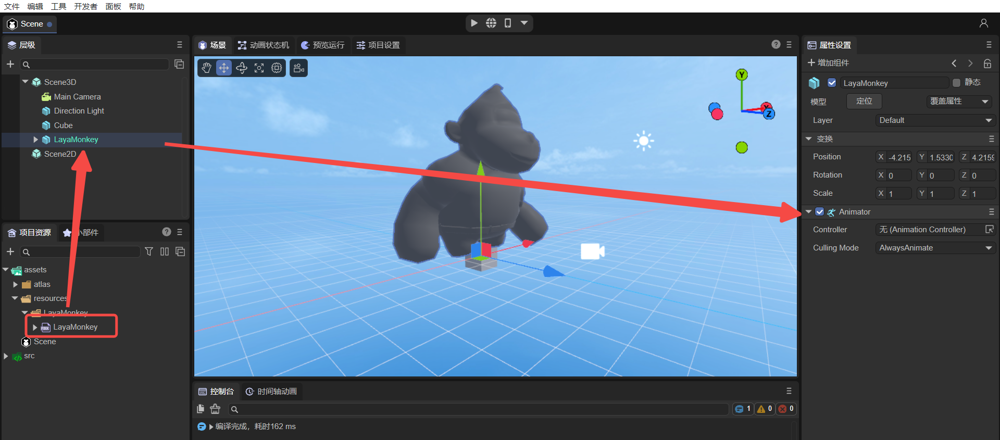
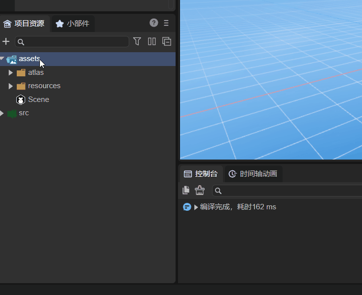
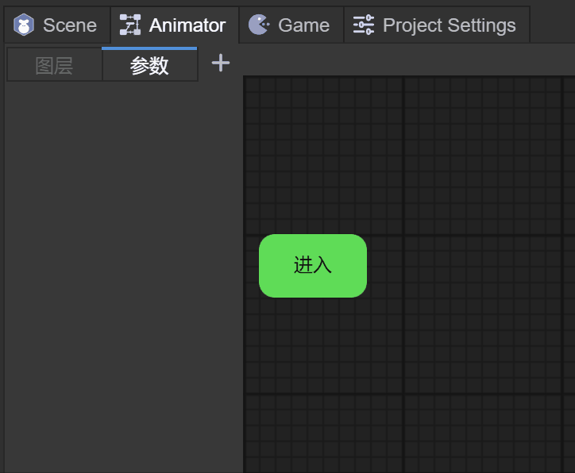
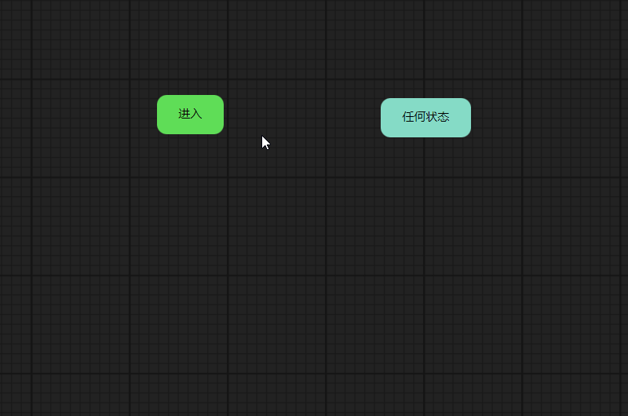
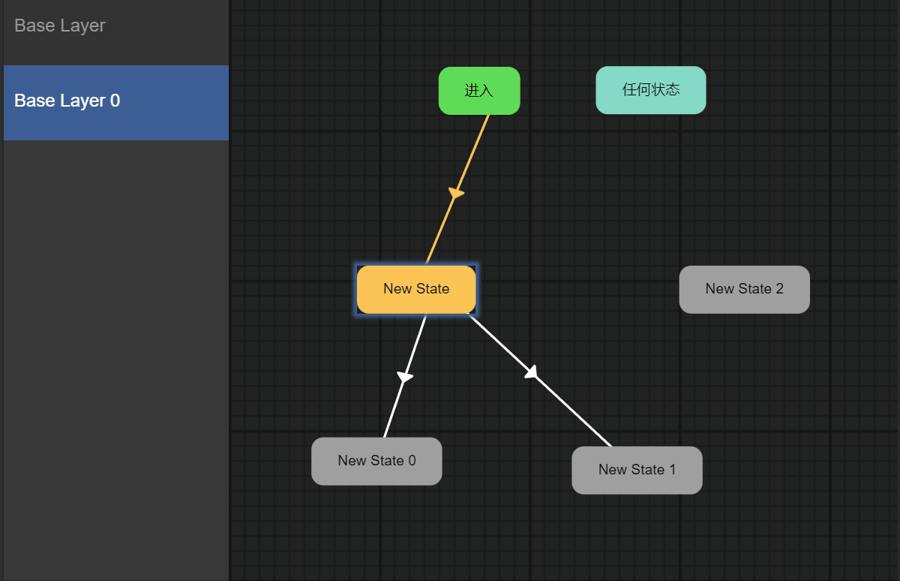
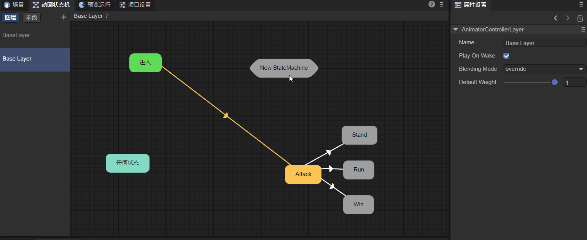
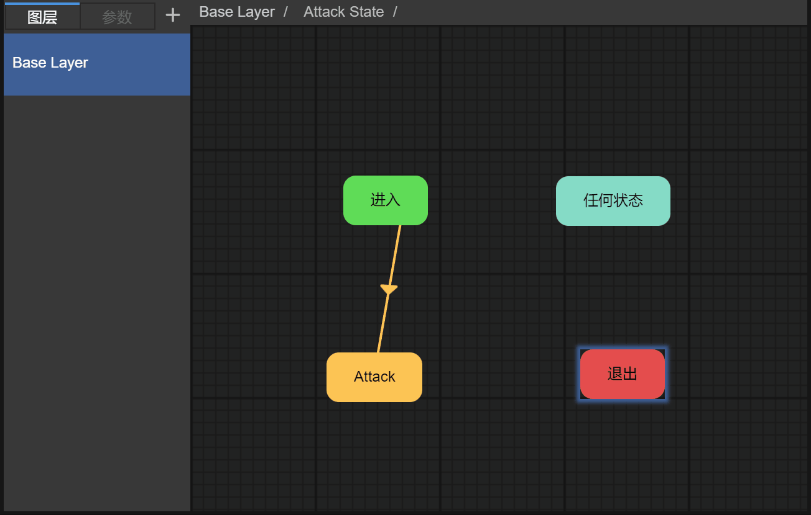

# 动画状态机详解

LayaAir IDE的动画状态机，适用于2D与3D。

本篇中的功能介绍，如果是2D与3D通用的操作，默认以3D为例进行说明，如果存在2D与3D差异的部分，会针对差异进行额外的说明。

> 隨着版本的升级，文档中截图的部分细节可能会稍有差异，以IDE实际版本为准，如果改动较大的我们会及时调整，未及时调整的欢迎联系官方客服进行反馈。


## 一，概述

我们先来了解一下什么是动画状态机和它的构成，后面再进一步了解每个部分。

首先，动画状态机 `Animator` 可以允许我们定义动画状态，以及动画状态之间的切换条件，来驱动3D对象播放不同的动画，表现出不同的行为。那么动画状态机有下面几部分构成：

- 动画状态机组件 `Animator Component` ：是Sprite3D上的一个组件，用来控制动画状态机的接口。
- 动画状态机文件 `Animator Controller` ：是一个文件，用来执行整个状态机逻辑，驱动动画状态运行，执行状态切换。同时定义了驱动参数，可以由代码逻辑驱动这些参数，再由这些参数驱动动画。
- 动画状态 `Animator State`：是状态机的一个动画状态，用来执行动画的逻辑，定义动画播放的属性，可以改变单一动画的播放位置、时间、层级等等。
- 动画切换 `Animator Transition`：由参数和比较条件构成，当条件满足时，会切换到相应的动画状态。每个状态，可以创建多个到其它状态的切换。

通过下图，可以清晰了解这四个部分的关系，如图1-1所示：


（图1-1）


## 二、动画状态机组件

我们需要播放动画以及使用动画状态机的对象都需要添加 `Animator` 组件，该组件是控制动画状态机的接口，下面我们来看看 `Animator` 组件。


#### 2.1 场景中的节点添加

场景中添加的任一节点都可以添加动画状态机组件，下述介绍以cube为例。首先在场景创建一个cube节点，**选中cube节点**后，就可以在编辑器的`增加组件`面板中添加 `Animator` 组件。如动图2-1所示： 


（动图2-1）


#### 2.2 预制体中添加

我们不仅可以在场景中的节点添加动画状态机组件，还可以在预制体中创建。

> 不理解预制体的，请先查阅预制体的文档[<<预制体模块>>](../../prefab/readme.md)。

从操作看，从场景上创建与预制体里创建并没有本质上的区别。

主要的区别是：

- 场景中的节点创建，适用于只用一次动画的情况。
- 预制体中创建，适用于需要多次复用动画的情况。


#### 2.3 默认添加

某些情况下，`Animator` 组件会自动添加到节点下，如图2-2所示，当我们导入一个FBX模型文件到场景中时，已经默认添加好了 `Animator` 组件。



（图2-2）


#### 2.4 组件属性

`Animator` 组件有两个属性，`Controller` 和 `Culling Mode`，如图2-3所示：

 

（图2-3）

`Controller` ：使用的 `Animator Controller `文件，当有了 `Animator` 组件，依然不能打开动画状态机，我们需要创建动画状态机文件，下一章将具体介绍。

`Culling Mode`：剔除模式，`Always Animate `表示即使摄像机看不见也要进行动画播放的更新，`Cull Completely ` 表示摄像机看不见时停止动画的所有更新。


## 三、动画状态机文件

`Animator Controller` 是一个文件，用来执行整个状态机逻辑，驱动动画状态运行，执行状态切换。


#### 3.1 创建动画状态机文件

Project面板中，任何目录下都可以创建一个动画状态机文件。如动图3-1所示：  



（动图3-1）


#### 3.2 自动创建动画状态机文件

对于一个带网格和动画信息的Fbx模型文件来说，如图3-2所示，Fbx文件导入过程中，LayaAir 3.0编辑器已经识别出这个Fbx文件具有`Animator`属性，并可以设置是否可开启压缩。


 （图3-2）

当我们拖Fbx模型到场景中时，会自动添加动画状态机组件。打开`时间轴动画`面板，会自动创建动画状态机文件，如图3-3所示：


（图3-3）

这种情况下，LayaAir 3.0已经自动为我们创建好了`Animator Controller`文件，下一步就可以编辑动画状态机了。


#### 3.3 打开动画状态机

当我们点击动画状态机文件后，可以点击 `动画状态机` 面板来打开动画状态机，如图3-4所示。


（图3-4）

LayaAir 3D引擎的Sprite3D类提供了 `getComponent()` 方法来获取模型上的组件。带动画的模型在加载创建时引擎默认赋予了`Animator（动画状态机）`动画组件，因此我们可以这样获取：

```typescript
//获得状态机
this.animator = this.target.getComponent<Laya.Animator>(Laya.Animator);
```

> 注：这段代码来自“3D入门示例”的“Animator”场景。


#### 3.4 编辑动画状态机

 `动画状态机` 面板中，可以做一些常规的操作，如动图3-5所示，下面一章，我们将引入动画状态的介绍和操作。 


（动图3-5） 


#### 3.5 动画状态机分层

默认情况下，一个动画状态机文件只有一个默认的层 `BaseLayer`，如图3-6所示，比如一个角色模型的常规动作（待机，跑，攻击），我们只需要一个默认层就可以了。

 

（图3-6）

但是我们也可以创建更多的分层，多个分层可以用来解决什么样的问题呢？试想一下如果你要开发一款第三人称的射击游戏，那么肯定是希望身体的动画分为上下两部分，上方根据瞄准的位置和是否射击进行动画播放，下方根据移动播放动画。所以更多复杂的需求可以用分层来解决，如图3-7所示，我们又添加了一个分层，并命名为Layer1。

 

（图3-7）

##### 3.5.1 图层的属性

每个图层是有一些参数属性的，如图3-8所示：

 

（图3-8）

**1.**`Name`：图层的名字。

**2.**`Play On Wake`：是否默认播放这个层的动画。

**3.**`Blending Mode`：动画混合方式：

- `Override`：覆盖，表示当前层的动画会覆盖掉其它层的动画，比如射击播放时右手就不能播放其它的动画了；
- `Additive`：添加，表示当前层的动画的量添加到其它层的动画，比如射击播放时，手部奔跑或站立的甩动也会保留。

**4.**`Default Weight`：动画层的权重，默认的Base Layer必须为1。如果设置为0则当前层的动画不会播放，1则会播放，0-1之间会采用类似融合的情况来播放动画，比如之前说的边移动边射击的情况，如果设置为0.5则射击动画播放时手部只会抬到脖子附近。

通过代码，我们可以获得想要的图层，需要使用Animator的 `animator.getControllerLayer(layerIndex)`方法，该方法的定义如下：

```typescript
    /**
     * 获取控制器层。
     */
    getControllerLayer(layerInex: number = 0): AnimatorControllerLayer {
        return this._controllerLayers[layerInex];
    }    
```

举一个使用此方法的例子：

```typescript
//获得BaseLayer层AnimatorControllerLayer
let animatorControllerLayer : Laya.AnimatorControllerLayer = this.animator.getControllerLayer(0);
//获得当前BaseLayer层的默认动画状态
let defaultState = animatorControllerLayer.defaultState;
```

**5.**`Avatar Mask`：动作遮罩，进行遮罩后，选定的上层动作会遮挡下层的动作。以一个具体的例子来说明：

假设有两个图层，如图3-9所示，fight和congratulate，


（图3-9）

将Blending Mode属性设置为覆盖后，congratulate层的动作会覆盖fight层的动作，congratulate效果如动图3-10所示。


（动图3-10）

此时的覆盖，是将fight动作全都覆盖掉了，如果想上半身是fight动作，下半身是congratulate动作，这就需要动作遮罩了，先来看一下动图3-11的fight动作，方便进行对比。


（动图3-11）

在项目资源面板中，添加`AvatarMask`后，如图3-12所示，可以添加预制体或模型资源，这里选择预制体，然后点击`导入骨架`按钮。


（图3-12）

导入后的骨架，勾选的部位，就是要进行遮罩的地方。如图3-13所示，这里勾选了下半身的骨架，那么就是要对下半身的动作进行遮挡。


（图3-13）

原本，congratulate层的动作会遮挡fight层的动作，并且会全部遮挡。现在，在congratulate层添加AvatarMask，按照刚刚的设置，congratulate层只遮挡fight层的下半身动作，也就是上半身仍然是fight层的动作不被覆盖，下半身的动作被遮挡变为congratulate层的动作。效果如动图3-14所示。


（动图3-14）

可以看到，上半身是fight动作，下半身是congratulate动作，这就是动作遮罩的用法。

> 这只是最基本的一种用法，如果只有一个动画层，比如给fight动画层的下半身添加动画遮罩，那么此时就只显示下半身动画了。


##### 3.5.2 图层的参数

每个图层是可以添加一些参数的，如图3-15所示，具体这些参数是在动画切换中会用到，我们将在第五章动画切换中介绍。

 

（动图3-15）

目前LayaAir中，我们可以添加这三种参数：

- `Float`：浮点数
- `Bool`：布尔
- `Trigger`：触发器


## 四、动画状态

动画状态 `Animator State`，是动画状态机里的一个动画状态，每个状态对应一个动画，所以叫动画状态。用来执行动画的逻辑，定义动画播放的属性，可以改变单一动画的播放位置、时间等等。而我们的游戏逻辑状态，可能由一系列的动画状态构成。


#### 4.1 系统状态

动画状态机创建时，会默认创建2个系统状态，如图4-1所示：

 

（图4-1）

任何状态 `AnyState`：当我们需要在条件满足时，无论当前是哪个状态，都执行切换时，可以定义切换为从该状态开始。

进入 `Entry`：进入状态，当进入一个动画状态机时，会首先执行从该状态到默认状态的切换。

当创建**子状态机**时，会默认多创建一个退出状态，如图4-2所示： 


（图4-2）

> 子状态机的内容请参看第七章。

退出 `Exit`：当需要退出该子状态机时，可以执行一个到该状态的切换。


#### 4.2 创建动画状态

##### 4.2.1 新建动画状态

在动画状态机面板中，鼠标右键点击空白处，点击创建空节点即可。如动图4-3所示：



（动图4-3）

##### 4.2.2 拖入一个动画状态

在Project面板中，可以拖动一个Fbx下的动作文件到Animator面板中，如动图4-4所示  ：


（动图4-4）

此时，我们已经可以自动播放一个动画了，这是最基本最简单的用法，不需要做额外的工作，可以让LayaMonkey动起来！

 

（动图4-5）


#### 4.3 动画状态属性

作为动画状态机里的每一个动画状态，我们都可以对此状态做单独的设置，如图4-6：


（图4-6）

##### 4.3.1 基础属性

`Name`：动画状态的名字，可以在代码里用来播放动画。

`Is Looping`：是否循环播放。

`Speed`：动画的播放速度。

`Cycle Offset`：循环偏移，基于播放起始时间的偏移值，仅作用于动画首次播放（0-1之间）。

`Clip Start`：动画文件的起始播放位置（0-1之间）。

`Clip End`：动画文件的停止播放位置（0-1之间）。

`Clip`：动画文件（.lani）。

> 注意：参数“Cycle Offset”不影响动画播放完整性，例如“Clip Start”设置为0，“Clip End"设为1，”Cycle Offset“设为0.8，那么动画就是从0.8这个位置开始播放，再播放到0.8这个位置算一次循环。

通常Fbx文件中包含的动画文件，通过拖入Animator中，会自动把动画文件关联进来，如图4-7所示：


（图4-7）

##### 4.3.2 切换列表

`AnimatorTransition`：列出了所有此动画状态连接其它动画状态的动画切换，如图4-8所示： 


（图4-8）

单机`New State -> New State 0`可以打开AnimatorTransition详细面板，双击` New State -> New State 0`，可以改名，如动图4-9所示：


（动图4-9） 

##### 4.3.3 solo与mute

solo与mute：两个选框，Solo表示只生效这一条切换，Mute相当于把这条动画切换禁用掉，如图4-10所示：


（图4-10）

**注意：**

> solo和mute都可以多选，但是优先级是按照添加顺序的，将会在5.5切换优先级中讲解。

> 条件满足优先于Solo/Mute，当条件没有满足时依然不会过渡，将会在5.5切换优先级中讲解。


## 五、动画切换

从一个状态过渡到另一个状态的过程就是动画切换，由参数和比较条件构成，当条件满足时，会切换到相应的动画状态。每个状态，可以创建多个到其它状态的切换。


#### 5.1 创建动画切换

当我们创建好动画状态后，通过在前一个状态上点击鼠标右键，选择连线，此时会创建一点连线，拖动鼠标到后面的动画状态上抬起鼠标，即可创建动画切换，点击此连线时，点击键盘的delete键可以删除此连线。如动图5-1所示：

 

（动图5-1）

当我们从New State连了New State 0，New State 1，New State 2后，在不添加任何条件的情况下，New State会继续切换到New State 0状态，因为New State 0是最先连的。


#### 5.2 设置为默认

当我们创建好多个动画状态时，如果想设置某个动画状态为进入状态，可以鼠标右键点击此动画状态，选择设置为默认即可，如动图5-2所示：

 

（动图5-2）

> 注意：当我们创建第一个动画状态时，会默认把这个状态设为默认状态，当然我们随时可以改为其它动画状态为默认状态。


#### 5.3 动画切换属性

点击一条连线时，可以看到动画切换的属性，如图5-3所示，用来处理动画切换的动画调整效果。


（图5-3）

`Exit Time`：该时间是一个0-1的归一化时间，用来定义在动画播放的时间百分比。比如0.85，表示动画播放到85%时，开始切换动画。Exit Time的逻辑功能类似于float参数，但是不能进行设置。

`Transstartoffset`：该时间是一个0-1的归一化时间，目标状态的时间偏移，即从哪个时间点开始播放目标状态动画。比如0.5，表示目标状态从50%开始播放动画。

`Transduration`：该时间是一个0-1的归一化时间，用来定义状态切换到目标状态时，持续播放后一个动画状态的时间百分比。比如0.15，表示动画播放到目标动画的15%时，停止切换动画。

**注意：**

> - 处于过渡时间时，动画1和动画2同时播放。当过渡时间结束，动画1才彻底停止播放，而动画2进入下一段切换的判断。
>
> - 当过渡时间为0时，动画1会直接切换到动画2。
>

`Exit By Time`：是否让Exit Time 生效，如果不勾选，该动画是直接切换到下一个动画。

动图5-3-1和动图5-3-2分别是勾选Exit Time和不勾选的对比效果，明显来看，不勾选会出现动画不衔接的情况。

  

（动图5-3-1）													（动图5-3-2）


#### 5.4 动画切换条件

状态切换可以有一个条件，多个，或者没有条件。如果切换没有条件，那么动画系统也会将Exit Time 作为唯一的条件，当到达时间时触发切换。如果有多个条件，必须所有条件都满足，才触发切换。

目前LayaAir中，我们可以添加这三种参数：

##### 5.4.1 Float：浮点数

如动图5-4所示，我们来看看Float条件怎么设置，首先要定义一个Float的参数，其次在条件中，可以选择这个Float参数，右边会选择 Less 或者 Greater，最后可以填上数值。那么动图5-4的意思是，当Float大于0.5时，切换New State到New State0。

> 注意：当定义这个Float参数时，可以设置默认值，比如1，那么如果条件是Float参数 Greater 0.5，则条件直接打成，运行时会直接切换状态


 （动图5-4）

可以通过代码来满足条件，代码如下：

```typescript
//通过设置“Float”参数的值，来满足切换状态的条件
this.animator.setParamsNumber( "Float" , 2 );
```

运行效果如动图5-5：


（动图5-5）

##### 5.4.2 Bool：布尔

如动图5-6所示，我们来看看Bool条件怎么设置，首先要定义一个Bool的参数（有true或false），其次在条件中，可以选择这个Bool参数，最后可以勾选true或者false。那么动图5-6的意思是，当Bool为true时，切换New State到New State0。

> 注意：当定义这个Bool参数时，可以设置默认值，比如true，那么如果条件是Bool参数 true，则条件直接打成，运行时会直接切换状态 


（动图5-6）

可以通过代码来满足条件，如下：

```typescript
//通过设置“Bool”参数的值，来满足切换状态的条件
this.animator.setParamsBool( "Bool" , true );
```

运行效果如动图5-7：


（动图5-7）

##### 5.4.3 Trigger：触发器

如动图5-8所示，我们来看看Trigger条件怎么设置，首先要定义一个Trigger的参数（有true或false），其次在条件中，可以选择这个Trigger参数。那么后面我们可以通过代码来使用触发器，切换New State到New State0 。


（图5-8）

通过代码来满足条件，如下：

```typescript
//通过触发“Trigger”，来满足切换状态的条件
this.animator.setParamsTrigger( "Trigger" );
```

运行效果如动图5-9：


（动图5-9）

##### 5.4.4 多个参数使用

当然我们可以定义多个参数，但是这种情况下需要对参数进行命名会更有效。如动图5-10所示来修改名字 ：


（动图5-10）

修改好名字后，可以比较清晰的来编辑切换条件，如图5-11所示：


（图5-11）

**注意：这些条件中只要满足一个就可以触发动画切换，而不是并且的关系**


#### 5.5 切换优先级

一个动画状态下如果连有多个动画状态时，我们来看看优先级时怎样的。

- 当没有任何条件时或者条件都满足时，没有选择solo和mute的情况下，如图5-12：


（图5-12）

此时，Attack动画播完会播放Stand动画，因为Stand动画是第一个。


- 当没有任何条件时或者条件都满足时，如果某个选了solo时，如图5-13：


（图5-13）

此时，Attack动画播完会播放Run动画，因为Run动画选了solo。


- 当没有任何条件时或者条件都满足时，如果都选了solo时，如图5-14：


（图5-14）

此时，Attack动画播完会播放Stand动画，因为即使都选了solo，但是动画切换只能选一个，按顺序Stand是第一个。


- 如果Attack-> Stand的条件不满足，Attack-> Run的条件满足，但是依然也如上图5-14一样，都选了solo。

此时，Attack动画播完会播放Run动画，因为Attack-> Stand的条件不满足


- 当没有任何条件时或者条件都满足时，如果都选了solo时，并Attack-> Stand选了mute，如图5-15：


（图5-15）

此时，Attack动画播完会播放Run动画，因为Attack-> Stand选了mute。


- 当没有任何条件时或者条件都满足时，如果都选了solo和mute时，如图5-16 ：


（图5-16）

此时，Attack动画播完不会切换任何状态。


## 六、动画播放及脚本

上面的章节中，只需要用简单的代码，就可以控制状态机来满足条件，播放指定的动画状态，除此之外，我们也可以通过代码来更多的控制动画播放。


#### 6.1 播放控制

在获得动画状态机组件，添加了多个动画状态的情况下，那怎么播放其中一个动画呢？有几种方法实现对动作的控制与切换：

##### 6.1.1 Play()

查看Animator动画组件中`play()`方法，具体方法参数如下：

```typescript
/**
* 播放动画。
* @param	name 如果为null则播放默认动画，否则按名字播放动画片段。
* @param	layerIndex 层索引。
* @param	normalizedTime 归一化的播放起始时间。
*/
play(name: string | null = null, layerIndex: number = 0, normalizedTime: number = Number.NEGATIVE_INFINITY)
```

这是动画状态机里最基本的播放动画方式，通过下面的代码：

```typescript
//动画状态机，直接播放Run动画状态
this.animator.play("Run");
```

看看运行效果，如动图6-1所示：

 

（动图6-1） 

通过Play()的参数也可以指定播放动画的起始位置：

```typescript
//动画状态机，直接播放Stand动画状态，从50%的位置开始
this.animator.play("Stand", 0 , 0.5);
```

看看运行效果，如动图6-2，每次鼠标点击按钮，可以从50%的位置开始播放Stand动画。

  

（动图6-2） 

当然我们也可以通过代码修改动画状态的属性，播放不同的效果：

```typescript
//获得动画状态机的BaseLayer层，也可以获得其它层
let acl: Laya.AnimatorControllerLayer = this.animator.getControllerLayer(0);
//获得一个动画状态
let state = acl.getAnimatorState("Stand");
//设置动作状态的名称
state.name = "Stand_new";
//设置动作状态播放的起始时间（起始时间与结束时间的设置为0-1的百分比数值）  要截取的时间点 / 动画的总时长
state.clipStart = 10/40;
//设置动作状态播放的结束时间
state.clipEnd = 20/40;
//动画播放是否循环
state.clip.islooping = true;
//动画状态机，直接播放Stand_new动画状态
this.animator.play("Stand_new");
```

看看运行效果，如动图6-3所示：

 

（动图6-3） 

##### 6.1.2 crossFade()

动画过度融合是用于在给定的时间内从一个动画状态平滑过渡到另一个动画状态。如果一个动画跳转到另一个完全不同的动画耗时很短，那么过渡通常的表现令人满意。

先来看看Animator动画组件中`crossFade()`方法，具体方法参数如下：

```typescript
    /**
     * 在当前动画状态和目标动画状态之间进行融合过渡播放。
     * @param	name 目标动画状态。
     * @param	transitionDuration 过渡时间,该值为当前动画状态的归一化时间，值在0.0~1.0之间。
     * @param	layerIndex 层索引。
     * @param	normalizedTime 归一化的播放起始时间。
     */
    crossFade(name: string, transitionDuration: number, layerIndex: number = 0, normalizedTime: number = Number.NEGATIVE_INFINITY)
```

通过代码调用如下：

```typescript
//动画状态机，过渡融合到Run动画状态
this.animator.crossFade("Run", 0.3);
```

看看运行效果，如动图6-4，将待机动画和跑步动画混合起来。

 

（动图6-4） 

##### 6.1.3 暂停动画

播放动画说完了，我们再来说一下暂停动画。可以直接使用动画的播放速度控制动画的暂停与播放，直接设置需要暂停动画的播放速度为0即可，继续播放只需要重新设置速度为1。

```typescript
//暂停动画
this.animator.speed = 0.0;
//播放动画
this.animator.speed = 1.0;
//一半速度播放动画
this.animator.speed = 0.5;
```

看看运行效果，如动图6-5所示：

  

（动图6-5） 


#### 6.2 获取播放状态

获取动画播放状态，需要先使用Animator的 `animator.getControllerLayer(layerIndex)`方法：

```typescript
    /**
     * 获取控制器层。
     */
    getControllerLayer(layerInex: number = 0): AnimatorControllerLayer {
        return this._controllerLayers[layerInex];
    }    
```

获得 `AnimatorControllerLayer` 后，再使用 `getCurrentPlayState()` 方法：

```typescript
    /**
     * 获取当前的播放状态。
     * @return 动画播放状态。
     */
    getCurrentPlayState(): AnimatorPlayState {
        return this._playStateInfo!;
    }
```

获得 `AnimatorPlayState` 后，有三个常用的方法获取播放状态如下：

```typescript
    /**
    * 播放状态的归一化时间,整数为循环次数，小数为单次播放时间。
    */
    get normalizedTime(): number {
    	return this._normalizedTime;
    }

    /**
    * 当前动画的持续时间，以秒为单位。
    */
    get duration(): number {
    	return this._duration;
    }

    /**
    * 动画状态机。
    */
    get animatorState(): AnimatorState {
    	return this._currentState!;
    }
```

通常我们可以利用 `normalizedTime` 来判断是否某个动画状态是否播完，例如下面的代码：

```typescript
const { regClass, property } = Laya;

@regClass()
export class Main extends Laya.Script {
    @property( { type: Laya.Label } )
    private label: Laya.Label;  
    @property( { type: Laya.Sprite3D } )
    private target: Laya.Sprite3D; 

    private animator : Laya.Animator;

    onStart() {
        this.label.on( Laya.Event.CLICK, this, this.test );
        //获得状态机
        this.animator = this.target.getComponent<Laya.Animator>(Laya.Animator);
    }

    //运行状态机的跑动画，可使用动作融合方式
    test(e: Laya.Event) 
    {
        //动画状态机，过渡融合到Run动画状态
        this.animator.crossFade("Run", 0.1);
        //等待动画播放完成
        Laya.timer.frameLoop(1,this,()=>{
            //如果当前播放state已经播放完了一次
            if(this.animator.getControllerLayer(0).getCurrentPlayState().normalizedTime >= 1){
                //回到站立状态
                this.animator.crossFade("Stand", 0.1);
                Laya.timer.clearAll(this);
            } 
        });        
	}
}
```

看看运行效果，如动图6-6所示：

  

（动图6-6） 


#### 6.3 使用状态脚本

对我们的开发需求来说，能够播放和切换动画状态还不够，可能还需要在每一个状态内实现更多的需求，例如当进入或者离开下一个状态时，播放不同的音效，那么通过添加动画状态脚本可以很容易实现，如图6-7所示，每个状态都可以添加一个或者多个状态脚本 。


（图6-7）

##### 6.3.1 创建脚本

我们通过动图6-8，来看看如何为一个站立状态创建一个动画脚本。首先在`项目资源->src`目录中，创建一个动画脚本，然后选中Stand状态，在`Scripts`下点击`+`按钮，即可挂上刚刚创建的动画脚本。


（动图6-8）

##### 6.3.2 脚本使用

我们来看看刚刚创建的动画脚本，初始的代码如下：

```typescript
const { regClass } = Laya;
interface AnimatorPlayScriptInfo {
    animator: Laya.Animator | Laya.Animator2D;
    layerindex: number;
    playState: Laya.AnimatorState | Laya.AnimatorState2D;
}
/**
 * 继承自AnimatorStateScript(动画状态脚本)
 * @author ...
 */
 @regClass()
export class AnimationScript extends Laya.AnimatorStateScript {
    /**动画的状态信息 */
    playStateInfo: AnimatorPlayScriptInfo = { animator: null, layerindex: -1, playState: null };

    /**@internal */
    setPlayScriptInfo(animator: Laya.Animator | Laya.Animator2D, layerindex: number, playstate: Laya.AnimatorState | Laya.AnimatorState2D) {
        this.playStateInfo.animator = animator;
        this.playStateInfo.layerindex = layerindex;
        this.playStateInfo.playState = playstate;
    }
    constructor() {
        super();

    }


    /**
     * 动画状态开始时执行。
     */
    onStateEnter(): void {
        console.log("动画开始播放了");
    }

    /**
     * 动画状态运行中
     * @param normalizeTime 0-1动画播放状态
     */
    onStateUpdate(normalizeTime: number): void {
        console.log("动画状态更新了");
    }

    /**
    * 动画状态退出时执行。
    */
    onStateExit(): void {
        console.log("动画退出了");
    }

}
```

AnimationScript脚本继承自Laya.AnimatorStateScript，`setPlayScriptInfo`是一个生命周期函数，可通过该函数获取当前脚本的动画组件、动画状态机层级、动画状态机。

```typescript
 /**说明
     * setPlayScriptInfo为生命周期函数，如果想获得动画状态机的信息，必须要调用。
     * @param animator 当前脚本的动画组件
     * @param layerindex 当前脚本所处的动画状态机层级
     * @param playState  当前脚本的动画状态机
     */
     setPlayScriptInfo(animator: Laya.Animator | Laya.Animator2D, layerindex: number, playstate: Laya.AnimatorState | Laya.AnimatorState2D) {
         this.playStateInfo.animator = animator;
         this.playStateInfo.layerindex = layerindex;
         this.playStateInfo.playState = playstate;
     }
```

此脚本还具备三个方法：

- onStateEnter：动画状态开始时执行；

- onStateUpdate：动画状态运行中，方法中可以获得当前状态执行的时间长度 normalizeTime；

- onStateExit：动画状态退出时执行；

我们可以通过重写这几个方法，来实现动画状态改变时执行自己的逻辑。简单加入一些代码来看效果：

```typescript
const { regClass } = Laya;
interface AnimatorPlayScriptInfo {
    animator: Laya.Animator | Laya.Animator2D;
    layerindex: number;
    playState: Laya.AnimatorState | Laya.AnimatorState2D;
}

/**
 * 继承自AnimatorStateScript(动画状态脚本)
 * @author ...
 */
@regClass()
export class AnimationScript extends Laya.AnimatorStateScript {
    /**动画的状态信息 */
    playStateInfo: AnimatorPlayScriptInfo = { animator: null, layerindex: -1, playState: null };

    private isShow: boolean = false;
    private _label: Laya.Label;
    /**@internal */
    setPlayScriptInfo(animator: Laya.Animator | Laya.Animator2D, layerindex: number, playstate: Laya.AnimatorState | Laya.AnimatorState2D) {
        this.playStateInfo.animator = animator;
        this.playStateInfo.layerindex = layerindex;
        this.playStateInfo.playState = playstate;
        this._label = animator.owner.scene.scene2D.getChildByName("Label");
    }
    constructor() {
        super();
    }

    /**
     * 动画状态开始时执行。
     */
    onStateEnter(): void {
        console.log("动画开始播放了");
        this._label.text = "开始跑动画";
    }

    /**
     * 动画状态运行中
     * @param normalizeTime 0-1动画播放状态
     */
    onStateUpdate(normalizeTime: number): void {
        console.log("动画状态更新了：" + normalizeTime);
        if (normalizeTime > 0.5 && !this.isShow) {
            this.isShow = true;
            this._label.text = "跑动画一半";
        }
    }

    /**
    * 动画状态退出时执行。
    */
    onStateExit(): void {
        console.log("动画退出了");
        this._label.text = "退出跑动画";
    }

}
```

实际运行效果，如动图6-9所示

 

（动图6-9）


## 七、子状态机

子状态机，就是在状态机里面，再创建一个新的状态机，这个新的状态机就叫子状态机。

这个状态机的作用是可以创建另外一套状态，方便来管理复杂的动画状态。举例来说，游戏中角色站着的时候有待机/跑/攻击/防御，下蹲的时候则是另外一套待机/跑/攻击/防御。那么下蹲就是子状态，因为下蹲跑，下蹲攻击这些动作都是基于下蹲这个状态，所以他们可以独立成为一个子状态机。


#### 7.1 创建子状态机

如动图7-1所示，在状态机的空白位置，点击鼠标右键，选择创建节点目录，将会生成一个名为“New StateMachine”的节点，这就是子状态机。双击子状态机可进入子状态机面板，在这个面板中可以看到三个状态， 进入、任何状态和退出 ，这三种状态是属于子状态机的，而非父状态机。父状态机只有进入和任何状态。 


（动图7-1）

同样，我们可以对子状态机进行新的命名，如动图7-2所示 ：



（动图7-2）


#### 7.2 编辑子状态机

比如我们想把角色的所有攻击和技能动画，都放到子状态机中，归为一类作为角色的攻击状态，而父状态机只用来处理待机，跑，眩晕，死亡，胜利等状态。那么我们进入子状态机中，拖入攻击和技能等动画并连线，同之前的父状态机的操作一样。如动图7-3所示：

 

（动图7-3）


#### 7.3 进入子状态机

拖入一个 Attack（Take 001） 动画进去，此时 `进入` 状态会连接到此动画，表示该子状态机的默认状态是Attack。如图7-4所示：

 

（图7-4）

接着回到父状态机，将Idle连接子状态机，实际上相当于连接子状态机中的 `进入` 状态。如动图7-5操作：

 

（动图7-5）


#### 7.4 退出子状态机

如果我们希望Attack动画结束之后，就完成了子状态机的功能，并且退出子状态机，回到父状态机，并回到Idle状态，这个过程属于退出子状态机。

在父状态机里，回到子状态机的状态后，需要继续连线到其它状态，才能让动画连续，如动图7-6所示：



（动图7-6）


