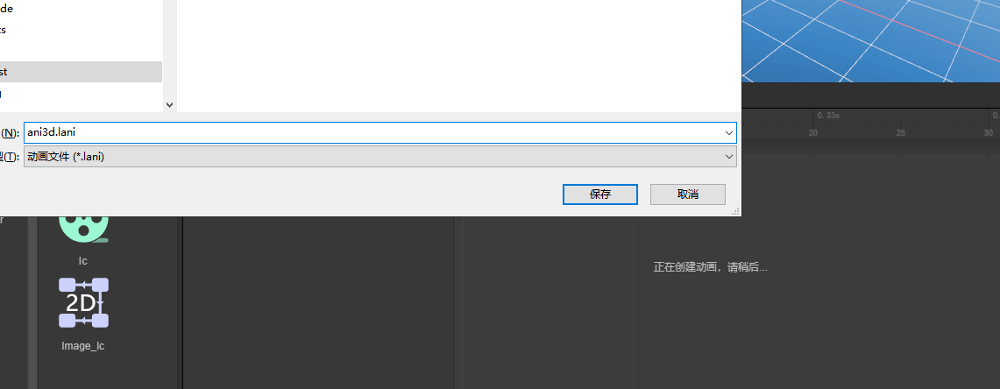
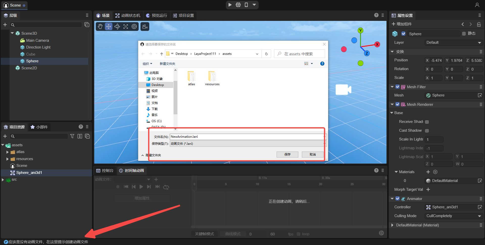
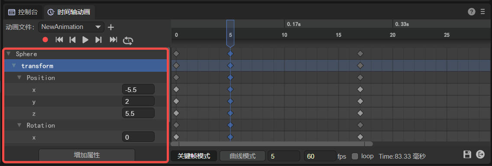
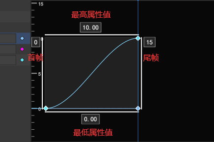
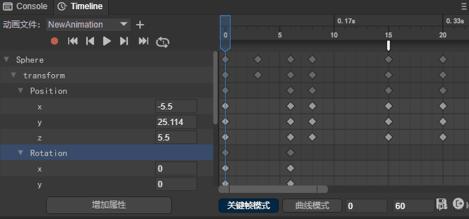
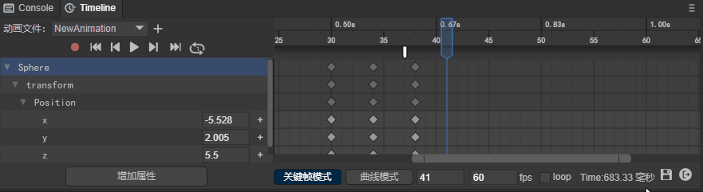
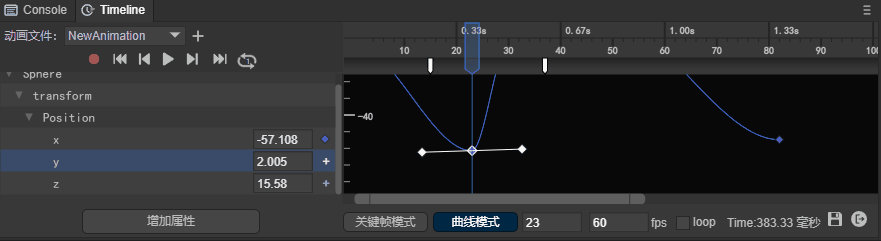
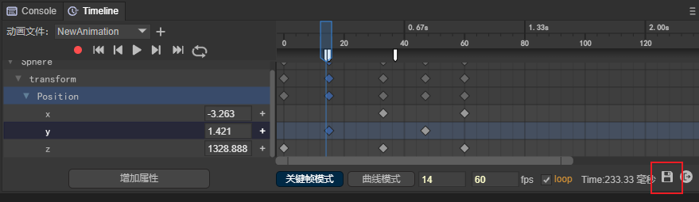

# 时间轴动画编辑详解

>  Author：charley

LayaAir IDE的时间轴动画编辑器，适用于2D与3D动画的编辑。

本篇中的功能介绍，如果是2D与3D通用的操作，默认以3D为例进行说明，如果存在2D与3D差异的部分，会针对差异进行额外的说明。

> 隨着版本的升级，文档中截图的部分细节可能会稍有差异，以IDE实际版本为准，如果改动较大的我们会及时调整，未及时调整的欢迎联系官方客服进行反馈。

## 一、打开时间轴动画编辑器

### 1.1 创建动画

#### 1.1.1 场景中的节点创建动画

场景中添加的任一节点都可以创建动画，下述介绍以cube（立方体）为例。首先在场景创建一个cube节点，**选中cube节点**后，就可以在编辑器下方的`时间轴动画面板（Timeline）` 中看到“`创建`”按钮。如图1-1所示：

 

（图1-1）

点击图1-1的“`创建`”按钮，会弹出如图1-2所示界面，提醒用户设置动画名称。

 

（图1-2）

> [!Tip]
>
> 3D动画文件的后缀是.lani，2D动画文件的后缀是.mc

保存名称后，可以看到时间轴动画编辑面板、动画组件、状态机、动画文件，即代表动画创建成功。如图1-3所示：

 

（图1-3）

#### 1.1.2 预制体中创建动画

我们不仅可以在场景中的节点创建动画，还可以在预制体中创建动画。

> 不理解预制体的，请先查阅[<<预制体模块>>](../../prefab/readme.md)文档。

从操作看，从场景上创建动画与预制体里创建动画并没有本质上的区别。

**主要的区别是：**

- 场景中的节点创建的动画，适用于只用一次动画的情况。

- 预制体中创建的动画，适用于需要多次复用动画的情况。

#### 1.1.3 动画文件后缀

3D创建的动画文件后缀名称为`.lani`，3D动画控制器（也叫动画状态机）文件后缀为`.controller`

2D创建的动画文件后缀为`.mc`，2D动画状态机文件后缀为`.mcc`。

> 在发布微信小游戏等对后缀有限制的平台时，IDE发布功能会自动修改后缀，开发者知道即可，仍按上述标准使用相对路径，引擎会根据不同平台自动适配文件后缀。

#### 1.1.4 动画状态机文件命名规则

首次为**节点**创建动画的时候，不仅会创建一个由开发者自己命名的动画文件，还会自动创建一个动画状态机文件，

状态机文件命名是由`动画节点名_动画名`组成。效果如图1-4所示。

 

（图1-4）

### 1.2 直接启动动画面板

如果节点上已经绑定了动画组件，那么无需再创建动画，直接点击下方的**启动动画面板**按钮即可。如图1-5所示：

 

（图1-5）

### 1.3 不支持动画组件的节点

场景根节点`Scene2D`不支持创建动画。

### 1.4 添加动画组件

当已经创建了动画，只是想在某个节点上复用已创建的动画时，可以通过添加动画组件的方式，直接打开已有动画。

以球体（Sphere）节点为例，进行介绍。

首先，选中球体节点，在右侧的属性面板中点击添加组件，选择Animator组件，在3D节点里只能看到Animator，如果是2D节点只能选Animator2D。

> [!Tip|label:Tips]
>
> Animator2D是2D动画组件，Animator是3D动画组件。

操作顺序如动图1-6所示：

 

（图1-6）

然后，在属性面板中可看到Animator组件。点击Animator组件中的Controller，选择已有的动画状态机。如图1-7所示：


（图1-7）

##### 有动画状态机且有动画文件的情况：

以选择cubeAni01动画状态机为例，选择后，即将此动画绑定在Sphere节点上，在有动画状态机且有动画文件的情况下，刷新后点击动画编辑面板中的启动动画即可。如图1-8所示：

 

（图1-8）

##### 有动画状态机但无动画文件的情况：

假如动画状态机中没有动画，添加动画组件后，动画编辑器面板，会提醒没有动画数据，点击面板按钮可以创建一个新的动画文件。

如图1-9所示：

 

（图1-9）

如果想使用已有的动画，直接从资源窗口中拖拽动画文件到状态机视图窗口即可，效果如图1-10所示。

 

（图1-10）

## 二、时间轴动画编辑器的基础概念

### 2.1 关键帧、空帧

#### 2.1.1 关键帧

关键帧指物体运动变化中关键动作所处的那一帧，即存储了属性值的帧。

 

（图2-1）

#### 2.1.2 空帧

空帧指这个帧里没有设置任何内容，通常指相邻两个关键帧之间的帧。

 

（图2-2）

#### 2.1.3 关键帧与空帧的区别

关键帧：根据关键帧上存储的属性值决定动画的效果变化。

空帧：引擎会根据插值算法计算出播放时的属性值，用于动画俩个关键帧之间的过渡。

### 2.2 当前帧

当前帧指针所在的帧，也是当前鼠标点击选择的帧。

并且，编辑器窗口下方也会显示出当前帧指针所在的位置。以图2-3所示为例，当前帧位于第6帧的位置。

 

（图2-3）

### 2.3 播放帧率

指每秒播放的动画帧数。如图2-4所示，默认值为60。

 

（图2-4）

### 2.4 动画节点属性

动画节点的属性如图2-5左侧所示，当指向某一个关键帧，再通过调节属性值，即可将调整后的属性值存储在该帧中，用于关键帧效果改变的依据。

 

（图2-5）

### 2.5 曲线、切线、权重

#### 2.5.1 曲线

##### 定义：

曲线是指两个关键帧之间用于帧过渡的插值算法连线。

##### 作用：

用于两个关键帧之间的属性插值算法，调节动画关键帧之间的过渡效果。

##### 外观：

曲线线条是关键帧之间的属性数值的过渡算法效果，IDE采用三次贝塞尔曲线（也称三阶贝塞尔曲线）算法绘制，绘制原理如动图2-6所示。

  

(动图2-6)

在动图2-6中，红色的线条就是最终的插值算法曲线效果外观，p0是起始帧，p3是结束帧，纵向红色指针是当前帧基于曲线的运动速度。

曲线的调节，由p1与p2决定，而p1与p2又是由切线与权重决定。

曲线外观的表现有曲线形态，也有直线形态，如图2-7所示，均是采用三次贝塞尔曲线算法绘制。

  

（图2-7）

> [!Tip|label:Tips]
>
> 以上所指贝塞尔曲线算法绘制的曲线均是可调节的曲线。2D动画内置的缓动曲线模板，并非是贝塞尔曲线算法。

#### 2.5.2  曲线切线

在上文的动图2-6中，p0到p1点的线段是p0点的切线，p3到p2的线段是p3的切线，切线的位置会影响曲线的形态。

对应到动画编辑器的效果如动图2-8所示，

 

（动图2-8）

#### 2.5.3 曲线权重

曲线权重是指曲线切线的长度。最短不能低于0，最长不能超过1。也就是上文动图2-6中，p0到p3这两个关键帧之间的长度。

注意观察动图2-9，当改变权重长度时，tips的第三行也会显示出当前权重的数值。

 

（动图2-9）

> 这里仅仅演示权重调节的概念，下文6.1.2小节，会有详细介绍曲线权重如何调节。

### 2.6 刻度

刻度分为横向刻度和纵向刻度，横向刻度是指动画帧的刻度，纵向刻度是指动画属性值刻度。如图2-10所示。

 

（图2-10）

## 三、时间轴动画编辑面板的基础交互

### 3.1 多选

#### 3.1.1 框选

持续按住鼠标左键进行框选，鼠标选区内全选。

#### 3.1.2 连续区域多选

Shift + 鼠标点击，指定首尾帧与属性区间内全选。

#### 3.1.3 间隔多选

ctrl + 鼠标点击，点中哪个选中哪个。

#### 3.1.4 排除

ctrl + 鼠标点击，在已选中的情况下，按住ctrl + 鼠标点击即可排除该项。

#### 3.1.5 多选松开

通用：所选的首帧与尾帧

曲线：显示所选的最高属性值与最低属性值，以及首帧与尾帧。如图3-1所示：

 

（图3-1）

### 3.2 鼠标左键

#### 3.2.1 单击 （改变当前帧）

改变当前帧位置，鼠标点击处为当前帧。

#### 3.2.2 双击

##### 添加动画事件

双击如图3-2所示区域添加动画事件。一帧可派发多个动画事件。

 

（图3-2）

##### 添加关键帧

双击如图3-3所示区域添加关键帧。

 

（图3-3）

#### 3.2.3 拖拽

##### 拖拽单帧

选中某一关键帧进行拖拽，可改变当前关键帧的位置。

##### 批量拖拽多帧

也可批量选中多个关键帧进行拖拽，整体进行位置改变。

### 3.3 鼠标右键

#### 3.3.1 单击

##### 添加关键帧

右键点击关键帧面板区域，可调出关键帧添加菜单。例如，图3-4所示的红1区域，括号内的数字代表是在第几帧上添加。

 

（图3-4）

##### 添加动画事件

右键点击帧刻度与关键帧面板中间的区域，如图3-5所示，可调出添`加动画事件`菜单，括号内的数字代表是在第几帧上添加。

 

（图3-5）

3、点击选中某一关键帧，单击右键调出当前关键帧功能菜单。如图3-6所示：

 

（图3-6）

4、右键点击（3）区域，调出属性添加菜单。如图3-7所示：

 

（图3-7）

5、在曲线模式下，右键单击空白区域，调出曲线自动定位菜单。如图3-8所示：

 

（图3-8）

6、在曲线模式下，右键单击关键帧，调出曲线功能菜单。如图3-9所示：

 

（图3-9）

7、在曲线模式下，右键单击曲线，调出曲线定位菜单。如图3-10所示：

 

（图3-10）

### 3.4 滚轮操作

#### 3.4.1 帧显示缩放

关键帧模式下，直接滚轮，将以鼠标指针为中心，对帧刻度面板进行缩放。如动图3-11所示：

 

（动图3-11）

#### 3.4.2 属性显示缩放

曲线模式下，使用 `Ctrl+滚轮` ， 将以鼠标指针为中心，对属性刻度面板进行缩放。如动图3-12所示：

 

（动图3-12）

#### 3.4.3  帧与属性同时缩放

曲线模式下，直接滚轮，将以鼠标指针为中心，对帧与属性刻度面板同时缩放。如动图3-13所示：

 

（动图3-13）

#### 3.4.3 动画属性面板纵向滚动

当有多个属性超出属性面板的显示区域时，为方便操作可直接通过鼠标滚轮对属性面板进行纵向滚动调节。如动图3-14所示：

 

（动图3-14）

#### 3.4.4 动画帧面板纵向滚动 

当鼠标在动画帧面板时，直接滚动鼠标滚轮只会对帧面板进行缩放。

那我们也需要纵向滚动时，可以在动画帧面板按住`Ctrl+滚动鼠标滚轮`进行纵向滚动操作，如动图3-15所示：

 

（动图3-15）


## 四、属性设置

### 4.1 属性增加

#### 4.1.1 通过按钮增加

如图4-1所示：

 

（图4-1）

#### 4.1.2 通过右键增加

如图4-2所示：

 

（图4-2）

#### 4.1.3 通过录制增加

首先，点击红色的录制按钮，在刻度条变为红色时，代表此时进入到录制状态，此时通过调节右侧的Transform参数，即可在时间轴动画编辑器中添加对应的属性。操作如图4-3所示：

 

（图4-3）

##### 2D动画属性与3D动画属性的差异：

> [!Note]
>
> 2D动画中的每一个属性值均允许单个设置。3D动画中的Vector属性不可缺少，删除也会自动补上。
>
> 2D动画默认是录制模式，3D动画需要点击录制按钮开启录制模式。

### 4.2 关键帧属性设置

#### 4.2.1 属性输入框直接输入

直接在输入框输入数值。如图4-4所示：

 

（图4-4）

#### 4.2.2 属性输入框划动输入

将鼠标放置输入框上，待光标变为双向箭头时，按住左键后左右拖动鼠标，即可改变数值。

#### 4.2.3 录制模式的同步输入

方式1：在录制模式下，在视图窗口拖拽输入。如图4-5所示：
 

（图4-5）

方式2：在录制模式下，在属性窗口的输入。如图4-6所示：


（图4-6）

## 五、帧面板通用操作

### 5.1 关键帧管理

#### 5.1.1 添加

##### 在动画帧面板添加：

在动画帧面板中已有属性的情况下，通过双击或鼠标右键单击如图5-1所示的区域来添加关键帧。

 

（图5-1）

##### 在动画属性面板添加：

在动画属性面板中点击属性右侧的 “+” 号添加，如图5-2所示：

 

（图5-2）

#### 5.1.2 删除

鼠标选中关键帧，通过 “delete” 快捷键或右键菜单中的“删除选中快捷键”按钮进行删除。

#### 5.1.3 复制

鼠标选中关键帧，通过 “ctrl+C” 进行复制。

#### 5.1.4 粘贴

鼠标选中某一空白帧，通过 “ctrl+V” 进行复制。

#### 5.1.5 移动

鼠标选中关键帧，按住左键不放进行拖拽。

### 5.2 关键帧批量管理

#### 5.2.1 批量平移

批量平移，是指对选中的关键帧整体进行水平位置移动，关键帧之间的间距保持不变。

操作方式是对关键帧进行批量选中，然后桉住鼠标左键不放，即可进行批量平移。如动图5-3所示：

 

（动图5-3）

#### 5.2.2 插入移动

插入移动是指，在选中的全部关键帧之中，每两个关键帧之间插入空白帧。所以首帧位置不变，但其后的所有关键帧间距变大或缩小。

##### 间距增大：

选中多个关键帧，执行插入空白帧操作。如动图5-4所示：

 

（动图5-4）

> 为方便理解动图5-4，采用了右键操作，但建议用快捷键F5插入空白帧。

##### 间距缩小：

选中多个关键帧，执行删除空白帧操作。当两个关键帧之间的空白帧全部删除后，会停止删除。但不影响其它关键帧的继续删除操作。如动图5-5所示：

 

（动图5-5）

> 为方便理解动图5-5，采用了右键操作，但建议用快捷键Shift + F5插入空白帧。

#### 5.2.3 批量删除

对关键帧进行批量选中，然后通过快捷键 “delete” 或右键菜单中的删除按钮即可进行批量删除。如动图5-6所示：

 

（动图5-6）

### 5.3 空白帧插入

#### 5.3.1 空白帧单个插入

增加：选中某个关键帧，通过快捷键 “F5” 或右键菜单中的 “插入空白帧” 按钮。

删除：选中某个关键帧，通过快捷键 “shift + F5” 或右键菜单中的 “删除空白帧” 按钮。

#### 5.3.2 空白帧批量插入

增加：选中多个关键帧，通过快捷键 “F5” 或右键菜单中的 “插入空白帧” 按钮。

删除：选中多个关键帧，通过快捷键 “shift + F5” 或右键菜单中的 “删除空白帧” 按钮。

### 5.4 动画事件

#### 5.4.1 添加

在帧面板中如图5-7所示的区域中，可以通过双击或右键菜单中的 “添加动画事件” 按钮来添加动画事件。

  

（图5-7）

#### 5.4.2 删除

鼠标选中动画事件，可以通过快捷键 “delete” 或者右键菜单中的 “移除动画事件” 来删除动画事件。

### 5.5 关键帧跳转 

 

（图5-8）

#### 跳转到首帧

点击如图5-8中的（1）所示的按钮，即可快速跳转到首帧。

#### 跳转到上个关键帧

点击如图5-8中的（2）所示的按钮，即可快速跳转到上一帧。

#### 跳转到下个关键帧

点击如图5-8中的（3）所示的按钮，即可快速跳转到下一帧。

#### 跳转到尾帧

点击如图5-8中的（4）所示的按钮，即可快速跳转到尾帧。

### 5.6 帧面板缩放

#### 5.6.1 滚动条缩放

左缩放：拉动左边滚动条对当前关键帧左边的帧刻度进行缩放。

右缩放：拉动右边滚动条对当前关键帧右边的帧刻度进行缩放。 

滚动条如动图5-9所示：

 

（动图5-9）

#### 5.6.2 滚轮缩放

1、鼠标放在帧刻度上滑动滚轮，此时帧刻度以当前鼠标所在刻度处为中心进行缩放。如动图5-10所示：

 

（动图5-10）

2、鼠标放在属性刻度上滑动滚轮，此时属性刻度以当前鼠标所在刻度处为中心进行缩放。如动图5-11所示：

 

（动图5-11）

> 关于滚轮缩放的锁定某个刻度面板，请上翻查看3.5快捷键小节。

## 六、曲线模式操作

### 6.1 动画曲线调节

#### 6.1.1 使用动画曲线模板

动画曲线模板可分为两种，分别是内置的曲线算法与自定义的曲线算法。

使用内置的曲线算法后，曲线不可随意调整。

使用自定义的曲线算法，曲线可以随意调整。

曲线模板打开方法：在曲线模式下右键单击关键帧，在右键菜单中单击 “使用动画曲线模板” 即可打开曲线模板界面。

> [!Tip|label:Tips]
>
> 内置的曲线算法仅支持2D动画。

##### 内置的曲线算法：

**Linear：**线性动画，也就是匀速。以相同的速度开始以相同的速度结束。动画曲线如图6-1所示：

 

（图6-1）

**EaseIn：**入口缓动曲线，动画以低速开始，进行过程中一直加速。

 

（图6-2）

**EaseOut：**出口缓动曲线，动画进行过程中一直减速，以低速结束。

 

（图6-3）

**EaseInOut：**两边缓动曲线，动画以低速开始，加速后再减速，以低速退出。

 

（图6-4）

##### 自定义的曲线算法：

**Custom：**

如果内置的曲线模板无法满足需求，开发者可以直接在选择Custom曲线模式，然后在面板区域中修改曲线轨迹。

后续，修改后可以将其保存下来，以便复用。

 

（图6-5）

#### 6.1.2 切线调节

 

（图6-6）

**峰值**：曲线过渡插值的最大或最小值所在帧。

**权重**：

- 默认权重：曲线权重默认值是权重总长度的三分之一处，该处为引擎优化位置，采用的是埃尔米特(Hermite)插值算法，性能较好。推荐使用。

    

  （图6-7）

- 自定义权重：自定义权重更加灵活，但是性能不如默认权重的性能好。

   

  （动图6-8）

- 锁定权重：当使用了自定义权重后，如果想保持这个权重，可以锁定该权重，只调节切线位置。

   
  
  （动图6-9）

**功能**：

- 左切线：调节当前关键帧左侧的切线设置参数。
- 右切线：调节当前关键帧右侧的切线设置参数。
- 两条切线：调节当前关键帧俩侧的切线设置参数。

**插值过渡**：

- linear：调整曲线角度，让曲线表现为直线形态。

   

  （图6-10）

- constant：调整曲线角度，让曲线表现为直角折线形态。

   
  
  （图6-11）

#### 6.1.3 平滑

不勾选状态：关键帧俩侧可分别设置曲线左、右切线来调节，互不影响。但是可能会出现过渡不够平滑，形成尖锐角度情况。如图6-12所示：
  

（图6-12）

勾选状态：关键帧两侧同步设置曲线切线，勾选后会使过渡更平滑。

#### 6.1.4 水平

不勾选状态：自定义曲线切线。

勾选状态：勾选后，使曲线切线快速恢复到水平位置。

 

（动图6-13）

### 6.2 曲线定位

#### 6.2.1 在曲线上定位输入

右键单击曲线，在右键菜单中点击 “定位到输入” 选项，即可快速定位到该曲线代表的参数。以绿色曲线为例，点击 “定位到输入” 后，即可发现绿色曲线代表的是X参数的变化。如图6-14所示：

  

（动图6-14）

#### 6.2.2 自动定位

当由于鼠标的一系列操作在曲线面板的显示区域中看不到曲线时，单击右键选择 “自动定位” 就可以使曲线快速显示出来。如动图6-15所示：

   

（动图6-15）

### 6.3 曲线显示筛选

#### 6.3.1 在动画属性面板筛选指定曲线

在动画属面板中双击参数，可快速找到指定曲线。如动图6-16所示：

  

（动图6-16）

#### 6.3.2 在曲线面板筛选指定曲线

在曲线面板中，选中某一曲线右键单击，在右键菜单中选择 “只显示当前曲线” 即可筛选到指定曲线。如动图6-17所示：

 

（动图6-17）

## 七、播放动画

### 7.1 动画面板播放

#### 7.1.1 单次播放

点击播放按钮，会播放动画，默认为单次播放。

单击如图7-1所示按钮，即可播放动画。

 

（图7-1）

#### 7.1.2 循环播放

动画预览默认是单次播放模式，当我们看到循环图标中间有个数字1的时候，就表示处于单次播放的模式。如图7-2所示。

 

（图7-2）

点击单次播放状态按钮后，按钮处于循环图标状态，如图7-3所示，此时可无限循环播放动画。

 

(图7-3)

#### 7.1.3 取消循环播放

点击循环播放状态按钮后，会停止当前循环播放状态，此时循环图标中间又可以看到数字1，说明已取消循环播放，恢复到单次播放模式。

 

（图7-3）

> 需要提醒的是，单次播放模式改变为循环播放模式时，由于当前未处于播放状态，所以不会自动转变为循环播放状态。

### 7.2 查看运行效果

IDE内的播放预览只是动画基础效果，多数情况下，动画还配合了代码交互逻辑，此时还需要在浏览器运行，查看最终运行效果。

点击如图7-4所示按钮，查看在不同平台的预览效果。

  

（图7-4）

由于动画组件，不能独立播放，必须挂在场景中，所以直接运行动画所在的场景即可播放动画。

> 如果想独立查看动画效果，则需要建立一个动图效果的测试场景，挂在测试场景中。

### 7.3 运行时的循环播放

IDE里的循环播放预览，与运行时是否循环播放无关。

如果需要在运行时循环播放，需要勾选图7-5中的loop状态。

  

（图7-5）

不勾选loop，在运行时会单次播放。

## 八、其它

### 8.1 保存动画

点击时间轴动画编辑器下方的保存图标即可。如图8-1所示：

 

（图8-1）

### 8.2 退出动画编辑器

点击时间轴动画编辑器下方的退出图标即可退出动画编辑器。如图8-2所示：

 

（图8-2）

### 8.3 快捷键总结

| 快捷键         | 作用                                                         |
| -------------- | ------------------------------------------------------------ |
| F5             | 插入空白帧                                                   |
| Shift + F5     | 删除空白帧                                                   |
| Delete         | 删除关键帧                                                   |
| Ctrl + c       | 复制关键帧                                                   |
| Ctrl + v       | 粘贴关键帧                                                   |
| Ctrl+滚轮      | 关键帧模式下，动画属性面板与动画帧面板，同时纵向滚动<br />曲线模式下，锁定帧刻度面板（不缩放），以鼠标指针为中心，无限制缩放属性刻度面板的精度。 |
| Alt+滚轮       | 曲线模式下，锁定属性刻度面板（不缩放），以鼠标指针为中心，无限制缩放帧刻度面板的精度。（无限制缩放会导致当缩放拉伸到0帧可见时，不再以缩放前的鼠标指标为中心进行缩放） |
| Alt+Shift+滚轮 | 曲线模式下，锁定锁定属性刻度面板（不缩放），以鼠标指针为中心，有限制缩放帧刻度面板的精度。（始终保持以鼠标指针为中心进行缩放，当缩放拉伸至0帧可见时，禁止刻度精度缩小，只允许刻度精度放大） |
| Shift          | 曲线模式下，持续按住Shift键，可以使得移动关键帧，始终保持水平方向位移，单个与批量移动均有效。 |
| Ctrl           | 曲线模式下，持续按住Ctrl键，可以使得移动关键帧，始终保持垂直方向位移，单个与批量移动均有效。 |

## 九、使用动画事件

在5.4小节中介绍了动画事件添加和删除的操作，我们看看如何使用动画事件

### 9.1 属性设置

当添加动画事件后，点击白色事件图标，可以在IDE后侧属性面板中设置动画事件属性，如图9-1所示

 

（图9-1）

Event Name：在脚本中调用的事件方法名

Params：在脚本中调用事件方式时的传参（字符串），可以设置多个

如图9-2所示，例如对此事件添加一个 “event1” 方法名，添加两个参数，"a", "1"，点击下面的保存

 

（图9-2）

### 9.2 脚本中监听

通过设置动画事件属性后，要想监听到事件和参数，需要在动画节点上添加脚本。

我们通过动图9-2，来看看如何为一个动画节点添加脚本


（动图9-3）

添加脚本后，就可以在脚本中监听到事件和参数了，脚本代码如下：

```typescript
const { regClass, property } = Laya;

@regClass()
export class Script extends Laya.Script {
    //declare owner : Laya.Sprite3D;

    constructor() {
        super();
    }

    event1(p1:any, p2:any): void {
        console.log("event1",p1,p2);
    }
}
```

在脚本中创建event1的方法和接收两个参数，最后我们来运行动画，看看运行结果：

 

（图9-4）