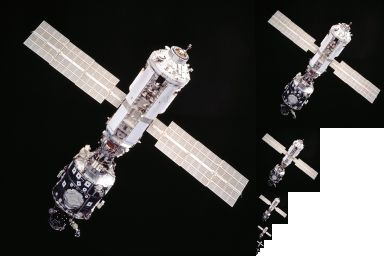

# 立方体贴图的设置与应用

> Author: Charley

## 一、初识立方体贴图

### 1.1 立方体贴图的应用场景

3D场景制作中的**天空盒**与**环境反射**是立方体贴图的应用场景，效果如图1所示。

 

（图1）

### 1.2 什么是立方体贴图

顾名思义，立方体贴图就是基于立方体结构的多纹理组合映射贴图。六个正方形的2D纹理分别表示立方体的各个面，每个面按世界坐标系的方向，分别是：前（z轴正方向）、后（z轴负方向）、左（x轴正方向）、右（x轴负方向）、顶（y轴正方向）、底（y轴负方向）。

如果将这个立方体的贴图展开为一个平面，示意效果为图2所示：

 

(图2) 

如果开发者想直接使用一个展开的2D纹理集作为立方体贴图，LayaAir是不支持的，如何创建一个立方体贴图，我们继续阅读。

## 二、立方体贴图的创建与应用

### 2.1 创建立方体贴图文件

LayaAir引擎的项目资源面板中提供了立方体贴图资源文件的创建流程。

步骤如下：

在`项目资源`面板 --> 右键菜单中**点击**`立方体贴图` --> 为生成的立方体贴图`命名`，

创建流程如图3所示：

 

（图3）

### 2.2 设置立方体的纹理

为立方体贴图设置完六个面（前后左右顶底）的纹理后，点击应用。才会生成对应的立方体贴图纹理，才能被正常使用。

设置完纹理，可以实时预览立方体贴图的效果。效果如图4所示：

 

（图4）

> 每次点击应用后，都会重新生成立方体贴图的纹理，所以弹出正在导入立方体贴图的进度面板是正常现象。

## 三、其它立方体贴图设置

### 3.1 贴图纹理尺寸

贴图纹理的尺寸是指每一个面的纹理尺寸，例如设置为1024，则是表示每一个面的纹理都是1024*1024。

### 3.2 纹理数据模式

纹理的每一个像素数据是采用什么样的模式，在这里进行设置，如图5所示。颜色方面，可以看出，都是基于红绿蓝（RGB）颜色模型。差别在于A与M，以及占位。

 

(图5)

#### 3.2.1 RGB与RGBA

RGB表示无透明通道的数据模式，RGBA表示有透明通道的数据模式。这两种是比较常用的纹理数据模式。其后的位数，是表示所占用的字节数。例如RGBA32位表示R8G8B8A8，也就是说，红色（Red）、绿色（Green）、蓝色（Blue）、Alpha（透明度），这四个通道每个都用8位（即一个字节）来表示，总共是32位。

位数占用越高，越可以表达更精细的颜色变化。但是，也会导致显存占用的增多。另外在某些低端或旧设备上不支持较高位的颜色模型。

#### 3.2.2 RGBM

RGBM的M表示亮度。这是一种用于在低位深度纹理中存储高动态范围（High Dynamic Range，HDR）图像的压缩格式。它是通过将HDR图像的颜色信息（RGB）与亮度（M）信息进行分离和压缩，以减少存储和传输的数据量。

RGBM模式主要用于存储和处理HDR的环境光照信息，这对于环境光照的处理非常有用，因为环境光照通常包含大量的高亮区域，这些区域的颜色信息在普通的RGB模式方式下很容易丢失。

但是，RGBM需要将RGB和M合并后才能得到最终的颜色。所以需要额外的计算处理，并且在颜色范围非常大的情况下，可能会导致颜色精度不足，在某些情况下还会出现颜色的偏差。

### 3.3 生成多级纹理

立方体贴图支持通过勾选的方式`生成多级纹理`，默认不勾选。

> 如果不了解多级纹理的继续阅读，已熟悉的可跳过。

#### 3.3.1 什么是多级纹理

多级纹理的英文是Mipmap，它是一种预先生成的纹理图像序列，基本思想是为一个纹理生成一系列的缩小版本，每个版本的大小都是前一个版本的一半。

例如，如果原始纹理的大小是256x256像素，那么多级纹理就会生成128x128、64x64、32x32、16x16、8x8、4x4、2x2、1x1像素的版本，以不同的分辨率呈金字塔状排列。效果如图6所示：

 

（图6） 

> 多级纹理的原始尺寸必须为2的幂

#### 3.3.2 用多级纹理消除摩尔纹

摩尔纹现象的产生主要是由于纹理贴图在映射到物体表面时，如果物体远离观察者或者物体表面相对较小，纹理的分辨率可能会超过屏幕的像素分辨率，这就导致了纹理中的高频细节（例如，细小的线条或点状模式）在屏幕上无法准确呈现，而被强行压缩或者忽略。当这些高频细节被压缩或忽略时，就可能产生两种相似且规则的模式叠加在一起的效果，形成了类似波纹的摩尔纹。此外，如果纹理贴图本身的滤波处理不当，也可能加剧摩尔纹现象的出现。

而使用多级纹理(Mipmap)可以有效地消除摩尔纹现象，效果如图7所示。

 

（图7）

#### 3.3.3 应用多级纹理的优劣势

多级纹理（Mipmap）的应用在视觉效果、渲染效率和资源占用方面都有显著的优势。它可以有效地消除摩尔纹和其他视觉问题，提高渲染效率。

然而，这些优势也伴随着一些劣势，例如增加了存储需求，因为每个纹理都需要存储一系列的Mipmap级别，这会增加显存的占用。同时，生成Mipmap需要一些额外的计算，这会增加预处理时间。并且，在Mipmap级别切换的边界处，可能会出现视觉上的不连续或其他问题。

### 3.4 过滤模式

要将纹理贴图应用到三维模型表面，需要通过纹理映射的技术将二维图像（纹理）与三维模型表面进行关联。

纹理映射的过程，主要包括纹理坐标生成、纹理采样、纹理应用，这几个步骤。纹理过滤正是处于纹理采样的颜色提取过程中。

LayaAir引擎支持三种采样过滤模式，分别是点过滤、双线性过滤、三线性过滤。如图8所示：

 

（图8）

#### 3.4.1 点过滤

点过滤也叫邻近点过滤，这是最简单的过滤模式，它直接选择最近的纹理元素的颜色作为采样点的颜色。

例如图9-1中，可以看到四个像素，加号表示纹理坐标。左上角那个纹理像素的中心距离纹理坐标最近，所以它会被选择为样本颜色.

 

（图9-1）

这种过滤模式在放大的情况下效率非常快，但会有明显的马赛克现象。而缩小的情况下会出现噪点闪烁和锯齿现象，并且性能开销变大。

#### 3.4.2 双线性过滤

双线性过滤相对于点过滤，可以有效地减少锯齿现象。

它是在最近邻过滤的基础上，通过对周围邻近的四个纹理元素的颜色进行加权平均，得到采样点的颜色。效果如图9-2所示：

  

（图9-2）

双线性过滤虽然在纹理映射放大的情况下会出现模糊的现象，但是相较于点过滤的马赛克，效果要好很多。对比效果如图9-3所示。

 

（图9-3）

#### 3.4.3 三线性过滤

尽管双线性过滤的效果要优于点过滤，但远距离的噪点问题仍然存在，所以通常双线性过滤还是要结合多级纹理来解决噪点与摩尔纹问题。

但是，当处理不同级别纹理之间的时候，就可能出现跳变现象，这种模糊到清晰的分界线，在运动的时候会更为明显。

因此，三线性过滤基于双线性过滤的基础上，针对多级纹理的层级之间进行双线性过滤，得到采样点的颜色，使之平滑过渡，不再显得突兀。效果如图9-4所示。

  

（图9-4）

> 从性能消耗上，从小到大依次为：点过滤 --> 双线性过滤  -->  三线性过滤

### 3.5 sRGB颜色空间

sRGB（标准红绿蓝）是一种标准化的RGB（红绿蓝）颜色空间，被广泛应用于计算机图形和显示领域。它定义了一种标准的Gamma校正曲线（Gamma0.45），用于映射线性RGB值到非线性的显示亮度。非线性的映射可以更好地适应人眼对亮度的感知，使得颜色在不同亮度范围下看起来更加自然和平衡。

另外，由于sRGB色彩空间的设计考虑了人眼的感知特性，所以在可视的颜色范围内，定义的色域相对小。可适用于大多数常见的显示设备，用于确保在不同设备上呈现颜色一致性。

需要注意的是，它也存在一些劣势，包括色彩范围有限（无法覆盖所有的可见颜色），对比度受限（色彩空间最亮和最暗之间的差距相对较小），不适合处理高动态范围（HDR）的内容，处理线性工作流程时可能出现色彩失真或过渡不自然等问题。