# 瓦片地图

## 一、前言

瓦片地图（Tilemap）是由瓦片（Tile）组成的，可以用于创建游戏的地图布局。使用瓦片地图来创建游戏场景，其效率远高于在场景中一个个的添加2D节点，而且可以创建更大的地图。瓦片地图还可以添加碰撞，遮挡，光照等更强大的功能。

在使用瓦片地图之前，我们首先要创建一个`TileSet`。`TileSet`是一种瓦片集的集合，其中可以包括多个瓦片集及其相关数据。

本节内容中，我们使用下图这张瓦片表作为示例：

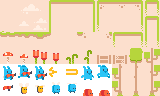

这张图片来源于[Pixel Line Platformer · Kenney](https://kenney.nl/assets/pixel-line-platformer) 

## 二、使用TileSet

### 2.1 创建TileSet

在项目资源面板创建一个TileSet：

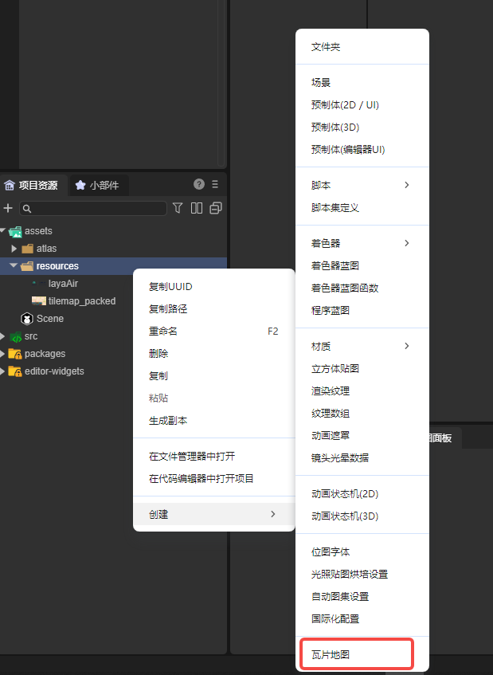

创建好之后，在面板栏中打开瓦片集面板：

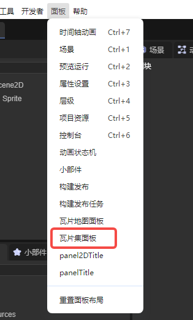

我们可以在瓦片集面板中设置TileSet的各项属性：

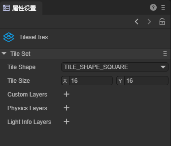

TileSet中的各项属性都与瓦片有关，因此下面我们先来学习如何创建一个瓦片集。

### 2.2 添加瓦片集

首先我们要准备一个图集，这里我们使用第一节中的示例图，将这个tilesheet拖到瓦片集面板中的瓦片区域，如图所示：

添加图集后，面板中就出现了按属性分割好的瓦片集，我们还需要将其创建为瓦片才能正常使用，选中要创建的部分，右键-创建瓦片：

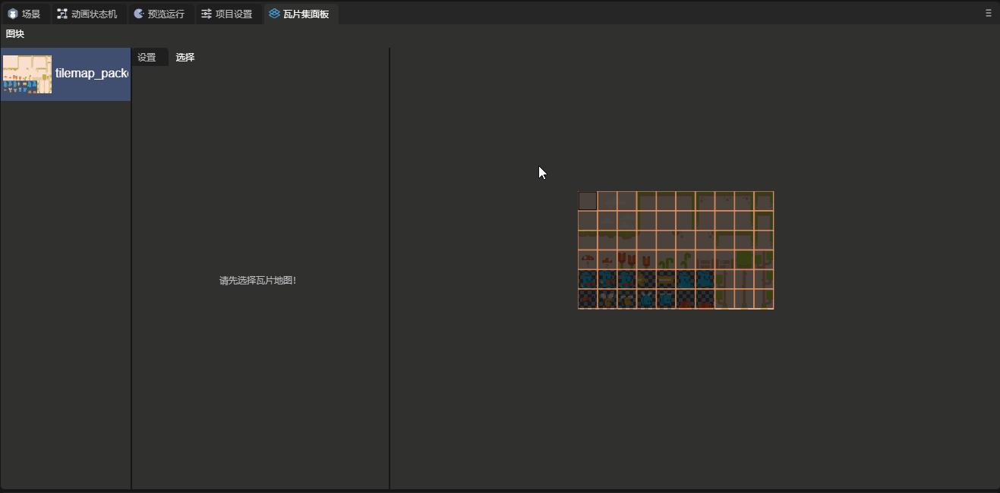

这里我们来了解一下与创建瓦片有关的属性：

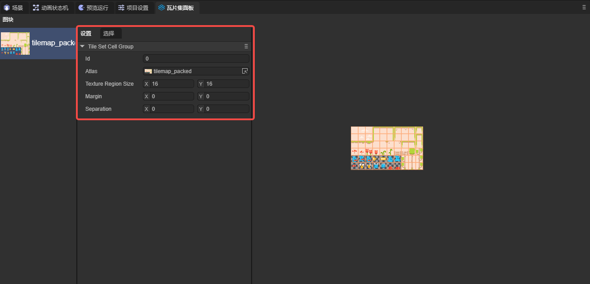

**`ID`**：一个TileSet中可以创建多个瓦片集，此属性为每一个瓦片集的索引。

**`Atlas`**：这个瓦片集使用的图集。

**`Texture Region Size`**：纹理区域大小，表示图集上每个瓦片的大小。

**`Margin`**：边距，图集边缘上不应选为瓦片的区域，用于去除掉图集边缘上的无用区域。

**`Separation`**：间距，图集上每个瓦片之间的距离，用于去除瓦片之间的辅助线等无用区域。

### 2.3 TileSet的属性

TileSet的属性会作用于每一个瓦片：

**`Tile Shape`**：瓦片形状。这个属性决定了场景中瓦片的形状以及系统分割图集的方式。默认瓦片形状是`TILE_SHAPE_SQUARE(矩形)`，开发者也可以根据瓦片形状选择其它属性：`TILE_SHAPE_ISOMETRIC(菱形)`，`TILE_SHAPE_HALF_OFFSET_SQUARE(半偏移矩形)`和`TILE_SHAPE_HEXAGON(六边形)`。

下图中，我们将此属性设置为了`TILE_SHAPE_HEXAGON(六边形)`，可以看到此属性的效果：

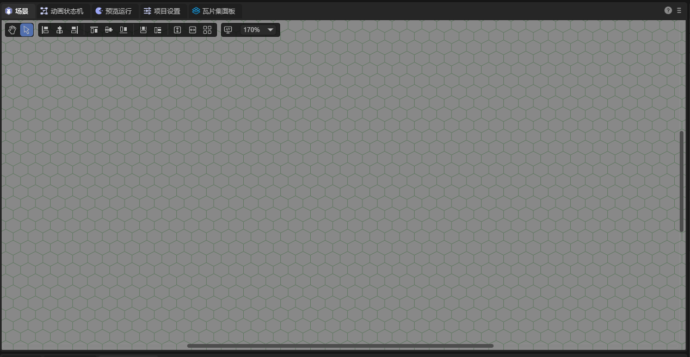

**`Tile Size`**：场景中每个瓦片的大小，一般来说这个值要和`Texture Region Size`保持一致。

**`Custom Layers`**：自定义层，开发者可以通过添加自定义层为瓦片添加自定义属性。

首先，在TileSet的属性设置面板中创建一个`Custom Layers`，并设置名称与属性类型：

接着在瓦片集面板中选择一个瓦片，并点击选择，在面板的底部，可以看到我们设置的属性，每个瓦片的属性是相互独立的，开发者可自行设置属性值：

**`Physics Layers`**：物理层。使瓦片可以产生物理效果，其属性值如下所示：

`Friction`：摩擦系数。`Restitution`：恢复系数。`Density`：密度。`Group`：碰撞组。`Category`：碰撞类别。`Mask`：碰撞掩码。

添加物理层后，开发者可以为瓦片添加碰撞形状：在瓦片集面板中选择一个瓦片，点击选择，在面板最下方可为瓦片添加碰撞形状：

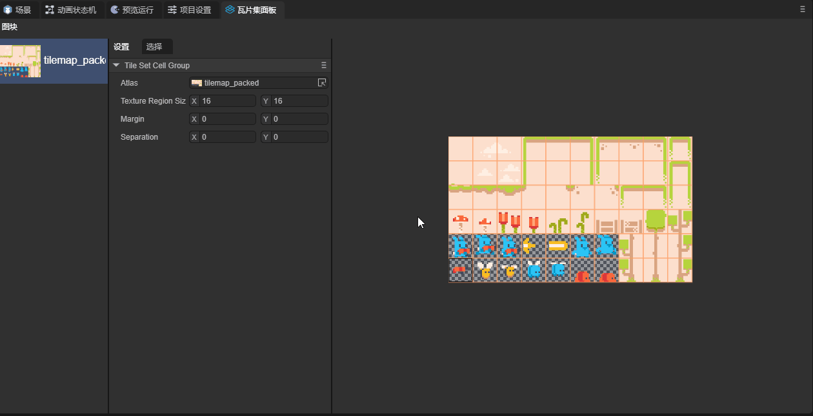

如果希望物理效果生效，还需要开启Tile Map Layer组件中的Physics Enable属性

此时，我们在场景中设置瓦片，就可以看到物理效果：

**`Light Info Layers`**：光线遮挡层。使瓦片地图可以与2D光线组件互动。

在TileSet的属性设置面板中创建一个`Light Info Layers`，并为其设置一个名称：

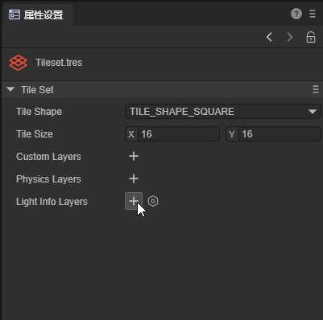

在瓦片集面板中选择一个瓦片，点击选择，在面板最下方可为瓦片添加形状：

如果希望此属性生效，需要在Tile Map Layer中启用`Light Occluder Enable`属性。

接下来，在场景中添加这个瓦片，与光照有关的部分可以参考文档[2D灯光与网格](..\..\Component\2D\BaseLight2D\readme.md)，效果如图：

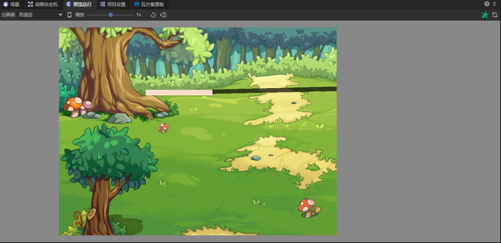

可以看到光照产生的阴影。

### 2.4 瓦片属性

本节内容我们来了解一下瓦片的属性。在瓦片集面板中选中一个瓦片，在选则界面中可以看到这个瓦片的属性：

**`Size By Atlas`**：设置一个瓦片将由图集中的几块组成。

这里我们选中一个瓦片，将这个瓦片的`Size By Atlas`属性设置为（2，3），

可以看到，图集中一块2*3的区域组成了一个瓦片，将这个瓦片放置到场景中：

下面我们讲解一下瓦片地图中Animation的用法：

使用Animation，首先，我们创建一个瓦片集，但不要创建瓦片，如图所示：

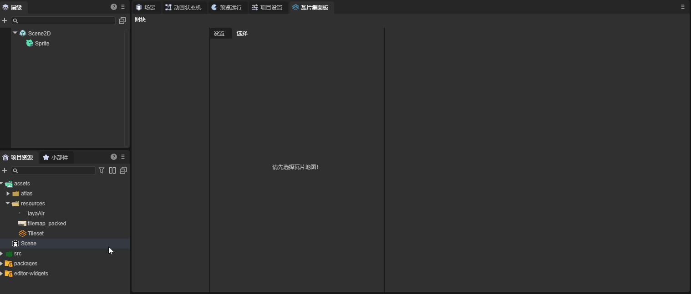

接下来，我们选择一个瓦片并创建，动画信息会保存在这个瓦片上，这里我们选择了第五行第一列的图片：

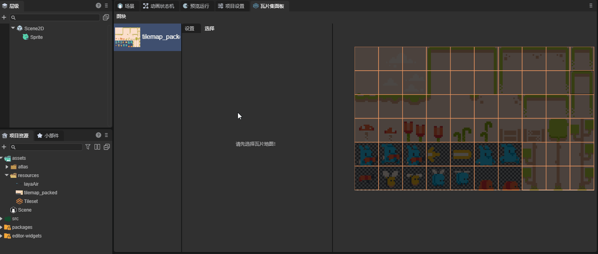

选中这个瓦片，为其添加帧，这里我们添加了五帧，瓦片地图会自动从这个瓦片开始，向右选取五个瓦片作为动画帧，帧属性的参数就是这一帧持续的时间：

将这个瓦片添加到场景中，可以观察到效果：

接下来我们来介绍一下Animation中的其它属性：

**`Columns`**：动画从每一行中选取的帧数，当值为零时，动画会从同一行中选取帧。否则会自动转行。

**`Seperation`**：从选取的瓦片开始，向X，Y方向上选取帧时跳过的帧数。

<!--**`Speed`**：-->

**`Mode`**：决定动画的播放模式。

`DEFAULT`：从第一帧开始；

`Random_Start_Times`：从随机帧开始。

下面来介绍一下Tile Data中的属性

<!--**`ProBability`**：-->

**`Color Modulate`**：控制瓦片的颜色。

<!--**`Rotate Count`**：-->

**`Texture_origin`**：纹理中心位置。当瓦片添加到场景中时，瓦片的中心会一直处于瓦片块的中心，但其纹理的位置可以改变。

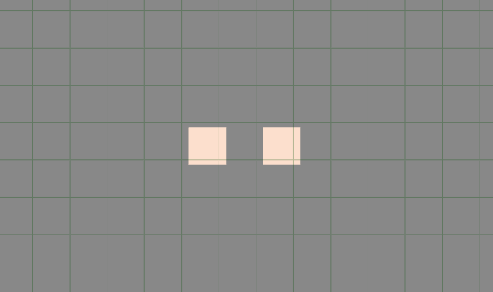

可以看到，纹理的位置出现了偏移。

**`Material`**：瓦片的材质。

**`Index`**：瓦片的索引。

<!--**`Sort_Origin`**：-->

<!--**`Terrain_set`**：-->

### 2.5 创建备选瓦片

对于一个已经创建好的瓦片块，开发者可以将这个瓦片块创建一个备选瓦片：

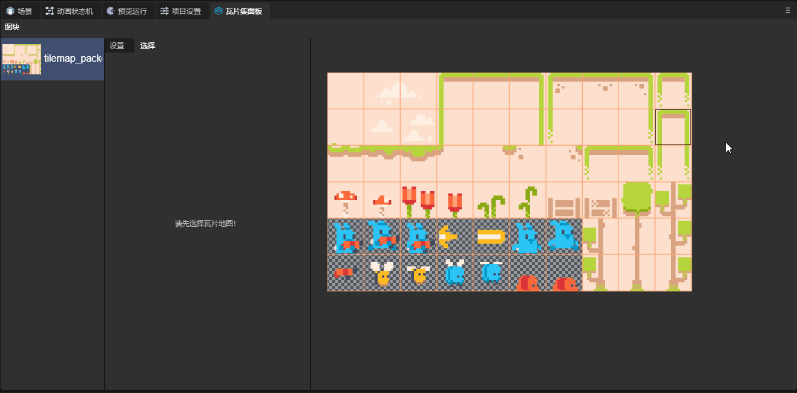

备选瓦片有三个独有的属性：

**`Flip_h`**：垂直翻转。

**`Flip_v`**：水平翻转。

**`Transpose`**：沿对角线镜像翻转。

## 三、瓦片地图资源的应用

瓦片地图资源的具体应用，请跳转到[《瓦片地图层》](../../Component/2D/TileMapLayer/readme.md)组件的文档

