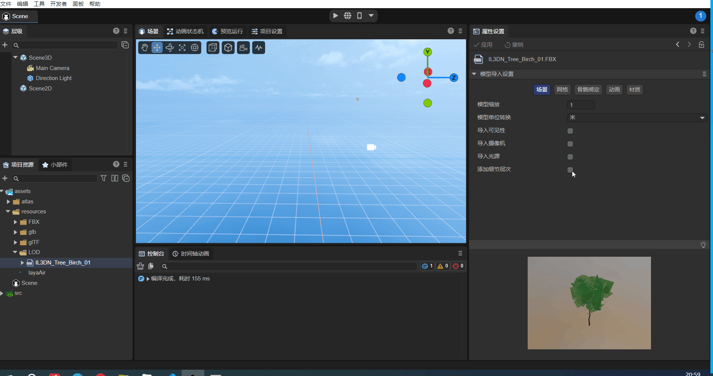
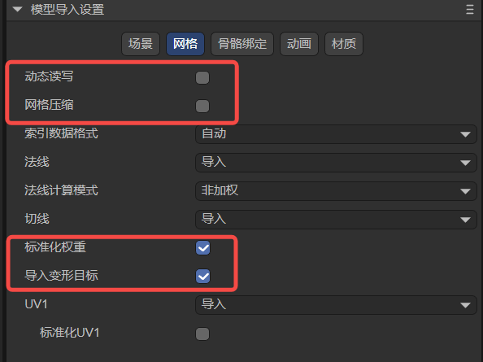
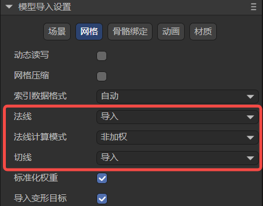

# 模型导入设置

> Author: Charley && 孟星煜

## 一、模型的导入与设置

LayaAir3-IDE仅支持**fbx、gltf、glb**这几种后缀的模型格式导入。

> LayaAirIDE也支持**“LayaAir-Unity资源导出插件”导出的模型与网格**的导入(.lh与.lm后缀)。本篇主要是指外部模型文件，如果有lm网格配置的需求，本篇文档也适用。

这几种后缀的模型拖拽到入到项目资源的assets目录内，即会自动进行转换导入，然后就可以添加在场景中了。

操作如动图1-1所示：

（动图1-1）

当选中某一模型后，可以在`属性设置面板`修改模型导入的设置，每次修改后点击`应用`，会根据修改后的属性重新进行导入。

操作如图1-2所示：

（图1-2）

## 二、模型的场景(Scene)导入设置说明

一个模型中，可能会包含很多信息，例如摄像机、光源等场景相关的信息，以及网格、动画、材质、骨骼等。我们对这些信息进行分类，首先从场景相关的设置开始介绍。

### 2.1 模型缩放scale Factor

模型缩放主要用于根据目标场景尺度来预处理模型大小，使其符合设计需求，并优化不同模型之间的缩放关系。

例如，可以通过该处的设置调整模型到符合需求的物理尺寸大小。效果对比如动图2-1所示：

（图2-1）

### 2.2 模型单位转换convert Units

模型导入进来之后的默认单位是米，

如果将单位改为厘米，默认会有一个已勾选的关联选项`尺寸随单位转换(Size Unit Converter)`，默认勾选的目的是为了保持当前模型的视觉大小，仅仅变更模型的单位。

如果勾选去掉，会在场景上感觉到被放大了100倍。效果对比如动图2-2所示：

（动图2-2）

### 2.3 导入模型内置数据（可见性、摄像机、光源）

如果美术在模型制作的时候，就有可见性(Visibility)、摄像机(Camera)、光源(Light)属性设置，LayaAir3-IDE默认是不导入的，建议在LayaAir-IDE的场景中进行添加与设置。

当开发者存在使用模型的这些内置数据需求时，也可以通过勾选这些选项，如图2-3所示。通过点击**应用**重新导入进来。

(图2-3)

### 2.4 添加细节层次add Lod Group

当模型中存在Lod数据时，勾选该选项，会导出Lod的数据，并在使用该模型的时候自动创建一个Lod Group组件来设置Lod数据。添加后的效果如动图2-4所示。

（动图2-4）

## 三、模型的网格(Mesh)导入设置说明

### 3.1 比较容易理解的属性说明

有一些属性的设置比较好理解，如图3-1所示，

（图3-1）

我们通过表格进行概要介绍。

| 中文属性名   | 英文属性名           | 属性说明                                                     |
| ------------ | -------------------- | ------------------------------------------------------------ |
| 动态读写     | read Write           | 当勾选动态读写后，允许开发者在运行时动态访问或修改模型的数据（比如捏脸时，需要更改的mesh顶点信息就属于修改模型数据）。 需要注意的是，启用`动态读写`会增加内存的使用。 所以，如果你的模型并不需要在运行时进行修改，那么请不要打开这个选项以节省内存。 |
| 网格压缩     | mesh Compress        | 勾选后可对网格数据进行压缩，用以减少网格文件大小。 需要注意的是，压缩后的网格会存在IDE的临时目录，原始模型不会变， 只能在发布之后才能看到体积减少的变化。 |
| 标准化权重   | standardized weights | 通过对权重校正调整，将总权重调整为1， 用于解决模型超过一定范围可能会出现扭曲等问题，建议保持勾选。 如果能确保模型在应用时不会出现问题，也可以取消勾选，取消后会保持模型的原数据，获得模型原始效果。 |
| 导入变形目标 | import Morph Target  | 导入模型中的变形目标morph target（也叫混合形状Blend Shape）数据。 |

### 3.2 索引数据格式index Format

索引数据用于确定顶点在顶点缓冲区中的位置，从而构建几何体的形状。该属性用于控制这些索引数据的精度和范围，从而影响渲染的性能和质量。

如图3-2所示，该属性有**自动、UInt16位、UInt32**位这三种选项。

（图3-2）

**自动：**自动是默认选项，该模式下，LayaAir会根据顶点数来自动决定使用哪一种数据格式，默认会优先使用UInt16，当顶点数超过65535时，会自动切到UInt32数据格式。

**UInt16**：这意味着索引数据使用16位无符号整数（0~65535）来表示。使用16位索引可以节省内存，并在大多数情况下足够表达顶点的索引。然而，当模型的顶点数超过65535时，就需要拆分成多个子网格来渲染，可能会增加绘制调用的数量。

**UInt32**：这意味着索引数据使用32位无符号整数（0~4294967295）来表示。使用32位索引可以支持更大的模型，避免了拆分成多个子网格，但会占用更多的内存。

### 3.3 处理法线与切线

在处理法线效果的能力方面，主要有三个相关属性构成，分别是**法线**、**法线计算模式**、**切线**，如图3-3所示：

(图3-3)

#### 3.3.1 法线`normal`

**法线**属性有三个选项，**导入**`import`、**计算**`calculate`、**无**`none`。如图3-4所示。

(图3-4)

**导入，**表示使用模型文件中预先定义的法线数据。这意味着，如果模型文件中包含了法线信息，LayaAir将直接使用这些法线数据进行渲染。如果模型没有法线数据或法线数据不正确，可能会得到不正确的光照效果。

**计算，**表示在导入模型时会重新计算模型的法线数据。这在某些情况下可能是有用的，例如当模型的法线数据不完整或不准确时。重新计算法线可能会消耗一些计算资源，但可以确保模型的光照效果正确。

无论是导入还是计算，都需要设置关联属性**法线计算模式** ，而选择**无**则会完全忽略模型的法线数据，顶点不会传入。IDE中也不会显示`法线计算模式`这个属性。**无**这个选项可能会用于特定的渲染需求，或者在LayaAir中手动编辑法线或使用脚本计算法线。否则，意味着在渲染时，将没有法线数据可用，可能会导致不正确的光照视觉效果。

#### 3.3.2  法线计算模式`normal Calculate Mode`

**法线计算模式**有**非加权**unweight与**面积加权**areaWeight这两个选项。如图3-5所示。

（图3-5）

**非加权**，表示法线会被计算为相邻顶点的简单平均。这意味着每个顶点的法线只受其相邻顶点的影响，不考虑面的大小或角度。这种方式可适用于平滑的表面，但在角锐或分离的边缘处可能会出现法线不连续的情况。

**面积加权**，会根据面的大小对相邻顶点的法线进行加权平均。这样可以在角锐的表面上产生更平滑的法线过渡，减少法线不连续性。

#### 3.3.3 切线`tangents`

切线数据是法线贴图和法线映射等高级效果的关键部分。法线贴图通过在模型表面上存储法线信息来模拟高度细节。切线数据帮助计算像素法线，使物体在视觉上呈现出凹凸细节。所以**切线**与**法线计算模式** 一样，只有法线存在（设置不为**无**）的时候，才会在属性面板上显示出来。

切线用于定义模型表面上每个顶点的切线向量。分别为**无**`none`、**计算**`calculate`、**导入**`import`。如图3-6所示。

(图3-6)

**无**，表示不会计算或导入切线数据。这意味着在渲染过程中将没有切线数据可用，可能会影响法线贴图等效果的正确性。如果不会存在问题，选择这个选项可以节省顶点占用的内存。

**计算**，表示在导入模型时重新计算切线向量。这在使用法线贴图和法线映射等效果时可能是有用的，因为切线向量需要与法线和纹理坐标一起使用。重新计算切线可能会消耗一些计算资源，但可以确保渲染效果的正确性。

**导入**，会使用模型文件中预先定义的切线数据。这意味着，如果模型文件中包含了切线信息，LayaAir将直接使用这些切线数据进行渲染。如果模型没有切线数据或切线数据不正确，你可能会得到不正确的法线映射效果。

### 3.4 光照贴图UV1 `generate Lightmap UVs`

默认的模型通常只有一个UV，勾选生成光照贴图UV，以及对子项配置，用于再生成一个UV1来支持光照贴图。如图3-7所示。

（图3-7）

#### 3.4.1 最大图表区域大小max Chart Area

最大图表区域大小是光照贴图生成过程中的一个参数，用于控制图表的最大面积。图表是在算法中用于组织面片的基本单元。该参数限制了单个图表所包含的面片的总面积，以控制图表的大小。

该参数在图表生成过程中发挥作用，用于控制图表的生成和合并过程。算法会检查每个图表的面积是否超过 `maxChartArea` 的值，如果超过则会限制图表的生成或合并。如果最大图表区域大小被设置为0（默认值），表示没有面积限制，图表可以任意大小。

较小的值会导致生成更多的图表，每个图表包含的面片较少。较大的值可能会生成少量大图表。

#### 3.4.2 边界最大长度max Boundary Length

在光照贴图生成过程中，边界最大长度用于约束图表的合并与生成。

算法中，会判断生成或合并两个图表后的边界长度是否超过了预设的最大边界长度限制，如果超过，则受到限制，不进行合并或中止生成，以此控制生成的图表在边界方面的紧凑程度。

默认情况下，边界最大长度的值为0，表示不对图表的边界最大长度进行限制。

效果如图3-8所示:

(图3-8)

#### 3.4.3 法线偏差权重normal Deviation Weight

法线偏差权重是一个用于控制光照贴图生成过程中，参与面片图表化过程中的成本计算的一个重要参数。

在面片的图表化过程中，算法会遍历当前图表区域中的每个面，并判断哪些面可以作为候选面加入图表的生成。计算的依据，我们称为成本。

而面法线与图表最佳拟合法线（整个图表平均法线向量）之间的角度偏差，正是影响成本的因素之一，当超出一定角度范围（大约是45度），视为较大成本，直接被排除生成队列之外。未超出角度的，在乘以法线偏差权重值后计入成本，用于进一步的计算依据。因此，法线偏差权重是影响法线角度偏差成本以及图表生成的重要参数之一。

当法线偏差权重值越大，法线偏差对图表生成的影响越大。较大的值，使得图表生成算法更加倾向于选择法线较一致的面片分配到同一个图表中，从而生成的图表在法线方向上更加平滑。然而，过高的值可能导致图表生成过于保守，无法充分利用有利的面结构。

反之，法线偏差权重值越小，图表生成算法在面片图表化过程中会容忍一定程度的法线偏差。这意味着算法可能会将法线差异较大的面片分配到同一个图表中，尽管它们的法线方向并不完全一致。可能适用于一些需要更多变化的场景。

#### 3.4.4 最大迭代次数max Iteration

最大迭代次数是用于控制图表生成和优化过程中迭代的次数的参数。迭代是图表生成算法的一个重要步骤，它通过多次迭代来不断优化生成的图表，以达到更好的结果。

更多的迭代次数意味着算法将有更多机会对图表进行调整和优化，从而可能生成更优质的图表布局。然而，过多的迭代次数可能会增加算法的计算成本和时间开销。

较低的迭代次数可能会在时间上更加高效，但生成的图表可能不如进行更多迭代的情况下优化得好。

开发者可以通过此处设置，控制图表生成和优化的迭代次数，以平衡计算效率和生成结果的质量。

#### 3.4.5 每单位纹素数 texels Per Unit

每单位纹素数参数定义了每个单位空间（例如，一个1x1的单位矩形）所包含的纹理像素数量。这个参数在光照贴图生成过程中用于控制图表的纹理密度。

具体来说，它影响了图表在纹理图集中的尺寸分配。在光照贴图生成算法中，当确定图表在纹理图集中的位置和尺寸时，会考虑到每单位纹素数的值。**如果值大于0，**算法会根据给定的值来分配图表的纹理区域，以使其在纹理上有更高的分辨率。**如果值为0**，则算法会根据图表的表面积和给定的分辨率来估计一个合适的值，以便使图表在纹理上得到适当的表示。

从效果上看，该参数影响了图表在最终纹理图集中的映射质量。较高的值会导致图表在纹理上有更高的分辨率，使得细节更清晰，但也会增加最终纹理图集的尺寸。较低的值会使图表在纹理上的分辨率降低，但可以减小纹理图集的尺寸。因此，调整` 每单位纹素数 `参数可以在图表质量和纹理图集尺寸之间进行权衡。

#### 3.4.6 边距padding

边距是指在图表周围添加的额外像素间隔。这些额外的像素用于扩展图表的边界，以确保它们之间有足够的空间，不会发生重叠。

扩大边距可以提供更好的纹理采样边界，减少图表之间的颜色混合，改善边缘渲染效果。

在使用时，可以根据需要调整边距的值，以权衡渲染质量和图集尺寸。合理的值通常会提供更好的渲染效果，但过度增加边距可能会导致图集变得过大，从而占用更多内存。

## 四、模型的骨骼绑定(Rig)导入设置说明

模型导入时的骨骼绑定有每顶点最大骨骼数和最大骨骼权重两个设置选项，如图4-1所示。

（图4-1）

### 4.1 每顶点最大骨骼数Max Bones/Vertex

顾名思义，这里用于设置每个顶点所能绑定的骨骼最大数量，也就是每个顶点最多可以受到多少根骨骼的影响。

这个参数跟角色模型的动画的复杂度和表现力直接相关。如果**每顶点最大骨骼数**的值设得很高，那么意味着每个顶点可以受到更多骨骼的影响，可以制作出更加复杂和精细的动画效果。但也会增加游戏的运算负担，可能导致性能下降。我们需要根据实际情况和需求来权衡。

### 4.2 最大骨骼权重 Max Bone Weight

最大骨骼权重用于限定单个骨骼对每个顶点赋予的最大权重值。

什么是骨骼权重？在我们为一个角色模型进行蒙皮的时候，我们需要决定每个骨骼如何影响模型的顶点。这就是权重，例如一个0.5的权重在这里意味着这个骨骼会对这个点产生50%的影响。

通常开发者为每个骨骼设定不同的权重，用于精细的控制它们如何影响模型的动画和形状。

这里的**最大骨骼权重**正是用于限制已设定的骨骼权重不能超过这里的值，当超过后会采取此处的权重设置。

## 五、模型的动画(Animator)导入设置说明

勾选 `动画数据压缩`后，如图5-1所示。可以根据配置对动画数据的体积进行压缩。

（图5-1）

最小忽略值表示超过设置的值，就会被算法忽略该关键帧，从而达到减少动画数据的目的。

忽略的维度有三种，分别是位移、缩放、旋转。

忽略的输入值均是以角度为单位。

## 六、模型的材质(Materials)导入设置说明

材质位置用于设置模型材质的访问位置来源，共有两种选项。如图6-1所示。

（图6-1）

选择**使用嵌入的材质**，即为直接使用模型文件内部嵌入的材质。

选择**使用外部的材质**，点击`应用`后，会将模型文件内部的材质提取到模型外部，作为模型外部的材质资源来使用。

