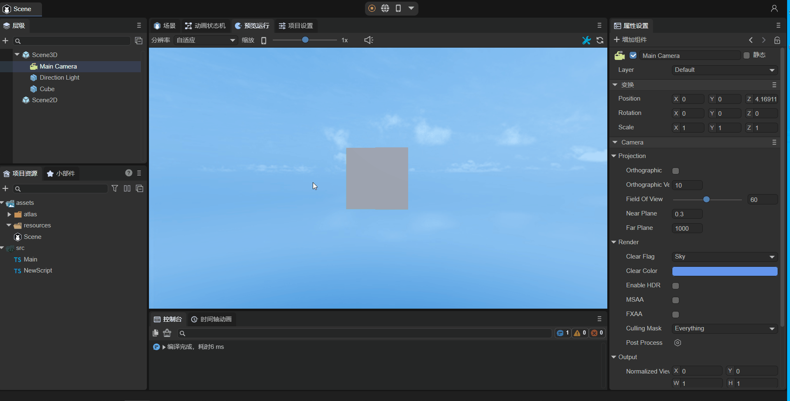

# 组件属性的代码使用

前文[《组件装饰器说明》](../decorators/readme.md)已经介绍了组件的添加与识别。本小节通过几种常用类型的属性使用示例，进一步帮助大家理解组件化开发的基础。

## 一、节点类型方式

LayaAir分为2D节点与3D节点类型，当设置为2D节点Laya.Sprite时，不能将3D节点作为其属性值。当设置为3D节点Laya.Sprite3D时，不能将2D节点作为其属性值。

### 1.1 2D节点的使用

首先，如动图1-1所示，将场景中已经添加好的2D节点Sprite拖入到@property暴露的属性入口中，这样就获取到了此节点。


（动图1-1）

然后就可以在脚本中使用代码改变节点的属性了，例如，给Sprite添加纹理等，示例代码如下所示：

```typescript
const { regClass, property } = Laya;

@regClass()
export class NewScript extends Laya.Script {

    @property({ type : Laya.Sprite})
    public spr: Laya.Sprite;
    
    onAwake(): void {
        this.spr.size(512, 313); //设置Sprite大小
        this.spr.loadImage("atlas/comp/image.png"); //添加纹理
    }

}
```

效果如图1-2所示：


（图1-2）


### 1.2 3D节点的基础使用

首先，如动图1-3所示，将场景中已经添加好的3D节点Cube拖入到@property暴露的属性入口中，这样就获取到了此节点。


（动图1-3）

然后就可以在脚本中使用代码改变节点的属性了，例如，可以让Cube绕自身旋转，示例代码如下所示：

```typescript
const { regClass, property } = Laya;

@regClass()
export class NewScript extends Laya.Script {

    @property({ type : Laya.Sprite3D})
    public cube: Laya.Sprite3D;

    private rotation: Laya.Vector3 = new Laya.Vector3(0, 0.01, 0);

    onStart() {
        Laya.timer.frameLoop(1, this, ()=> {
            this.cube.transform.rotate(this.rotation, false);
        });
    }
}
```

效果如动图1-4所示：



（动图1-4）


### 1.3 3D节点的进阶使用

```typescript
    @property( { type :Laya.Sprite3D } ) //节点类型
    public p3d: Laya.Sprite3D;

    onAwake(): void {

        this.p3d.transform.localPosition = new Laya.Vector3(0,5,5);
        let p3dRenderer = this.p3d.getComponent(Laya.ShurikenParticleRenderer);
        p3dRenderer.particleSystem.simulationSpeed = 10;
    }
```

通过暴露@property( { type :Laya.Sprite3D } )节点类型属性，来拖入particle节点，可以获得particle节点对象。transform可以直接修改，而simulationSpeed属性则通过getComponent(Laya.ShurikenParticleRenderer).particleSystem的方式获取。


## 二、组件类型的使用

```typescript
    @property( { type : Laya.ShurikenParticleRenderer } ) //组件类型
    public p3dRenderer: Laya.ShurikenParticleRenderer;

    onAwake(): void {

        (this.p3dRenderer.owner as Laya.Sprite3D).transform.localPosition = new Laya.Vector3(0,5,5);
        this.p3dRenderer.particleSystem.simulationSpeed = 10;
    }
```

通过暴露@property( { type : Laya.ShurikenParticleRenderer } )组件类型属性，来拖入particle节点，可以获得particle的ShurikenParticleRenderer组件。transform可以通过(this.p3dRenderer.owner as Laya.Sprite3D)修改，而simulationSpeed属性则通过this.p3dRenderer.particleSystem的方式获取。

> 不能通过直接使用Laya.ShuriKenParticle3D作为属性类型，因为IDE无法识别，只有节点和组件类型可以识别。
>
> 就算将type类型设置为Laya.Sprite3D，这样IDE虽然标识了属性是Sprite3D节点，但也无法转换为Laya.ShuriKenParticle3D对象。


## 三、Prefab类型属性

当使用Laya.Prefab作为属性时，例如：

```typescript
@property( { type : Laya.Prefab } ) //加载 Prefab 的对象
private prefabFromResource: Laya.Prefab;    
```

此时，需要按动图3-1所示，从assets目录下，拖入prefab资源。运行时会直接获取到加载实例化后的prefab。


（动图3-1）


