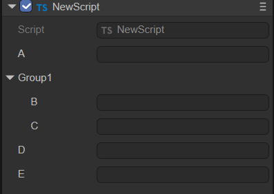

# 组件装饰器说明

在LayaAir-IDE中，如果想在IDE内展示组件脚本的属性，需要通过装饰器的规则来实现。开发者在查阅本文档时可以先学习一下[《实体组件系统》](../../../basics/common/Component/readme.md)文档，下面分别介绍四种装饰器。

## 一、@regClass()

开发者编写的组件脚本，需要在类定义之前使用装饰器的标识`@regClass()`，示例代码如下所示：

```typescript
const { regClass } = Laya;

@regClass()
export class Script extends Laya.Script {
}
```

如动图1-1所示，只有使用了上述的这个装饰器标识，开发者自定义的组件脚本才会被IDE识别为组件，可以被节点（实体）的`属性设置面板 -> 增加组件 -> 自定义组件脚本`所添加。


（动图1-1）

> 一个TS文件只能有一个类使用@regClass() 。
>
> 标记了@regClass()的类，在IDE环境内都会被编译，但最终发布时，如果这个类没有被其他类引用，也没有被添加到节点上，或者所在的预制体/场景没有发布，则这个类会被裁剪。


## 二、@property()

### 2.1 组件属性的常规使用

当开发者想将组件的属性，通过IDE暴露给外界编辑来传入数据。需要在类属性定义之前使用装饰器的标识`@property()`，示例代码如下所示：

```typescript
const { regClass, property } = Laya;

@regClass()
export class NewScript1 extends Laya.Script {
    //装饰器属性的标准写法，适用于IDE的需要显示Tips或属性的中文别名等完整功能需求
    @property({ type: String, caption: "IDE显示用的别名", tips: "这是一个文本对象，只能输入文本哦" }) 
    public text1: string = "";

    //装饰器属性类型的简写方式，适用于只定义类型的需求
    @property(String)   
    public text2: string = "";

    constructor() {
        super();
    }
}
```
`@property()`是IDE识别组件属性并显示到IDE属性面板上的装饰器标识，类型是装饰器属性标识必须携带的参数。

如果我们不需要给属性写一个tips说明，也不需要给属性重新定义一个在IDE里显示的别名，等需求。那按上面示例的简写方式即可。

> 如果简写方式有语法警告，请用新版本IDE，并通过IDE的`开发者 -> 更新引擎d.ts文件`功能来解决，或者使用标准写法来解决。

### 2.2 属性访问器的装饰器使用

有的时候，开发者会通过属性访问器(getter)和属性设置器(setter)来控制属性的读写行为。

当属性访问器和属性设置器同时存在时，装饰器的属性标识`@property()`直接用于属性访问器之前即可，此时的组件属性与上一小节中介绍的常规使用方式一样，都是可读写的。

如果，该脚本只有属性访问器，那这个属性则是只读的，仅可以在IDE中显示，但不能编辑。

getter和setter同时存在的装饰器使用示例代码如下：

```typescript
const { regClass, property } = Laya;

@regClass()
class Animal {
    private _weight: number = 0;
    
    @property( { type : Number } )
    get weight() : number {
        return this._weight;
    }
    
    set weight(value: number) {
        this._weight = value;
    }
}
```


### 2.3 是否序列化保存

通过装饰器定义为组件属性后，默认状态下，属性名与值都会被序列化保存到组件被添加的场景文件或预制体文件里。例如，scene.ls里添加完自定义组件，通过vscode打开这个scene.ls，可以找到序列化保存后的组件属性名称与值，效果如动图2-1所示。


（动图2-1）

序列化保存后，不仅方便在IDE中直观查看与编辑组件属性值。在运行阶段，也可以直接使用序列化存储的值，对于结构复杂的数据，直接使用序列化的值还可以节省数据结构生成带来的开销。所以，有些时候，即便是不需要在属性面板上显示与编辑，也可以通过装饰器设置为组件属性，将值序列化存储在场景或预制体文件中。

但是，也有的时候，我们的组件属性只是为了方便在IDE中理解与调整，在使用的时候，这些值其实用不到，所以，还提供了是否序列化保存的控制。当装饰器属性定义的时候，**对象参数中传入serializable为false，那么该属性就不会被序列化**。

例如，开发者的需求是序列化保存弧度值，但弧度值在人为调整数值的时候并不直观，此时，可以在IDE里直接输入角度值但不保存，仅将转换后的弧度值存起来。示例代码如下：

```typescript
const { regClass, property } = Laya;

@regClass()
export class Main extends Laya.Script {
    @property({ type: Number })
    _radian: number = 0;  //带下划线的属性，默认不会出现在IDE的属性面板上，只是用来存储输入的弧度
    
    @property({ type: Number, caption: "角度", serializable: false }) //这里设置serializable为false，所以degree不会被保存到场景文件中
     get degree() {
        return this._radian * (180 / Math.PI);//由于自己没有序列化保存，需要把_radian存下来的弧度反算回角度，用于IDE属性面板显示
    }
    set degree(value: number) {
        this._radian = value * (Math.PI / 180);//把输入的角度值，转成弧度给_radian存起来。
    }
    
    onStart() {
        console.log(this._radian); 
    }
}
```


### 2.4 组件属性是否在IDE中显示

在默认情况下，装饰器属性规则只会对非下划线的类属性标记为IDE的组件属性。

对于有下划线的属性，其实是不会被显示到IDE里，此时该组件属性的价值只剩下将值保存到场景文件中了，这一点上文有所提及，示例也有应用。

> 带下划线的属性如果没有序列化保存到场景文件的需求，那就不必使用装饰器了。

假如，开发者想对有下划线的属性，也要显示到IDE上，也可以做到。将修饰器属性标识的传入对象中，设置参数private为false即可。

示例代码如下：

```typescript
@property({ type: "number", private: false })
_velocity: number = 0;
```

private参数不仅可以使得下划线属性显示，也可以通过将private设置为true，使得不带下划线的属性，不在IDE的属性面板出现。

这里，我们将前文的弧度转换示例稍作修改，代码如下：

```typescript
const { regClass, property } = Laya;

@regClass()
export class Main extends Laya.Script {
    @property({ type: Number , private: true })
    radian: number = 0;  //private设置为true之后，radian不会出现在IDE的属性面板上，只是用来存储输入的弧度
    
    @property({ type: Number, caption: "角度", serializable: false }) //这里设置serializable为false，所以degree不会被保存到场景文件中
     get degree() {
        return this.radian * (180 / Math.PI);//由于自己没有序列化保存，需要把radian存下来的弧度反算回角度，用于IDE属性面板显示
    }
    set degree(value: number) {
        this.radian = value * (Math.PI / 180);//把输入的角度值，转成弧度给radian存起来。
    }
    
    onStart() {
        console.log(this.radian); 
    }
}
```


### 2.5 装饰器属性标识的类型

装饰器属性标识的类型支持引擎对象类型（例如：Laya.Vector3、Laya.Sprite3D、Laya.Camera等）、自定义的对象类型（需要标记`＠regClass()`）、以及TS语言的基本类型。

#### 2.5.1 引擎对象类型

引擎对象类型的理解比较简单，暴露组件属性之后，直接传入对应类型的值就可以。例如Laya.Sprite3D就只能传入3D节点，试图拖入2D节点或拖入资源都是禁止的。

常用的引擎对象类型使用示例如下：

```typescript
const { regClass, property } = Laya;

@regClass()
export class Main extends Laya.Script {

    @property( { type:Laya.Camera } ) //摄像机类型
    private camera: Laya.Camera;  

    @property( { type:Laya.Scene3D } ) //3D场景根节点类型
    private scene3D: Laya.Scene3D;

    @property( { type:Laya.DirectionLightCom } ) //DirectionLight组件类型
    private directionLight: Laya.DirectionLightCom;

    @property( { type:Laya.Sprite3D } ) //Sprite3D节点类型
    private cube: Laya.Sprite3D;  

    @property( { type:Laya.Prefab } ) //加载 Prefab 拿到的对象
    private prefabFromResource: Laya.Prefab;    

    @property( { type:Laya.ShurikenParticleRenderer } ) //ShurikenParticleRenderer组件类型
    private particle3D: Laya.ShurikenParticleRenderer;  

    @property( { type:Laya.Node } ) //节点类型
    private scnen2D: Laya.Node; 

    @property( { type:Laya.Box } ) //拿到 Box 组件
    private box: Laya.Box; 

    @property( { type:Laya.List } ) //拿到 List 组件
    private list: Laya.List; 

    @property( { type:Laya.Image } ) //拿到 Image 组件
    private image: Laya.Image; 

    @property( { type:Laya.Label } ) //拿到 Label 组件
    private label: Laya.Label; 

    @property( { type:Laya.Button } ) //拿到 Button 组件
    private button: Laya.Button; 

    @property( { type:Laya.Sprite } ) //拿到 Sprite 组件
    private sprite: Laya.Sprite; 

    @property( { type:Laya.Animation } ) //拿到 Animation 组件
    private anmation: Laya.Animation; 

    @property( { type:Laya.Vector3 } ) //Laya.Vector3类型
    private vector3 : Laya.Vector3;
}
```

如动图2-2所示，将场景中已经添加好的Image拖入到@property暴露的Image属性入口中，这样就获取到了此节点，然后可以在脚本中使用代码控制Image的属性了。

> 代码中使用属性参考[《组件属性的代码使用》](../componentProperties/readme.md)。


（动图2-2）


#### 2.5.2 自定义对象类型

自定义对象类型，就是设置一个自定义的引入对象。按该对象的装饰器属性标识来暴露组件属性。

例如，下面这两个TS代码：

```typescript
//MyScript.ts
const { regClass, property } = Laya;

import Animal from "./Animal";

@regClass()
export class MyScript extends Laya.Script  {
    @property({ type : Animal })
    animal : Animal;
}
```

```typescript
//Animal.ts
const { regClass, property } = Laya;

@regClass()
export default class Animal {
    @property({ type : Number })
    weight : number;
}
```

组件脚本MyScript中引用了Animal对象 ，并将装饰器属性标识的类型设置为Animal，尽管Animal不是继承于Laya.Script的组件脚本，但由于被组件脚本MyScript所引用并暴露给IDE，所以Animal类定义之前也需要标记`＠regClass()`，该类下使用了`@property()`标识的属性，也可以出现在IDE属性面板中。


#### 2.5.3 TS语言基本类型

最后就是常用的TS语言基本类型，不过需要注意的是，基本类型需要使用字符串的方式来描述，只有数字、字符串、布尔类型，可以用其对象类型来标记。

| 类型               | 类型书写示范                                                 | 类型说明                                            |
| ------------------ | ------------------------------------------------------------ | --------------------------------------------------- |
| 数字类型           | "number"                                                     | 也可以用Number来标记该类型                          |
| 单行字符串文本类型 | "string"                                                     | 也可以用String来标记该类型                          |
| 布尔值类型         | "boolean"                                                    | 也可以用Boolean来标记该类型                         |
| 整数类型           | "int"                                                        | 等价于 { type: Number, fractionDigits: 0 }          |
| 正整数类型         | "uint"                                                       | 等价于 { type: Number, fractionDigits: 0 , min: 0 } |
| 多行字符串文本类型 | "text"                                                       | 等价于 { type: string, multiline: true }            |
| 任意类型           | "any"                                                        | 类型只会被序列化，不能显示和编辑。                  |
| 类型化数组类型     | Int8Array、Uint8Array、<br />Int16Array、Uint16Array、<br />Int32Array、Uint32Array、Float32Array | 支持7种类型化数组类型                               |
| 数组类型           | ["number"]、["string"]                                       | 用中括号包含数组元素类型，                          |

使用示例代码如下：

```typescript
const { regClass, property } = Laya;

//枚举
enum TestEnum {
    A,
    B,
    C
};
//字符串形式的枚举
enum Direction {
    Up = 'UP',
    Down = 'DOWN',
    Left = 'LEFT',
    Right = 'RIGHT'
};

@regClass()
export class Script extends Laya.Script {

    @property(Number)//数字类型，等价于{ type : "number" }
    num : number;

    @property(String)//单行字符串文本类型，等价于 { type: "string"}
	str : string;

    @property(Boolean)//布尔值类型，等价于 { type: "boolean"}
	bool : boolean;

	@property("int")//整数类型，等价于 { type: Number, fractionDigits: 0 }
	int : number; 

    @property("uint") //正整数类型，等价于 { type: Number, fractionDigits: 0 , min: 0 }
    uint : number; 

    @property("text")//多行字符串文本类型，等价于 { type: String, multiline: true }
    text : string; 

    @property("any")//any类型只会被序列化，不能显示和编辑。
	a : any; 
    
    @property(Int8Array)//类型化数组类型,除了Int8Array，还支持Uint8Array、Int16Array、Uint16Array、Int32Array、Uint32Array、Float32Array，使用方式都类似
    i8a: Int8Array;
        
    @property({ type: ["number"] })//数组类型，用中括号包含数组元素类型
    arr1: number[];

    @property({ type: ["string"] })//数组类型，用中括号包含数组元素类型
    arr2: string[];
    
    //普通的枚举类型（可以类型简写），会显示为下拉框供用户选择
    @property(TestEnum)
    enum: TestEnum;
    
	//字符串形式的枚举，不能使用类型简写，如：@property(Direction)。必须下面带type参数指定的标准写法
    @property({ type: Direction })
    direc: Direction;
    
    //字典类型，需要用数组参数来设置类型，下面示例中的Record类型需要放到字符串内作为数组参数的第一个元素，数组参数的第二个元素是字典输入值的类型，用于决定属性面板的输入控件类型
    @property({ type: ["Record", Number] })
    dict: Record<string, number>; 

}
```

示例效果如动图2-3所示：


（动图2-3）


### 2.6 组件属性值的输入控件

IDE内置了number（数字输入）、string（字符串输入）、boolean（多选框）、color（颜色框+调色盘+拾色器）、vec2（XY输入组合）、vec3（XYZ输入组合）、vec4（XYZW输入组合）、asset（选择资源），这些输入控件。

通常情况下，IDE会根据组件属性类型自动选择对应的属性值输入控件。

但在某些情况下，也需要强制指定输入控件。例如，数据类型是string，但其实它表达的是颜色，用默认编辑string的控件不适合，需要在这里设置组件属性标识的参数inspector为“color”。示例代码如下：

```typescript
//显示为颜色输入（如果类型是Laya.Color，则不需要这样定义，如果是字符串类型，则需要）
@property({ type: String, inspector: "color"})
color: string;
```
> 注意：按照以上方法得到的颜色，是2D组件的颜色值，例如：rgba(217, 232, 0, 1) 

效果如动图2-4所示：


（动图2-4）

如果inspector参数为null，则不会为属性构造属性输入控件，这与hidden参数设置为true不同。hidden为true是创建但不可见，inspector为null则是完全不创建。


### 2.7 组件属性分类与排序

组件的属性默认会统一显示在以组件脚本名称的属性分类栏目下，效果如图2-5所示：


（图2-5）

如果开发者想对组件内的某些属性进行归类，可以通过装饰器属性标识的对象参数catalog来实现，示例代码如下：

```typescript
    @property({ type : "number" })
    a : number;

    @property({ type: "string"})
    b : string;

    @property({ type: "boolean",catalog:"adv"})
    c : boolean;

    @property({ type: String, inspector: "color" ,catalog:"adv"})
    d: string;
```

通过上面的代码可以看出，当为多个属性（c和d）设置相同的catalog名称（“adv”），就会按catalog名称进行分类。效果如图2-6所示：


（图2-6）

如果我们想给这个分类再起个中文别名，可以通过参数catalogCaption来实现，示例代码如下（更改上述示例的d属性）：

```typescript
    @property({ type: String, inspector: "color" ,catalog:"adv", catalogCaption:"高级组件"})
    d: string;
```

效果如图2-7所示：


（图2-7）

在面对多个组件属性分类的时候，我们还可以通过参数catalogOrder对栏目的显示顺序自定义排序。数值越小显示在前面，不提供则按属性出现的顺序。示例代码如下：

```typescript
	@property({ type : "number", catalog:"bb", catalogOrder:1 })
    a : number;

    @property({ type: "string"})
    b : string;

    @property({ type: "boolean", catalog:"adv"})
    c : boolean;

    @property({ type: String, inspector: "color", catalog:"adv", catalogCaption:"高级组件", catalogOrder:0})
    d: string;
```

效果如图2-8所示：


（图2-8）

>  属性分类名称catalogCaption与属性分类排序catalogOrder，在任意一个catalog相同名称的属性里配置即可，无需所有的属性都配置一次。


### 2.8 装饰器属性标识参数总结

上文介绍了常用装饰器属性标识的参数作用（加粗为上文出现过的），这里我们概述总结一下全部的参数。

| 参数名             | 参数使用示例                                                 | 说明                                                         |
| ------------------ | ------------------------------------------------------------ | ------------------------------------------------------------ |
| name               | name: "abc"                                                  | 一般不需要设定                                               |
| **type**           | type: "string"                                               | 组件属性可输入值的类型，参照上文的介绍                       |
| **caption**        | caption: "角度"                                              | 组件属性的别名，常用中文，可以不设置，默认会用组件属性名     |
| **tips**           | tips: "这是一个文本对象，只能输入文本哦"                     | 组件属性的Tips说明，用于进一步描述该属性的作用等用途         |
| **catalog**        | catalog:"adv"                                                | 为多个属性设置相同的值，可以将它们显示在同一个栏目内         |
| **catalogCaption** | catalogCaption:"高级组件"                                    | 属性分类栏目的别名，不提供则直接使用栏目名称                 |
| **catalogOrder**   | catalogOrder:0                                               | 栏目的显示顺序，数值越小显示在前面。不提供则按属性出现的顺序 |
| **inspector**      | inspector: "color"                                           | 属性值输入控件，内置有：number,string,boolean,color,vec2,vec3,vec4,asset |
| hidden             | hidden: "!data.a"                                            | true隐藏，false显示。可以直接使用布尔值，也可以使用表达式，通过将条件表达式放到字符串里，获得布尔类型的运算结果。<br />字符串表达式内，data是一个固定名字的变量，它是当前类型的所有已注册属性的数据集合。表达式内可以使用所有js语法，但不能引用引擎相关类型，也不能使用Laya等全局对象。 |
| readonly           | readonly: "data.b"                                           | true表示只读。可以直接使用布尔值，也可以使用表达式，通过将条件表达式放到字符串里，获得布尔类型的运算结果。（表达式的格式同上） |
| validator          | validator: "if (value == data.text1) return '不能与text1值相同' " | 可以使用表达式，将表达式放到字符串里。例如示例中，若在IDE中输入的值和text1的值相等，就会显示”不能与text1值相同“ |
| **serializable**   | serializable： false                                         | 控制组件属性是否序列化保存，true：序列化保存，false：不序列化保存 |
| **multiline**      | multiline: true                                              | 字符串类型时，是否为多行输入，true：是，false：不是          |
| password           | password: true                                               | 是否密码输入，true：是，false：不是。密码输入会隐藏输入的内容 |
| submitOnTyping     | submitOnTyping: false                                        | 如果设置为true，那么每次输入一个字符，就会提交一次。如果设置为false，那么只有当输入完成后，并且点击其它地方，让文本输入框失去焦点时，才会提交一次。 |
| prompt             | prompt: "文本提示信息"                                       | 在输入文本前，文本框内会有一个提示信息                       |
| enumSource         | enumSource: [{name:"Yes", value:1}, {name:"No",value:0}]     | 组件属性以下拉框的形式来展示与输入值                         |
| reverseBool        | reverseBool: true                                            | 反转布尔值，当属性值为true时，多选框显示为不勾选             |
| nullable           | nullable: true                                               | 是否允许null值，默认为true                                   |
| **min**            | min: 0                                                       | 数字类型时，数字的最小值                                     |
| max                | max: 10                                                      | 数字类型时，数字的最大值                                     |
| range              | range: [0, 5]                                                | 数字类型时，组件属性在一个范围内以滑动杆的方式显示与输入值   |
| step               | step: 0.5                                                    | 数字类型时，在输入框的鼠标滑动或滚轮滚动的最小更改精度值     |
| **fractionDigits** | fractionDigits: 3                                            | 数字类型时，属性值的小数点后保留几位                         |
| percentage         | percentage: true                                             | 将range参数设置为[0,1]时，可以让percentage为true，显示为百分比 |
| fixedLength        | fixedLength: true                                            | 数组类型时，固定数组长度，不允许修改                         |
| arrayActions       | arrayActions: ["delete", "move"]                             | 数组类型时，可限制数组可以进行的操作。如果不提供，表示数组允许所有操作，如果提供，则只允许列出的操作。提供的类型有："append"，"insert" ，"delete" ，"move" |
| elementProps       | elementProps: { range: [0, 10] }                             | 对数组类型属性适用。这里可以定义数组元素的属性               |
| showAlpha          | showAlpha: false                                             | 颜色类型时，表示是否提供透明度a值的修改。true表示提供，false表示不提供 |
| defaultColor       | defaultColor: "rgba(217, 232, 0, 1)"                         | 颜色类型时，定义一个非null时的默认颜色值                     |
| colorNullable      | colorNullable: true                                          | 颜色类型时，设置为true可显示一个checkbox决定颜色是否为null   |
| isAsset            | isAsset: true                                                | 说明此属性是引用一个资源                                     |
| assetTypeFilter    | assetTypeFilter: "Image"                                     | 资源类型时，设置加载的资源类型                               |
| useAssetPath       | useAssetPath: true                                           | 属性类型是string，并且进行资源选择时，这个选项决定属性值是资源原始路径还是res://uuid这样的格式。默认false，如果是true，则是资源原始路径，一般不使用，因为如果资源改名，路径会丢失。 |
| position           | position: "before x"                                         | 属性显示的顺序默认是在类型定义里出现的顺序，position可以人为改变这个顺序。可以使用的句型有："before x"、"after x"、"first"、"last" |
| **private**        | private：false                                               | 控制组件属性是否显示在IDE里，false：显示，true：不显示       |
| addIndent          | addIndent:1                                                  | 增加缩进，单位是层级，注意不是像素                           |
| onChange           | onChange: "onChangeTest"                                     | 当属性改变时，调用名称为onChangeTest的函数。函数需要在当前组件类上定义 |

代码示例如下（只列出上文没有介绍过的）：

```typescript
	//隐藏控制
    @property({ type: Boolean })
    a: boolean;
    @property({ type: String, hidden: "!data.a" })//将条件表达式!data.a放在了字符串中，如果a为true（在IDE中为勾选状态），则!data.a返回false，此时hidden属性表示的是显示
    hide: string = "";

	// 只读控制
    @property({ type: Boolean })
    b: boolean;
    @property({ type: String, readonly: "data.b" })//将条件表达式data.b放在了字符串中，如果b为true（在IDE中为勾选状态），则data.b就返回true，此时readonly属性表示只读
    read: string = "";

	//数据检查机制
    @property(String)
    text1: string;
    @property({ type: String, validator: "if (value == data.text1) return '不能与a值相同' " })
    text2: string = "";

	//密码输入
    @property({ type: String, password: true })
    password: string;

	//如果true或者缺省，文本输入每次输入都提交；否则只有在失焦时才提交
    @property({ type: String, submitOnTyping: false })
    submit: string;

	//输入文本的提示信息
    @property({ type: "text", prompt: "文本提示信息" })
    prompt: string;

	//显示为下拉框
    @property({ type: Number, enumSource: [{name:"Yes", value:1}, {name:"No",value:0}] })
    enumsource: number;

	//反转布尔值
    @property({ type: "boolean", reverseBool: true })
	reverseboolean : boolean;
	
	//允许null值
    @property({ type: String, nullable: true })
    nullable: string;

	//控制数字输入的精度和范围
    @property({ type: Number, range:[0,5], step: 0.5, fractionDigits: 3 })
    range : number;

	//显示为百分比
    @property({ type: Number, range:[0,1], percentage: true })
    percent : number;

	//固定数组长度
    @property({ type: ["number"], fixedLength: true })
    arr1: number[];

	//数组允许的操作
    @property({ type: ["number"], arrayActions: ["delete", "move"] })
    arr2: number[];

    //使数组元素编辑时限制最大值和最小值
    @property({ type: [Number], elementProps: { range: [0, 100] } })
    array1: Array<Number>;
    //如果是多维数组，则elementProps同样需要使用多层
    @property({ type: [[Number]], elementProps: { elementProps: { range: [0, 10] } } })
    array2: Array<Array<Number>>;

	//不提供透明度a值的修改
    @property({ type: Laya.Color, showAlpha: false })
    color1: Laya.Color;

	//颜色类型时，defaultColor定义一个非null时的默认值
    @property({ type: String, inspector: "color", defaultColor: "rgba(217, 232, 0, 1)" })
    color2: string;

	//显示一个checkbox决定颜色是否为null
    @property({ type: Laya.Color, colorNullable: true })
    color3: Laya.Color;

	//加载Image资源类型，设置资源路径格式
    @property({ type: String, isAsset: true, assetTypeFilter: "Image" })
    resource: string;

    //x属性出现在testposition属性之前
    @property({ type: String })
    x: string;
    //可以用position人为将testposition属性安排在x属性之前显示
    @property({ type: String, position: "before x" })
    testposition: string;

	//增加缩进，单位是层级
    @property({ type: String, addIndent:1 })
    indent1: string;
    @property({ type: String, addIndent:2 })
    indent2: string;

    //当属性改变时，调用名称为onChangeTest的函数
    @property({ type: Boolean, onChange: "onChangeTest"})
    change: boolean;
    onChangeTest() {
        console.log("onChangeTest");
    }
```


### 2.9 装饰器属性标识特殊用法

> 除了以上列出的基本参数属性，@property还有一些特殊的组合用法。

- 类型属性嵌套数组或字典

示例如下：

```typescript
    @property([["string"]])
    test1: string[][] = [["a", "b", "c"], ["e", "f", "g"]];

    @property([["Record", "string"]])
    test2: Array<Record<string, string>> = [{ name: "A", value: "a" }, { name: "B", value: "b" }];

    @property({ type: ["Record", [Number]], elementProps: { elementProps: { range: [0, 10] } } })
    test3: Record<string, number[]> = { "a": [1, 2, 3], "b": [4, 5, 6] };

    @property(["Record", [Laya.Prefab]])
    test4: Record<string, Laya.Prefab[]>;
```

它的一个重要应用就是实现动态下拉框。前面3.2.8节介绍过有两种方式可以实现下拉框：一是设置属性类型为Enum，二是通过设置enumSource为数组。这两种方式都可以实现固定的下拉选项列表，但如果想让选项列表是动态的，可以使用以下方式：

```typescript
    //这个属性提供一个get方法，返回下拉选项，这个数据一般只用于编辑器，所以设置不保存
    @property({ type: [["Record", String]], serializable: false })
    get itemsProvider(): Array<Record<string, string>> {
        return [{ name: "Item0", value: "0" }, { name: "Item1", value: "1" }];
    }
    //将enumSource设置为一个字符串，表示使用该名字的属性作为下拉数据源
    @property({ type: String, enumSource: "itemsProvider" })
    enumItems: string;
```


## 三、@runInEditor

除了在IDE属性面板上暴露组件属性，开发者还可以通过装饰器标识 `@runInEditor`来让组件在IDE内加载时也可以触发生命周期方法（onEnable、onStart等所有的组件脚本生命周期方法）。示例代码如下：

```typescript
const { regClass, property, runInEditor } = Laya;

@regClass() @runInEditor     //重点看这里，要放到类之前，@regClass()与@runInEditor谁先谁后都可以。
export class NewScript extends Laya.Script {
    @property({ type: Laya.Sprite3D })
    sp3: Laya.Sprite3D;

    constructor() {
        super();
    }

    onEnable() {
        console.log("Game onStart", this.sp3.name);
    }
}
```

除非有特别的需求，我们并不建议这样做，一方面是因为静态物体更有利于IDE内进行编辑。另一方面是因为场景编辑器为了性能优化，帧率刷新要比正常运行慢很多，因此效果会与正常运行有明显差异。


## 四、@classInfo()

装饰器标识`@classInfo()`主要有两个作用：

### 4.1 加入IDE的组件列表

开发者的自定义组件脚本默认都位于`属性设置`面板的`增加组件->自定义组件脚本`的下面，如动图4-1所示。


（动图4-1）

如果我们想在这个`组件列表`中，将该组件加入自己定义的组件列表分类中，可以使用装饰器标识`@classInfo()`,示例代码如下所示：

```typescript
const { regClass, property, classInfo } = Laya;

@regClass()
@classInfo( {
    menu : "MyScript",
    caption : "Main",
})
export class Main extends Laya.Script {

    onStart() {
        console.log("Game start");
    }
}
```

然后我们保存代码，回到IDE，会发现自定义的分类已出现在组件列表中。如动图4-2所示。


（动图4-2）

### 4.2 属性分组

假设用装饰器暴露了A、B、C、D、E，5个属性，显示效果如下：


（图4-3）

当属性比较多时，可以将属性分组显示，就要用到@classInfo()了，@classInfo()可以为类型添加非数据类型的属性。例如，将BC两个属性显示在一个组里，实现方式如下：

```typescript
const { regClass, property, classInfo } = Laya;

@regClass()
@classInfo({
    properties: [
        {
            name: "Group1",
            inspector: "Group",
            options: {
                members: ["b", "c"]
            },
            position: "after a"
        }
    ]
})
export class NewScript extends Laya.Script {

    @property(String)
    public a: string = "";

    @property(String)
    public b: string = "";

    @property(String)
    public c: string = "";

    @property(String)
    public d: string = "";

    @property(String)
    public e: string = "";

}
```

其中，members指定了属于这个分组的属性名称列表。如果属性较多，也可以用这种格式 [ "b~c" ]，表示从属性b到属性c之间所有的属性。position是可选的，指示这个分组显示在哪里。显示效果如下：



（图4-4）


