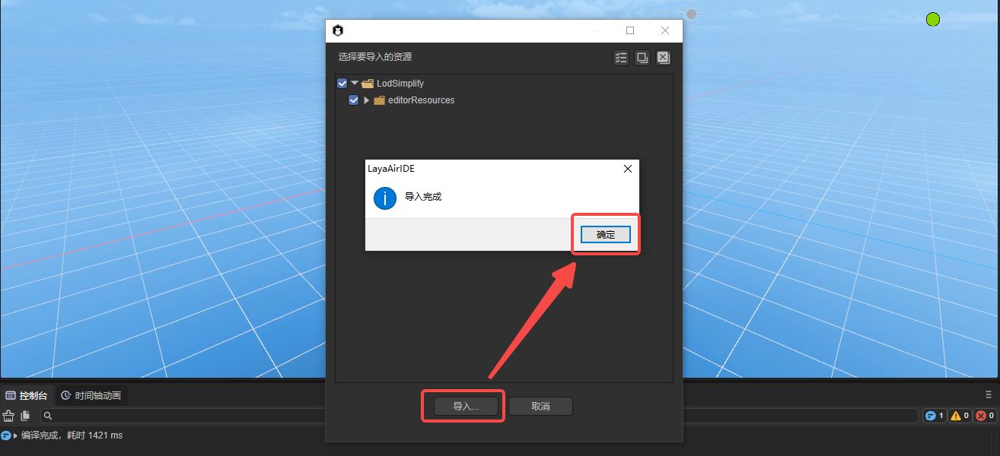

# 细节层次(LOD)减面插件

> Author: Charley

欢迎使用细节层次(LOD)减面插件。本插件具有强大的模型优化功能，可以帮助开发者减少游戏引擎在展示3D模型时的性能压力。

## 一、插件概述

### 1.1 插件简介

LOD是"Level of Detail"的缩写，通常译为“细节层次”，有的文档也会译为”细节级别“，都是一回事，它是计算机图形学中用于处理大规模场景的一种通用技术方案。

这个方案中认为，模型的复杂度应该根据视点与模型之间的距离、模型在屏幕上的投影大小等因素动态调整。这样，近处、大的、重要的模型用高分辨率的细节表示，而远处、小的、不重要的模型用低分辨率的细节表示。

借助LOD技术方案，计算机只需展示摄像角度当前能看到的场景细节，降低了大幅度的计算负担、降低了硬件设备的性能要求，在保证画质和动画流畅度的同时，允许更庞大的场景，更为复杂的景物设定，这在一定程度上提升了游戏或者其他可视化产品的表现力和用户体验。

LOD常用于电子游戏、虚拟现实、城市模拟等领域。在游戏中，比如说角色离你越远，模型的多边形就越少，贴图就越模糊，角色离你越近，模型的多边形就越多，贴图就越清晰，这样可以充分利用硬件性能，提供更真实最佳的游戏体验。

Layabox官方出品的LOD减面插件用于创建和管理3D模型的细节层次（LOD）以及减少模型Mesh面数。LOD技术通过根据物体在3D场景中的距离调整其显示的多边形数量，能够极大地提高3D游戏和应用的性能。本插件有效降低了复杂模型详情时硬件的计算压力，特别适用于在有限硬件资源中运行的设备。

### 1.2 主要功能

 

(图1)

- **层次生成与删除**：用户可以设置多个LOD层次，也可以对新增的层次进行删除。
- **模型减面压缩**：细节层次减面工具，能自动计算模型的三角面数量并依据压缩比例生成各个层次的减化模型。
- **指定层次的剔除率**：对于每个层次的模型，可以自定义在场景中优化剔除的比例条件。

## 三、使用说明

### 3.1 导入插件

当我们将IDE资源商店的`资源添加至我的资源`后，在`已购资源`的列表中，点击`在LayaAirIDE中打开`，会弹出浏览器调用IDE的控件，再次点击`打开LayaAirIDE`，操作流程如图2-1所示。

 

（图2-1）

如上操作之后，控件会调起LayaAir3-IDE并弹出导入资源的窗口。

我们点击窗口的`导入`，当导入完成后，会弹出导入完成的提示面板，点击`确定`即完成了插件的导入。操作如图2-2所示。

 

（图2-2）

导入完成后的界面如图2-3所示：

 

（图2-3）

##### 插件更新

插件的开发者推出新版本后，不会为插件使用者主动更新版本（有的使用者也许不想升级），所以插件开发者需要手动在资源商店点击更新，更新之后，再点击`“在LayaAirIDE中打开”`才会重新导入并打开新版本的插件。操作如图2-4所示。

 

### 3.2 参数说明

#### 3.2.1 目标类型与减面目标

LOD减面的目标对象通过两个参数来指定，

一是目标类型，该项支持的三种类型分别是：节点（Node）、预制体（prefab）、模型网格（Mesh）。

二是减面目标，减面目标是具体要减面的资源，会根据目标类型来控制减面的目标资源。

例如，节点类型时，只能从`层级面板`拖拽3D节点对象到减面目标，而预制体与模型网格，只能从`项目资源面板`里拖拽对应类型的资源。如图3-1所示：

 

(图3-1)

#### 3.2.2 保留边界

`保留边界`的概念是指，在简化模型的过程中，不对位于拓扑边界的顶点进行移动。拓扑边界的顶点是指那些在三角形边缘上但没有配对三角形的顶点。

边界的顶点是重要的特征点，移动这些顶点可能会严重改变模型的形状，甚至造成视觉上的错误。通过`保留边界`的功能，可以在保持模型的整体形状和相对精度的同时，达到简化模型的目的。 该功能在简化大型网格的一部分时会非常有用。

在使用时，如果勾选该功能，工具在生成LOD模型时，会保持这些位于边界的顶点不动，只移动和简化其他的顶点和元素，不会对模型的边缘进行过度简化。这样可以确保在模型被简化后，它的边界依然保持原样，防止边界形状的改变带来的视觉影响。 

#### 3.2.3 指定存储路径

点击 `减面` 按钮会生成减面后的模型资源，默认是生成到assets下的根目录（以网格名称作为目录命名）。

当勾选`指定存储路径`后，会出现存储路径的输入框，如图3-2所示，用于自定义某个目录作为减面后生成的模型目录。

 

（图3-2）

#### 3.2.4 细节层次配置

细节层次（LOD）的配置，主要分为三个模块：细节层次增减、模型压缩比例配置、最小剔除率。

##### 增加与删除细节层次

工具默认是3个细节层次的设定，0层表示原始层次，值均为100%，1为50%比例的层次设定，2表示10%比例的层次设定。

如果要增加层次，点击加号即可，如图3-3所示。

 

(图3-3)

如果要删除层次，点击层次ID前的删除图标即可，如图3-4所示。

 

(图3-4)

##### 模型压缩比例配置

每一个层次，都可以设置一个不同的压缩比例，100%为原始尺寸，不压缩。低于100%的会根据比例，对模型的网格进行压缩。

##### 最小剔除率

最小剔除率指的是对象在对应的细节层次下，如果其在屏幕上的尺寸低于设置的最小视角占比，那么对象会被完全剔除，即不再渲染。这帮助优化渲染性能并减少资源消耗。

剔除率的比例与模型在3D场景中显示的相对尺寸有关，一般是以百分比形式描述。通常，物体离摄像机越近，在屏幕上的尺寸就越大，反之则越小。例如，如果细节层次的最小剔除率设置为50%，这表示模型高度占场景显示高度的一半。当模型的占比小于50%时，那些在LOD组中大于或等于该占比的模型将不被渲染，转而渲染LOD组中下一级别的模型。

简而言之，最小剔除率用于确定渲染哪个细节层次的模型，通常是在物体靠近摄像机时使用细节更丰富的高分辨率模型，在远处使用较低分辨率模型或者只保留模型的轮廓以减少渲染开销。