# 实战操作

本章节中我们以一个示例项目为基础，为开发者演示智能资源管理插件的使用流程。请注意，在阅读此文前，建议先阅读[使用说明](../instruction/readme.md)文档。

## 1. 导入插件

开发者需要使用已经开通智能资源管理插件使用权限的账号登陆IDE，在开发者栏中打开包管理器，选择智能资源管理插件并安装。


## 2. 资源组管理

成功导入插件后，IDE中会出现智能资源管理面板，开发者要将资源添加到资源组中，并设置资源别名与标签。

**注意：**在真实的项目开发场景中，请根据实际需求来确定具体的资源分组方案，此处仅用于演示。

添加资源：


修改资源别名：

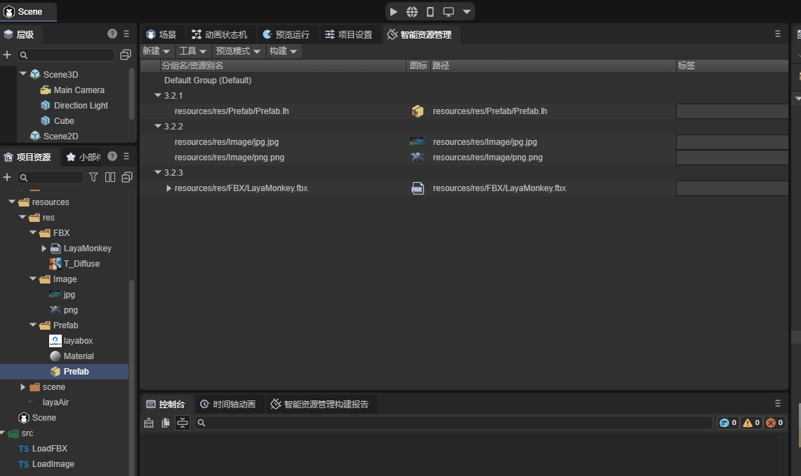

添加标签：

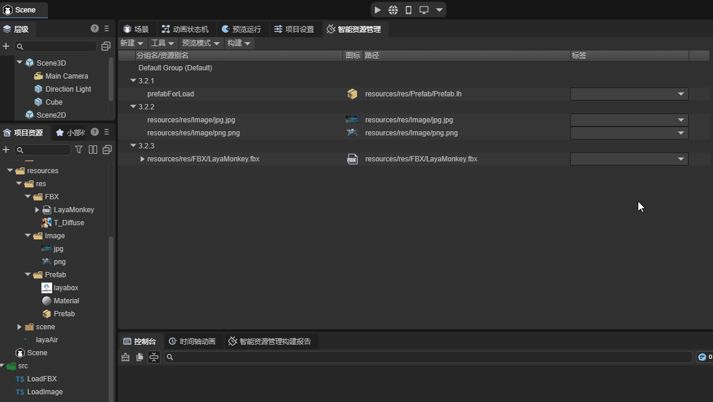

## 3. 预览调试

### 3.1 构建资源

设置好资源组后，便需要对资源进行打包，以在预览模式下对程序进行调试。打开智能资源管理面板，点击构建 - 新构建，启动插件的资源构建流程。


### 3.2 资源加载示例

#### 3.2.1 加载一个预制体

示例使用到的资源如下：

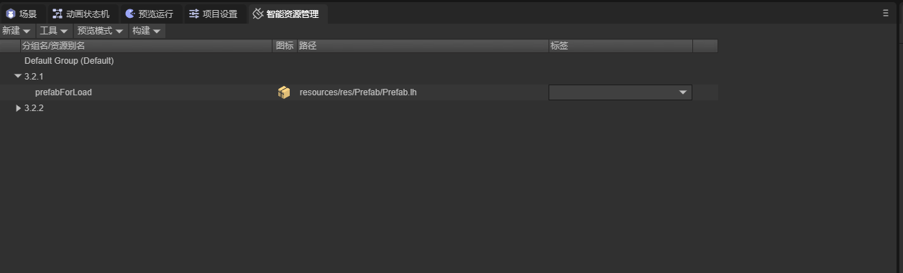

可以看到，资源组中只添加了一个资源 “Prefab”，但实际上这个预制体使用了红框中的资源，且 “layaBox” 和 “Material” 这两个资源并没有被添加到资源管理中。这便是智能资源管理插件的一项功能，开发者只需要将需要直接使用的资源添加到组管理中，与此资源相关联的资源会自动进行打包。

示例代码如下：

```typescript
@regClass()
export class LoadPrefab extends Laya.Script {

    @property(Laya.Scene3D)
    public scene: Laya.Scene3D;

    key: string = "prefabForLoad"

    onStart(): void {
        Addressables.instantiateAsync(this.key).then((res) => {
            res.data.transform.position = new Laya.Vector3(-3, 0, 0);
            this.scene.addChild(res.data);
        })

        Addressables.loadAssetAsync(this.key).then((res) => {
            let prefab = res.data.create();
            prefab.transform.position = new Laya.Vector3(3, 0, 0);
            this.scene.addChild(prefab);
        })
    }

}
```

将以上脚本挂载到场景中，点击运行，运行结果如图：


加载预制体时，即可以使用 `Addressables.instantiateAsync` 方法直接将预制体创建为实例；也可以先使用 `Addressables.loadAssetAsync` 加载预制体资源，再通过预制体对象的 `create()` 方法创建实例。

#### 3.2.2 加载多个图片

示例使用到的资源如下：

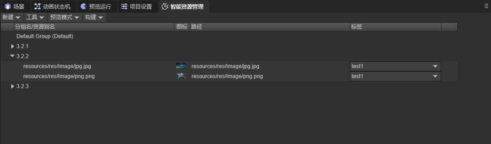

示例代码如下：

```typescript
@regClass()
export class LoadImage extends Laya.Script {

    key: string[] = ["test1"];
    resourceLocation: ResourceLocation[] = [];

    onStart(): void {
        this.loadImage(this.key);
    }

    async loadImage(key: string[]){
        //加载资源
        await Addressables.loadAssetsAsync(this.key, { mode: MergeMode.Union });
        //获取资源地址
        this.resourceLocation = await Addressables.getLocationAsync(this.key, MergeMode.Union);
        this.setImage();
    }

    //将图片添加到场景中
    setImage(): void{
        let imageJPG: Laya.Image = new Laya.Image(this.resourceLocation[0].path);
        imageJPG.pos(165, 62.5);
        imageJPG.size(300, 200);
        this.owner.addChild(imageJPG);

        let imagePNG: Laya.Image = new Laya.Image(this.resourceLocation[1].path);
        imagePNG.pos(600, 62.5);
        imagePNG.size(300, 200);
        this.owner.addChild(imagePNG);
    }

}
```

可以看到，在加载资源之后，代码中又通过 `Addressables.getLocationAsync` 方法获取了资源的路径。有些方法需要使用资源路径作为为参数，此时就需要获取到资源的地址。

运行结果如图：

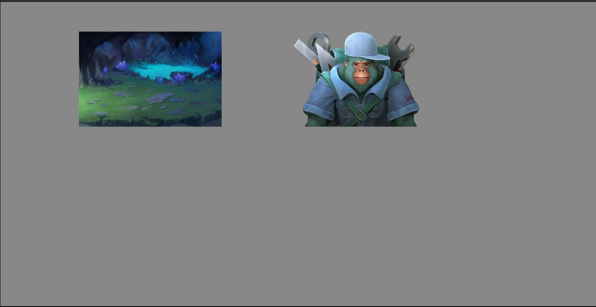

**注意：**`Addressables.getLocationAsync` 方法不会对资源进行加载。当通过智能资源管理插件加载资源时，无论加载的是什么样的资源，第一步都是先调用[使用说明](../instruction/readme.md)第5节中介绍的四种方法加载资源包。

#### 3.2.3 加载FBX资源

示例使用到的资源如下：

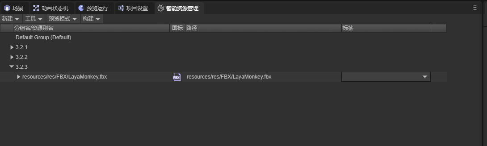

示例代码如下：

```typescript
@regClass()
export class NewScript extends Laya.Script {
    
    @property(Laya.Scene3D)
    public scene: Laya.Scene3D;

    resource: any;

    onStart(): void {
        this.loadFBX();
    }

    async loadFBX() {
        let loadResult = await Addressables.loadAssetAsync("resources/res/FBX/LayaMonkey.fbx", { type: Laya.Loader.HIERARCHY});
        let monkey: Laya.Sprite3D = loadResult.data.create();
        this.scene.addChild(monkey);
    }
}
```

引擎在加载某些资源时需要传入资源类型作为参数。

插件加载资源时，会将加载到的资源包存在缓存中，当一个资源包被加载后，开发者也可以通过`Laya.loader.load`的方法加载资源包中的其它资源。

运行结果如图：


实际上，也可以将资源制作成预制体，然后进行加载。

按需求加载资源也是智能资源管理插件的优势。在不使用插件时，系统会下载全部的资源，即使有些资源不一定会被使用；而智能资源管理插件会根据开发者的设置，有选择的对资源进行加载（例如程序总共有十个资源包，此时只需要用到其中的两个，插件只会下载这两个资源包，而不下载其余八个资源包），这大大提高了程序加载的速度。

### 3.3 优化资源包

在每次进行资源构建后，插件都会自动生成构建报告。如果有多个资源引用了同一个资源，且被引用的资源未添加到智能资源管理中，那这个资源就会被插件重复打包，造成空间的浪费。开发者需根据实际需求，优化资源包。


## 4. 构建发布

当预览调试没有问题之后，就可以进行构建发布了。

### 4.1 智能资源构建配置管理

在智能资源管理面板中，点击工具栏，打开构建配置管理面板。

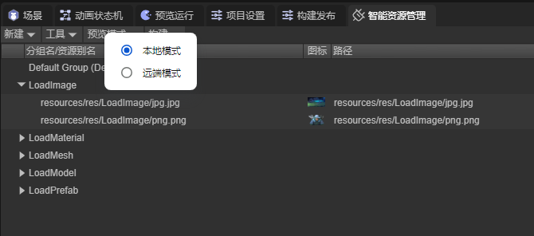

根据需求，设置构建配置并激活。

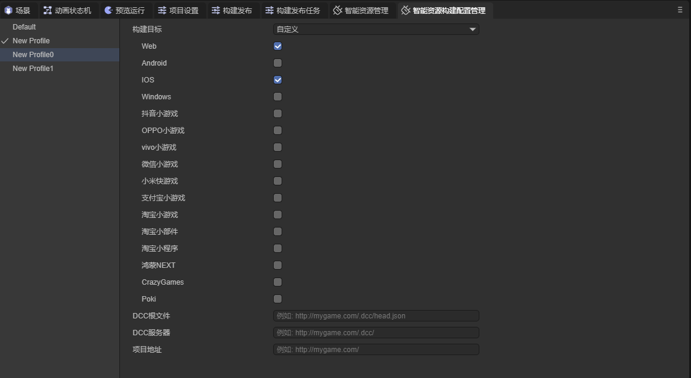

构建配置的操作方法和属性请[参考文档](../instruction/readme.md)

### 4.2 构建发布设置

在构建配置设置完成后，接下来就是在构建发布 - 智能资源管理页面进行设置，对具体属性的讲解请[使用说明](../instruction/readme.md)中第2.1节和第2.3节。


### 4.3 构建发布

完成以上流程后，开发者就可以进行构建发布了，构建发布的流程与一般情况下的发布流程相同，无需额外设置。

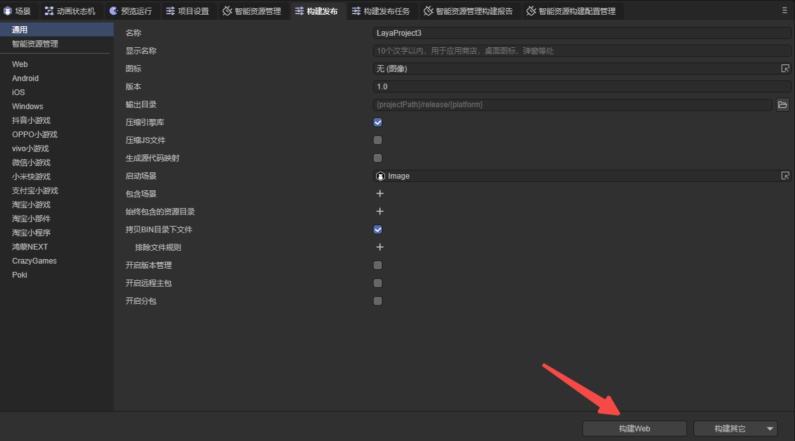

构建完成后，会在输出目录下生成打包好的项目，项目文件中会存在一个 .dcc 文件。

### 4.4 分发远程包

接下来要分发远程包。

先说明以下下文提到的项目资源：项目资源就是构建发布后生成的资源包，一般会存放在release文件夹中。


首先就是将项目资源放到项目地址中。

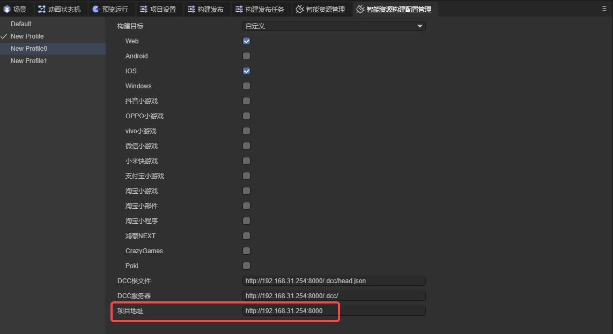

接下来是 `head.json` 文件，这个文件会生成在项目资源下的 .dcc 文件中，开发者要将其转移到根文件地址中。留空时会使用项目路径下的DCC资源输出路径中的
`head.json` 路径。


最后是DCC生成的文件。这些文件会生成在项目资源的`.dcc`目录中，开发者需将其转移到DCC服务器地址上。留空时会使用项目路径下的DCC资源输出路径作为DCC服务器地址。


### 4.5 更新资源

当开发者需要对资源进行更新时，可以使用更新上一次构建的功能。

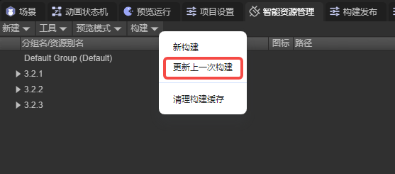

更新上一次构建生成的资源包会根据开发者此时激活的构建配置，存放在构建输出目录中与构建配置同名的文件夹中。

开发者只需要将 `.dcc` 和 `head.json` 文件以及新的导出资源转移到对应的服务器地址中即可，不需要对程序的代码做出修改。

从这里也可以体会到使用智能资源管理插件的优势。在不使用插件的情况下，如果开发者对资源做出了修改（例如重命名，修改资源的路径等），就需要对代码做出修改，以确保程序可以正常找到资源；如果使用了插件，就不会有这个问题，因为插件是通过关键字（资源别名和标签）来加载资源，只要关键字不变，插件就可以找到资源并加载，无论开发者对资源做出了什么修改。

这里我们将3.2.1中使用的预制体改名为了aaa

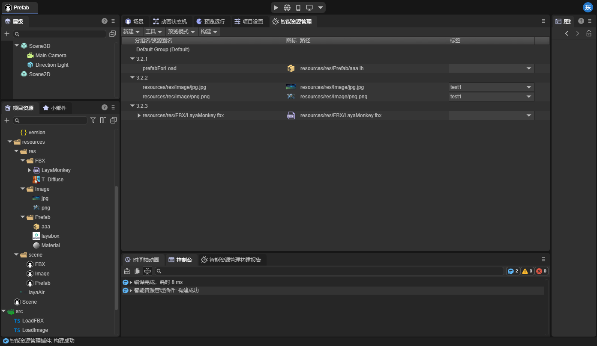

重新构建资源后，在不修改任何代码的前提下，运行可以发现资源仍正常加载。


