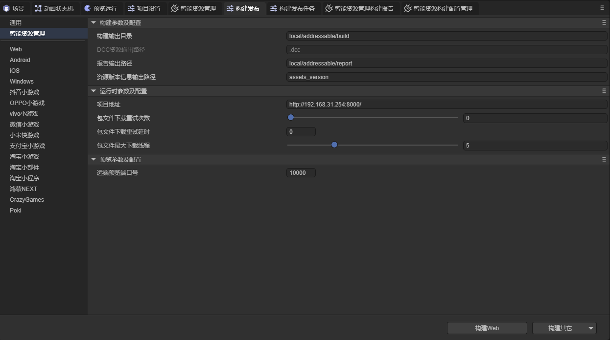

# 智能资源管理插件使用流程

本章节将会介绍智能资源管理插件的全部使用流程，并对流程中的一些细节进行讲解。本章节内容主要分为，插件导入，资源组管理，代码加载资源和项目运行四个部分。

## 1.插件导入

开发者需要使用已经开通智能资源管理插件使用权限的账号登陆IDE，在开发者栏中打开包管理器，选择智能资源管理插件并安装。


## 2.资源组管理

开发者可在智能资源管理面板中对资源及资源组进行管理，根据项目的实际需求，将资源分成不同的组，也可以更改资源别名，或为资源添加标签，具体的操作方法在智能资源管理插件文档中有详细描述，此处便不再重复。


## 3.在代码中加载资源

此章节是使用流程中的重点，这里会讲解加载资源的全部流程以及可能遇到的情况。

使用插件加载资源需要对资源进行构建，具体的构建流程会在后面的章节进行讲解，这里我们假设资源已经成功构建。

### 3.1加载资源

插件中提供了四种方法用于加载资源。关于这四种方法的具体使用方法，请参考智能资源管理插件文档

```typescript
static async instantiateAsync(key: string, options?: InstantiateOptions): Promise<LoadResult>
static async loadSceneAsync(key: string, options?: LoadSceneOptions): Promise<LoadResult>
static async loadAssetAsync(key: string, options?: LoadAssetOptions): Promise<LoadResult>
static async loadAssetsAsync(key: string | string[], options?: LoadAssetsOptions): Promise<LoadResult>
    
export type LoadResult = {
    /** 加载是否成功 */
    success: boolean;
    /** 加载结果, 仅当 {@link LoadResult.success} 为 true 时有效 */
    data?: any;
}
```

success 代表加载是否成功，data 为加载结果，根据加载的方法以及加载资源的不同，返回的内容也不相同。

instantiateAsync 用于加载预制体，此方法返回的 data 为由预制体创建的实例，可直接使用。

loadSceneAsync 用于加载场景，此方法返回的 data 为场景的路径，开发者需要通过代码来打开此场景。

loadAssetAsync 和 loadAssetsAsync 比较相似，区别在于 loadAssetAsync 只会加载单个资源，而 loadAssetsAsync 会加载多个资源。这两种方法返回的data与 Laya.loader.load 方法加载到的资源是一致的。


注意：使用这四种加载方法时，插件首先会下载资源包，这一过程是插件工作的核心，无论是什么样的资源，只要需要通过智能资源管理插件进行加载，加载流程的第一步便是调用这些方法，下载资源。

### 3.2使用资源时的一些特殊情况

某些资源通过智能资源管理插件加载后可能无法被识别，例如：


加载结果


可以看到，资源加载成功，但 data 中的数据为 undefined 。

这种情况下，首先要使用 getLocationAsync 方法获取到资源的路径，然后通过 Laya.Loder.load 方法来加载资源。（getLocationAsync 方法不会下载资源包，因此仍需要通过 loadAssetAsync 或 loadAssetsAsync 方法先下载资源，再获取地址。）

注意: 实际上这种方法仍然是在使用插件来加载资源，这是因为插件在下载到资源包后，会将资源包存入缓存中，而 Laya.Loder.load 方法在加载资源时会优先从缓存中读取资源，这也是在3.1中所说的，使用插件的第一步便是通过四种方法加载资源包的原因。

## 4.项目运行

本章节对项目的预览模式和正式发布进行讲解。

### 4.1预览模式

游戏开发的过程中，开发者需要不断进行调试，此时就需要用到预览模式。如果使用插件进行预览需要进行一些操作，下面我们来进行讲解。

智能资源管理插件的预览模式分两种：本地模式和远端模式。


无论使用哪种预览模式，在开始预览前，如果开发者对资源做出了修改，则需要进行新构建。如果项目已经新构建过了，也可以通过更新上一次构建来更新资源。


新构建生成的资源会保存在构建输出目录中，开发者可自行修改此目录。每次构建生成的资源会根据智能资源构建配置的不同而存在构建输出目录下的不同子目录中，这个我们后面再讲。


新构建后，便需要选择选择预览模式。

在本地模式下，资源会通过 assets 目录加载，而不会通过打包好的资源包进行加载；

在远端模式下，插件将在本地启动一个Server服务用于模拟外网资源加载，此时插件的加载流程与正式发布后的加载流程一致。

当开发者切换预览模式后，需要刷新编辑器，才可以开启/关闭Server服务。

### 4.2构建发布

当开发者需要对游戏在真实环境下进行测试或正式发布时，便需要进行构建发布，除正常的发布流程之外，使用了智能资源管理插件的游戏还需要一些额外的设置，本章节将对这些设置进行说明。

在构建发布-智能资源管理面板中，开发者可设置项目的相关信息，其中项目地址是比较重要的属性，开发者尽量要保证项目地址和真实项目服务器地址一致。



设置完成后，还需要选择构建配置。在智能资源管理面板中，点击工具，选择配置管理。


在智能资源构建配置管理界面，开发者可根据需求，设置构建配置。在构建发布时，插件会根据开发者选择的构建配置，设置根文件加载地址和DCC服务器地址。


开发者所激活的构建配置需包含将要发布的平台，否则插件会提示开发者更换构建配置。


下面讲解一些构建配置中的两个属性：根文件和DCC服务器。

根文件，即 head.json 文件，构建发布后会生成在输出目录下的 .dcc 文件夹中，在游戏加载时会根据设置的地址进行加载，如果地址留空则会使用项目地址。

DCC服务器，加载 .dcc  文件的地址， .dcc文件会在构建发布后生成在输出目录中，如果地址留空也会使用项目地址。

在4.1节中，我们提到新构建生成的资源会根据构建配置的不同而存放在不同的文件夹中，实际上，新构建会将生成的资源存放到 local/addressable/build 文件夹下的与构建配置同名的文件夹中，如果不存在对应文件夹，则会生成一个新的文件夹。注意：新构建和构建发布均会清空构建配置的文件夹，如果希望保留文件，请提前备份。

在构建发布后，如果开发者想对资源做出修改，便需要用到更新上一次构建这一功能。


更新上一次构建也会在激活的构建配置对应的文件夹中生成资源文件。

开发者需手动将生成的 head.json 文件移动到根文件服务器中，将 .dcc 文件夹移动到 DCC服务器中

如果资源组启用了阻止更新这一属性，在更新上一次构建时插件则不会对此资源组重新打包，但开发者也不可对此资源组中的资源做出修改，否则插件会提醒开发者将有变化的资源移动到新的组中。


### 4.3构建报告

在新构建，更新上一次构建，构建发布后，插件均会生成构建报告，报告的具体内容在智能资源管理插件文档中有详细描述，报告会保存在报告输出路径中，开发者可自行修改此路径。


插件在打包资源时，不同包中的文件如果使用了同一资源，且该资源没有加入资源管理，插件会将这些资源重复打包（也就是有多少个包用到就会打包几次），在构建报告中会对有重复使用的资源做出标注，开发者可根据构建报告，优化资源管理，以减小资源包的大小。


