# 使用说明

## 1. 概述

LayaAir智能资源管理插件是一个用于管理和打包程序资源的插件，当资源加入智能资源管理后，无论这个资源是在本地程序中还是在远端服务器上，开发者都可以在代码的任何位置，通过资源别名来加载它，智能资源管理插件会处理资源加载的过程，并将获取到的数据返回。

使用智能资源管理插件可以显著提高项目的灵活性，开发者可以在需要使用资源的时候再对资源进行加载，而不是随程序一起下载资源。在开发阶段，开发者可任意修改资源所在的位置，而无需重写任何游戏代码。

### 1.1 智能资源管理插件系统概述

本节会对智能资源管理插件中的一些概念进行基础的介绍，以帮助开发者对此插件建立一个基础的认识。

**资源别名：**标识被插件管理的资源的字符串ID，开发者可使用资源别名对资源进行加载。

**标签：**一个标记，开发者可将其分配给多个资源，并使用标签作为关键字加载资源。

**资源组：**资源管理的基础单元，插件会根据资源组的设置对资源进行打包。

**资源构建：**对资源进行打包的操作，插件会根据开发者的设置来打包资源。

**构建报告：**资源进行构建后，插件会生成资源构建报告，开发者可根据构建报告，优化资源设置。

## 2. 配置智能资源管理对象

### 2.1 智能资源管理插件配置

在构建发布 - 智能资源管理栏中打开配置面板。

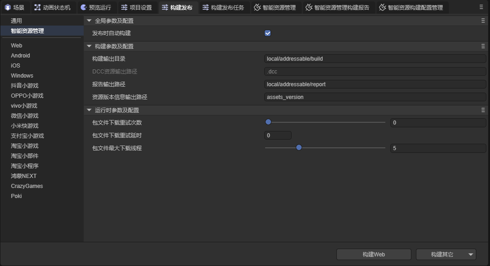

#### 2.1.1全局参数及配置

**发布时自动构建：**启用此配置后，在执行构建发布时，智能资源管理插件会自动进行一次新构建；如果未启用此配置，插件会使用上一次构建时生成的资源包。

#### 2.1.2 构建参数及配置

**构建输出目录：**构建生成文件存放的根路径，相对于当前项目路径，构建时会基于该目录创建一个子目录，子目录名及构建时激活的构建配置名，构建时生成所有文件会存放在该子目录下，且每次构建都会清空该子目录。

一般不建议修改。

**DCC资源输出路径：**构建时DCC相关文件的输出地址，相对与构建输出目录下与激活的构建配置名同名的子目录，该地址不可修改。

**报告输出路径：**构建报告存放的路径，相对于当前项目路径。

**资源版本信息输出路径：**资源版本信息数据存放的地址，相对于当前项目路径，该数据用于在更新上一次构建时，比较两次构建间被管理的资源发生的变化，此地址一般不建议修改。

#### 2.1.3 运行时参数及配置

**包文件下载重试次数：**包文件下载失败时插件会重试的次数。

**包文件下载重试延迟：**包文件下载失败时，插件要延迟多久才会重试。 

**包文件最大下载线程：**最多同时下载多少个包文件。

### 2.2 资源组配置

在智能资源管理面板内，点击任意一个组，即可在右侧面板中对此组进行配置管理。

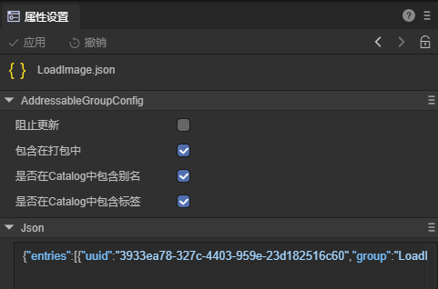

**阻止更新：**启用此属性后，在执行更新上一个构建时, 不再对该资源组进行资源构建。如果开发者修改了该资源组下的资源，插件会提醒开发者将修改过的资源移动到新组中。新构建时不受该属性影响。

**包含在打包中：**只有启用了该属性的资源组才会进行打包。未启用该属性的资源组相当于不存在。

**是否在Catalog中包含别名/标签：**未启用此属性时，插件生成的 Catalog文件中不会包含该资源组中资源的别名/标签，也无法通过别名/标签作为关键字加载该资源组中的资源。

### 2.3 构建配置

在智能资源管理 - 工具栏中打开智能资源管理构建配置面板。

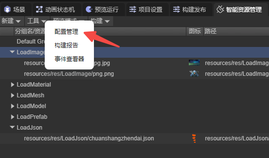


**构建目标：**此构建配置会在哪个平台生效，可以是全部平台，也可以自定义组合多个平台。

**根文件：**插件会通过该属性设置的地址加载 `head.json` 文件，留空则使用构建发布时设置的项目地址下的 `.dcc/head.json` 作为根文件地址。

**DCC服务器：**插件会根据该属性中填写的地址加载DCC相关文件，留空则使用构建发布时设置的项目地址下的 `.dcc` 目录地址作为DCC服务器地址。

**项目地址：**项目资源的HTTP地址，用于访问项目资源，留空则表示项目资源都在包体内。

### 2.4 预览模式

预览模式在程序开发阶段使用，用于模拟加载资源，方便开发者调试程序。

预览模式分为两种，本地模式和远端模式。

当选择本地模式时，资源不会通过包文件加载，而是通过 assets 目录加载资源；

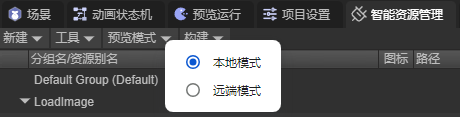

当选择远端模式时，插件将在本地启动一个HTTP服务用于模拟外网资源加载。
**注意：**修改模式后，需要使用 `Ctrl + Shift + R` 刷新编辑器，才可以开启/关闭此HTTP服务。

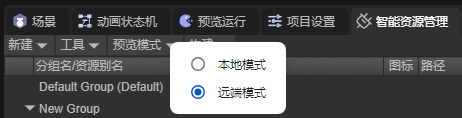

## 3. 资源管理

### 3.1 资源组管理

#### 3.1.1 新建资源组

点击面板上方的“新建”按钮，新建一个资源组


#### 3.1.2 资源组重命名

可以通过右键组名 - 重命名、慢速双击、或选中需要重命名的组并按键盘上的 `F2` 键这三种方式来为组重命名


#### 3.1.3 删除资源组

可以通过右键组名 - 移除组、或选中需要删除的组并按键盘上的 `Del` 键这两种方法来删除组


#### 3.1.4 改变组顺序

通过拖动改变组的排列顺序, 以方便用户管理

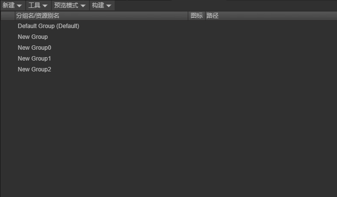

### 3.2 组内资源管理

#### 3.2.1 添加资源

第一种方式：将需要打包的资源拖入到新建的资源组中，生成资源条目。可以拖动单个资源或文件夹到资源组中。


当拖动文件夹到资源组中时，插件会自动将该文件夹下（包括该文件下所有子文件夹下）的所有资源加入到该资源组。

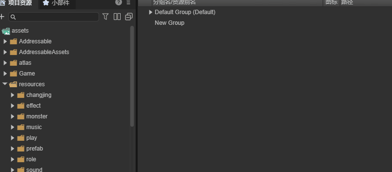

第二种方式：在项目资源面板中选中要添加的资源，在右侧面板中勾选“智能资源管理”这一选项，并应用，此时资源将被自动添加到默认组中。


#### 3.2.2 移除资源

第一种方式：在可寻址资源管理面板中，右击想要移除的资源，点击移除。

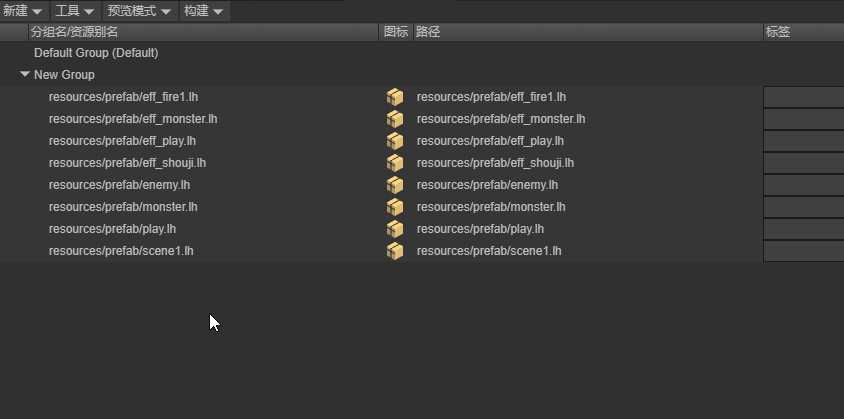

第二种方式：在项目资源面板中选中要移除的资源，在右侧面板中将“智能资源管理”这一选项取消勾选，并应用

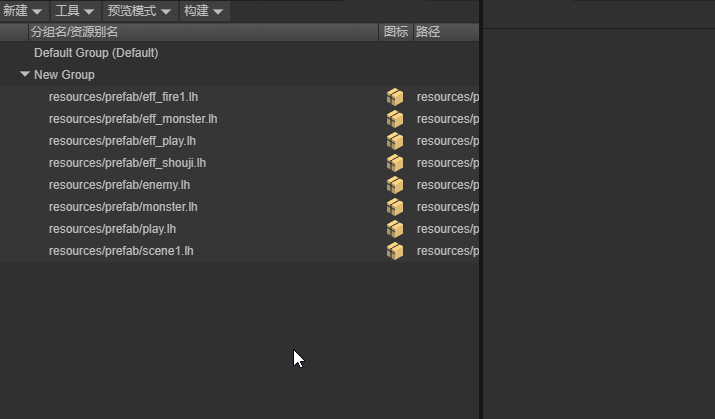

#### 3.2.3 资源别名重命名  

通过右键资源 - 重命名、慢速双击、或选中需要重命名的资源并按键盘上的 `F2` 键这三种方式来更改资源的资源别名


#### 3.2.4 更改资源所在的资源组

通过拖动更改资源所在的资源组


也可以将项目资源面板中的资源拖入不同组来更改资源所在的资源组

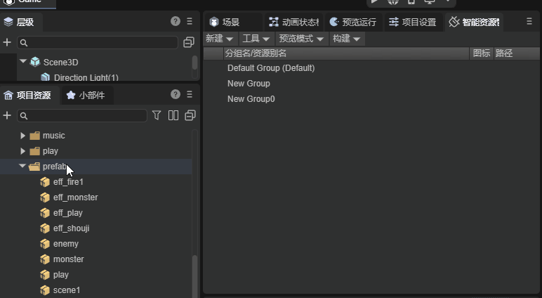

#### 3.2.5 资源标签管理

在标签管理界面对标签进行增加，移除，重命名操作

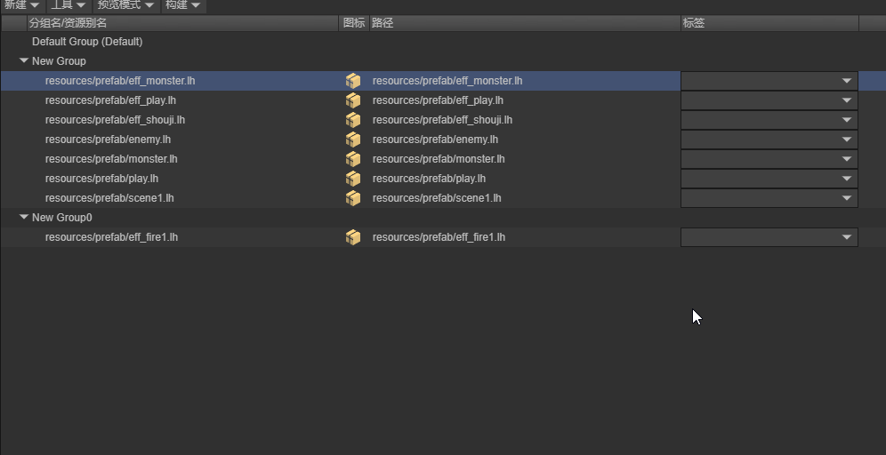

为资源添加标签。一个资源可以有多个标签，一个标签也可以对应多个资源。

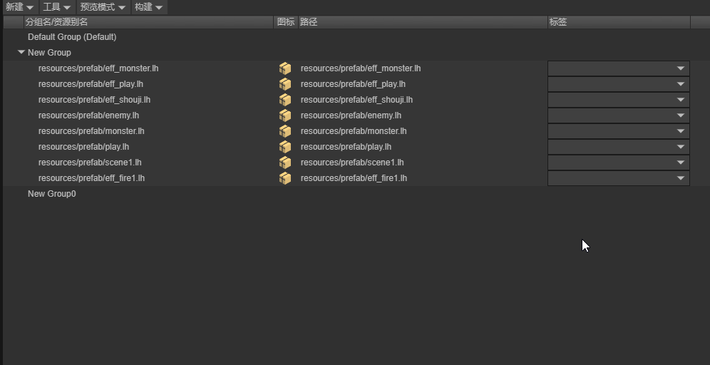

### 3.3 构建配置管理

在智能资源管理面板，点击工具栏，打开智能资源构建配置管理。


开发者可管理构建配置，包括新建，删除，重命名，激活这些操作。


对于每一个构建配置，开发者可自行设置其属性。
**注意：**默认配置的构建平台属性始终为 `全部` 且不可以修改，这是为了用户在发布项目时，始终有一个可用的构建配置文件。


构建发布前，开发者需选择正确的构建配置，如果激活的构建配置的构建目标中不包含此次构建的平台，插件会提醒开发者更换构建配置。

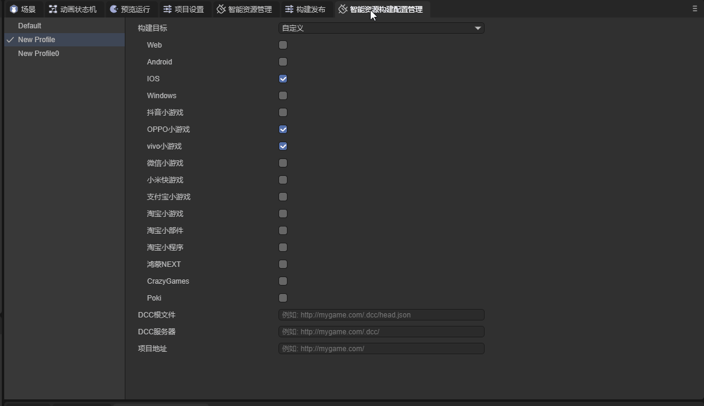

## 4. 构建内容

### 4.1 构建设置

要对资源进行构建，开发者需进行以下操作：

1.对资源组进行设置。

2.在构建发布 - 智能资源管理页面进行设置。

3.选择正确的构建配置文件。

4.执行构建。

### 4.2 执行构建

#### 4.2.1 新构建

进行构建时，开发者可通过新构建单独对智能资源管理中的资源进行构建，而不构建整个项目。


#### 4.2.2 构建发布

构建发布时，如果开发者启用了发布时自动构建这一配置，插件会对资源进行构建，此时生成的 `.dcc` 文件会保存在项目输出目录中，开发者可根据激活的构建配置，将 `.dcc` 文件和 `head.json` 文件移动到对应的服务器中。

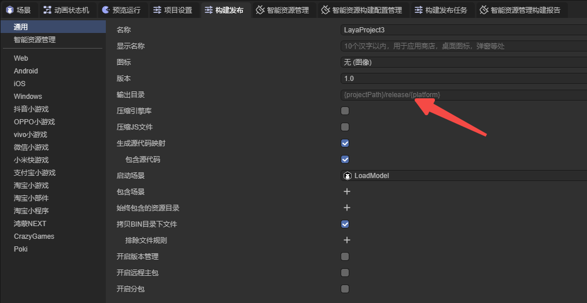

### 4.3 更新资源

当开发者需要更新资源时，可以使用更新上一次构建的功能。

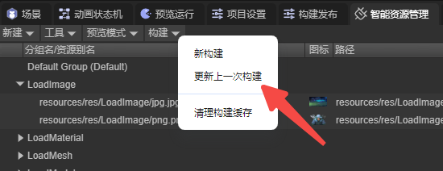

更新上一次构建会根据资源组是否启用阻止更新这一属性，决定是否对该资源组进行资源构建。


完成构建后，生成的文件会存放在构建输出目录中，开发者需要将新打包的资源、`.dcc`目录 和 `head.json` 文件转移到指定的服务器中。

## 5. 在运行时使用

运行时，共有四种方法用于加载资源。

```typescript
/**
 * 加载资源
 * @param key 用来筛选资源的关键字
 * @param options {LoadAssetOptions} 加载资源的选项
 * @returns {Promise<LoadResult>}
 */
static async loadAssetAsync(key: string, options?: LoadAssetOptions): Promise<LoadResult> ;

/**
 * 加载资源
 * @param key 用来筛选资源的关键字
 * @param options {LoadAssetsOptions} 加载资源的选项
 * @returns {Promise<LoadResult>}
 */
static async loadAssetsAsync(key: string | string[], options?: LoadAssetsOptions): Promise<LoadResult> ;

/**
 * 创建资源的实例
 * @description 在 {@link LoadResult.data} 中返回创建的实例，仅当加载的资源是一个Prefab时有效
 * @param key 用来筛选资源的关键字
 * @param options
 * @return {Promise<LoadResult>}
 */
static async instantiateAsync(key: string, options?: InstantiateOptions): Promise<LoadResult> ;

/**
 * 加载场景
 * @description 在 {@link LoadResult.data} 中返回加载场景所需的路径
 * @param key 用来筛选资源的关键字
 * @param options
 * @returns {Promise<LoadResult>} 在 {@link LoadResult.data} 中返回加载的场景的路径
 */
static async loadSceneAsync(key: string, options?: LoadSceneOptions): Promise<LoadResult>;
```

### 5.1 加载单个资源 

```typescript
/**
 * 加载资源
 * @param key 用来筛选资源的关键字
 * @param options {LoadAssetOptions} 加载资源的选项
 * @returns {Promise<LoadResult>}
 */
static async loadAssetAsync(key: string, options?: LoadAssetOptions): Promise<LoadResult> ;
```

Addressables.loadAssetAsync ，此方法会根据关键字加载第一个找到的资源。

    onStart(): void {
        Addressables.loadAssetAsync('test1').then((result: LoadResult) => {
            console.log(result);
        });
    }


输出结果：


### 5.2 加载多个资源

```typescript
/**
 * 加载资源
 * @param key 用来筛选资源的关键字
 * @param options {LoadAssetsOptions} 加载资源的选项
 * @returns {Promise<LoadResult>}
 */
static async loadAssetsAsync(key: string | string[], options?: LoadAssetsOptions): Promise<LoadResult> ;
```

Addressables.loadAssetsAsync，此方法根据不同的 options 值有三种加载选项。

#### 5.2.1 UseFirst

在使用此加载选项时，插件会根据传入的第一个关键字，加载所有包含此资源别名或标签的资源，如果此时传入多个关键字，只有第一个关键字生效。


```typescript
onStart(): void {
    Addressables.loadAssetsAsync(['test2', 'test1'], { mode: MergeMode.UseFirst }).then((result: LoadResult) => {

        console.log(result);

        for(let i = 0; i < result.data.length; i++) {
            console.log(result.data[i].url);
        }
    });
}
```

输出结果：


#### 5.2.2 Union

插件会筛选出每个关键字所对应的所有资源，并对这些资源求并集。


```typescript
onStart(): void {
    Addressables.loadAssetsAsync(['test1', 'test2'], { mode: MergeMode.Union }).then((result: LoadResult) => {

        console.log(result);

        for(let i = 0; i < result.data.length; i++) {
            console.log(result.data[i].url);
        }
    });
}
```

输出结果：

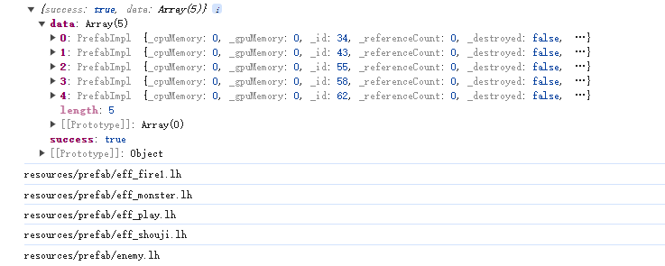

#### 5.2.3 Intersection

插件会筛选出每个关键字所对应的所有资源，并对这些资源求交集。


```typescript
onStart(): void {
    Addressables.loadAssetsAsync(['test1', 'test2'], { mode: MergeMode.Intersection }).then((result: LoadResult) => {

        console.log(result);

        for(let i = 0; i < result.data.length; i++) {
            console.log(result.data[i].url);
        }
    });
}
```

输出结果：


#### 5.2.4 options

智能资源管理插件内部调用了`Laya.loader.load`的方法，因此插件的加载方法也可以使用其属性值作为参数。开发者可根据需求自行设置参数。

```typescript
export interface ILoadOptions {
    type?: string; //资源类型。比如：Loader.IMAGE。
    priority?: number; //(default = 0)加载的优先级，数字越大优先级越高，优先级高的优先加载。
    group?: string; //分组，方便对资源进行管理。
    cache?: boolean; //是否缓存
    noRetry?: boolean; //是否重新尝试加载
    silent?: boolean; //是否提示加载失败
    useWorkerLoader?: boolean; //(default = false)是否使用worker加载（只针对IMAGE类型和ATLAS类型，并且浏览器支持的情况下生效）
    constructParams?: TextureConstructParams; //图片属性，参考如下
    propertyParams?: TexturePropertyParams; //纹理属性，参考如下
    blob?: ArrayBuffer; //传递blob对象获得HTMLImageElement
    noMetaFile?: boolean; //是否不去下载Meta(json)文件
    [key: string]: any;
}

TextureConstructParams {
    width?: number,
    height?: number,
    format?: TextureFormat,
    mipmap?: boolean,
    canRead?: boolean,
    sRGB?: boolean,
}

TexturePropertyParams {
    wrapModeU?: number,
    wrapModeV?: number,
    filterMode?: FilterMode,
    anisoLevel?: number,
    premultiplyAlpha?: boolean,
    hdrEncodeFormat?: HDREncodeFormat,
}
```

如果开发者希望智能资源管理插件内部调用`Laya.loader.fetch`方法来加载资源，则需要将`noUseResourceLoader?: boolean`属性设置为`true`,并传入需要的

`contentType?: keyof Laya.ContentTypeMap`属性值。

```typescript
export interface LoadOptions extends Laya.ILoadOptions {
    /** 资源加载进度回调 */
    progress?: Laya.Handler | Laya.ProgressCallback;
    /** 不使用 {@link Laya.IResourceLoader} 对下载的资源进行解析, 当该值为 true 时, {@link LoadResult.data} 返回通过 
    {@link Laya.Loader.fetch} 接口获取的结果 */
    noUseResourceLoader?: boolean;
    /** 当且仅当 {@link noUseResourceLoader} 为 true 时有效, 该参数会作为 {@link Laya.Loader.fetch} 的参数传递 */
    contentType?: keyof Laya.ContentTypeMap;
}
```

### 5.3 创建资源的实例

```typescript
/**
 * 创建资源的实例
 * @description 在 {@link LoadResult.data} 中返回创建的实例，仅当加载的资源是一个Prefab时有效
 * @param key 用来筛选资源的关键字
 * @param options
 * @return {Promise<LoadResult>}
 */
static async instantiateAsync(key: string, options?: InstantiateOptions): Promise<LoadResult> ;
```

Addressables.instantiateAsync， 插件会根据传入的关键字，将检索到的第一个预制体资源直接转换为对应的节点，其他资源会被忽略


```typescript
onStart(): void {
    Addressables.instantiateAsync('test1').then((result: LoadResult) => {
        console.log(result);
    });

    Addressables.instantiateAsync('test3').then((result: LoadResult) => {
        console.log(result);
    });
}
```

输出结果：


### **5.4 加载场景**

```typescript
/**
 * 加载场景
 * @description 在 {@link LoadResult.data} 中返回加载场景所需的路径
 * @param key 用来筛选资源的关键字
 * @param options
 * @returns {Promise<LoadResult>} 在 {@link LoadResult.data} 中返回加载的场景的路径
 */
static async loadSceneAsync(key: string, options?: LoadSceneOptions): Promise<LoadResult> 
```

Addressables.loadSceneAsync， 插件会根据传入的关键字，加载检索到的第一个场景资源，非场景资源会被忽略。

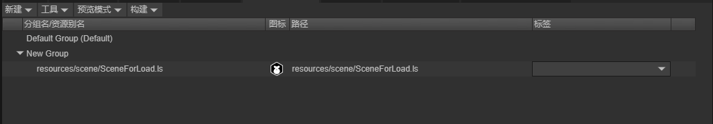

```typescript
onStart(): void {
    Addressables.loadSceneAsync("resources/scene/SceneForLoad.ls").then((res) => {
        console.log(res);
        Laya.Scene.open(res.data);
    })
}
```

输出结果：


### 5.5 获取资源的描述信息列表

Addressables.getLocationAsync, 插件会根据传入的关键字，加载并返回资源的描述信息，需要注意的是，此方法不会加载资源

```typescript
/**
 * 获取资源的描述信息列表
 * @param keys 用来筛选资源的关键字列表
 * @param mode 合并模式
 * @returns {Promise<ResourceLocation[]>}
 */
static async getLocationAsync(key: string | string[], mode?: MergeMode): Promise<ResourceLocation[]>
```

与加载多个资源的方法相同，Addressable.getLocationAsync 也可以根传入的关键字的不同，使用不同的加载选项。


```typescript
onStart(): void {
    Addressables.getLocationAsync(["test2"], MergeMode.Union).then((res) => {
        console.log(res);
    })
}
```


## 6. 构建报告

资源构建完成后，会生成资源报告。点击智能资源管理构建报告面板，可以查看相关信息。报告中有概要、浏览、潜在问题三个页面。

### 6.1 概要

概要页面中包含了本次报告的编译时间、版本号、资源量统计、冲突问题等信息。


### 6.2 浏览

浏览页面中，显示了每个包中包含的资源，资源之间的依赖关系、包之间的依赖关系等信息。


### 6.3 潜在问题

不同包内的多个资源同时引用了相同的资源，且该资源没有加入资源管理，此时这个被引用的资源会同时存在于多个包内，造成空间浪费。

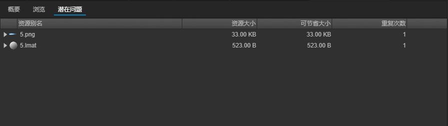

## 7. 日志查看器

在IDE中进行预览时，插件会生成运行日志，记录插件在运行时的行为，开发者可根据运行日志，检查插件是否按设计要求正确运行，或是对代码和资源分包进行优化。

### 7.1 打开日志查看器

在智能资源管理面板，选择工具栏，点击事件查看器，即可打开日志查看器。

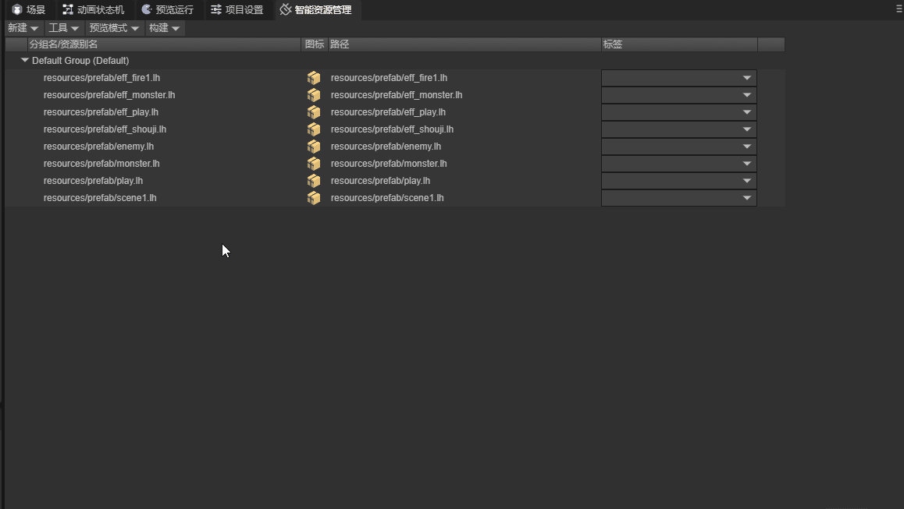

### 7.2 预览时生成日志

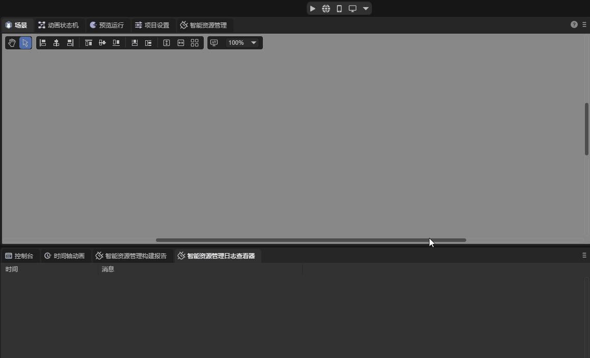

开始预览时，插件会自动清除上一次预览时生成的日志。

### 7.3 资源优化

在远端预览模式下，插件会生成资源包下载日志，开发者可根据日志，优化资源管理模式。


