# 智能资源管理插件

智能资源管理插件，是一款用于优化 LayaAir 引擎资源管理的工具。该插件需要在 IDE 开发环境中进行资源的分类、编辑、编译等操作，并在游戏运行时环境中使用。可以提高资源加载效率，并提供更灵活的资源管理方式。

## 1.基础使用方式

### 1.1导入插件

1.在开发者栏中打开包管理器

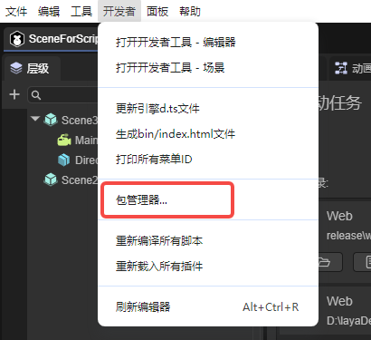

2.在包管理器中，选择智能资源管理插件，点击安装


### 1.2 资源组管理

#### 1.2.1.新建资源组

点击面板上方的“新建”按钮，新建一个资源组

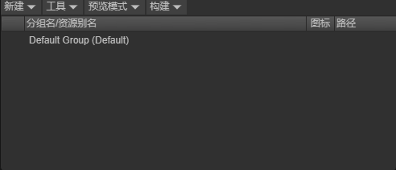

#### 1.2.2.资源组重命名

可以通过右键组名 - 重命名，慢速双击或者选中资源条目后，按键:F2组名的方式为组重命名


#### 1.2.3.删除资源组

可以通过右键组名 - 移除组的方法来将组删除

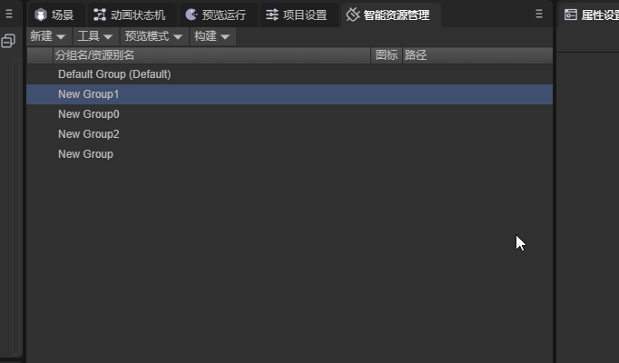

#### 1.2.4.改变组顺序

通过拖动改变组的排列顺序


### 1.3 资源管理

#### 1.3.1.添加资源

第一种方式：将需要打包的资源拖入到新建的资源组中，生成资源条目


第二种方式：在项目资源面板中选中要添加的资源，在右侧面板中勾选“智能资源管理”这一选项，并应用，

这种方式会将资源添加到默认组中

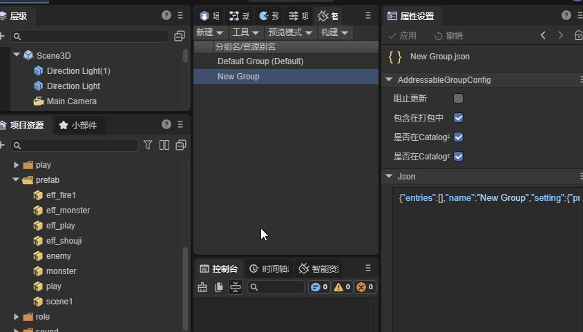

#### 1.3.2.移除资源

第一种方式：在可寻址资源管理面板中，右击想要移除的资源，点击移除。


第二种方式：在项目资源面板中选中要移除的资源，在右侧面板中将“智能资源管理”这一选项取消勾选，并应用


#### 1.3.3.资源别名重命名  

通过右键资源-重命名的方式或者选中资源条目后，按键:F2来更改资源的资源别名

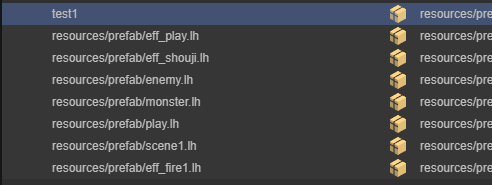

#### 1.3.4.更改资源所在的资源组

通过拖动更改资源所在的资源组

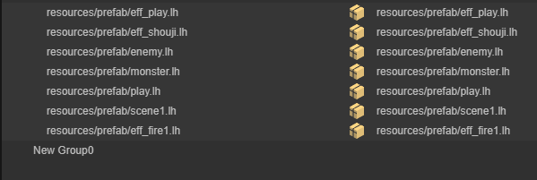

也可以将项目资源面板中的资源拖入不同组来更改资源所在的资源组

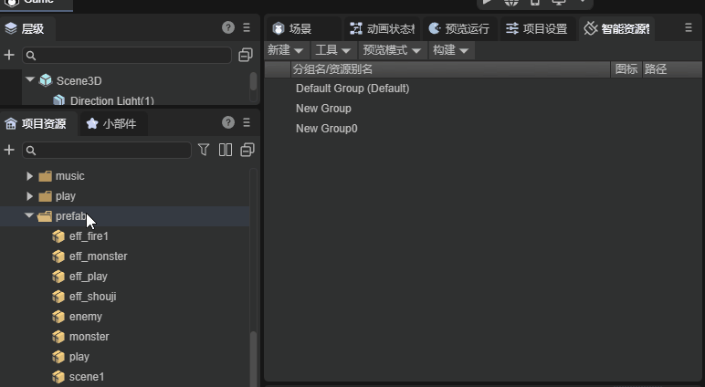

#### 1.3.5.资源标签管理

在标签管理界面对标签进行增加，移除，重命名操作


为资源添加标签。一个资源可以有多个标签，一个标签也可以对应多个资源。


## 2.资源构建与使用

### 2.1智能资源构建配置管理

在智能资源管理面板，点击工具栏，打开智能资源构建配置管理。

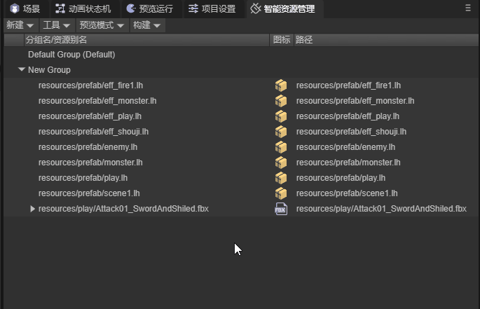

开发者可管理构建配置，包括新建，删除，重命名，激活这些操作。

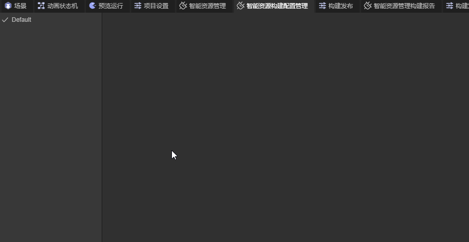

对于每一个构建配置，开发者可自行设置其属性，下面对这些属性进行讲解：

构建目标：此属性决定了这个构建配置可在开发者进行哪个平台的构建时生效，默认为全选，可进行自定义。

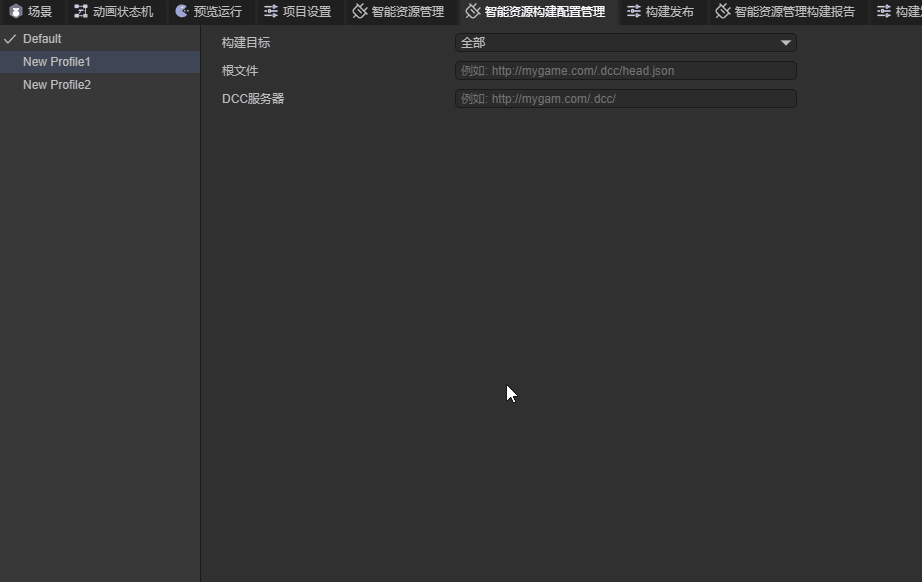

如果激活的构建配置的构建目标中不包含此次构建的平台，插件会提醒开发者更换构建配置。


根文件：在资源构建成功后，会在资源包目录中的 .dcc 文件夹中会生成 head.json 文件，插件会根据根文件属性设置的地址加载 head.json 文件，如果开发者没有设置此属性，则会使用构建发布时设置的项目地址。

DCC服务器：在资源构建成功后，会在资源包目录中的 .dcc 文件夹，插件会根据DCC服务器属性中填写的地址加载 .dcc 文件。

### 2.2新构建，更新上一次构建与构建发布

插件中有三种方法进行资源构建打包，下面对这三种方法进行讲解。

#### 2.2.1新构建

新构建会对全部已加入资源管理的资源进行打包，生成的资源包会保存在项目的构建输出目录中（默认为local/addressable/build），根据开发者激活的智能资源构建配置管理的不同，构建出的资源会存放在不同的文件夹中（文件夹名称与构建配置名称相同），即使没有对资源组进行修改，插件依然会对资源重新打包，生成新的文件。


#### 2.2.2更新上一次构建

更新上一次构建与新构建相似，唯一不同的是更新上一次构建会根据资源组是否启用阻止更新这一属性，决定是否进行资源构建。

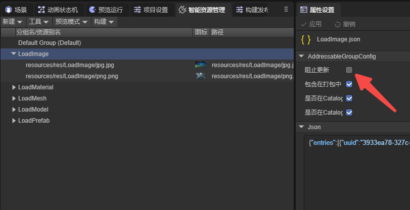

所有启用了阻止更新属性的组都不会进行资源构建，但开发者也不能对这些组中的资源做出修改；如果资源有修改，插件会提醒开发者将资源移动到其它资源组中。

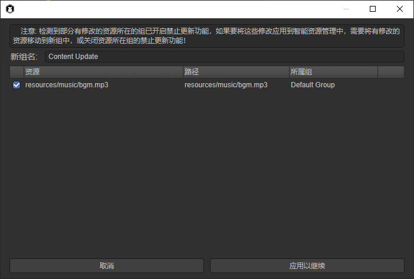

#### 2.2.3构建发布

在构建发布时，资源包不会生成在构建输出目录中，而是直接存入项目的输出目录（默认为项目路径下的 release 文件夹中）对应的构建目标文件中（例如选择构建web，文件就会存入web文件夹中）。

### 2.3预览模式与正式发布

#### 2.3.1预览模式

预览模式在程序开发阶段使用，用于模拟加载资源，方便开发者调试程序。

预览模式分为两种，本地模式和远端模式。

当选择本地模式时，资源不会通过包文件加载，而是通过 assets 目录加载资源；

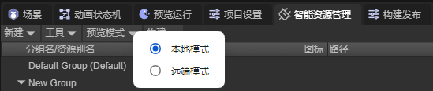

当选择远端模式时，插件将在本地启动一个Server服务用于模拟外网资源加载。注意: 修改模式后, 需要使用ctrl+shift+R刷新编辑器, 才可以开启/关闭Server服务。

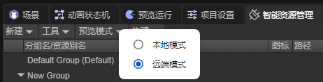

#### 2.3.2正式发布

当开发者完成程序的开发，或需要进行远程测试时，便需要用到构建发布来真正构建资源。本章节主要介绍构建发布时与智能资源管理有关的内容，构建发布的其它功能请参考引擎文档。

在构建发布页面，选择智能资源管理条目。

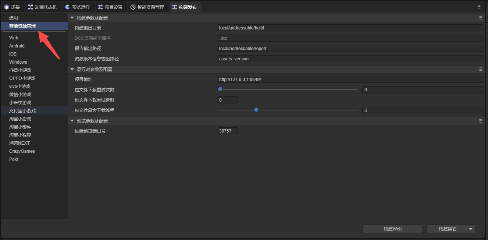

在此条目下，开发者可对各项参数进行配置。

完成构建后，开发者需要将项目文件放到项目地址中设置的服务器地址下，如果使用的构建配置设置了根文件地址和DCC服务器地址，还需要将 head.json 文件和 

.dcc 文件移动到对应的服务器地址下。

### 2.4查看报告

资源构建完成后，会生成资源报告。点击可寻址资源报告面板，可以查看相关信息。报告中有概要、浏览、潜在问题三个页面。

#### 2.4.1.概要页面

概要页面中包含了本次报告的编译时间、版本号、资源量统计、冲突问题等信息。


#### 2.4.2.浏览页面

浏览页面中，显示了每个包中包含的资源，资源之间的依赖关系、包之间的依赖关系等信息

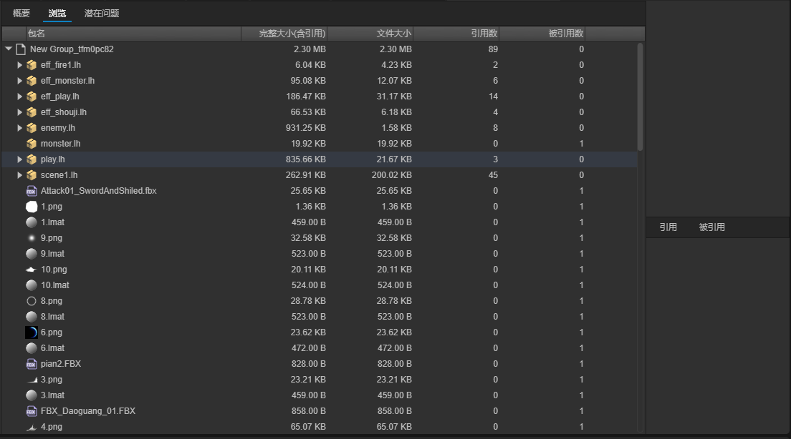

#### 2.4.3潜在问题

不同包内的多个资源同时引用了相同的资源，且该资源没有加入资源管理，此时这个被引用的资源会同时存在于多个包内，造成空间浪费。

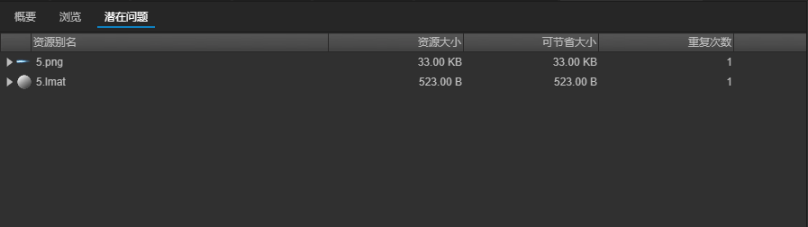

## 3.运行时加载

运行时，共有五种方法用于加载资源。

```typescript
    /**
     * 加载资源
     * @param key 用来筛选资源的关键字
     * @param options {LoadAssetOptions} 加载资源的选项
     * @returns {Promise<LoadResult>}
     */
    static async loadAssetAsync(key: string, options?: LoadAssetOptions): Promise<LoadResult> ;

    /**
     * 加载资源
     * @param key 用来筛选资源的关键字
     * @param options {LoadAssetsOptions} 加载资源的选项
     * @returns {Promise<LoadResult>}
     */
    static async loadAssetsAsync(key: string | string[], options?: LoadAssetsOptions): Promise<LoadResult> ;

    /**
     * 创建资源的实例
     * @description 在 {@link LoadResult.data} 中返回创建的实例, 仅当加载的资源是一个Prefab时有效
     * @param key 用来筛选资源的关键字
     * @param options
     * @return {Promise<LoadResult>}
     */
    static async instantiateAsync(key: string, options?: InstantiateOptions): Promise<LoadResult> ;

    /**
     * 加载场景
     * @description 在 {@link LoadResult.data} 中返回加载场景所需的路径
     * @param key 用来筛选资源的关键字
     * @param options
     * @returns {Promise<LoadResult>} 在 {@link LoadResult.data} 中返回加载的场景的路径
     */
    static async loadSceneAsync(key: string, options?: LoadSceneOptions): Promise<LoadResult>;
    
    /**
     * 获取资源的描述信息列表
     * @param keys 用来筛选资源的关键字列表
     * @param mode 合并模式
     * @returns {Promise<ResourceLocation[]>}
     */
    static async getLocationAsync(key: string | string[], mode?: MergeMode): Promise<ResourceLocation[]>

```


### 3.1加载单个资源 

```typescript
    /**
     * 加载资源
     * @param key 用来筛选资源的关键字
     * @param options {LoadAssetOptions} 加载资源的选项
     * @returns {Promise<LoadResult>}
     */
    static async loadAssetAsync(key: string, options?: LoadAssetOptions): Promise<LoadResult> ;
```

Addressables.loadAssetAsync ，此方法会根据关键字加载第一个找到的资源。

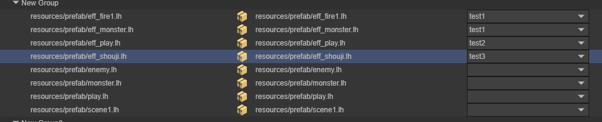

```typescript
    onStart(): void {
        Addressables.loadAssetAsync('test1').then((result: LoadResult) => {
            console.log(result);
        });
    }
```

输出结果：

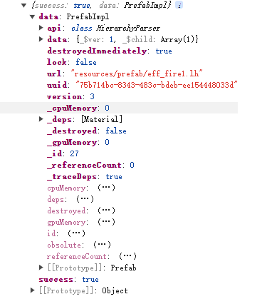

### 3.2加载多个资源

```typescript
    /**
     * 加载资源
     * @param key 用来筛选资源的关键字
     * @param options {LoadAssetsOptions} 加载资源的选项
     * @returns {Promise<LoadResult>}
     */
    static async loadAssetsAsync(key: string | string[], options?: LoadAssetsOptions): Promise<LoadResult> ;
```

Addressables.loadAssetsAsync，此方法根据不同的 options 值有三种加载选项。

#### 3.2.1.UseFirst

在使用此加载选项时，插件会根据传入的第一个关键字，加载所有包含此资源别名或标签的资源，如果此时传入多个关键字，只有第一个关键字生效。


```typescript
    onStart(): void {
        Addressables.loadAssetsAsync(['test2', 'test1'], { mode: MergeMode.UseFirst }).then((result: LoadResult) => {

            console.log(result);

            for(let i = 0; i < result.data.length; i++) {
                console.log(result.data[i].url);
            }
        });
    }
```

输出结果：


#### 3.2.2.Union


```typescript
    onStart(): void {
        Addressables.loadAssetsAsync(['test1', 'test2'], { mode: MergeMode.Union }).then((result: LoadResult) => {

            console.log(result);

            for(let i = 0; i < result.data.length; i++) {
                console.log(result.data[i].url);
            }
        });
    }
```

输出结果：

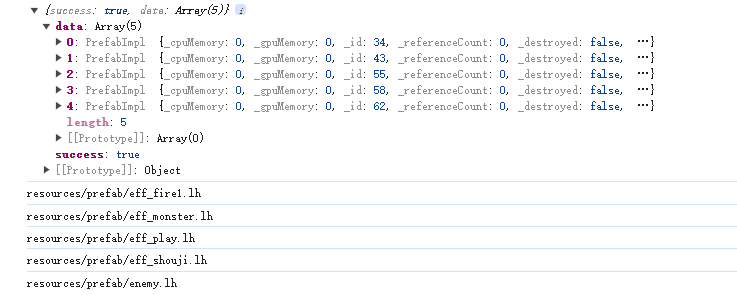

#### 3.2.3.Intersection

插件会筛选出每个关键字所对应的所有资源，并对这些资源求交集。


```typescript
    onStart(): void {
        Addressables.loadAssetsAsync(['test1', 'test2'], { mode: MergeMode.Intersection }).then((result: LoadResult) => {

            console.log(result);

            for(let i = 0; i < result.data.length; i++) {
                console.log(result.data[i].url);
            }
        });
    }
```

输出结果：


### 3.3创建资源的实例

```typescript
    /**
     * 创建资源的实例
     * @description 在 {@link LoadResult.data} 中返回创建的实例, 仅当加载的资源是一个Prefab时有效
     * @param key 用来筛选资源的关键字
     * @param options
     * @return {Promise<LoadResult>}
     */
    static async instantiateAsync(key: string, options?: InstantiateOptions): Promise<LoadResult> ;
```

Addressables.instantiateAsync,  插件会根据传入的关键字，将检索到的第一个预制体资源直接转换为对应的节点，其他资源会被忽略

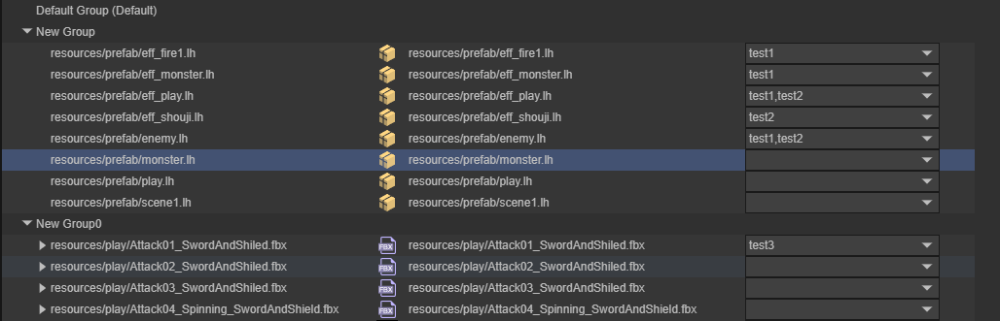

```typescript
    onStart(): void {
        Addressables.instantiateAsync('test1').then((result: LoadResult) => {
            console.log(result);
        });

        Addressables.instantiateAsync('test3').then((result: LoadResult) => {
            console.log(result);
        });
    }
```

输出结果：

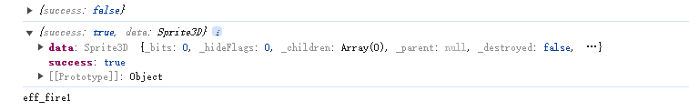

### **3.4加载场景**

```typescript
    /**
     * 加载场景
     * @description 在 {@link LoadResult.data} 中返回加载场景所需的路径
     * @param key 用来筛选资源的关键字
     * @param options
     * @returns {Promise<LoadResult>} 在 {@link LoadResult.data} 中返回加载的场景的路径
     */
    static async loadSceneAsync(key: string, options?: LoadSceneOptions): Promise<LoadResult> 
```

Addressables.loadSceneAsync， 插件会根据传入的关键字，加载检索到的第一个场景资源，非场景资源会被忽略。

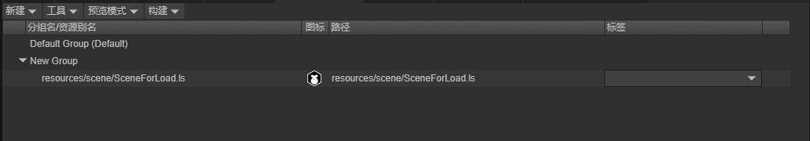

```typescript
    onStart(): void {
        Addressables.loadSceneAsync("resources/scene/SceneForLoad.ls").then((res) => {
            console.log(res);
            Laya.Scene.open(res.data);
        })
    }
```

输出结果：


通过此方法加载到的是场景的地址，需要通过代码控制打开场景。

### 3.5获取资源的描述信息列表

Addressables.getLocationAsync, 插件会根据传入的关键字，加载并返回资源的描述信息，需要注意的是，此方法不会加载资源

```typescript
    /**
     * 获取资源的描述信息列表
     * @param keys 用来筛选资源的关键字列表
     * @param mode 合并模式
     * @returns {Promise<ResourceLocation[]>}
     */
    static async getLocationAsync(key: string | string[], mode?: MergeMode): Promise<ResourceLocation[]>
        
    export interface ResourceLocation {
    /** 资源的关键字列表 */
    keys: string[];
    /** 资源的路径 */
    path: string;
    /** 资源引用的包名列表 */
    packFiles?: string[];
}
```

与加载多个资源的方法相同，Addressable.getLocationAsync 也可以根传入的关键字的不同，使用不同的加载选项。

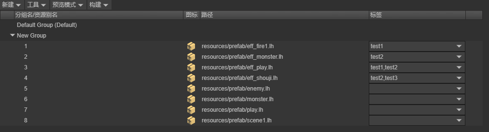

```typescript
    onStart(): void {
        Addressables.getLocationAsync(["test2"], MergeMode.Union).then((res) => {
            console.log(res);
        })
    }
```

输出结果：

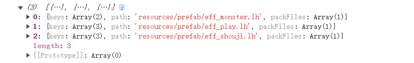


