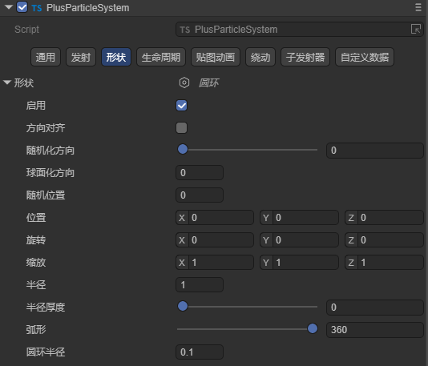
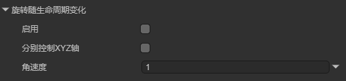

# CPU粒子系统

CPU 粒子系统不如 GPU 粒子系统灵活，但 CPU 粒子系统适用于更广泛的硬件，并且可以为手机或旧设备提供更好的支持。由于粒子渲染在 CPU 上进行处理，因此性能上不如 GPU 粒子系统。

在LayaAir-IDE中，打开包管理器，安装CPU粒子系统。

（图1）

导入插件后，如图2所示，在层级面板中即可添加CPU粒子。

（图2）

LayaAir中的3D粒子由3部分构成：粒子系统、粒子渲染、粒子着色。下面介绍各部分的使用：

## 一、粒子系统

粒子系统（Particle System）包含影响整个系统的全局属性。大多数这些属性用于控制新创建的粒子的初始状态。

### 1.1 通用

#### 1.1.1 参数说明

粒子系统的通用模块，如图1-1所示，用于设置粒子系统的基础性的设置。此模块为固有模块，不可禁用。该模块定义了粒子初始化时的持续时间、循环方式、发射速度、大小等一些列基本的参数。

（图1-1）

`运行时长`：粒子系统不断发射粒子的持续时间，或一个周期时间内可以发射多次粒子，到达设置的时间后，粒子停止发射。

`循环`：勾选后，粒子系统在持续时间结束时，再次启动并继续重复循环。

`延迟开始`：启用后，系统开始发射前的延迟时间。

`生命周期`：控制每个粒子的生命周期，也就是粒子发生多长时间后消失。

`起始速度`：每个粒子在适当方向上的初始速度。

`起始大小`：每个粒子的初始大小，如果想分别控制每个轴的大小，请启用“分别控制XYZ轴的大小”选项。

`起始旋转`：每个粒子的初始旋转角度。如果想分别控制每个轴的旋转，请启用“分别控制XYZ轴的旋转”选项。

`起始颜色`：每个粒子的初始颜色。

`重力影响`：设置物理重力值。零值会关闭重力。

`模拟空间`：控制粒子的运动位置是在父对象的局部空间中（与父对象一起移动）、在世界空间中还是相对于自定义对象。

`模拟速度`：调整整个粒子系统更新的速度。

`缩放模式`：控制粒子的缩放模式。Local 仅应用粒子系统变换缩放，忽略任何父级。Shape 模式将缩放应用于粒子起始位置，但不影响粒子大小。

`最大粒子数`：一次系统中的最大粒子数。如果达到限制，则会移除一些粒子。如果设置为1，则粒子系统会一个一个发射粒子。

`自动播放`：如果启用，粒子系统会在创建对象时自动启动。

`自动随机种子`：启用后每次播放都会有不同。

#### 1.1.2 参数模式

在调节参数时，有时会用到粒子曲线编辑器，它支持设置粒子系统中部分属性随时间变化的曲线。属性默认都是以常量的形式显示，点击属性框右侧的下箭头按钮，可以选择编辑形式：

（图1-2）

`常量`：设置属性的常量值，该值在粒子整个生命周期内不会发生变化。

（图1-3）

`曲线`：属性切换为曲线编辑形式，点击属性框即可打开曲线编辑器，编辑属性值随时间变化的曲线图。

（图1-4）

`双曲线间随机`：通过两条曲线设定属性值随时间变化时，在生命周期内某一点的上、下限，取随机值。

（图1-5）

`双常量间随机`：通过两个常量值设定属性值的范围，实际值会随着时间推移在范围内随机变化。

（图1-6）

### 1.2 发射

此模块中的属性会影响粒子系统发射的速率和时间。当创建新的粒子系统时，发射模块会默认启用。

（图2-1）

`随单位时间产生的粒子数`：每秒发射的粒子数。

`随单位距离产生的粒子数`：每个移动距离单位发射的粒子数，此模式可模拟实际由对象运动产生的粒子（例如，泥路上车轮留下的尘土）。

`爆发`：爆发是产生粒子的事件。允许在指定时间发射粒子。可以设置多组爆发点，分别修改时间，最小粒子数，最大粒子数。

（图2-2）

`时间`：设置发射爆发粒子的时间（粒子系统开始播放后的秒数）。

`数量`：设置可能发射的粒子数的值。

`循环次数`：设置播放爆发次数的值。

`间隔`：设置触发每个爆发周期的间隔时间（以秒为单位）的值。

`概率`：控制每个爆发事件生成粒子的可能性。较高的值使系统产生更多的粒子，而值为 1 将保证系统产生粒子。

### 1.3 形状

形状属性定义了发射体积的形状，并且根据开发者选择的形状，模块的其余属性会有所不同。LayaAir提供了立方体、球、圆锥、圆等形状。

（图3-1）

#### 1.3.1 立方体

立方体形状，可以让所有粒子向单一方向发射，可以很好的模拟雨雪类粒子效果。

（图3-2）

`方向对齐`：根据粒子的初始行进方向定向粒子。如果想要模拟大块的汽车油漆在碰撞过程中飞出车身，可以使用此设置。

`随机化方向`：将粒子方向朝随机方向混合。设置为 0 时，此设置不起作用。设置为 1 时，粒子方向完全随机。

`球面化方向`：将粒子方向朝球面方向混合，从它们的变换中心向外行进。设置为 0 时，此设置不起作用。设置为 1 时，粒子方向从中心向外（与形状设置为球时的行为相同）。

`随机位置`：以随机量移动粒子，直至达到指定值。此属性设置为 0 时，此设置不起作用。任何其他值都会对粒子的生成位置应用一些随机性。

`位置`：将一个偏移应用于生成粒子的发射器形状。

`旋转`：旋转粒子发射器形状。

`缩放`：更改粒子发射器形状的大小。

`发射于`：选择立方体形状发射粒子的部分。

#### 1.3.2 球、半球

球形状，可以向四面八方发射粒子。球和半球具有相同的属性。

（图3-3）

`方向对齐`：根据粒子的初始行进方向定向粒子。如果想要模拟大块的汽车油漆在碰撞过程中飞出车身，可以使用此设置。

`随机化方向`：将粒子方向朝随机方向混合。设置为 0 时，此设置不起作用。设置为 1 时，粒子方向完全随机。

`球面化方向`：将粒子方向朝球面方向混合，从它们的变换中心向外行进。设置为 0 时，此设置不起作用。设置为 1 时，粒子方向从中心向外（与形状设置为球时的行为相同）。

`随机位置`：以随机量移动粒子，直至达到指定值。此属性设置为 0 时，此设置不起作用。任何其他值都会对粒子的生成位置应用一些随机性。

`位置`：将一个偏移应用于生成粒子的发射器形状。

`旋转`：旋转粒子发射器形状。

`缩放`：更改粒子发射器形状的大小。

`半径`：形状的圆形半径。

`半径厚度`：发射粒子的体积比例。值为 0 表示从形状的外表面发射粒子。值为 1 表示从整个体积发射粒子。介于两者之间的值将使用体积的一定比例。

`弧形`：用于确定形成完整圆形部分的角度范围。影响发射粒子的区域，360表示可以向各个方向向外发射粒子。

#### 1.3.3 圆锥

锥形，让粒子像手电筒的光一样从一点开始向一个圆型扇出。

（图3-4）

`方向对齐`：根据粒子的初始行进方向定向粒子。如果想要模拟大块的汽车油漆在碰撞过程中飞出车身，可以使用此设置。

`随机化方向`：将粒子方向朝随机方向混合。设置为 0 时，此设置不起作用。设置为 1 时，粒子方向完全随机。

`球面化方向`：将粒子方向朝球面方向混合，从它们的变换中心向外行进。设置为 0 时，此设置不起作用。设置为 1 时，粒子方向从中心向外（与形状设置为球时的行为相同）。

`随机位置`：以随机量移动粒子，直至达到指定值。此属性设置为 0 时，此设置不起作用。任何其他值都会对粒子的生成位置应用一些随机性。

`位置`：将一个偏移应用于生成粒子的发射器形状。

`旋转`：旋转粒子发射器形状。

`缩放`：更改粒子发射器形状的大小。

`半径`：形状的圆形半径。

`半径厚度`：发射粒子的体积比例。值为 0 表示从形状的外表面发射粒子。值为 1 表示从整个体积发射粒子。介于两者之间的值将使用体积的一定比例。

`角度`：锥体在其顶点处的角度。角度为 0 时产生圆柱体，角度为 90 度时产生圆盘。

`弧形`：用于确定形成完整圆形部分的角度范围。

`长度`：锥体的长度。仅当“发射于”属性设置为“体积”时，此选项才适用。

`发射于`：锥体发射粒子的部分。

#### 1.3.4 圆

从圆形的中心或边缘均匀发射粒子。粒子仅在圆形的平面内移动。

（图3-5）

`方向对齐`：根据粒子的初始行进方向定向粒子。如果想要模拟大块的汽车油漆在碰撞过程中飞出车身，可以使用此设置。

`随机化方向`：将粒子方向朝随机方向混合。设置为 0 时，此设置不起作用。设置为 1 时，粒子方向完全随机。

`球面化方向`：将粒子方向朝球面方向混合，从它们的变换中心向外行进。设置为 0 时，此设置不起作用。设置为 1 时，粒子方向从中心向外（与形状设置为球时的行为相同）。

`随机位置`：以随机量移动粒子，直至达到指定值。此属性设置为 0 时，此设置不起作用。任何其他值都会对粒子的生成位置应用一些随机性。

`位置`：将一个偏移应用于生成粒子的发射器形状。

`旋转`：旋转粒子发射器形状。

`缩放`：更改粒子发射器形状的大小。

`半径`：形状的圆形半径。

`半径厚度`：发射粒子的体积比例。值为 0 表示从形状的外表面发射粒子。值为 1 表示从整个体积发射粒子。介于两者之间的值将使用体积的一定比例。

`弧形`：用于确定形成完整圆形部分的角度范围。

#### 1.3.5 圆环

圆环形状，从环面发射粒子。粒子从环面的环向外移动。

（图3-6）

`方向对齐`：根据粒子的初始行进方向定向粒子。如果想要模拟大块的汽车油漆在碰撞过程中飞出车身，可以使用此设置。

`随机化方向`：将粒子方向朝随机方向混合。设置为 0 时，此设置不起作用。设置为 1 时，粒子方向完全随机。

`球面化方向`：将粒子方向朝球面方向混合，从它们的变换中心向外行进。设置为 0 时，此设置不起作用。设置为 1 时，粒子方向从中心向外（与形状设置为球时的行为相同）。

`随机位置`：以随机量移动粒子，直至达到指定值。此属性设置为 0 时，此设置不起作用。任何其他值都会对粒子的生成位置应用一些随机性。

`位置`：将一个偏移应用于生成粒子的发射器形状。

`旋转`：旋转粒子发射器形状。

`缩放`：更改粒子发射器形状的大小。

`半径`：主圆环的半径。

`半径厚度`：发射粒子的体积比例。值为 0 表示从形状的外表面发射粒子。值为 1 表示从整个体积发射粒子。介于两者之间的值将使用体积的一定比例。

`弧形`：用于确定形成完整圆形部分的角度范围。

`环宽`：外圆环的粗度。

#### 1.3.6 边缘

从线段发射粒子。粒子在发射器对象的向上 (Y) 方向上移动。

（图3-7）

`方向对齐`：根据粒子的初始行进方向定向粒子。如果想要模拟大块的汽车油漆在碰撞过程中飞出车身，可以使用此设置。

`随机化方向`：将粒子方向朝随机方向混合。设置为 0 时，此设置不起作用。设置为 1 时，粒子方向完全随机。

`球面化方向`：将粒子方向朝球面方向混合，从它们的变换中心向外行进。设置为 0 时，此设置不起作用。设置为 1 时，粒子方向从中心向外（与形状设置为球时的行为相同）。

`随机位置`：以随机量移动粒子，直至达到指定值。此属性设置为 0 时，此设置不起作用。任何其他值都会对粒子的生成位置应用一些随机性。

`位置`：将一个偏移应用于生成粒子的发射器形状。

`旋转`：旋转粒子发射器形状。

`缩放`：更改粒子发射器形状的大小。

`半径`：此半径属性用于定义边的长度。

`半径模式`：定义如何沿着半径生成粒子。Random 表示沿着半径随机生成粒子。Loop 表示沿着形状的半径依序生成粒子，并在每个周期结束时循环回到起点。PingPong 与 Loop 基本相同，不同之处在于每个连续循环的发生方向与上一个循环相反。

`半径扩散`：沿着半径可产生粒子的离散间隔。例如，值为 0 表示允许沿着半径的任何位置生成粒子，值为 0.1 表示仅沿着半径以 10% 的间隔生成粒子。

`半径速度`：发射位置沿着半径移动的速度。

#### 1.3.7 网格、网格渲染

网格形状，从任意网格形状发射粒子。网格渲染与网格类似，唯一的区别是网格是选择网格过滤器Mesh形状，网格渲染是选择带蒙皮的网格渲染器。

（图3-8）

`方向对齐`：根据粒子的初始行进方向定向粒子。如果想要模拟大块的汽车油漆在碰撞过程中飞出车身，可以使用此设置。

`随机化方向`：将粒子方向朝随机方向混合。设置为 0 时，此设置不起作用。设置为 1 时，粒子方向完全随机。

`球面化方向`：将粒子方向朝球面方向混合，从它们的变换中心向外行进。设置为 0 时，此设置不起作用。设置为 1 时，粒子方向从中心向外（与形状设置为球时的行为相同）。

`随机位置`：以随机量移动粒子，直至达到指定值。此属性设置为 0 时，此设置不起作用。任何其他值都会对粒子的生成位置应用一些随机性。

`位置`：将一个偏移应用于生成粒子的发射器形状。

`旋转`：旋转粒子发射器形状。

`缩放`：更改粒子发射器形状的大小。

`网格`：选择Mesh网格资源。

`类型`：指定从何处发射粒子。Vertex 表示从顶点发射粒子，Egg 表示从边发射粒子，Triangle 表示从三角形发射粒子。

`模式`：指定如何为每个新粒子选择网格上的位置。对于要选择随机位置的粒子，请选择 Random；对于要从网格中下一个顶点发射的每个新粒子，请选择 Loop；PingPong 类似于 Loop 模式，但会在每个循环后沿网格顶点交替方向。

`单材质`：勾选后，可以设置子网格索引。

#### 1.3.8 矩形

从矩形发射粒子。粒子从矩形向上移动。

（图3-9）

`方向对齐`：根据粒子的初始行进方向定向粒子。如果想要模拟大块的汽车油漆在碰撞过程中飞出车身，可以使用此设置。

`随机化方向`：将粒子方向朝随机方向混合。设置为 0 时，此设置不起作用。设置为 1 时，粒子方向完全随机。

`球面化方向`：将粒子方向朝球面方向混合，从它们的变换中心向外行进。设置为 0 时，此设置不起作用。设置为 1 时，粒子方向从中心向外（与形状设置为球时的行为相同）。

`随机位置`：以随机量移动粒子，直至达到指定值。此属性设置为 0 时，此设置不起作用。任何其他值都会对粒子的生成位置应用一些随机性。

`位置`：将一个偏移应用于生成粒子的发射器形状。

`旋转`：旋转粒子发射器形状。

`缩放`：更改粒子发射器形状的大小。

### 1.4 生命周期

该模块定义了发射出的粒子的生命周期内的属性。

（图4-1）

#### 1.4.1 速度随生命周期变化

（图4-2）

`方向`：粒子在 X、Y 和 Z 轴上的线性速度。

`空间`：指定X、Y、Z 轴是参照本地空间还是世界空间。

`径向`：粒子远离/朝向中心位置的径向速度。

`速度修正`：在当前行进方向上/周围向粒子的速度应用一个乘数。

#### 1.4.2 限制速度随生命周期变化

（图4-3）

`分别控制XYZ轴`：将轴拆分为单独的 X、Y 和 Z 分量。

`限制`：设置粒子的速度限制。

`抑制`：当粒子速度超过速度限制时，粒子速度降低的比例。

`阻力`：对粒子速度施加线性阻力。

`乘以大小`：启用此属性后，较大的粒子会更大程度上受到阻力系数的影响。

`乘以速度`：启用此属性后，较快的粒子会更大程度上受到阻力系数的影响。

#### 1.4.3 继承速度

（图4-4）

`模式`：指定如何将发射器速度应用于粒子。Initial表示每个粒子出生时将施加一次发射器的速度，粒子出生后对发射器速度的任何改变都不会影响该粒子。Current表示发射器的当前速度将应用于每一帧上的所有粒子，例如，如果发射器减速，所有粒子也将减速。

`曲线乘数`：粒子应该继承的发射器速度的比例。

#### 1.4.4 力随生命周期变化

（图4-5）

`空间`：选择是在局部空间还是在世界空间中施力。

`方向`：在 X、Y 和 Z 轴上施加到每个粒子的力。

#### 1.4.5 旋转随生命周期变化

（图4-6）

`分别控制XYZ轴`：允许根据每个轴指定旋转。启用此选项后，即可为 X、Y 和 Z 轴中的每个轴设置旋转。

`角速度`：旋转速度（以度/秒为单位）。当粒子表示小型实体对象（例如爆炸产生的碎片）时，分配随机的旋转值将使效果比粒子在飞行时保持直立更加真实。随机旋转也有助于打破粒子形状相似的规律性（重复多次的相同纹理可能会非常明显）。

#### 1.4.6 旋转随速度变化

（图4-7）

`分别控制XYZ轴`：为每个旋转轴独立控制旋转。

`角速度`：旋转速度（以度/秒为单位）。

`范围`：大小曲线映射到的速度范围的下限和上限。如果速度在这个范围内，会按照相应规则进行处理。如果速度超出了这个范围，那么该速度将会被映射到曲线的两个端点上。

#### 1.4.7 大小随生命周期变化

（图4-8）

`分别控制XYZ轴`：在每个轴上独立控制粒子大小。

`大小`：粒子的大小在其生命周期内如何变化。

#### 1.4.8 大小随速度变化

（图4-9）

`分别控制XYZ轴`：在每个轴上独立控制粒子大小。

`大小`：定义粒子速度范围的大小。

`范围`：大小曲线映射到的速度范围的下限和上限。如果速度在这个范围内，会按照相应规则进行处理。如果速度超出了这个范围，那么这个速度将被映射到曲线的端点上。

#### 1.4.9 颜色随生命周期变化

（图4-10）

`颜色`：粒子在其生命周期内的颜色渐变。

#### 1.4.10 颜色随速度变化

（图4-11）

`颜色`：在速度范围内定义的粒子的颜色渐变。

`范围`：颜色渐变映射到的速度范围的下限和上限。当粒子的速度处于这个范围内时，颜色会根据速度在特定的颜色渐变中进行映射。如果粒子的速度超出了这个范围，那么其颜色将被映射到颜色渐变的端点。

### 1.5 贴图动画

用来播放粒子动画的模块，粒子动画的原材料是一种纹理，它包含了一组帧动画（使用多张图片，每张图片为一帧，构成一个完整的动画叫帧动画。或一张大图片，图片中包含了一个动画的所有帧的图片），能够以动画方式渲染粒子。

（图5-1）

`贴图分格`：纹理在 X（水平）和 Y（垂直）方向上划分的图块数量。

`动画类型`：动画模式可以设置为整张或单行。

`起始帧`：允许指定粒子动画应该从哪一帧开始。

`帧随时间变化`：指定动画帧随着时间的推移如何增加。

 `循环次数`：动画序列在粒子生命周期内重复的次数。

> 启用后，需要创建对应的材质才能渲染，参考第二节。

### 1.6 绕动

（图6-1）

`分别控制XYZ轴`：在每个轴上独立控制强度和重新映射。

`强度`：定义噪声在粒子的生命周期内对粒子的影响有多强。值越高，粒子移动越快和越远。

`频率`：低值会产生柔和、平滑的噪声，而高值会产生快速变化的噪声。此属性可控制粒子改变行进方向的频率以及方向变化的突然程度。

`滚动速度`：随着时间的推移而移动噪声场可产生更不可预测和不稳定的粒子移动。

`八度数`：指定组合多少层重叠噪声来产生最终噪声值。使用更多层可提供更丰富、更有趣的噪声，但会显著增加性能成本。

`八度倍数`：对于每个附加的噪声层，按此比例降低强度。

`八度比例`：对于每个附加的噪声层，按此乘数调整频率。

`位置变化`：用于控制噪声对粒子位置影响程度的乘数。

`旋转变化`：用于控制噪声对粒子旋转（以度/秒为单位）影响程度的乘数。

`大小变化`：用于控制噪声对粒子大小影响程度的乘数。

### 1.7 子发射器

（图7-1）

此模块用于配置一个子发射器列表，并选择它们的触发条件以及它们从父粒子继承的属性。

### 1.8 自定义数据

（图8-1）

此模块允许定义要附加到粒子的自定义数据格式，数据可以是矢量或颜色。

## 二、粒子渲染

渲染器模块的设置决定了粒子如何着色和绘制。

（图9-1）

`接收阴影`：决定此系统中的粒子是否可以接收来自其它来源的阴影。只有不透明的材质才能接收阴影。

`投射阴影`：如果启用此属性，粒子系统会在投射阴影的灯光照射时创建阴影。

`光照贴图缩放倍率`：调整特定物体在最终光照贴图中的像素密度。

`材质列表`：用来渲染粒子的材质。可以自定义粒子材质后选择，例如，贴图动画。

`渲染模式`：如何从图形图像（或网格）生成渲染图像。有以下五种模式：

Billboard：将粒子渲染为广告牌，永远面向摄像机；

Stretched：粒子面向摄像机的同时，允许使用粒子缩放；

Horizontal Billboard：粒子平面平行于XZ底平面；

Vertical Billboard：粒子在Y轴上是直立的，但是面向相机；

Mesh：粒子是从3D网格而不是纹理渲染的；

`排序偏移`：使用此属性将影响绘制顺序。

## 三、粒子着色

可以添加插件内置或自定义的粒子着色器，其可渲染各种CPU粒子系统效果。开发者可以在“粒子渲染”中的“材质列表”添加自定义的材质，默认是内置的着色器：

（图10-1）

`Alpha Test Value`：会根据AlbedoTexture与AlbedoColor的alpha叠加值来进行测试，小于AlphaTestValue值得片元会丢弃不进行渲染。

`Tiling Offset`：可以用来设置uv缩放与偏移值，实现对Albedo贴图不同位置的采样。

`Albedo Color`：可以设置材质的整体漫反射颜色。

`Albedo Color Intensity`：设置漫反射颜色的强度。

`Albedo Texture`：设置材质的整体纹理。

`Metallic Gloss Map`：设置表面材质金属度与光滑度的贴图，贴图的r通道存放模型材质的金属度信息。

`Metallic`：用来设置表面金属光泽度的效果。

`Smoothness`：用来设置表面的光滑度，光滑度越高，高光部分越明显。

`Normal Map`：用来设置法线贴图。

`Emission Color`：叠加的整体的自发光颜色。

`Emission Texture`：设置自发光贴图，对不同的顶点位置叠加自发光颜色。

`Emission Color Intensity`：设置自发光颜色的强度。

`EMISSION`：设置自发光是否开启。

