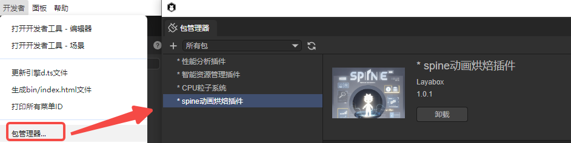
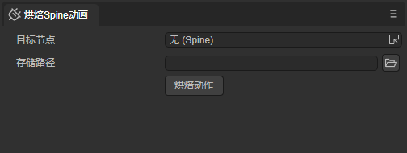
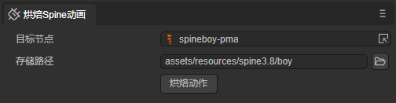
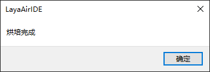
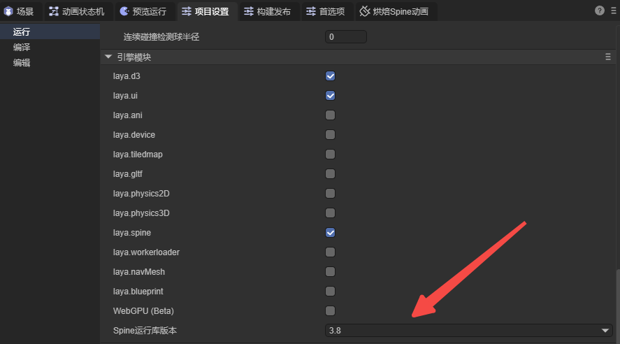
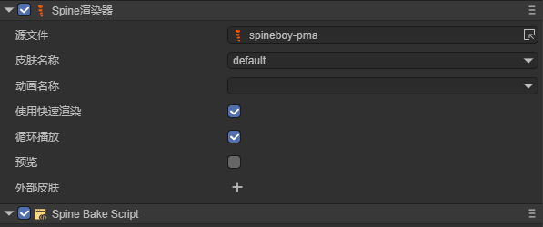
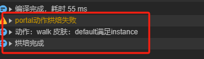
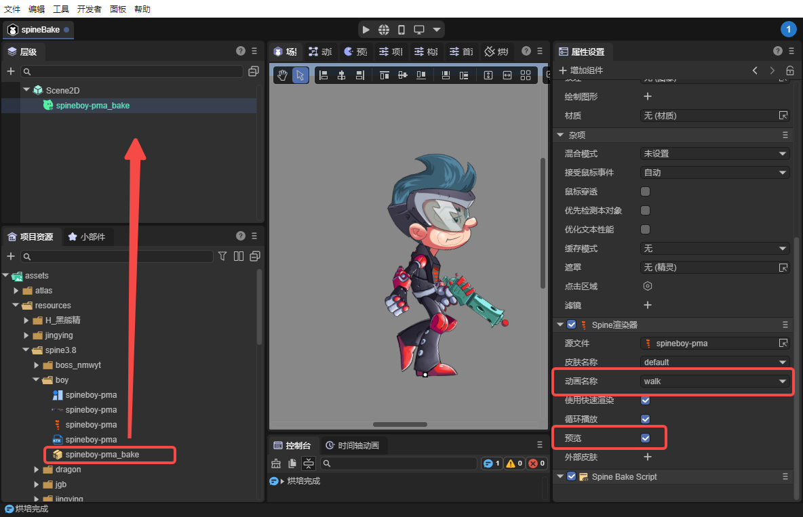

# Spine动画烘焙插件

Spine动画烘焙插件是一款为游戏开发者设计的高效工具，旨在优化和提升Spine动画在LayaAir引擎中的运行性能。通过烘焙Spine动画数据，能显著减少游戏运行时的性能消耗，并增加整体的渲染效率。

## 一、安装插件

在LayaAir-IDE中，从包管理器中安装Spine动画烘焙插件，如图1-1所示，



（图1-1）

安装完成后，会打开此工具面板。



（图1-2）


## 二、烘焙动作

目标节点：可以选择spine资源（.skel或者.json格式）。

存储路径：选择在resources目录下的自定义目录即可。



（图2-1）

点击`烘焙动作`按钮后，会有弹窗提示烘焙完成。



（图2-2）

如果选择的spine和IDE设置的spine版本不符，或者spine文件损坏会提示错误弹框。spine的版本设置在图2-3所示的项目设置中，



（图2-3）

烘焙成功后，会在目标文件夹中生成一个.ktx压缩纹理文件和一个.lh预制体文件。


（图2-4）

生成的预制体文件增加了一个烘焙组件（参数没有暴露）和spine组件。



（图2-5）

另外，

1、控制台会输出哪些动作烘焙失败（目前只有使用裁剪的资源无法烘焙）。

2、烘焙时会输出哪些满足了instance渲染条件（中途没有换vb ib，即spine没有换插槽、没有显示隐藏、没有修改blend）。



（图2-6）


## 三、预制体的使用

方法一：

在IDE中，将预制体拖入到场景，勾选预览，选择皮肤动画，就可以在IDE中预览。



（图3-1）

方法二：

通过脚本中代码添加，示例代码如下所示：

```typescript
const { regClass, property } = Laya;

@regClass()
export class SpineTest extends Laya.Script {

    //组件被启用后执行，例如节点被添加到舞台后
    onEnable(): void {
        //加载预制体文件
        Laya.loader.load("resources/spine3.8/boy/spineboy-pma_bake.lh").then((res) => {
            // 创建预制体
            let spineboy: Laya.Sprite = res.create();
            // 获取Spine2DRenderNode组件 
            let spine2dRender: Laya.Spine2DRenderNode = spineboy.getComponent(Laya.Spine2DRenderNode);
            // 设置播放动画
            spine2dRender.animationName = "walk";
            // 添加预制体到场景
            this.owner.addChild(spineboy);
        });
    }

}
```


