# 插件开发说明

## 一、插件能力

编辑器使用Electron框架开发，本质是对Chrome浏览器的封装。编辑器实际是一个HTML+JS+CSS制作的单页应用。但我们封装了大部分功能，所以游戏开发者和插件开发者都不需要学习HTML/CSS或者相关的前端框架。我们在开发插件时，需要使用编辑器提供的UI框架，一般不允许直接去修改编辑器的DOM结构。考虑到用户体验和兼容性，资源商店也一般不允许这类插件上架。

在项目的engine/types目录，有三个与编辑器插件开发相关的声明文件，editor.d.ts, editor-ui.d.ts, editor-env.d.ts，他们包含了大量编辑器的扩展API。

- editor.d.ts 是编辑器UI进程的API。常用的是全局对象Editor和IEditor命名空间下的类和接口。
- editor-env.d.ts 是场景场景进程的API。常用的是全局对象EditorEnv和IEditorEnv命名空间下的类和接口。
- editor-ui.d.ts 编辑器UI库。使用IEditorUI命名空间下的类和接口。

其中IEditor.utils/IEditorEnv.utils暴露了大量实用的工具函数，包括UUID生成，加密解密，ZIP压缩/解压，文件/目录拷贝/移动，HTTP请求，上传/下载等等。

开发者可以直接使用node模块，另外，IDE也内置了一些常用的npm库，例如sharp，glob，pinyin, @svgdotjs/svg.js等。引用node内置模块可以使用import xx from "xx"的方式，所有IDE内置cjs模块都可以通过IEditor.require或者IEditorEnv.require去引用。

```typescript
//可以通过import导入node内置模块
import fs from "fs";
import path from "path";

//也可以通过require
const fs = IEditor.require("fs");
const sharp = IEditor.require("sharp");
const glob = IEditor.require("glob");
```


## 二、插件运行环境

编辑器是多进程体系，主要有三个进程：Main进程/UI进程/Scene进程。插件只能运行在UI进程和Scene进程。UI进程没有载入引擎库，也就是没有LayaAir引擎环境；Scene进程有LayaAir引擎环境，与UI通讯只能通过编辑器提供的异步通讯API。此外，插件脚本也可能在预览（含编辑器内预览和外部浏览器预览）中运行，它与Scene进程的区别是，预览进程中没有node环境。总结一下，插件脚本可能运行的环境有3种：

(1) UI进程：可直接使用node等本地模块，不可使用Laya引擎；

(2) Scene进程：可直接使用node等本地模块，可使用Laya引擎；

(3) 预览进程：不可使用node等本地模块，可使用Laya引擎；

如果插件脚本错误使用了当前环境中不存在的特性，脚本可能无法运行。例如，在一个Laya自定义组件脚本里使用node的fs模块去访问文件系统，会导致脚本在预览或者最终发布时运行报错。

为了脚本能在各种环境正确运行，开发者编写脚本时，需要自行在文件级别隔离这三种代码。比如，一个自定义面板的TS文件，不能引用Laya引擎，因为它是运行在UI进程里的。又比如，一个Laya.Script，不能使用fs，path等模块，因为它可能会运行在预览进程。但这两种需求也是常见的，应该怎么办？


### 2.1 在Laya.Script中使用本地能力

下面是一个推荐做法：

```typescript
//Script.ts
@Laya.regClass()
class Script extends Laya.Script {

    wantToUseNode() {
        EditorEnv.scene.runScript("TestSceneScript.visitNode");
    }
}

//TestSceneScript.ts
import fs from "fs";

//注意是IEditorEnv.regClass，不是Laya.regClass!!
@IEditorEnv.regClass()
class TestSceneScript {

    static visitNode() {
        fs.readFileSync(....)        
    }
}
```

> TestSceneScript.ts这个文件会在发布中被裁剪，因为它没有被Laya.Script直接引用。


### 2.2 UI进程脚本和Scene进程脚本通讯的方式

1、设置节点/组件属性后，场景里的节点/组件会自动刷新，无需代码。例如：

```typescript
//下面是UI进程代码

//获取选中的节点
let node = Editor.scene.getSelection()[0];

//修改节点属性，场景里的对象会自动同步，无需手动
node.props.x = 100;

//修改组件属性，场景里的对象会自动同步，无需手动
node.getComponent("MeshRenderer").props.enabled = false;
```


2、调用节点/组件的一个方法，并返回值。例如：

```typescript
//下面是UI进程代码

//获取选中的节点
let node = Editor.scene.getSelection()[0];

//调用MyScript组件里的test方法，传入参数abc
let ret = await Editor.scene.runNodeScript(node.id, node.getComponent("MyScript").id, "test", "abc");
console.log(ret);
```


3、自定义一个函数，并执行。例如：

```typescript
//下面是场景进程的代码

//注意：IEditorEnv.regClass是必须的
@IEditorEnv.regClass()
export class TestSceneScript {
    //注意：this是当前的IEditorEnv.IGameScene对象，如果不需要，也可以省略这个声明
    static test(this: IEditorEnv.IGameScene, msg: string) {
        console.log(msg); //hello
        
        return "ok";
    }
}
//下面是UI进程的代码

let ret = await Editor.scene.runScript("TestSceneScript.test", "hello");
console.log(ret); //ok
```

特别的用法，可以通过window对象调用eval执行脚本，用于一些简单的需求，例如：

```typescript
let str = await Editor.scene.runScript("window.eval", `
    (function() {
        //do something
        return "hello";
    }())
`);
```


4、场景进程向UI进程发送消息：

```typescript
//选中项目资源面板一个资源
EditorEnv.postMessageToPanel("ProjectPanel", "select", assetId);

//调用自定义的Panel的一个方法，并返回结果
let ret = await EditorEnv.sendMessageToPanel("MyPanel", "getResult");

//使用eval执行一些简单的脚本
let ret = await EditorEnv.runUIScript("window.eval", `
    (function() {
        //do something
        return "hello";
    }())
`);
```


### 2.3 预览运行进程和UI进程的通讯方式

1、预览运行进程调用UI进程的脚本：

```typescript
let EditorClient = (<any>window).EditorClient;
EditorClient.postMessageToPanel("ProjectPanel", "select", assetId);

//调用自定义的Panel的一个方法，并返回结果
let ret = await EditorClient.sendMessageToPanel("MyPanel", "getResult");

//使用eval执行一些简单的脚本
let ret = await EditorClient.runUIScript("window.eval", `
    (function() {
        //do something
        return "hello";
    }())
`);
```


2、 UI进程调用预览运行进程的脚本：

```typescript
//下面是游戏的逻辑代码

@Laya.regClass()
export class TestGameScript {
    static test(msg: string) {
        console.log(msg); //hello
        
        return "ok";
    }
}

//下面是UI进程的代码

//这里用runScriptMax而不是runScript，因为在播放状态下，runScript依然会发送到源场景，而不是正在播放的场景
let ret = await Editor.scene.runScriptMax("TestGameScript.test", "hello");
console.log(ret); //ok
```

编辑器实现脚本隔离的机制是将脚本编译成三个js，bundle.js包含可以在预览环境，也就是在浏览器可以运行的版本；bundle.editor.js是在UI进程运行的脚本；bundle.scene.js是在Scene进程的脚本。这个机制是自动的，但开发者需了解这个机制的运作方式：

1、所有含有@Laya.regClass装饰器的脚本会编译进bundle.js和bundle.scene.js。注意，这里指的“所有”，仅限于Debug版本。在release版本的bundle.js里，只会包含有被场景引用的脚本。bundle.scene.js不会出现在发布版本中。

2、所有含有@IEditorEnv.regClass装饰器的脚本会编译进bundle.scene.js。这个js只在编辑器内部运行，可以放心使用node能力。

3、所有含有@IEditor.xxx装饰器的脚本会编译进bundle.editor.js。这个js只运行在UI进程，可以放心使用node能力，但如果引用Laya的类会报错。

虽然这种识别机制能够解决标记不同脚本使用用途的问题，但还是建议开发者自行用目录方式进行隔离。例如将UI进程运行的脚本放入到editor名称的目录，将只在编辑器内运行的脚本放入到scene名称的目录，这样维护起来会更清晰。


## 三、制作编辑器UI

LayaAirIDE提供了开发编辑器UI的可视化编辑器。在`项目资源`面板的菜单里，新建一个`编辑器界面预制体`，例如MyWidget.widget。建议将此类预制体放置到editorResources目录或其子目录。

> editorResources目录是一个LayaAirIDE里约定名称的特殊目录，它和resources的特性类似，也就是无论它放在多深的子目录下，资源的路径都可以从editorResources开始。例如一个资源位于”/MaDaHa/v1/editoResources/a/b.png“，在引用资源时可以直接填写”editorResources/a/b.png“，而不用理会前面的”MaDaHa/v1/“。
>
> 这在插件体系中是很重要的，因为在开发插件时，插件开发者无法确定用户使用时会将插件资源放置在什么目录下，只能确定用户不会破坏插件内部的目录结构。
>
> resources目录里具有相同的特性，差别在于，resources目录在发布时会拷贝到发布目录里，但editorResources则永远不会。

双击打开MyWidget.widget，使用内置UI编辑器制作好插件需要的UI界面。

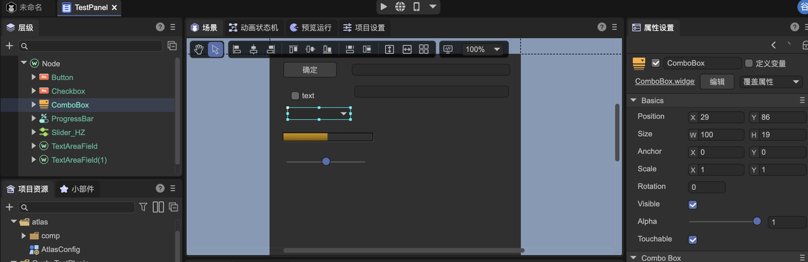

以面板为例，代码里载入该预制体的方法为：

```typescript
@IEditor.panel("Test")
export class MyPanel extends IEditor.EditorPanel {
    async create() {
        this._panel = await gui.UIPackage.createWidget("editorResources/UI/MyWidget.widget");
        let input: gui.TextInput = this._panel.getChild("TextInput").getChild("title");
        input.on("changed", () => {
            console.log("改变了！");
        })
    }
}
```


## 四、程序化生成界面

### 4.1 常用方法

除了使用UI编辑器制作界面，也可以使用代码的方式去创建一些常用的UI组件，它们在IEditor.GUIUtils。

```typescript
export interface IGUIUtils {
    /**
     * 编辑器默认的背景颜色
     */
    bgColor: gui.Color;
    /**
     * 编辑器默认的分割线颜色
     */
    lineColor: gui.Color;
    /**
     * 编辑器默认的文字颜色
     */
    textColor: gui.Color;

    createButton(autoSize?: boolean): gui.Button;
    createIconButton(flat?: boolean): gui.Button;
    createCheckbox(autoSize?: boolean): gui.Button;
    createIconCheckbox(flat?: boolean): gui.Button;
    createRadio(): gui.Button;
    createComboBox(): gui.ComboBox;
    createTextInput(): TextInput;
    createTextArea(): TextArea;
    createSearchInput(): SearchInput;
    createNumericInput(): NumericInput;
    createColorInput(): ColorInput;
    createGradientInput(): GradientInput;
    createCurveInput(): CurveInput;
    createResourceInput(): ResourceInput;
    createNodeRefInput(): NodeRefInput;
    createProgressBar(): gui.ProgressBar;
    createSlider(): gui.Slider;
    createListItem(): ListItem;
    createIconListItem(): ListItem;
    createCheckboxListItem(): ListItem;
    createCheckboxIconListItem(): ListItem;
    
    createInspectorPanel(): InspectorPanel;
}
```


### 4.2 示例

例如要动态创建一个按钮，可以用以下代码。

```typescript
let button = IEditor.GUIUtils.createButton();

//它实现的功能其实和以下代码是相同的，只是更加简洁
//let button = gui.UIPackage.createWidgetSync("~/ui/basics/Button/Button.widget");
```

IEditor.InspectorPanel是一个通过配置生成界面的通用界面类，下面举一个例子，完全通过配置方式生成一个面板

```typescript
@IEditor.panel("Test")
export class MyPanel extends IEditor.EditorPanel {
    private _data : any;
    declare _panel : IEditor.InspectorPanel;
    async create() {
        this._panel = IEditor.GUIUtils.createInspectorPanel();
        
        Editor.typeRegistry.addTypes([
            {
                name : "MyPanelType", //请注意，名字是全局唯一的，一定要长
                properties : [
                    { name : "text", type : "string" },
                    { name : "count" , type: "number" },
                    { name : "actions", inspector: "Buttons",
                        options : { buttons : [ { caption : "点我", event: "my_click" } ] }
                    }
                ]
             }
        ]);
        
        this._panel.allowUndo = true; //根据需要设置
        //如果不需要undo功能，也可以直接this._data = {};
        this._data = IEditor.DataWatcher.watch({}); 
        
        //inspect可以多次调用，将多个数据组合在一个面板编辑
        this._panel.inspect(this._data, "MyPanelType");
        
        this._panel.on("my_click", ()=> {
            alert("hello");
        });
    }
} 
```

执行效果如下：


如果不需要顶部的'My Panel Type'栏目显示，可以稍微修改代码，加入以下红字：

```typescript
{
    name : "MyPanelType",
    catalogBarStyle: "hidden",
    properties : [
       ....
    ]
 }
```

效果如下：


配置方式可以生成非常复杂的界面，它不但可以用于制作单一的面板，也可以嵌入到其他UI中。例如，在UI编辑器制作界面时中拖入InspectorPanel预制体（它放在"editor-widgets/baisc/Inspector/InspectorPanel.widget），然后在代码里通过getChild获得的Widget对象类型则自动为IEditor.InspectorPanel，然后可以通过上述的API（inspect等）进行填充。

> 类型和属性定义语法请参考[文档](../../../basics/common/Component/readme.md)。


在LayaAir3.2中，可以用更直观的方式定义数据类型，以上面的例子为例，可以改写为：

```typescript
@IEditor.regClass()
export class MyPanelType {
    @property(String)
    text: string;
    
    @property(Number)
    count: number;
    
    @IEditor.property({ inspector: "Buttons", options: { buttons: [{ caption: "点我", event: "my_click" }] } })
    actions: any;
}

@IEditor.panel("Test")
export class MyPanel extends IEditor.EditorPanel {
    delcare _panel : IEditor.InspectorPanel;
    private _comp : IEditor.DataComponent;
    
    async create() {
        this._panel = IEditor.GUIUtils.createInspectorPanel();
        
        this._panel.allowUndo = true; //根据需要设置
        //DataComponent可以方便的将你的组件和数据绑定在一起
        this._comp = new IEditor.DataComponent(MyPanelType); 
        
        //inspect可以多次调用，将多个数据组合在一个面板编辑
        this._panel.inspect(this._comp.props, MyPanelType);
        
        this._panel.on("my_click", ()=> {
            alert("hello");
        });
    }
} 
```


## 五、自定义Inspector字段编辑界面

当我们编写一个组件，并暴露某些字段到IDE编辑后，有时希望能够自定义某个字段的编辑界面，可以通过以下步骤：

1、编写一个InspectorField

 ```typescript
@IEditor.inspectorField("MyTestField")
export class TestField extends IEditor.PropertyField {
    @IEditor.onLoad
    static async onLoad() {
        await gui.UIPackage.resourceMgr.load("MyField.widget");
    }
    
    create() {
        let input = gui.UIPackage.createWidgetSync("MyField.widget");

        return { ui: input };
    }
    
    refresh() {
        //这里负责将数据设置到界面上
    }
}
 ```

MyTestField是注册的名字，实际应用需要保证不要和其他人取的名字冲突，所以建议取"com.layabox.test"这样的名字。

InspectorField的create方法是同步的，所以这里不能用createWidget，而需要用createWidgetSync。这需要确保预制体在创建之前已经载入。所以这里使用了一个IEditor.onLoad的回调用于提前载入资源。


2、设置字段的inspector属性为刚才取的名字，这里为MyTestField

 ```typescript
@Laya.regClass()
export class Script extends Laya.Script {
     @property({ type : Laya.Node, inspector: "MyTestField" })
     public node: Laya.Node;
}
 ```


3、实际效果：


## 六、自定义面板

可以通过以下方式给编辑器增加一个面板

```typescript
@IEditor.panel("test", {
    title: "Test",
    icon : "editorResources/20230710-161955.png"
})
export class TestPanel extends IEditor.EditorPanel {

    async create() {
        this._panel = await gui.UIPackage.createWidget("MyPanel.widget");
    }
}
```

效果如下图：

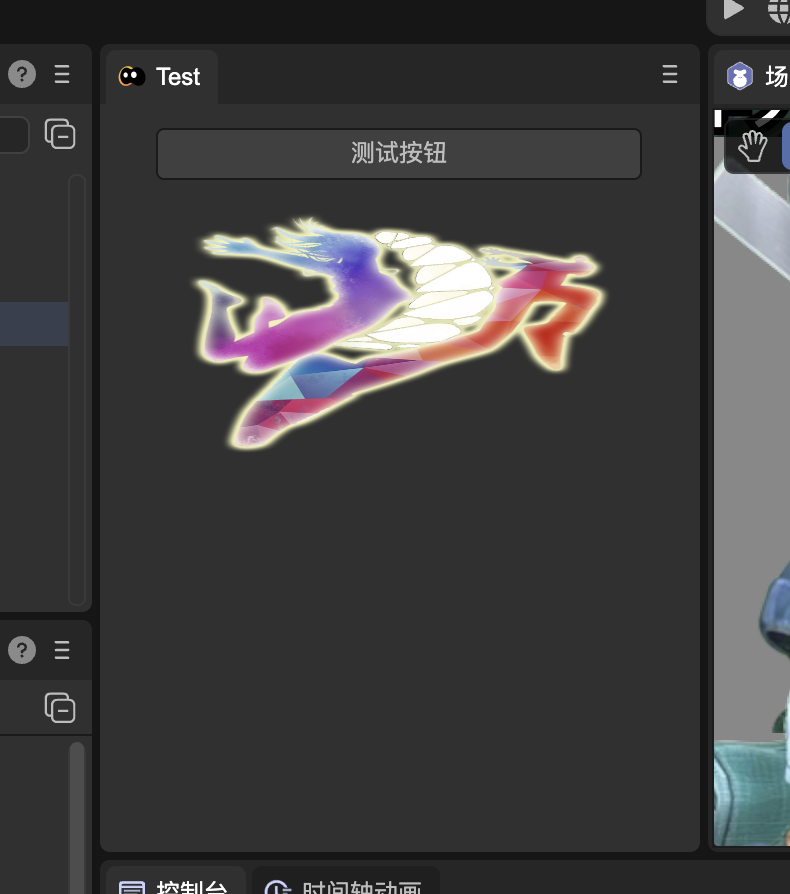


## 七、使用对话框

可以通过以下方式创建一个弹出的对话框：

```typescript
//MyDialog.ts
export class MyDialog extends IEditor.Dialog {
    async create() {
        this.contentPane = await gui.UIPackage.createWidget("MyDialog.widget");
    }
    
    onShown() {
    }
    
    onHide() {
    }
}
```

在编辑器内，所有对话框都是单例。显示这个对话框的方式为：

```typescript
import { MyDialog } from "./MyDialog";

Editor.showDialog(MyDialog, null);
```


## 八、扩展内置菜单

支持对编辑器现有菜单的扩展。如以下代码，在应用程序菜单栏的工具菜单下，新增了一个test的菜单，并且点击菜单会调用test函数。

```typescript
class AnyName {
    @IEditor.menu("App/tool/test")
    static test() {
        console.log("click menu");
    }
}
```

menu的第一个参数表示菜单的路径，路径用"/"分隔，"App/tool/test"表示App菜单下的tool子菜单的test子项。注意这里的路径使用的是ID，不是菜单显示的文字。编辑器内部支持扩展的所有菜单名称和它的子菜单可以通过下面的方法打印出来参考：

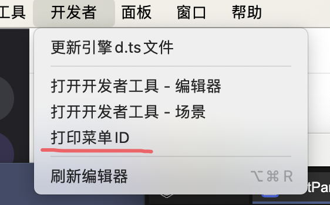

menu方法的第二个参数是可选参数，通过它可以进行一些额外的配置。例如：

```typescript
class AnyName {
    @IEditor.menu("App/tool/test", { position: "before openDevTools" } )
    static test() {
        console.log("click menu");
    }
}
```

通过position选项可以设置这个新加的test菜单显示在原有菜单“打开开发者工具 - 编辑器"的前面，而不是默认加到最后。

常用的选项有：

`position` :  设置菜单的位置，支持的语法: "first" / "last" / "before ids" / "after ids" / "beforeGroup ids" / "afterGroup ids"。

> "before"和"beforeGroup"的区别是，"before"是插入到参考菜单的前面，而"beforeGroup"是插入到参考菜单前面最近的一个分割线之前。
>
> "after"和"afterGroup"的区别是，"after"是插入到参考菜单的后面，而"afterGroup"是插入到参考菜单后面最近的一个分割线之后。
>
> 在同一个类的扩展定义里，默认是添加到上一个扩展的菜单的后面。如果不在同一个类里，不指定position则默认添加到菜单的最后面。
>
> 多个参考菜单的id值用逗号分隔。

`checkbox` :  设置菜单为一个可以打勾的效果。

`sepBefore` : 在此菜单之前显示一条分割线。

`sepAfter`: 在此菜单之后显示一条分割线。

`enableTest` : 给定返回布尔值的一个函数，在菜单显示之前会执行此函数，用于决定菜单的激活（变灰）状态。**App菜单不支持。**

`visibleTest`: 给定返回布尔值的一个函数，在菜单显示之前会执行此函数，用于决定菜单的显隐状态。仅调用show方法弹出的菜单有效。**App菜单不支持。**

`checkedTest`：给定返回布尔值的一个函数，在菜单显示之前会执行此函数，用于决定菜单的显隐状态。**App菜单不支持。**

下面的例子演示了enableTest的用法。这个新加的菜单， 如果场景中没有选中的物体，则会显示变灰并且无法触发点击回调。

```typescript
class AnyName {
    static testEnable() {
        return Editor.scene.getSelection().length > 0;
    }
    
    @IEditor.menu("Hierarchy/test", { enableTest: ()=> AnyName.testEnable() } )
    static test() {
        console.log("click menu");
    }
}
```


## 九、创建菜单

可以创建新菜单，并用代码控制弹出。方法为：

```typescript
let menu = IEditor.Menu.create([ 
    { label: "test" , click : function() { console.log("clicked"); } }
 ]);

//当需要弹出时
menu.show();
```

菜单也支持级联，并且不限层数。例如：

```typescript
IEditor.Menu.create([ 
    { 
        label: "test" , 
        submenu: [ 
            { label : "a" },
            { 
                label : "b",
                submenu : [
                    { label : "c" }
                ]
            }
        ]
    }
 ]);
```

可以给菜单指定一个ID，通过ID引用菜单。但要注意ID值不要和编辑器内置的菜单或者其他人的菜单的ID冲突。

```typescript
IEditor.Menu.create("MyTestMenu", [ 
    { label: "test" , click : function() { console.log("clicked"); } }
 ]);
 
 //当需要弹出时
 IEditor.Menu.getById("MyTestMenu").show();
```


## 十、在场景视图中绘制形状以及交互式手柄

使用IEditorEnv.Gizmos/IEditorEnv.Handles/IEditorEnv.Gizmos2D提供的接口，在场景视图中绘制形状和交互式手柄。假设我们已经有一个自定义的组件Script1，通过IEditorEnv.customEditor这个装饰器，给Script1绑定一个CustomEditor脚本，以实现在编辑器内的自定义编辑。

```typescript
//Script1.ts

@regClass()
export class Script1 extends Laya.Script {
    declare owner : Laya.Sprite3D;
}
//TestCustomEditor.ts

@IEditorEnv.customEditor(Script1)
export class TestCustomEditor extends IEditorEnv.CustomEditor {
    declare owner: Laya.Sprite3D;

    onSceneGUI(): void {
        IEditorEnv.Handles.drawHemiSphere(this.owner.transform.position, 2);
    }
    
    onDrawGizmos(): void {
        IEditorEnv.Gizmos.drawIcon(this.owner.transform.position, "editorResources/UI/ready1.png");
    }
}
```

实现效果如下：


2D的实现方式有所不同，它必须通过IEditorEnv.Gizmos2D接口，并且目前只支持onDrawGizmosSelected事件，不支持onDrawGizmos和onSceneGUI事件。

以下是2D的一个例子：

```typescript
@IEditorEnv.customEditor(Script2)
export class TestCustomEditor extends IEditorEnv.CustomEditor {
    private _c: IEditorEnv.IGizmoCircle;

    onDrawGizmosSelected(): void {
        if (!this._c) {
            let manager = IEditorEnv.Gizmos2D.getManager(this.owner);
            this._c = manager.createCircle(10);
            this._c.fill("#ff0");
        }
        this._c.setLocalPos(10, 10);
    }
}
```

实现效果如下：

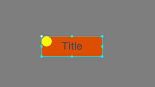


## 十一、自定义配置

插件开发者可以自定义一些配置数据，这些数据可以保存到文件，也可以只保存在内存中。例如：

```typescript
@IEditor.onLoad
static onLoad() {
    //注意这里面的属性不要使用到Laya引擎里的类型，比如Vector3这些，是不可以的
    Editor.typeRegistry.addTypes([
        {
            name: "MyTestSettingsType",
            properties: [
                {
                    name: "option1",
                    type: "boolean",
                    default: true
                },
                {
                    name: "option2",
                    type: "string",
                    default: "",
                }
            ]
        }
    ]);
    Editor.extensionManager.createSettings("MyTestSettings", "project", "MyTestSettingsType");
}
```

createSettings的第一个参数是这个配置的名称，它是全局的，请取一个不会和其他人冲突的名字。第二个参数是配置数据放置的地方，可选的值为：

- project : 保存到路径“项目/settings”。这是一个项目所有成员共享的配置文件放置位置。保存的文件名是"plugin-配置名称.json”，plugin前缀使用户能够清晰地分辨出这是第三方插件创建的配置文件。

- local: 保存到路径“项目/local"。这是IDE使用者对项目的个性设置。这里的文件通常不建议项目成员间共享。
- application: 保存到系统的用户数据目录。这是IDE使用者对IDE的个性设置，它应该是和具体项目不相关的。
- memory：仅存在于内存中，不会保存到文件。

第三个参数是类型名称，对应上面addTypes的操作。如果类型名称和配置名称一致，第三个参数也可以省略。

配置创建后，UI进程可以通过Editor.getSettings访问配置数据，然后进行读写，例如：

```typescript
let data = Editor.getSettings("MyTestSettings").data;
data.option2 = "hello";
```

配置是自动载入和保存的，无需手动操作。

场景进程可以通过EditorEnv.getSettings访问配置数据，**但是是只读的，无法修改**。而且因为是跨进程，所以要获得最新的数据，要先调用sync，例如：

```typescript
let settings = EditorEnv.getSettings("MyTestSettings");
await settings.sync();
console.log(settings.data.option2); //hello
```

在LayaAir3.2中，我们可以用更直观的方式定义数据类型，以上面的例子为例，可以改写为：

```typescript
@IEditor.regClass()
export class MyTestSettingsType {
    @property({ type: Boolean, default: true })
    option1: boolean = true;
    
    @property(string)
    options2: string = "";
}

@IEditor.onLoad
static onLoad() {
    Editor.extensionManager.createSettings("MyTestSettings", "project", MyTestSettingsType);
}
```


## 十二、扩展编辑器配置界面

如果我们通过上一节创建了一些自定义的配置数据，可以将它展现在项目配置界面，或者首选项界面让用户修改。例如：

```typescript
@IEditor.panel("TestSettings", { usage: "project-settings", title: "测试" })
export class TestSettings extends IEditor.EditorPanel {
    async create() {
        let panel = IEditor.GUIUtils.createInspectorPanel();
        panel.inspect(Editor.getSettings("MyTestSettings").data, "MyTestSettings");
        this._panel = panel;
    }
}
```

@IEditor.panel这个装饰器在“六、使用面板”中已经介绍过，这里不再赘述，唯一不同的是usage这个选项的设置。usage可以取的值有：

- project-settings: 显示在项目配置界面
- build-settings：显示在构建发布界面
- preference: 显示在首选项界面

上述代码的显示效果为：

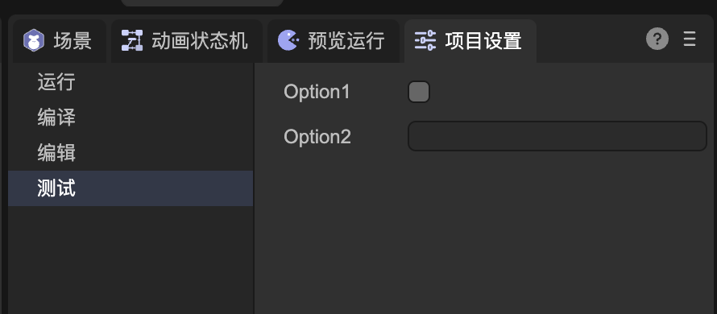


## 十三、扩展构建流程

构建流程除了在界面中启动外，也可以通过API调用，下面的例子演示了通过一个自定义菜单启动构建任务:

```typescript
class Abc {
    IEditor.menu("App/my/build")
    static build() {
        IEditor.BuildTask.start("web");
    }
}
```

在场景进程也可以手动启动构建任务：

```typescript
IEditorEnv.BuildTask.start("web");
```

通过构建插件定制插件流程，构建插件的接口是IBuildTask。IBuildTask的定义为：

```typescript
export interface IBuildPlugin {
    /**
     * 构建任务初始化时。可以在这个事件里修改config和platformConfig等配置。
     * @param task 
     */
    onSetup?(task: IBuildTask): Promise<void>;

    /**
     * 构建任务开始。可以在这个事件里在初始化目标目录的结构，或者进行必要的检查和安装等。
     * @param task
     */
    onStart?(task: IBuildTask): Promise<void>;

    /**
     * 正在收集需要发布的资源。assets集合是系统根据依赖、resources目录规则等所有有效的规则收集的所有需要发布的资源对象，你可以额外向集合添加资源对象。
     * @param task 
     * @param assets 
     */
    onCollectAssets?(task: IBuildTask, assets: Set<IAssetInfo>): Promise<void>;

    /**
     * 正在导出资源。exportInfoMap包含了导出资源的信息，包括保存的位置等信息。可以修改outPath自定义资源的输出位置。
     * @param task 
     * @param exportInfoMap 
     */
    onBeforeExportAssets?(task: IBuildTask, exportInfoMap: Map<IAssetInfo, IAssetExportInfo>): Promise<void>;

    /**
     * 脚本导出完成。如果开发者需要对生成的代码进行修改，可以在这个事件里处理。因为在这时脚本还没压缩或者混淆（如果有）。
     * @param task
     */
    onExportScripts?(task: IBuildTask): Promise<void>;
 
    /**
     * 导出资源完成。如果开发者需要添加自己的文件，或者及进行压缩等操作，可以在这个事件里处理。
     * @param task 
     * @param exportInfoMap 
     */
    onAfterExportAssets?(task: IBuildTask): Promise<void>;

    /**
     * 构建已经完成，可以在这个事件生成一些清单文件，配置文件等。
     */
    onCreateManifest?(task: IBuildTask): Promise<void>;

    /**
     * 如果有原生的构建流程，在这里处理。
     * @param task 
     */
    onCreatePackage?(task: IBuildTask): Promise<void>;

    /**
     * 构建任务完成事件。
     * @param task 
     */
    onEnd?(task: IBuildTask): Promise<void>;
}
```

所有钩子函数都是可选的，可以根据需要实现需要的逻辑。需要通过IEditorEnv.regBuildPlugin装饰器注册插件。下面的例子演示了怎样在web这个平台构建时，手动添加一个参加构建的资源。

```typescript
@IEditorEnv.regBuildPlugin("web")
class MyBuildPlugin implements IEditorEnv.IBuildPlugin {
    async onCollectAssets(task : IEditorEnv.IBuildTask, assets: Set<IAssetInfo>) {
        let myAsset = ...
        assets.add(myAsset);
        
        //在发布插件里，需要使用task.logger输出日志
        task.logger.debug("add my asset");
    }
}
```

如果需要构建插件在所有平台都生效，那么regBuildPlugin的第一个参数可以传递"*"。regBuildPlugin的第二个参数可以传递一个优先级的数值，优先级越大，构建时这个插件会被更早的调用。

在插件中经常会用到的一些工具方法有：

（1）使用task.logger接口记录日志；

（2）使用IEditorEnv.utils.renderTemplateFile渲染模版文件，使用的是mustache库；

（3）使用task.mergeConfigFile合并配置文件。即，如果在内置模版目录和项目模版目录(build-templates)有相同路径和名字的json格式的配置文件，通过此方法可以将他们合并；

（4）使用IEditorEnv.utils.intallCli安装公共的一些cli包，它将安装在library/cli-package下。例如：

```typescript
await IEditorEnv.utils.installCli("@oppo-minigame/cli", options);
```

（5）使用IEditorEnv.utils.exeCli执行npm/npx或者使用installCli安装的cli。例如：

```typescript
await IEditorEnv.utils.exeCli("npm", ["install"], options);

await IEditorEnv.utils.exeCli("quickgame", args, options); //假设quickgame已通过installCli安装
```

（6)  使用IEditorEnv.utils.exec执行任意本地命令。

（7） 使用IEditorEnv.utils.downloadFile下载文件。

（8）使用IEditorEnv.utils.ZipFileR解压文件。

可以扩展构建选项面板，添加一些自定义的参数，如“自定义面板”一节中描述那样，我们将面板的usage设置为“build-settings"即可。

```typescript
@IEditor.panel("TestBuildSettings", { usage: "build-settings", title: "测试" })
export class TestBuildSettings extends IEditor.EditorPanel {
@IEditor.onLoad
    static start() {
        Editor.typeRegistry.addTypes([
            {
                name: "MyBuildSettings",
                catalogBarStyle : "hidden",
                properties: [
                    {
                        name: "option1",
                        type: "boolean",
                        default: true
                    },
                    {
                        name: "option2",
                        type: "string",
                        default: "2332",
                    }
                ]
            }
        ]);
        Editor.extensionManager.createSettings("MyBuildSettings", "project");
    }

    async create() {
        let panel = IEditor.GUIUtils.createInspectorPanel();
        panel.allowUndo = true;
        panel.inspect(Editor.getSettings("MyBuildSettings").data, "MyBuildSettings");
        this._panel = panel;
    }
}
```

效果如下：

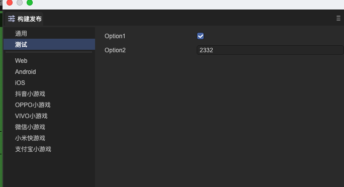

在构建插件中可以通过Settings机制访问这些参数，例如：

```typescript
@IEditorEnv.regBuildPlugin("web")
class MyBuildPlugin implements IEditorEnv.IBuildPlugin {
    async onSetup(task : IEditorEnv.IBuildTask) {
        let mySettings = EditorEnv.getSettings("MyBuildSettings");
        await mySettings.sync();
        
        task.logger.debug(mySettings.data.option1);
    }
}
```


## 十四、自定义发布目标平台

可以通过插件给IDE新增一个发布目标平台。例如：

```typescript
Editor.extensionManager.createBuildTarget("test",  //平台的唯一id，不能冲突
{ 
    caption: "自定义平台", //目标名称
    settingsName:"MyBuildPlatformtSettings", //需要先用Edition.extensionManager.createSettings注册
    inspector: "TestBuildSettings"  //一个usage为build-settings的面板
    templatePath : "editorResources/testTemplate" //可选的一个参数，指定的目录内放置构建模版文件，构建时将会自动拷贝到输出目录
});
```

以下是一个完整的实例：

```typescript
@IEditor.panel("TestBuildSettings", { usage: "build-settings", title: "测试" })
export class TestBuildSettings extends IEditor.EditorPanel {
    @IEditor.onLoad
    static start() {
        Editor.typeRegistry.addTypes([
            {
                name: "MyTestSettings2",
                catalogBarStyle : "hidden",
                properties: [
                    {
                        name: "option1",
                        type: "boolean",
                        default: true
                    },
                    {
                        name: "option2",
                        type: "string",
                        default: "2332",
                    }
                ]
            }
        ]);
        Editor.extensionManager.createSettings("MyBuildPlatformtSettings", "project");
        Editor.extensionManager.createBuildTarget("test", { caption: "自定义平台", settingsName:"MyTestSettings2", inspector: "TestBuildSettings" });
    }

    async create() {
        let panel = IEditor.GUIUtils.createInspectorPanel();
        panel.allowUndo = true;
        panel.inspect(Editor.getSettings("MyBuildPlatformtSettings").data, "MyBuildPlatformtSettings");
        this._panel = panel;
    }
}
```

效果如下：

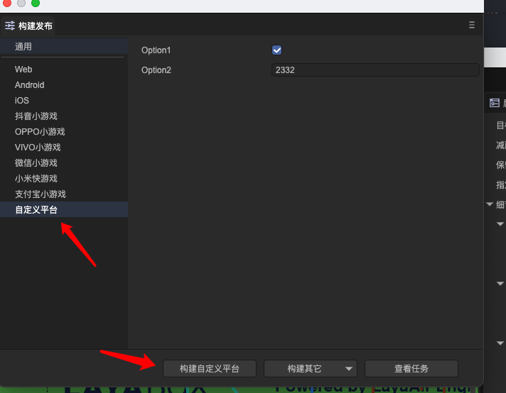

在场景进程中，需要添加一个或者多个构建插件，用于这个新的自定义平台。

```typescript
@IEditorEnv.regBuildPlugin("test")
export class TestBuildPlugin implements IEditorEnv.IBuildPlugin {

    async onCreatePackage(task: IEditorEnv.IBuildTask) {
        //这里platformConfig，对应的是MyBuildPlatformtSettings，不需要自行再getSettings
        task.logger.info(task.platformConfig.option2);
    }
}
```

构建完成后，如果需要支持“运行”，构建插件需要定义runHandler。下面这个例子演示了通过Web访问构建后的内容，Web站的根目录就是构建的目标目录，所以传入了一个空串，如果是子目录，可以传入子目录的路径。

```typescript
@IEditorEnv.regBuildPlugin("test")
export class TestBuildPlugin implements IEditorEnv.IBuildPlugin {

    async onCreatePackage(task: IEditorEnv.IBuildTask) {
        task.config.runHandler = {
            serveRootPath : ""
        };
    }
}
```


## 十五、资源导入预处理和后处理

我们有时候需要在导入资源的时候做一些自动化处理，比如导入图片时自动设置为精灵纹理，设置压缩格式等，这时可以使用IAssetProcessor接口，接口的定义如下：

```typescript
export interface IAssetProcessor {
    //在图片资源被导入前调用
    onPreprocessImage?(assetImporter: IImageAssetImporter): void | Promise<void>;
    //在任意类型资源被导入前调用
    onPreprocessAsset?(assetImporter: IAssetImporter): void | Promise<void>;

    //在图片资源被导入后调用
    onPostprocessImage?(assetImporter: IImageAssetImporter): void | Promise<void>;
    //在任意类型资源被导入后调用
    onPostprocessAsset?(assetImporter: IAssetImporter): void | Promise<void>;
}
```

实现IAssetProcessor接口的类需要通过装饰器IEditorEnv.regAssetProcessor注册。以下是一个AssetProcessor的简单例子，它把类型不是精灵纹理的图片都设置为压缩格式。

```typescript
@IEditorEnv.regAssetProcessor()
export class TestAssetProcessor implements IEditorEnv.IAssetProcessor {
    onPreprocessImage(assetImporter: IEditorEnv.IImageAssetImporter): void | Promise<void> {
        if (assetImporter.config.textureType != 2) {
            assetImporter.config.platformDefault = { format: 10 };
        }
    }
}
```

> (1)可以使用assetImporter.isNew区分是否是新增加的资源；
>
> (2)增加或者修改IAssetProcessor后，资源库没有自动为现有资源重新执行脚本的行为。需要用户自己使用资源库的右键菜单“重新导入”。当然也可以通过插件代码重新导入：EditorEnv.assetMgr.importAsset(asset).


## 十六、国际化支持

使用LayaAirIDE提供的接口，可以实现插件界面国际化以及插件代码里输出的信息国际化。首先我们需要一个新建一个配置文件，如果这个配置是用于界面国际化，请将它新建在你的所有界面文件所在的目录或上级目录。

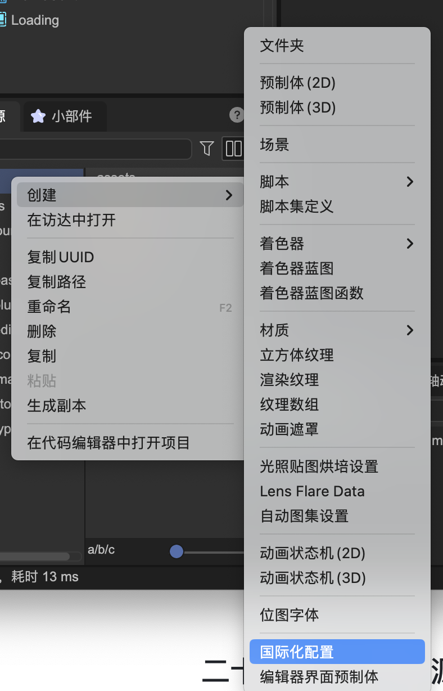


**标识**：国际化配置文件的唯一标识，自动生成，不可修改（如果确实要修改，可以用文本方式打开配置文件直接修改，但需要自行保证唯一。但修改后已经在界面上绑定的会全部丢失）。

**使用范围：**运行时或编辑器扩展。运行时表示用于游戏（暂不支持）。目前我们选择编辑器扩展，即在插件界面中使用。

**默认语言ID**：通过可视化方式制作编辑器预制体时，在界面设计时使用的文本语言。举例，如果你用中文制作界面，那这里就是zh-CN，如果你用英文制作界面，那这里是en，等等。如果这里设定的语言与运行时的语言一致，那么将直接使用界面上的文本，不会使用翻译文件进行替换。

**后备语言ID**：如果找不到匹配运行时语言的翻译文件，就会使用后备语言ID继续进行匹配。例如，如果运行时语言是德语，而翻译文件里没有德语（de）的翻译文件，就会使用后备语言ID（en）的翻译文件。

**翻译参考**：一般用于自动收集界面上的文字，形成一个参考文件。然后用这个参考文件去翻译成各种语言，再添加到翻译文件列表中。参考文件不需要添加到翻译文件列表中，因为参考文件内的文字都是界面上现存的。

**收集文本：**点击后，将分析配置文件所在目录和子目录下的所有预制体文件，收集所有需要翻译的文字到参考文件中，并将这些文本转换为国际化的格式。如果参考文件未设定，则会自动生成一个。

**同步**：当重新收集文本后，点击同步，可以使所有翻译文件的条目与参考文件匹配。例如，如果界面上新建了一个文本“abc”，点击收集文本后，参考文件将增加一个条目“abc"。点击同步后，所有翻译文件都会增加一个条目"abc"。

除了自动收集界面上的文字，我们也可以手动设定，例如一个按钮的标题：

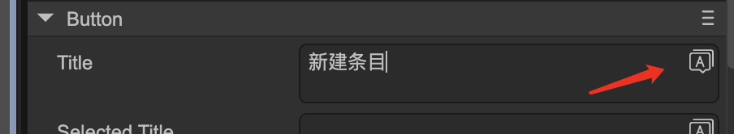

点击右上角的按钮，将弹出界面：

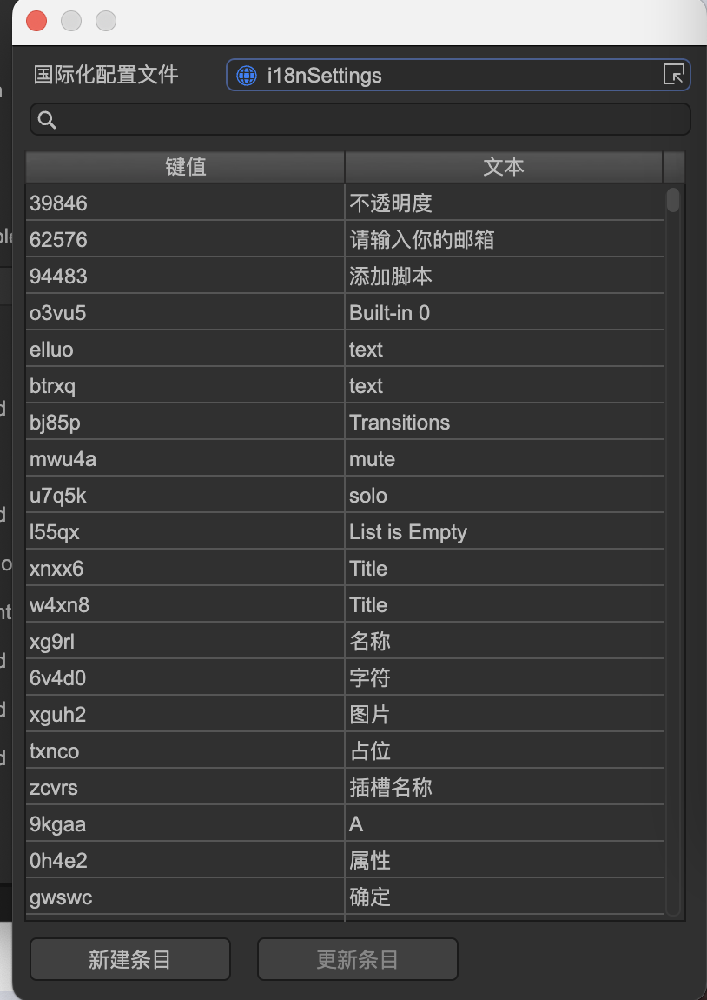

在这里可以选择，或者新建语言文件中的条目。选择一项后，输入框更新显示为：

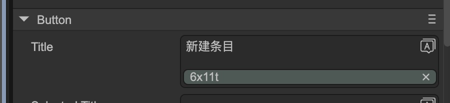

绿色的横条显示着翻译文件的键值，表示这个文本已经国际化。

**界面国际化后，语言的适配是全自动的，无需代码干预。**


除了界面国际化，代码输出的信息也需要国际化。通常我们建议使用另外的配置文件，不要和界面使用的配置文件混淆。我们新建一个国际化配置：


这里只要手动创建多个翻译文件，拖入到翻译文件列表中就可以了。这些文件的键值需要自行同步。

翻译参考功能可以忽略，因为无需从界面上收集。


代码里使用的方式为：

```typescript
myI18n: gui.Translations;

@IEditor.onLoad
async onLoad() {
    myI18n = await gui.UIPackage.resourceMgr.load("editorResources/i18nSettings.i18ns");
}

test() {
    console.log(myI18n.t("a"));
}
```

在很多情况下，如果只是代码里用到的一些小量国际化的支持，并不想创建多个json文件，那么也有全代码的方法。

```typescript
//第一个参数需要全局唯一
let myI18n = gui.Translations.create("LodSimplify");
myI18n.setContent("zh-CN", {
    meshRate : "模型压缩比例",
    meshRateTips : "根据设置的比例对模型网格进行压缩2x"
});

Editor.typeRegistry.addTypes([
{
    name: "LodSimplifyData",
    properties: [
        {
            name: "meshRate",
            type : "number",
            caption: myI18n.t("meshRate", "Mesh Rate"),
            tips: myI18n.t("meshRateTips", "Compress the model mesh based on the set ratio."),
        }
     ]
 }
```

可以多次调用setContent添加不同语言的翻译，下面的例子添加了语言en的翻译，所以在应用t函数时可以省略默认值。

```typescript
//第二个参数是备用语言ID，默认是en，所以在这里是可以省略不写的
let myI18n = gui.Translations.create("LodSimplify", "en");
myI18n.setContent("zh-CN", {
    meshRate : "模型压缩比例",
    meshRateTips : "根据设置的比例对模型网格进行压缩2x"
}).setContent("en", {
    meshRate: "Mesh Rate2",
    meshRateTips: "Compress the model mesh based on the set ratio."
});

Editor.typeRegistry.addTypes([
{
    name: "LodSimplifyData",
    properties: [
        {
            name: "meshRate",
            type : "number",
            caption: myI18n.t("meshRate"),
            tips: myI18n.t("meshRateTips"),
        }
     ]
 }
```


## 十七、添加新的资源类型

可以通过插件为IDE增加新的可识别的资源类型，资源类型通常使用特殊的扩展名进行识别。

### 17.1 设置资源的显示图标

示例代码如下：

```typescript
class AssetHelper {
    @IEditor.onLoad
    onLoad() {
        //为扩展名为abc的文件设置图标为abc.svg
        Editor.extensionManager.setFileIcon(["abc"], "editorResources/abc.svg");
    }
}
```


### 17.2 设置资源的分类名称

 当资源需要被用户挑选时，这时需要使用到资源的分类。

```typescript
class AssetHelper {
    @IEditor.onLoad
    onLoad() {
        //为扩展名为abc的文件设置分类名称
        Editor.extensionManager.setFileType(["abc"], "ABC Files");
    }
}
```

 如果脚本组件上需要支持选择abc扩展名的资源，那可以这样写：

```typescript
@property({ type: "string", isAsset:true, typeAssetFilter: "ABC Files"})
abcResource: string;
```


### 17.3 设置资源的操作

```typescript
class AssetHelper {
    @IEditor.onLoad
    onLoad() {
        //双击abc类型文件时打开VSCode
        Editor.extensionManager.setFileAtions(["abc"], {
            onOpen : asset=> IEditor.utils.openCodeEditor(Editor.assetDb.getFullPath(asset))
        });
    }
}
```

 这里支持的操作有：

- onOpen 双击文件时触发。
- onCreateNode 如果资源支持实例化为节点，那么在这里实现。例如：

```typescript
onCreateNode: asset => {
    return Editor.scene.createNode("Image");
}
```

- onDropToScene 资源被拖放到场景时被调用，如果没有定义这个方法，或者这个方法返回false，则会尝试调用onCreateNode创建节点，如果创建成功，新节点会添加到场景。
- onCreateInField 当一个限定了接受当前资源类型的资源输入框处于空白状态时，双击会触发该方法。这通常用于创建新文件。


## 十八、自定义的资源缩略图

资源在资源库中一般显示为图标，但某些特殊资源可以支持显示为一个缩略图。例如，目前IDE已经支持了图片、材质和模型显示为缩略图。

（注意：如下图两个红色箭头所示，需要开启双列显示，并且图标大小不为最小时，才会显示缩略图，否则显示为图标）

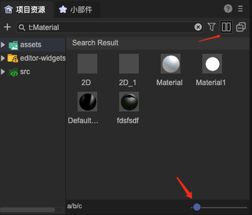

为某种资源添加资源缩略图通过以下方式实现：

```typescript
class AssetHelper {
    @IEditor.onLoad
    onLoad() {
        //为扩展名为abc的文件设置缩略图，DemoThumbnailPlugin是一个场景脚本的名字
        Editor.extensionManager.setFileThumbnail(["abc"], "DemoThumbnailPlugin");
    }
}
```

```typescript
//生成缩略图的场景脚本

@IEditorEnv.regClass()
export class DemoThumbnailPlugin extends IEditorEnv.AssetThumbnail {
    async generate(asset: IEditorEnv.IAssetInfo): Promise<string | Buffer> {
        //这里可以返回两种类型
        //1. 字符串类型。为一个png/jpg/svg文件的绝对路径。
        //2. Buffer类型。为一个png/jpg/svg格式的数据。
        //图片的大小建议为AssetThumbmail.imageSize
    }
}
```

 以下是IDE内置的ImageThumbmail的一个简略版本，供参考：

```typescript
const sharp = IEditorEnv.require("sharp");
       
@IEditorEnv.regClass()
export class DemoThumbnailPlugin extends IEditorEnv.AssetThumbnail {
    async generate(asset: IEditorEnv.IAssetInfo): Promise<string | Buffer> {
        let file = EditorEnv.assetMgr.getFullPath(asset);
        let img = sharp(file);
        let meta = await img.metadata();
        if (meta.width < 200 && meta.height < 200)
            return "source"; //source是一个特殊的字符串，表示返回源文件。
        else
            return await img.resize(AssetThumbnail.imageSize, AssetThumbnail.imageSize, 
                { fit: "inside" }).png().toBuffer();
    }
}
```


## 十九、自定义资源的预览面板

资源的预览是指下图红框中的界面：

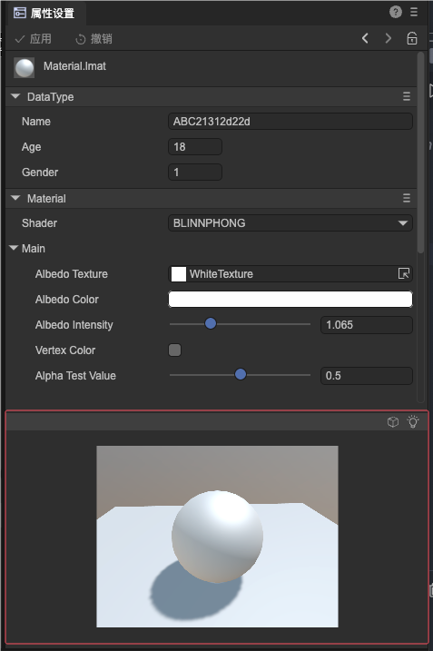

这部分界面可以由插件自定义：

```typescript
/**
    面板的usage必须为preview
    当一个资源被选中时，会调用所有usage为preview的面板的accept方法，第一个返回true的将显示出来
    面板的顺序通常是由注册顺序决定，但也可以通过order参数制定，order越小，判断顺序越前。例如
    { usage : "preview", order: -1 }
*/    
@IEditor.panel("TestPreview", { usage: "preview" })
export class TestPreview extends IEditor.EditorPanel implements IEditor.IPreviewPanel {

    async create(): Promise<void> {
        this._panel = new gui.Widget();
        let btn = IEditor.GUIUtils.createButton();
        btn.setPos(150, 180);
        this._panel.addChild(btn);
    }
    
    accept(asset: IEditor.IAssetInfo): boolean {
        return asset.ext === "abc"; //应用于扩展名是abc的资源
    }

    async refresh(asset: IEditor.IAssetInfo, render3DCanvas: IEditor.IRender3DCanvas): Promise<void> {
        //这里执行具体的渲染逻辑，比如更新UI（this._panel）
        
        //如果需要绘制引擎中的3D内容，可以使用render3DCanvas这个接口。如果不需要，可忽略。
        //render3DCanvas一般使用createObject接口，它的第一个参数是场景脚本的名称，第二个参数是脚本的函数的名字，其余参数是函数的参数
        return render3DCanvas.createObject("DemoPreviewPlugin", "setAssetById", asset.id);
    }
}
```

```typescript
//AssetPreview是IDE封装的具有离线渲染引擎对象功能的基类，
//通过this.scene可得到一个配置完备的3D场景。然后将this.renderTarget设置为this.scene.scene3D，就可以将场景的内容返回到UI界面。
//也可以通过this.sprite绘制纯2D内容，然后将this.renderTarget设置为this.sprite，就可以将2D内容返回到界面。

@IEditorEnv.regClass()
export class DemoPreviewPlugin extends IEditorEnv.AssetPreview {
    constructor() {
        super();

        this.sprite.graphics.drawCircle(100, 100, 50, "#ffff00");
        this.sprite.size(100, 100);
    }

    async setAsset(asset: IEditorEnv.IAssetInfo): Promise<any> {
        this.renderTarget = this.sprite;
    }
}
```

显示效果如下：

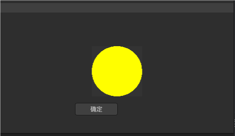


## 二十、自定义资源的导入导出

资源在第一次导入IDE，或者文件被修改后，会触发IDE的导入流程，这个导入流程的核心部分由AssetImporter完成。每种资源都可以有自己的Importer。资源Importer定义的方式如下：

```typescript
@IEditorEnv.regAssetImporter(["abc"])
export class DemoAssetImporter extends IEditorEnv.AssetImporter {
    async handleImport(): Promise<any> {
        console.log("importing abc file");
    }
}
```

并非每种资源都需要定义Importer。 Importer一般用于在导入阶段对资源进行预处理，例如，生成临时文件信息在library目录。

> 注意：Importer不允许修改资源的源文件，这会导致循环导入。

当处于构建发布阶段时，资源会调用对应的Exporter进行处理。注册Exporter的方法如下：

```typescript
@IEditorEnv.regAssetExporter(["abc"])
export class DemoAssetExporter extends IEditorEnv.AssetExporter {
    async handleExport(): Promise<void> {
        //导出处理
        //当前正在处理的资源是this.asset
        //输出信息在this.exportInfo
    }
}
```

在IDE编辑器中，资源引用的方式主要是uuid，但在发布后，资源引用的方式是路径。所以，在构建时，需要从uuid引用转化为路径引用。Exporter的主要功能是分析出资源的依赖，然后构建器会自动转换这些依赖。如果资源有依赖其他资源，可以用addQueue添加，但一般较方便的方式是使用parseLinks方法：

IAssetLinkInfo结构由开发者填充并传入，例如

```typescript
const links = [ { obj: "data", prop: "url", url : "b5b5975b-3d93-4ee5-83a3-68d25c2354bf" };
this.exportInfo.deps = this.parseLinks(links);
```

构建器在输出阶段，将会自动处理这些依赖的更新，以上面的代码为例，假设“b5b5975b-3d93-4ee5-83a3-68d25c2354bf”输出的路径是"test/123.xyz"，那么输出时将会自动设置data[url] = "test/123.xyz"。

除了分析和转换依赖，Exporter还可以改写资源的输出，这主要是通过exportInfo.contents数组。默认情况下，exportInfo.contents包含了一个元素，它表示将源文件原样复制到输出目录。下面的例子是直接替换源文件的输出，改为输出一个文本。

```typescript
this.exportInfo.contents[0] = { type: "text", data: "this is demo text" };
```

type参数的可选值有text/json/xml/arraybuffer/bytes/filePath/custom，特别的，filePath是一个文件的绝对路径，custom可以指定一个自定义的回调函数。

如果资源不需要输出，那可以直接将输出内容置为空数组，即：

```typescript
this.exportInfo.contents.length = 0;
```

如果资源不需要输出，也不会被其他资源引用，例如是仅在IDE内使用的配置文件，那么可以在注册Exporter就声明exclulde为true：

```typescript
@IEditorEnv.regAssetExporter(["abc"], { exclude: "true" } )
export class DemoAssetExporter extends IEditorEnv.AssetExporter {} //不需要任何实现代码
```

在上面的例子里，资源的扩展名是abc，但在实际应用中，abc这个扩展名未必能被部分Web服务器或者小游戏环境支持，这时我们可以定义一个扩展名转换：

```typescript
this.fileExtensionOverrides["abc"] = "abc.json";
```

这样，test.abc发布后就会变成test.abc.json。要注意的是，这个转换行为是底层行为，也就是说，开发者如果在代码里需要载入test.abc时，依然是使用test.abc而不需要用test.abc.json。


## 二十一、自定义资源配置界面

为资源设计配套的配置界面，需要根据资源的特性进行考虑，下面就集中典型的资源特性展开描述：

### 21.1 素材型资源

这类资源的特点是，它通常来自于DCC软件，不会在IDE中二次编辑，也不需要在选中时就载入资源。典型的如图片、模型。它需要配置的属性主要是用于Importer，即自定义导入参数。自定义导入参数我们约定是保存在meta文件的importer属性中。所以，这类资源的配置界面可以这样定义：

```typescript
@IEditor.regClass()
export class DemoABCImportSettings {
    @IEditor.property(String)
    name: string = "";

    @IEditor.property(Number)
    age: number = 18;

    @IEditor.property(Number)
    gender: number =1;
}

@IEditor.inspectorLayout("asset")
export class DemoInspectorLayout extends IEditor.MetaDataInspectorLayout {
    constructor() {
        super(DemoABCImportSettings);
    }

    accept(asset: IEditor.IAssetInfo): boolean {
        return asset.ext === "abc";
    }
}
```

DemoABCType是一个自定义的类，它必须通过IEditor.regClass定义。它的用法有点类似于Laya.regClass定义的组件类，也是可以使用@property定义各种属性，不同在于，它生存在UI进程，因此不能使用引擎的对象。

IEditor.inspectorLayout注册了一个编辑器布局，第一个参数指定是选择资源时会触发（如果是“node”，则是选定场景节点时会触发）。IEditor.MetaDataInspectorLayout是一个典型的从meta文件读取数据和写入数据到meta文件的处理。

显示如果如下：

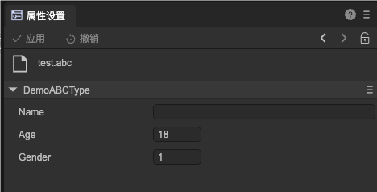

修改数据并点击应用按钮，观察meta文件的变化，可以看到数据写入到了meta文件的importer属性内。这部分数据，在AssetImporter的settings属性可以读取到。

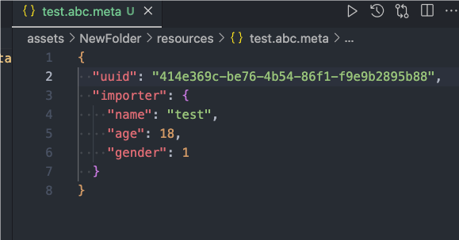


### 21.2 实时读写的资源

这类资源的特点，IDE在显示此类资源属性时，需要先在引擎中载入该资源（或者已经由场景节点先行载入)，同一个资源总是对应同一个实例。典型的如材质。修改一个材质文件时，所有使用到此材质的物体都会发生改变。

首先，需要为资源定义一个Laya.Resource的派生类：

```typescript
//因为这个类需要在实际游戏环境中使用，所有请勿和其他包含@IEditorEnv装饰器的脚本混杂在一起

@Laya.regClass()
export class ABCResource extends Laya.Resource {
    @Laya.property(String)
    name: string = "";

    @Laya.property(Number)
    age: number = 18;

    @Laya.property(Number)
    gender1: number = 100;

    constructor() {
        super();
    }
}
```

然后定义资源的载入方式：

```typescript
//因为这个类需要在实际游戏环境中使用，所有请勿和其他包含@IEditorEnv装饰器的脚本混杂在一起

//第三个参数是true，表示资源支持热重载。如果资源需要支持热重载，需要在load方法里判断是否有task.obsuluteInst,
//如果有，需要使用此实例去重载资源的实际内容并返回。如果不需要支持热重载，则忽略。
@Laya.regLoader(["abc"], null, true)
export class DemoAssetLoader implements Laya.IResourceLoader {

    async load(task: Laya.ILoadTask): Promise<any> {
        let json = await task.loader.fetch(task.url, "json");
        let res = task.obsoluteInst ? task.obsoluteInst : new ABCResource();
        Object.assign(res, json);
        return res;

    }
}
```

注册了Loader后，在游戏代码里就可以使用Loader加载资源：

```typescript
let res: ABCResource = await Laya.Loader.load("xx.abc");
```

资源还需要定义保存的方式，因为保存操作只会发生在IDE内，所以这里用的是IEditorEnv，主要不要和游戏代码混合在一起。

```typescript
//AssetSaver只在IDE内使用，不会发布到最终的游戏中

@IEditorEnv.regAssetSaver(["abc"])
export class DemoAssetSaver implements IEditorEnv.IAssetSaver {
    async onSave(asset: IEditorEnv.IAssetInfo, res: ABCResource): Promise<any> {
        //SerializeUtil是一个可以将组件序列化为json的工具类，直接使用最方便
        let data = IEditorEnv.SerializeUtil.encodeObj(res, null, { writeType: false });
        await IEditorEnv.utils.writeJsonAsync(EditorEnv.assetMgr.getFullPath(asset), data);
    }
}
```

在UI进程为资源定义属性界面，这种类型的资源，使用基类ResourceInspectorLayout即可，无需额外编码

```typescript
@IEditor.inspectorLayout("asset")
export class DemoInspectorLayout extends IEditor.ResourceInspectorLayout {
    constructor() {
        super();
    }

    accept(asset: IEditor.IAssetInfo): boolean {
        return asset.ext === "abc";
    }
}
```

界面的显示效果为：

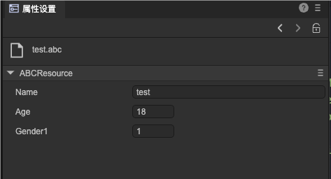

可以看到这里是没有"应用”和“撤销”按钮的，所有属性的改变都会立刻同步到场景的资源实例里，并实时影响场景效果。

保存的文件内容为：

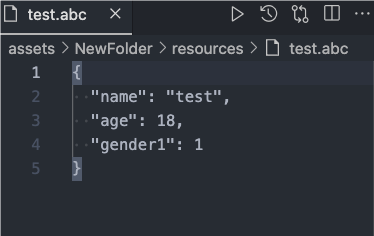

资源会在恰当的时机保存到文件，例如任何场景的保存，构建发布前，关闭编辑器前等。


### 21.3 离线的资源

这类资源的特点是在编辑和查看属性时，不需要在引擎中生成资源实例。它通常是`json/xml/bin`这种普通的格式，可能需要在实际游戏中使用，也可能仅仅是在IDE里做一个配置。典型的如位图字体，自动图集等。

这里我们同样使用了一个自定义类，也就是说，文件内容将会是一个json文件，它由DemoABCType序列化生成。

```typescript
@IEditor.regClass()
export class DemoABCType {
    @IEditor.property(String)
    name: string = "";

    @IEditor.property(Number)
    age: number = 18;

    @IEditor.property(Number)
    gender: number =1;
}

@IEditor.inspectorLayout("asset")
export class DemoInspectorLayout extends IEditor.FileInspectorLayout {
    constructor() {
        super(DemoABCType);
    }

    accept(asset: IEditor.IAssetInfo): boolean {
        return asset.ext === "abc";
    }
}
```

如果目标文件不是json文件，例如是xml，或者是二进制，可以自行重写FileInspectorLayout的readFile和writeFile，返回转移后的json对象即可。


