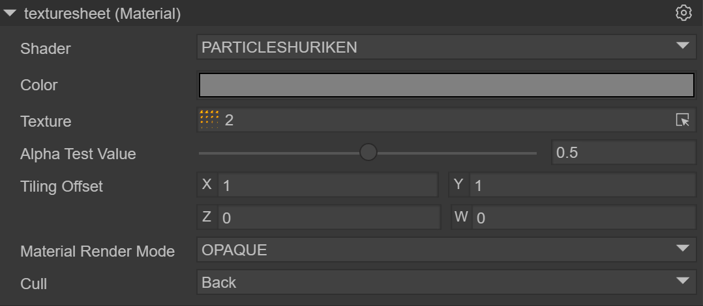

# 3D粒子编辑器

> Author:  zhangzhe && Charley    Date:  2022-11-05
>

## 一、3D粒子编辑器基础

### 1.1 什么是3D粒子

在百科中，粒子是指能够以自由状态存在的最小物质组成部分。

在LayaAir引擎中，3D粒子系统中的粒子可用于模拟中烟、雾、水、火、雨、雪、流光等非固定形态的自然现象。而上述这些自然物体的形态由于没有固定的形态，所以不能用固定的模型来模拟实现，需要用多个模型组合成一个完整的视觉效果，而3D粒子正是组合效果的最小单元，但需要注意的是，粒子并非是三维立体模型，而是面片模型。

> 粒子面片由于一直朝向摄像机，所以通常不会感觉到是面片模型。当然，也可以设置粒子不一直朝向摄像机。

3D粒子的示例效果如动图1所示：

 

（动图1）

### 1.2 LayaAir粒子系统


#### 定义

粒子系统是Laya3.0引擎特效表现的基础，它可以用于模拟的火、烟、水、云、雪、落叶等自然现象，也可用于模拟发光轨迹、速度线等抽象视觉效果。粒子系统是游戏物理、运动图形和计算机图形学中的一种技术，它使用许多微小的精灵、3D模型或其他图形对象来模拟某些类型的“模糊”现象，否则这些现象很难用传统的渲染技术重现。通常粒子系统在三维空间中的位置与运动是由发射器控制的。发射器主要由一组粒子行为参数以及在三维空间中的位置所表示。粒子行为参数可以包括粒子生成速度（即单位时间粒子生成的数目）、粒子初始速度向量（例如什么时候向什么方向运动）、粒子寿命（经过多长时间粒子湮灭）、粒子颜色、在粒子生命周期中的变化以及其它参数等等。

#### 说明

粒子系统一般由以下几个部分组成：

1. 发射器，用于创建粒子，并初始化粒子的属性
2. 影响器，用于更新粒子的属性
3. 渲染器，渲染粒子
4. 粒子类，存储粒子的属性
5. 粒子系统类，管理上面的模块


粒子系统的基本单元是粒子，一个粒子一般具有位置、大小、颜色、速度、加速度、生命周期等属性。

#### 粒子系统分类

在Laya3.0编辑器中，可以使用5种类型，分别做出不同的特效。

 

（图1.2）

#### 1.2.1 基础面板 `General`

默认的是粒子系统的通用模块，用于设置粒子系统的基础性的设置。此模块为固有模块，不可禁用。该模块定义了粒子初始化时的持续时间、循环方式、发射速度、大小等一些列基本的参数。

 

（图1.2.1）

`Duration`：粒子运行的持续时间
`Loop`：如果启用，系统将在其持续时间结束时再次启动并继续重复循环。
`Play On Awake`：如果启用，粒子系统会在创建对象时自动启动。
`Start Delay`：启用后系统开始发射前的延迟（以秒为单位）。可选择两种延迟方式，固定时间；从最小到最大两个时间中随机取值
`Start Lifetime`：粒子的初始生命周期时间。
`Start Speed`：每个粒子在适当方向上的初始速度。
`Start Size`：每个粒子的初始大小，如果您想分别控制每个轴的大小，请启用3D选项。
`Start Rotation`：每个粒子的初始旋转角度。如果您想分别控制每个轴的旋转，请启用3D选项。还可以设置随机的方向
`Start Color`：每个粒子的初始颜色。
`Gravity Modifier`：设置物理重力值。零值会关闭重力。
`Simulation Space`：控制粒子是否在父对象的本地空间（因此随父对象移动）、世界空间进行动画处理。
`Simulation Speed`：调整整个系统更新的速度。
`Scale Mode`：从变换中选择如何使用比例。设置为`World`、`Local`。本地仅应用粒子系统变换比例，忽略任何父项。
`Max Particles`：一次系统中的最大粒子数。如果达到限制，则会移除一些粒子。
`Auto Random Seed`：如果启用，粒子系统在每次播放时看起来都不同。设置为 false 时，每次播放时系统完全相同。禁用自动随机种子时，此值用于创建独特的可重复效果。

#### 1.2.2 发射模块 `Emission`

该模块是粒子系统组件的一部分，用来指定发射粒子的属性。当创建新的粒子系统时，Emission 模块会默认启用。

 

（图1.2.2）

`Enable`：是否启用
`Loop`：如果启用，系统将在其持续时间结束时再次启动并继续重复循环。
`Rate over Time`：每单位时间发射的粒子数。
`Rate over Distance` 每个移动距离单位发射的粒子数，此模式对于模拟实际由对象运动产生的粒子非常有用（例如，泥路上车轮留下的尘土）
`Bursts`：爆发是产生粒子的事件。这些设置允许在指定时间发射粒子。可以设置多组爆发点，分别修改时间，最小粒子数，最大粒子数

#### 1.2.3 形状模块 `Shape`

该模块定义了发射粒子的体积或表面，以及起始速度的方向。

 

（图1.2.3）

`Shape`：定义了发射体积的形状，可以创建或者删除形状实例，其余属性根据选择的形状而有所不同。所有形状都具有定义其尺寸的属性，例如Radius属性。
`Shape Type`：形状，形状的选择会影响可以发射粒子的区域，还会影响粒子的初始方向。例如，一个Sphere向各个方向向外发射粒子，一个Cone发射一个发散的粒子流，而一个网以垂直于表面的方向发射粒子。
1，`Sphere` ：球
​	`Radius`：半径
​	`Emit from shell`：根据壳发射
​	`Randomize Direction`：随机化方向
2，`Hemisphere`：半球形状
​	`Radius`：半径
​	`Emit from shell`：根据壳发射
​	`Randomize Direction`：随机化方向
3，`cone`：锥形
​	`Angle DEG`：形状的圆形方面的角度
​	`Radius`：半径
​	`Length`：长度
​	`Emit from`：发射方式
​		`Base`：基础
​		`Base Shell`：基于壳
​		`Volume`：体积
​		`Volume Shell`：体积壳
​	`Randomize Direction`：随机化方向
4，`Box`：盒子形
​	`Length`：形状的圆形方面的长度
​	`Randomize Direction`：随机化方向
5，`circle`：环形
​	`Radius`：半径
​	`Angle DEG`：形状的圆形方面的角度
​	`Emit From Edge`：基于边缘发射
​	`Randomize Direction`：随机化方向

#### 1.2.4 生命周期`Lifetime`

该模块定义了发射出的粒子的生命周期内的属性

 

（图1.2.4）

1，`Velocity over Lifetime`：生命周期中的速度
​	`Constant`：常数模式，速度是恒定的
​	`Curve`：线模式，粒子速度随着 lifetime 动
​	`Random from two Constant`：随机速度模式
​	`Space`：空间
​		`Local`：模型空间
​		`World`：世界空间
2，`Color over Lifetime`：生命周期中的颜色
​	`Constant`：常数模式，颜色是恒定的
​	`Gradient`：梯度
​	`Random from two Constant`：随机两个颜色模式
​	`Random between two Gradient`：在两个梯度中随机取值
3，`Size over Lifetime`：生命周期中的大小
​	`Separate Axes`：按轴分离
​		`Curve`：曲线
​		`Random Between Two Contants`：在两个常数中随机取值
4，`Rotation over Lifetime`：生命周期中的旋转
​	`Separate Axes`：按轴分离未选中
​		`Angular Velocity`：角速度
​		`Constant`：常数
​		`Curve`：曲线
​		`Random Between Two Contants`：在两个常数中随机取值

#### 1.2.5 贴图动画 `Texture Sheet`

该模块是粒子系统的一部分。当创建新的粒子系统时，Laya 3.0 将贴图动画模块添加到粒子系统。

 

（图1.2.5）

目前Laya3.0采用网格模式（Grid）

`Tiles`：纹理在 X（水平）和 Y（垂直）方向上划分的图块数量。

`Animation`：动画模式可以设置为整张或单行（即，每行代表一个单独的动画序列）。

`Frame`：设置帧

​	`Type`：帧类型

​		`Constant`：固定帧数

​		`Curve`：一条曲线，指定动画帧如何随着时间的推移而增加。

​		`Random Between two constant`：两个固定帧数之间随机

​		`Random Between two curve`：两个曲线之间随机

`Start Frame`：起始帧，允许您指定粒子动画应该从哪一帧开始（对于在每个粒子上随机定相动画很有用）

`Cycles`：动画序列在粒子生命周期内重复的次数。

### 1.3 粒子渲染模块 `ShurikenParticleRenderer`

渲染器模块的设置决定了一个粒子的图像，模型，如何被其它粒子变换、着色和过度绘制。

#### 

（图1.3）

`Receive Shadows`：决定此系统中的粒子是否可以接收来自其它来源的阴影。只有不透明的材质才能接收阴影。

`Cast Shadows`：如果启用此属性，粒子系统会在投射阴影的灯光照射时创建阴影。

`Scale In Lightmap`：调整特定物体在最终LightMap中的像素密度。

`Materials`：用来渲染粒子的材质

`Render Mode`：如何从图形图像（或网格）生成渲染图像。

1，`Billboard`：将粒子渲染为广告牌，总是面向相机

2，`Stretched Billboard`：粒子面向相机用了各种可能的缩放选项。

​	`Camera Scale`： 相机比例
​	`Velocity Scale`： 速度比例
​	`Length Scale` ：长度比例

3，`Horizontal Billboard`：粒子平面平行于XZ“底”平面

4，`Vertical Billboard`：粒子在Y轴上是直立的，但是面向相机

5，`Mesh`：粒子是从3D网格而不是纹理渲染的

`Sorting Fudge`：数值越小渲染优先级越大

### 1.4 粒子着色器

在材质中选择Laya的particle，可以添加Laya内置的粒子着色器（PARTICLESHURIKEN），其可渲染各种粒子系统
效果。所有的粒子都是用使用的这个材质。

#### 

（图1.4）

`Color`：指定粒子的颜色。

`Texture`：指定粒子使用的纹理贴图

`Alpha Test Value`：透明度测试

`Tiling Offset`：获取纹理平铺和偏移

`Material Render Mode`：设置渲染模式

​	`Opaque`：默认设置，适用于没有透明区域的普通实体对象。
​	`Cutout`：允许创建在不透明和透明区域之间具有硬边的透明效果。在此模式下，没有半透明区域，纹理要么 100% 不透明，要么不可见。这在使用透明度来创建材料的形状（例如树叶或带孔和破烂的布）时很有用。
​	`Transparent`： 适用于渲染逼真的透明材质，例如透明塑料或玻璃。在此模式下，材质本身将采用透明度值（基于纹理的 Alpha 通道和色调颜色的 Alpha），但反射和照明高光将在完全清晰的情况下保持可见，就像真正的透明材质一样。
​	`Additive`： 叠加方式
​	`AlphaBlended`： 透明混合方式

`Cull`：剔除方式


## 二、3D粒子编辑器使用

### 2.1 3D粒子根节点

#### 2.1.1 粒子节点

在场景中的任何节点，可以通过鼠标右键来添加粒子系统。

 

（图2.1.1-1）

默认粒子系统添加完成效果

 

（图2.1.1-2）

#### 2.1.2 预制体

拖动场景中的粒子根节点到Assets中，可以保持预制体

 

（图2.1.2）

### 2.2 粒子系统的使用

创建粒子节点后，Inspector中可以看到粒子系统，包括5种分类，针对我们要实现的功能做进一步设置

示例：火焰特效

#### 2.2.1 创建火焰预制体

 

（图2.2.1）

在Scene3D场景下，点击鼠标右键，选择创建Effects->Particle3D 默认创建一个3D粒子系统，命名为FireEffect，拖到Assets->Prefab目录下，创建好预制体

#### 2.2.2 火焰序列帧动画

 

（图2.2.2）

准备好火焰序列帧动画贴图文件，放到Assets目录下，点击贴图，勾选sRGB和Alpha Channel，TextureType依然为Default，点击Apply按钮，确保修改成功

#### 2.2.3 设置火焰材质

 

（图2.2.3）

在Assets下创建一个材质，命名为FlameRoundYellowParticle，Shader使用Laya.Particle，基本上所有的粒子特效都使用此Shader。Color设置为191,191,191,255，texture选择上面添加的贴图，Material Render Mode选择ADDITIVE方式

#### 2.2.4 设置粒子系统渲染模块

 

（图2.2.4-1）

创建粒子系统后，Inspector面板中默认会添加ShurikenParticleRenderer组件，选择FlameRoundYellowParticle材质

 

（图2.2.4-2）

在Scene窗口中，可以看到粒子效果已经换成贴图，需要进一步设置贴图动画

#### 2.2.5 使用贴图动画

  

（图2.2.5-1）

在粒子系统的TextureSheet中，创建一个Instance，由于火焰贴图的组成方式为10x5，此时修改Tiles为X：10，Y：5。修改后粒子系统贴图变为火焰效果，但是依然是静态图，下面来修改Frame帧动画，修改Frame->Type为Curve，点击Curve打开面板，横轴为时间线，纵轴为帧动画的帧数，我们希望的效果是1秒中火焰帧动画循环播放一遍，也就是从0到50帧，那么我们修改Curve为下图

 

（图2.2.5-2）

完成Curve后，再看火焰效果已经可以播放帧动画

#### 2.2.6 设置基础属性

 

（图2.2.5） 

Start Speed的Constant为0，火焰发射时的初始速度为0，Start Size的Constant为2，放大2倍火焰的尺寸，Simulation Speed为2，可以加快火焰播放的速度

#### 2.2.6 设置发射器

 

（图2.2.6） 

修改每单位时间发射的粒子数为5，相当于每秒中会燃烧5个火焰

#### 2.2.7 设置形状模块

 

（图2.2.7） 

我们希望粒子在一个圆形内发射，可以达到火焰聚集燃烧效果

#### 2.2.8 设置粒子生命周期

 

（图2.2.8-1） 

最重要一环为设置粒子生命周期，首先设置火焰生命周期内颜色的过程，创建Color Over Lifetime实例，Type设置为Gradient梯度变化曲线，打开Gradient面板，上面3个箭头向下的指示标表明颜色的透明度从 0%的不透明->80%的不透明->100%的全透明，下面的2个箭头向上的指示标表明颜色的区间变化从c99451到ff4500

 

（图2.2.8-2） 

由于火焰是粒子向上运动到消失，创建Velocity Over Lifetime实例，选择Curve曲线，只需要修改Y轴的位移为1秒钟从0到1，向上移动1个单位

 

（图2.2.8-3） 

由于火焰是会尺寸上有缩小的过程，创建Size Over Lifetime实例，选择Curve曲线，只需要修改0.5秒时间内，Size从1到0.5，缩小一倍

 

（图2.2.8-4）

此时在Scene窗口中看到，火焰效果已制作完成

## 四、应用场景及代码示例

往往在游戏的战斗过程中，需要大量创建粒子，那么需要用到对象池。对象池优化是游戏开发中非常重要的优化方式，也是影响游戏性能的重要因素之一。在游戏中有许多对象在不停的创建与移除，比如角色攻击子弹、特效的创建与移除，NPC的被消灭与刷新等，在创建过程中非常消耗性能，特别是数量多的情况下。对象池技术能很好解决以上问题，在对象移除消失的时候回收到对象池，需要新对象的时候直接从对象池中取出使用。优点是减少了实例化对象时的开销，且能让对象反复使用，减少了新内存分配与垃圾回收器运行的机会。

> *注意：对象移除时并不是立即从内存中抹去，只有认为内存不足时，才会使用垃圾回收机制清空，清空时很耗内存，很可能就会造成卡顿现象。用了对象池后将减少程序的垃圾对象，有效的提高程序的运行速度和稳定性。*

### 4.1 自定义Particle3D类

```
import Node = Laya.Node;
import Sprite3D = Laya.Sprite3D;
import ShuriKenParticle3D = Laya.ShuriKenParticle3D;
import ShurikenParticleSystem = Laya.ShurikenParticleSystem;
import { Pool } from "./Pool";

//粒子特效的基类，包括创建，播放，暂停，销毁，清理对象池
export class Particle3D extends Sprite3D  {

    private _isInited: boolean = false;
    private _filePath: string = null;
    private _particle: Laya.Sprite = null;
    private _shuriKenParticle3D: Array<ShuriKenParticle3D>= [];
    private _shurikenParticleSystem: Array<ShurikenParticleSystem>= [];
    constructor() 
    {
        super();
    }
    
	//通过传入粒子特效的路径，创建一个粒子特效，从对象池里拿一个
    static Create(path: string): Particle3D
    {
        var ret:Particle3D = Pool.getInstance().getItemByClass("Particle3D@" + path, Particle3D);
        ret.Init(path);
        return ret;
    }
    
	//粒子特效初始化
    private Init(file_path:string): void
    {
        if (this._isInited)
        {
            return;
        }
        this._filePath = file_path;

        console.log("Particle3D");
        //从拿到的粒子系统克隆一个
        var res = Laya.loader.getRes(file_path);
        var particle = res.clone();

        this._particle = particle;
        //获取这个粒子特效的所有粒子系统，用于后面整体播放
        for (var i = 0, len = this._particle.numChildren; i < len; i++)
        {
            var child:Node = this._particle.getChildAt(i);
            if (child instanceof Laya.ShuriKenParticle3D)
            {
                this._shuriKenParticle3D.push(child);
                this._shurikenParticleSystem.push(child.particleSystem);
            }
        }

        this.addChild(this._particle);
        this._isInited = true;
    }

	//粒子特效播放，由于一个复杂的粒子特效由多个粒子系统组成，此时遍历粒子特效所有粒子系统对象调用play()
    play(): void 
    {
        for (var i = 0, len = this._shurikenParticleSystem.length; i < len; i++)
        {
            var particle_system = this._shurikenParticleSystem[i];
            particle_system.simulate(0, true);
            particle_system.play();
        }
    }

	//粒子特效暂停和恢复，由于一个复杂的粒子特效由多个粒子系统组成，此时遍历粒子特效所有粒子系统对象调用pause()和play()
    pause(): void 
    {
        for (var i = 0, len = this._shurikenParticleSystem.length; i < len; i++)
        {
            var particle_system:ShurikenParticleSystem = this._shurikenParticleSystem[i];
            if (this._isPaused)
            {
                particle_system.play();
                this._isPaused = false;
            }
            else
            {
                particle_system.pause();
                this._isPaused = true;               
            }
        }
    }

	//粒子系统对象池回收
    Recover(): void
    {
        this.removeSelf();
        Pool.getInstance().recover(this._filePath, this);
    };

	//彻底销毁清理一个粒子特效对象
    Clean(): void
    {
        if (this.destroyed)
        {
            return;
        }

        this.Recover();

        if (this._particle && !this._particle.destroyed)
        {
            this._particle.removeSelf();
            this._particle.destroy(true);
            this._particle = null;
        }

        this._shuriKenParticle3D = null;
        this._shurikenParticleSystem = null;

        this._isInited = false;

        this.destroy(true);
    };

	//通过传入粒子特效的路径，清除缓冲池
    static ClearPool(root_path: string): void
    {
        if (root_path == null)
        {
            root_path = "";
        }
        Pool.getInstance().ClearGroup("Particle3D@" + root_path, this, function(particle_3d:Particle3D)
        {
            particle_3d.Clean();
        });
    }

}
```

### 4.2 自定义对象池类

```
export class Pool {
    
        private _poolDic:{[key: string]: any;} = {};
	    private InPoolSign: string = "__InPool";

        constructor() 
        {
        }

        private static _instance: Pool = new Pool();
        public static getInstance() {
            return this._instance;
        }

		//通过名字找到对应的对象池
        getPoolBySign(sign:string): any
        {
            return this._poolDic[sign] || (this._poolDic[sign] = []);
        };

		//回收
        recover(sign:string, item:any): void
        {
            item["__InPool"] = true;
        };

		//通过名字获得一个对象，如果对象池内没有对象，则创建一个
	    getItemByClass(sign:string, cls:any): any
        {
            var ret = null;
            var pool = this.getPoolBySign(sign);
            for (var i = 0, len = pool.length; i < len; i++)
            {
                var item = pool[i];
                if (item["__InPool"] && item instanceof cls)
                {
                    ret = item;
                    break;
                }
            } 
            if (!ret)
            {
                ret = new cls();
                pool.push(ret);         
            }
            ret["__InPool"] = false;
            return ret;
        };

		//通过名字，清理一组对象池
        ClearGroup(head_sign:string, caller:any, func:Function): void
        {
            for (var key in this._poolDic)
            {            
                if (key.indexOf(head_sign) == 0)
                {
                    var pool = this._poolDic[key];
                    if (func)
                    {
                        for (var i = 0, len = pool.length; i < len; i++)
                        {
                            var item = pool[i];
                            func.call(caller, item);
                        }
                    }
                    pool.length = 0;
                }
            }
        };

		//清理所有的对象池
        ClearAll(caller:any, func:Function): void
        {
            for (var key in this._poolDic)
            {            
                var pool = this._poolDic[key];
                if (func)
                {
                    for (var i = 0, len = pool.length; i < len; i++)
                    {
                        var item = pool[i];
                        func.call(caller, item);
                    }
                }
                pool.length = 0;
            }
        };
}
```

### 4.3 代码调用

```
const { regClass, property } = Laya;
import { Particle3D } from "./Particle3D";

@regClass()
export class Main extends Laya.Script {

	//粒子特效的路径
    private filePath = "FireEffect";
    onStart() {
        console.log("Game start");  
        //加载粒子特效资源
        Laya.loader.load(this.filePath, Handler.create(this, () => {    
        }));        
    }

	//每次鼠标点下屏幕后，会创建一个特效
    mouseDown(e: Event): void {
        var particle = Particle3D.Create(this.filePath);
        this.owner.addChild(particle);             
    }

	//鼠标抬起后，会释放对象池
    mouseUp(e: Event): void {
        Particle3D.ClearPool(this.filePath);      
    }    
}
```


